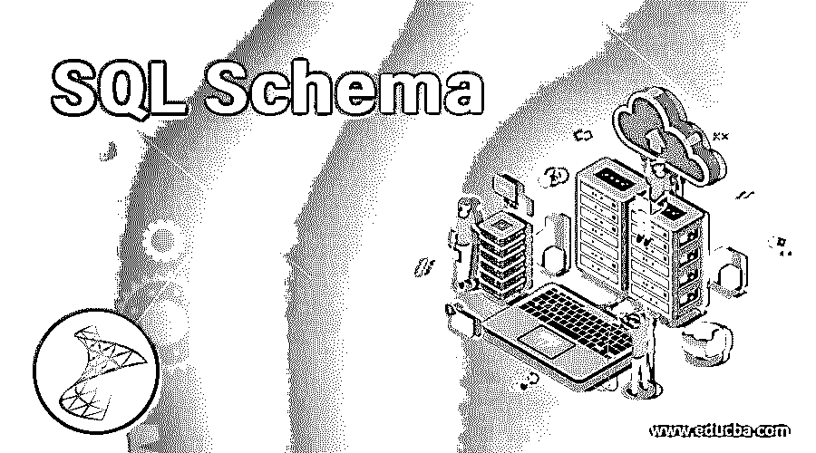
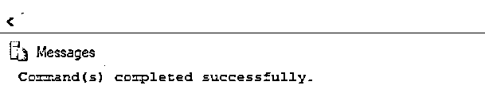
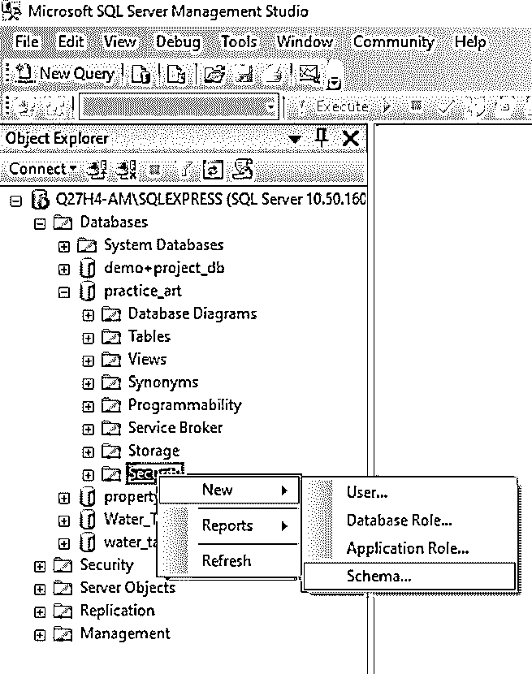
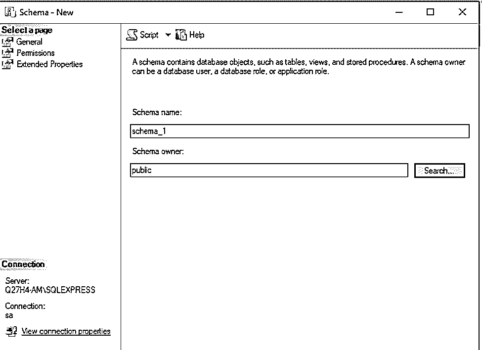
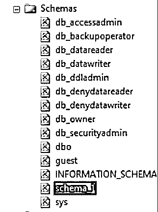
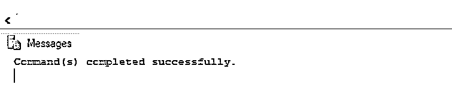
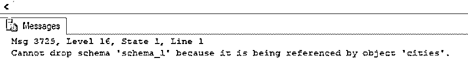

# SQL 模式

> 原文：<https://www.educba.com/sql-schema/>

## SQL 模式介绍

SQL 模式是数据库对象(如表、视图、索引、存储过程、函数、触发器等)的逻辑分组集合。用于隔离数据库对象的访问权限，管理数据库和其他应用程序的安全管理。SQL 模式总是只属于一个数据库。但是，一个数据库可以有多个模式。与 SQL 模式相关联的数据库用户(用户名)是模式所有者，并且具有对模式的访问权限。

### 如何创建 SQL 模式？

我们可以通过两种方式创建 SQL 模式，一种是通过使用 CREATE SCHEMA 语句编写 SQL 查询，另一种是通过使用 sql server management studio。首先，我们将讨论使用 SQL 查询创建 SQL 模式。相同的语法如下所示。

<small>Hadoop、数据科学、统计学&其他</small>

**语法:**

`CREATE SCHEMA [schema_name] [AUTHORIZATION owner_name];`

上述查询中的参数是:

*   **Schema_name:** 提及在数据库中标识它的模式名。
*   **AUTHORIZATION owner_name:** 提及将拥有该模式的数据库级主体的名称。

上面提到的参数是强制性的。此外，我们甚至可以在 CREATE SCHEMA 语句中使用 GRANT 关键字提及权限。

**示例–说明模式创建的 SQL 查询**

`CREATE SCHEMA schema_2 AUTHORIZATION dbo;`

在上面的示例中，我们创建了一个名为“schema_2”的模式，用户名为“dbo ”,所有者为。现在，我们将讨论使用 SQL server management studio 创建架构。

**步骤 1:** 在 management studio 右侧的对象资源管理器中，展开数据库文件夹。

**步骤 2:** 展开数据库，创建新的数据库模式。

**步骤 3:** 右键单击安全文件夹，指向新建，然后选择架构。

**步骤 4:** 在“一般信息”页面的“方案-新建”对话框中，分别在“方案名”和“方案所有者”框中输入方案名和所有者名(数据库用户名)。然后，您可以使用搜索按钮浏览用户名。

**第五步:**点击确定。

在上面的示例中，我们使用 SQL server management studio 创建了一个名为“schema_1”的模式，用户名为“public”。

假设您很想知道您的模式是否已经创建。您可以在 Schemas 菜单中检查相同的内容；您将发现刚刚创建的模式“schema_1”。

### 如何改变 SQL 模式？

我们可以使用 ALTER 语句在同一数据库的模式之间转移或移动安全对象。将安全对象移动到新架构时，将删除与安全对象或对象相关的所有权限。

我们可以使用下面的语法来改变模式。

`ALTER SCHEMA schema_name TRANSFER [entity_type] securable_name;`

上述语法中提到的参数有:

*   **Schema_name:** 指定安全对象要移动到的目标方案的名称。
*   **实体类型:**指定进行转移的实体的类型。如果我们没有指定任何东西，entity_type 默认设置为“Object”。
*   **安全对象名称:**提及将被移动的安全对象的名称。

**Note**: We should note that the schema name specified in the ALTER statement should not be SYS or INFORMATION_SCHEMA. Also, to transfer an object or securable from one schema to another, the current user must have CONTROL permission on the object being transferred.

**示例——说明模式变更的 SQL 查询**

—将安全对象从一个模式转移到另一个模式

`ALTER SCHEMA schema_1 TRANSFER dbo.Cities;`

在上面的示例中，我们修改了在前面的示例中创建的 schema_1，将一个名为 cities 的表从 dbo 模式转移到其中。

要更改或删除模式中的安全对象或对象，我们可以使用特定于该安全对象或对象的 ALTER 或 drop 语句。

### 如何删除 SQL 模式？

要从数据库中删除一个模式，我们必须使用特定于该模式的 DROP 语句。例如，我们可以使用以下语法从数据库中删除一个模式。

`DROP SCHEMA  [ IF EXISTS ] schema_name ;`

上述语法中使用的参数是:

*   **如果存在:**这适用于 SQL server 的当前版本。它有助于有条件地从数据库中删除模式。
*   **schema_name:** 提及要从数据库中删除的模式名。

**Note:** The schema which is being dropped must not contain any objects. Otherwise, the DROP statement will fail on such a schema. Also, the user or owner dropping the schema must have CONTROL permissions or ALTER ANY SCHEMA permissions to drop a schema.

**示例–说明删除模式的 SQL 查询。**

在本例中，我们将删除“schema_1”。但是正如注释中提到的，必须删除的模式不能包含任何对象；否则，查询将失败。在前面的例子中，我们已经将“cities”表转移到 schema_1。因此，drop 语句失败。

`DROP SCHEMA schema_1;`

我们必须首先删除城市表，然后再删除模式。

`DROP TABLE schema_1.cities;
DROP SCHEMA schema_1;`

### 优势

SQL 模式用于排列数据库对象。我们可以进一步将它们分成逻辑组。这些组可用于分离用户权限和访问权限。这样，我们就能够增强数据库的安全性。当转移访问权限、拒绝数据库用户的权限等时，SQL 模式也非常有用。

### 推荐文章

这是一个 SQL 模式指南。在这里，我们将通过几个例子来介绍如何在数据库中创建和修改 SQL 模式。您也可以看看以下文章，了解更多信息–

1.  [SQL 中的主键](https://www.educba.com/primary-key-in-sql/)
2.  [SQL 集合运算符](https://www.educba.com/sql-set-operators/)
3.  [SQL 右连接](https://www.educba.com/sql-right-join/)
4.  [MySQL 中的 MIN()](https://www.educba.com/min-in-mysql/)

