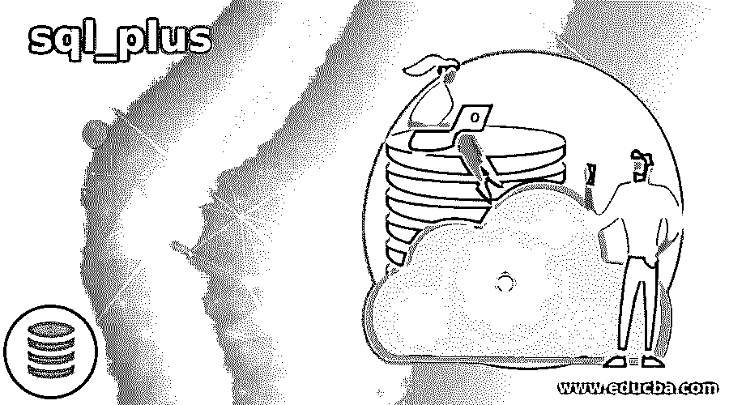

# sql_plus

> 原文：<https://www.educba.com/sql_plus/>

## sql_plus 简介

SQL plus 是一个 oracle 数据库实用程序，它拥有一个基本的命令行界面，可以帮助开发人员或程序员以简化的方式执行最少的查询和其他事务性活动。将该实用程序与图形用户界面结合使用的优点是，它为最终用户提供了 SQL 数据库方面的额外权限，使他们可以轻松地执行任何与数据库相关的活动的基本操作。在 Oracle 的 Database 11g 版本之后，集成形式的基于 web 的 SQL_plus 和 GUI 都已过时。它基本上只支持所有管理语言和非脚本语言。

### 什么是 sql_plus？

SQL plus 是 Oracle 数据库支持的用于执行某些查询的实用程序，包括用于操作和执行的命令行界面。在理解和输入特定类别的文本时，它理解特定的类别模式。脚本可以包括与之相关的各种组件。它不仅仅限于查询特定的命令，如 SQL，还包括用于解析和管理的 PL/SQL 块。

<small>Hadoop、数据科学、统计学&其他</small>

就 SQL 块或文本而言，SQL_Plus 遵循某些类别，如下所示:

*   SQL 语句
*   某些环境配置，包括带有控制和监控功能的布景和演出。
*   PL/SQL 块
*   某些需要加上前缀的外部命令！茶
*   所有的命令都与它交互。

### SQL Plus 命令

SQL Plus 遵循某些命令:

*   连接
*   变化
*   清楚的
*   复制
*   圆柱
*   计算
*   可变的
*   商店
*   开始
*   标题
*   不明确的
*   救援
*   打印
*   目录
*   形容
*   是吗
*   破裂
*   属性
*   存档日志
*   线轴
*   无论何时出错
*   恢复
*   提示
*   出口
*   主机
*   得到
*   帮助
*   reply header-回复标头
*   注意
*   奔跑
*   执行
*   XQUERY
*   每当 SQLERROR
*   定时
*   停止
*   关机
*   显示
*   设置
*   启动
*   奔跑
*   投入
*   拆开
*   /斜线
*   附加
*   @ at 标志
*   @@(双符号)

### 使用 SQL Plus

*   SQL Plus 大量使用与执行查询相关的图形界面；甚至某些其他第三方插件也可以交互进行增强。
*   Oracle 数据库用户不太依赖 SQL Plus 相关的环境，因为这些第三方插件已经涵盖了大多数主题。
*   Oracle 有权使用 SQL plus 脚本来创建简单的报告，其中一些简化的脚本需要用每个需要操作的 CRON 进行更新。
*   SQL plus 在组件方面有很多改进，具体如下:Oracle SQL Plus worksheet，ORM 的一个组件，Oracle SQL Developer 的 SQL Plus worksheet 的一个组件，提供基于 web 的实用程序，提供被视为 SQL workshop 的 Oracle application Express。
*   可以从 SQL*Plus 的文本文件中提取数据。
*   可以使用 EXPLAIN PLAN 命令调优查询，这对 SQL plus 用户来说是一个额外的优势。

### 我该如何学习和指导？

*   学习 SQL plus 有各种来源，但建议遵循具有真实性的真实来源。
*   在开始学习 SQL plus 之前，还有一些先决条件，比如 SQL Plus 特殊键和它们各自的键。
*   当涉及到支持它的操作系统时，可能会有不同的功能和键。
*   学习时应参考相关版本的 Oracle 原始文档。
*   Oreilly 和其他知名网站可以被认为是学习 SQL plus 的可信网站。
*   关于 SQL Plus 的研究和其他学习活动可以参考许多网站。

### 命令–SQL _ Plus

某些命令类似于 SQL Plus 中的常用命令:

*   SQL PLUS [用户名，密码，系统管理员]:登录数据库
*   帮助[索引|主题]:列出主题及其要点。
*   STARTUP[Parameters_to_pass]:启动相关数据库。
*   HOST [ command_as_parameter]:向主机登记所需的详细资料，并执行主机命令。
*   SHOW [ALL，ERRORS]:该命令在 SQL Plus 中主要用于显示带有操作的系统或环境设置的 SQL* Plus 变量。
*   CONNECT[参数]:用于在建立连接后连接到数据库。
*   SET [系统变量或环境变量]:该命令主要用于操作系统或环境变量，作为操作参数传递。
*   EDIT:该命令主要用于编辑 SQL 缓冲区的内容或用于操作的文件。
*   SAVE:这个命令用于将整个 SQL 缓冲区的内容保存到一个特定的文件中。
*   APPEND:该命令用于将文本追加到 SQL 缓冲区中当前行的末尾。

### windows GUI–SQL Plus

*   SQL Plus 支持 Windows GUI，其中安装了 GUI 工具，包括 TOAD 和 SQL developer，后者通常使用 SQL Plus 和一些优秀的旧注释。
*   有一些带有许可证的软件包，使用这些软件包可以下载 SQL Plus Client，并且包括用于修改 GUI 的功能，这些 GUI 可以以各种方式用于执行操作。
*   下载并解压任意一个 SQL plus 客户端，指定一个 SQL* Plus 12.0.xx 一旦完成，就可以进行 GUI 相关的开发，接下来还有一些其他的流程。
*   所有 Windows GUI 开发都将映射到 oracle 数据库，该数据库支持所有基于 CLI 的查询。

### 结论

Oracle 提供的 SQL Plus 实用程序为开发人员提供了执行各种命令来满足需求的能力。在接下来的几年里，它像其他任何东西一样发展，从特定版本集成到其他数据库，增加了许多优势。

### 推荐文章

这是一个 sql_plus 的指南。在这里，我们讨论 SQL Plus 在 SQL 块和命令方面遵循的某些类别。您也可以看看以下文章，了解更多信息–

1.  [SQL 忽略案例](https://www.educba.com/sql-ignore-case/)
2.  [SQL 匹配](https://www.educba.com/sql-matches/)
3.  [SQL MAX()](https://www.educba.com/sql-max/)
4.  [SQL 不在](https://www.educba.com/sql-not-in/)中

