# SQL 格式化程序

> 原文：<https://www.educba.com/sql-formatter/>

## SQL 格式化程序简介

SQL Formatter 用于自动格式化 SQL 脚本，以使代码看起来更加美观、结构化，易于阅读、理解和审查。SQL 中的代码可以通过在语句之间提供缩进、空格和制表符等来格式化。目前，许多流行的 SQL 数据库管理服务器(如 postgreSQL)没有自动查询格式化程序。而其他管理服务器，如 SQL server，提供了一些基本的查询格式化程序，帮助您缩进 SQL 代码，删除和添加代码之间的空格，自动换行，包含行号等。

### 使用查询设计器设置 SQL 查询格式

考虑下面的查询。它肯定是最格式化的。

<small>Hadoop、数据科学、统计学&其他</small>

**代码:**

`select * from dbo.books_audit_table;`

为了格式化这个查询，我们可以使用查询设计器。

下面是做同样事情的步骤。

**步骤 1:** 点击主栏正下方栏中的查询选项卡。单击查询选项卡，屏幕上将出现如下所示的下拉菜单。从编辑器选项中选择设计查询。

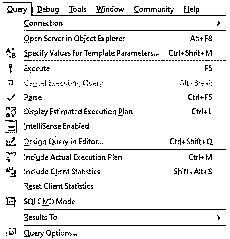

**第二步:**选择在编辑器中设计查询选项后，会出现如下所示的查询设计器对话框。根据需要进行更改。您可以在格式化查询和 all 中选择所需的列名。

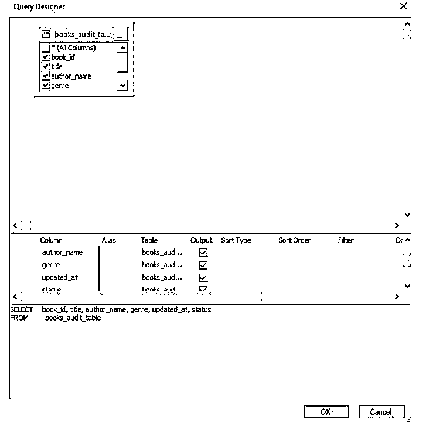

**步骤 3:** 在您以所需的方式格式化查询后，单击 OK。您甚至可以在下半部分看到格式化查询的预览。当您单击“确定”时，原始查询将自动格式化，如下所示。

这可能看起来需要很多步骤，但是您可以使用快捷键 Ctrl+Shift+Q 来打开查询设计器。

让我们也试试这个。

**代码:**

`select * from dbo.books_audit_table where
author_name like ‘A%’;`

为了格式化这个 SQL 查询，我们将使用快捷方式。只需选择要格式化的查询，然后在关键字上按 Ctrl+Shift+Q。

一个查询设计器对话框将出现在您面前。根据需要修改查询，然后单击 Ok。

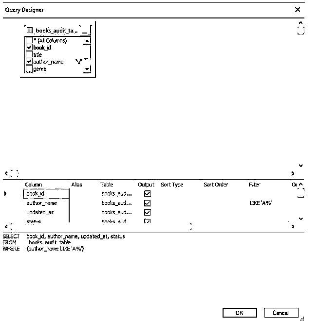

当你点击“确定”时。格式化后的 SQL 查询如下所示。瞧啊。!查询已被格式化。

到目前为止，我们一直使用自动查询设计器来格式化查询。我们甚至可以通过个人定制来格式化查询，比如缩进、制表符、注释和取消注释等。

### 使用 SQL 编辑器、文本编辑器和编辑工具自定义 SQL 查询格式

在 MS SQL Server management studio 中，有多种方法可以为 SQL 查询提供缩进和更改制表符的长度。第一个是使用编辑选项卡。当您在 SQL management studio 中单击“编辑”选项卡时，如果您选择“高级”选项，您将获得多个选项，如“表化选定行”、“取消选定行的表化”、“大写”、注释选择等。因此，有很多选项来格式化您的查询。

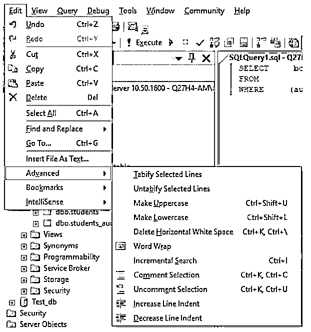

如果出于某些原因不需要 edit 选项卡，可以使用 SQL 编辑器和文本编辑器来格式化 SQL 查询，如下所示。

**SQL 编辑器中的格式选项:**

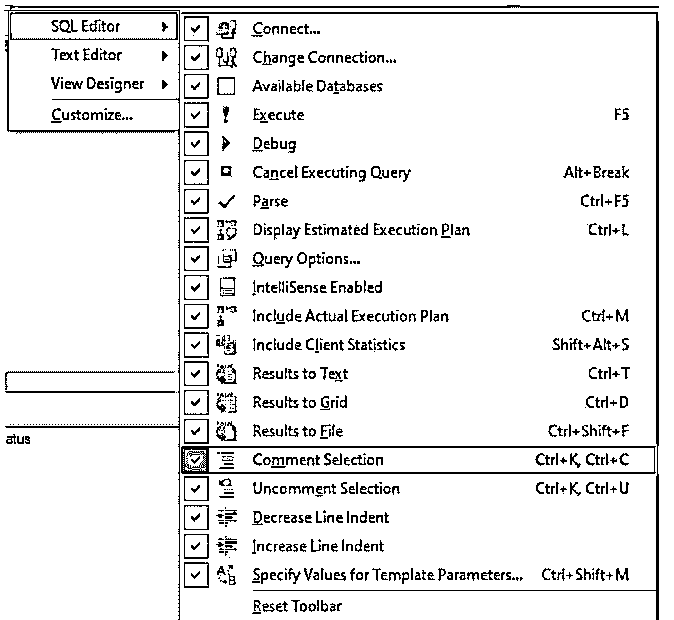

**文本编辑器中的格式选项:**

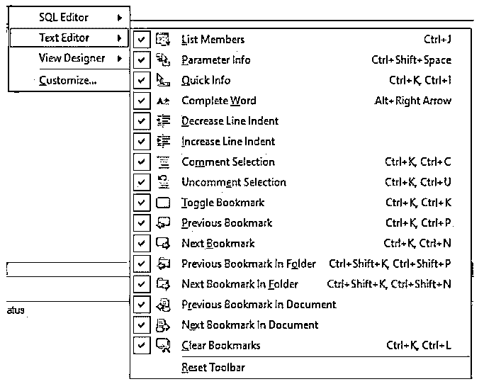

已经了解了 SQL server management studio 中用于自定义格式化 SQL 查询的各种选项，让我们尝试几个示例来说明给定命令的用法。

**代码:**

`select count(book_id), author_name
from dbo.books_audit_table
where genre = 'memoir'
group by author_name
order by count(book_id);`

假设您希望对查询中的某些行进行缩进，那么选择这些行并单击“增加缩进”。该工具将增加所选行的缩进量。

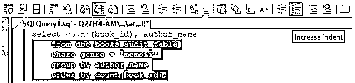

接下来，如果您希望注释代码中的几行，那么选择这些行并单击注释掉所选行工具，如下所示。

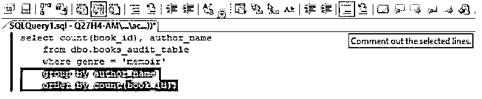

接下来，您将会看到上述行已经被成功地注释了。

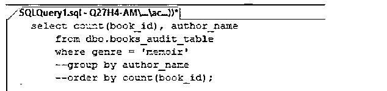

有许多方法可以格式化和设计您的 SQL 查询。

例如，您想要将查询中的几个句子或单词转换成大写字母，您可以使用工具栏中的 edit 选项卡来完成，如下所示。

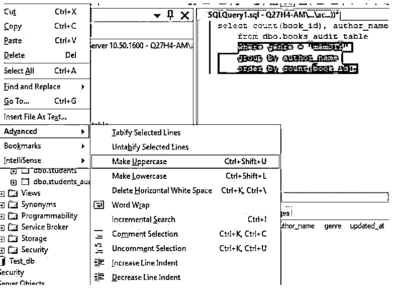

在“编辑”标签的“高级”选项下有更多的选项。你可以尝试尽可能多的选项。单击“变成大写”工具后，SQL 查询中的选定行将自动转换为大写，如下所示。

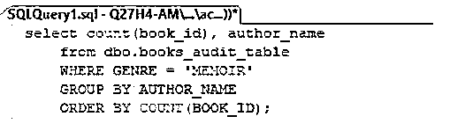

此外，到现在为止，您可能已经发现在编辑菜单中的每个选项旁边，都提到了相应的快捷方式。所以，别忘了利用它们来加快这个过程。

### 结论

在本文中，我们看到了使用查询设计器和编辑工具栏选项来美化和格式化 SQL 查询。格式化的查询不仅看起来漂亮，而且还提高了查询对其他人的可读性，因此调试和检查的过程变得更加容易和快速。但是，您应该注意到，自动查询设计器可能并不是在所有的数据库管理服务器上都可用，但是 edit 选项总是存在的。

### 推荐文章

这是 SQL 格式化程序的指南。在这里，我们讨论的简介，查询设计器，自定义 SQL 查询格式使用 SQL 和文本编辑器，编辑工具。您也可以看看以下文章，了解更多信息–

1.  [SQL 联合](https://www.educba.com/sql-union/)
2.  [SQL TRUNCATE()](https://www.educba.com/sql-truncate/)
3.  [SQL DML 命令](https://www.educba.com/sql-dml-commands/)
4.  [SQL 中的分区依据](https://www.educba.com/partition-by-in-sql/)

