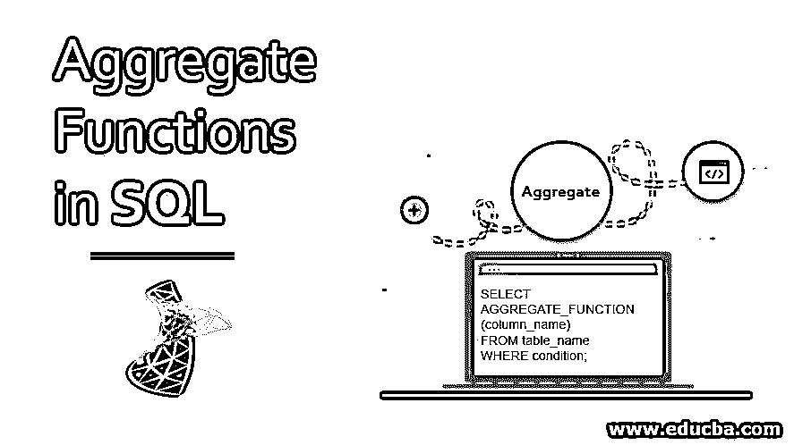
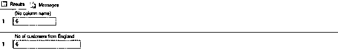
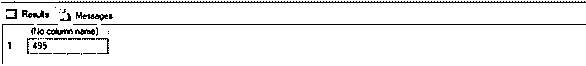
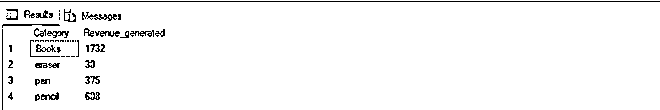
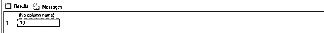
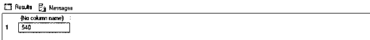
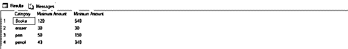
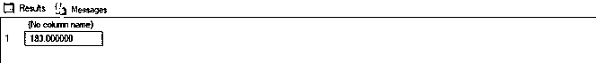
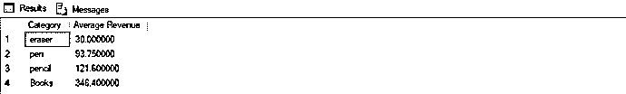

# SQL 中的聚合函数

> 原文：<https://www.educba.com/aggregate-functions-in-sql/>

## SQL 中的聚合函数简介

SQL 中的聚合函数用于对整列(可能有数千行)执行计算。它们通常用于汇总大型数据集。如果您熟悉 Excel，那么这些功能与我们在 Excel 中拥有的功能相似。

**语法:**

<small>Hadoop、数据科学、统计学&其他</small>

聚合函数的通用语法如下:

`SELECT AGGREGATE_FUNCTION (column_name)
FROM table_name
WHERE condition;`

**参数:**

语法中使用的不同参数是:

*   **AGGREGATE_FUNCTION:** 从{ SUM，COUNT，MIN，MAX，AVG }中提及您想要使用的聚合函数的类型。
*   **column_name:** 提及要执行计数操作的列名。
*   **FROM table_name:** 提及要从中提取列的表名。
*   **WHERE condition:** 提及过滤数据的具体标准，即您希望输出记录满足的标准。

除了 WHERE 条件之外，上述所有参数都是强制性的。您可以根据需要使用 GROUP BY、HAVING 和 ORDER BY 子句。

接下来，我们将详细讨论上述功能。

为了有效地演示和解释 SQL 中的聚合函数，我们将使用下表。这是一个在线文具店的示例“customers”表，其中包含 15 条记录，包括每个客户的 id、姓名、城市、他/她所属的国家、他/她购买的商品以及他们支付的金额。

**“客户”表的模式如下:**

记录数量:15 项

| **客户** |
| ID(主键) |
| 顾客 |
| 城市 |
| 国家 |
| 项目 _ 已购买 |
| 金额 _ 已付 |

让我们看看客户表中的记录。以便稍后，我们可以理解聚合函数在计算中是如何有帮助的。

| **ID** | **客户** | **城市** | **国家** | **物品 _ 已购买** | **已付金额** |
| One | 彼得·金 | 曼彻斯特 | 英格兰 | 书 | One hundred and twenty |
| Two | 普里雅·克里希纳 | 新德里 | 印度 | 围栏 | Fifty |
| Three | 吉姆·哈尔珀特 | 曼彻斯特 | 英格兰 | 铅笔 | Forty-three |
| Four | 迈克尔·斯科特 | 纽约 | 美利坚合众国 | 书 | Two hundred and fifty |
| Five | 哈维·斯佩克特 | 伯明翰 | 英格兰 | 铅笔 | One hundred |
| Six | 迪帕的钱 | 孟买 | 印度 | 书 | Three hundred and seventy |
| Seven | 安妮塔·德赛 | 伦敦 | 英格兰 | 铅笔 | Fifty |
| Eight | 雷切尔·赞 | 密歇根 | 美利坚合众国 | 围栏 | Seventy |
| Nine | 比勒陀利亚约翰 | 堪培拉 | 澳大利亚 | 围栏 | One hundred and ninety |
| Ten | 约翰·L | 布达佩斯 | 饥饿的 | 书 | Five hundred and forty |
| Eleven | 贾斯汀·格林 | 渥太华市 | 加拿大 | 围栏 | Sixty-five |
| Twelve | 哈比塔·戈什 | 加尔各答 | 印度 | 铅笔 | Seventy-five |
| Thirteen | 克里斯·普拉特 | 伦敦 | 英格兰 | 橡皮擦 | Thirty |
| Fourteen | 伊丽莎白·布朗特 | 伦敦 | 英格兰 | 铅笔 | Three hundred and forty |
| Fifteen | Nina Debrov | 阿姆斯特丹 | 荷兰 | 书 | Four hundred and fifty-two |
| 空 | 空 | 空 | 空 | 空 | 空 |

### SQL 聚合函数

SQL 聚合函数包括:

*   数数
*   总和
*   最小/最大
*   AVG

#### 1.计数功能

COUNT 函数用于计算存储在指定列中的值或记录的总数。可以通过指定标准来进一步定制。

这里有一个例子来说明 COUNT 函数的用法。

##### 示例#1

找出来自英国的顾客人数。

`SELECT COUNT(Customer)FROM Customers WHERE Country = 'England';` 

–我们甚至可以给输出列命名

`SELECT COUNT(Customer) as "No of customers from England" FROM Customers WHERE Country = 'England';`

**输出:**

**Note:** we should keep in mind that all aggregate functions exclude NULL values before operating on the column.

如果您想在结果中考虑重复值和空值，那么您可以使用一个专门版本的 COUNT，即。计数(*)。COUNT(*)返回一列中的所有记录，包括空值和重复值。

#### 2.求和函数

Sum 函数用于计算特定列中所有值的总和。与 count 不同，它只对数值数据字段有效。对于自定义，您也可以指定标准。

这里有几个例子来说明 SUM 函数。

##### 实施例 2

找出印度顾客的总消费金额。

`SELECT SUM(Amount_paid)FROM Customers WHERE Country = 'India';`

##### 实施例 3

查找收集的总收入以及不同类别的文具。

`SELECT Items_purchased as "Category", SUM(Amount_paid) as "Revenue_generated"
FROM Customers
GROUP BY Items_purchased;`

#### 3.最小/最大函数

MIN 函数用于返回特定列中的最小值。而 MAX 函数用于找出特定列中的最大值。

这里有几个例子来说明最小值/最大值函数的用法。

##### 实施例 4

找出文具的最低价格。

`SELECT MIN(Amount_paid) FROM Customers;`

##### 实施例 5

找出文具的最高价格。

`SELECT MAX(Amount_paid) FROM Customers;`

##### 实施例 6

找出不同类别文具的最小值和最大值。

`SELECT Items_purchased as "Category", MIN(Amount_paid) as "Minimum Amount", MAX(Amount_paid) as "Minimum Amount"
FROM Customers
GROUP BY Items_purchased
ORDER BY Items_purchased;`

#### 4.AVG 函数

AVG 函数用于计算选定列中所有记录的平均值。计算平均值时，AVG 函数完全忽略空值。

这里有几个例子来说明 AVG 函数的用法。

##### 实施例 7

找出文具的平均价格。

`SELECT AVG(Amount_paid)FROM Customers;`

**输出:**

### 实施例 8

找出不同类别的文具产生的平均收入，按平均收入升序排列。

`SELECT Items_purchased as "Category", AVG(Amount_paid) as "Average Revenue"
FROM Customers
GROUP BY Items_purchased
ORDER BY 2;`

–为了简化代码，我们可以在 group by 或 order by 子句中简单地使用列号。

**输出:**

**SQL 聚合函数的一些限制**

*   在对列进行操作之前，所有聚合函数都排除空值
*   除了 COUNT 之外，所有聚合函数只对数字数据值有效

### 结论

因此，在本文中，我们学习了 SQL 聚合函数，它在计算、总结和理解大型数据集中的模式时非常有用。

### 推荐文章

这是一个 SQL 聚合函数的指南。在这里，我们讨论 SQL 聚合函数及其 4 个主要函数的介绍，以及示例中的参数。您也可以浏览我们的其他相关文章，了解更多信息——

1.  [MySQL 中的光标](https://www.educba.com/cursor-in-mysql/)
2.  [MySQL 聚合函数](https://www.educba.com/mysql-aggregate-function/)
3.  [SQL 关键字](https://www.educba.com/sql-keywords/)
4.  [SQL 子句](https://www.educba.com/sql-clauses/)

