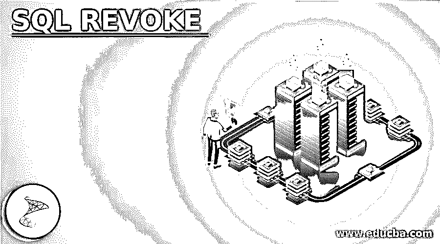
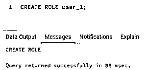
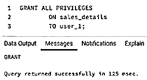
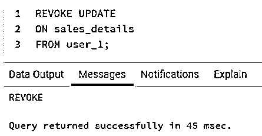
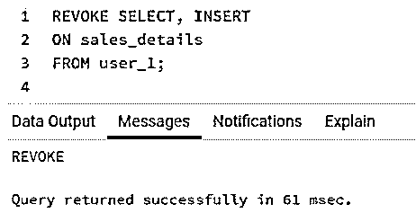
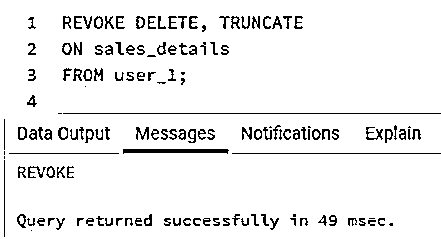
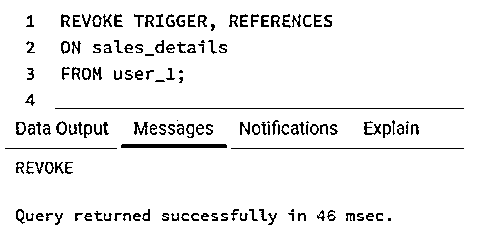

# SQL 撤销

> 原文：<https://www.educba.com/sql-revoke/>

## SQL REVOKE 简介

标准查询语言(SQL)中的 REVOKE 命令用于删除以前授予用户帐户的对数据库对象的权限或特权。因此，我们可以将 REVOKE 视为一种工具，用来限制已经被允许的角色或用户执行 select、insert、delete、alter 语句、分配外键等约束、更新数据记录等的能力。，在数据库对象上。

REVOKE 是一个与 GRANT 相反的命令，它将数据库对象的特权授予用户帐户或角色。例如，在 SQL 中，我们可以授予或撤销用户的以下特权集。

<small>Hadoop、数据科学、统计学&其他</small>

您可以将它视为一个汇总表，以供参考。

| **特权** | **描述** |
| 挑选 | 用户帐户执行 SELECT 语句和从所述数据库对象提取记录的能力。 |
| 删除 | 用户帐户执行删除语句以及从所述数据库对象中删除或移除记录的能力。 |
| 插入 | 用户帐户在所述数据库对象中执行插入语句和插入记录的能力。 |
| 更新 | 用户帐户在所述数据库对象中执行更新语句和更新记录的能力。 |
| 改变 | 用户帐户执行 ALTER 语句以及在所述数据库对象中添加、删除或修改列的能力。 |
| 缩短 | 用户帐户执行 TRUNCATE 语句和删除所述数据库对象的能力。 |
| 引发 | 用户帐户指定触发器约束的能力，如对所述数据对象的登录触发器。 |
| 参考 | 用户帐户指定约束的能力，如引用所述数据对象的外键。 |
| 全部 | 用户帐户执行除 ALTER 之外的所有上述语句的能力，即选择、插入、删除、更新、引用等。 |

了解了在 SQL 数据库中我们可以授予用户帐户的特权类型之后。

### SQL 中 REVOKE 命令的语法

用 SQL 编写 REVOKE 命令的基本语法如下:

`REVOKE PRIVILEGES [, ...] ON DATABASE_OBJECTS [, ...] FROM ROLE
[ CASCADE | RESTRICT ]`

上述语法中使用的参数如下:

*   **PRIVILEGES:** 这是我们指定必须为用户帐户删除的权限的参数。我们可以参考上面提到的特权表。
*   **数据库对象:**数据库对象可以是任何东西，比如一个特定的表或者模式中的所有表。
*   **角色:**在这里，我们指定需要删除权限的用户帐户。我们可以从一系列可能性中进行选择，如公共、组或用户。
*   **CASCADE | RESTRICT:** 我们可以使用 CASCADE 关键字指出撤销上述特权是否也会撤销从前者派生的其他特权。否则，我们可以将撤销限制在指定的特权上。

有人正确地说，没有动觉学习，学习是不完整的。

### SQL 撤销示例

以下是 SQL REVOKE 的示例:

为了说明 REVOKE 命令的用法，让我们首先创建一个用户帐户，然后使用 grant 命令授予它一些权限。我们将使用以下 SQL 语句创建一个名为“user_1”的新角色。您可以根据自己的喜好对其进行重命名。

**代码:**

`CREATE ROLE user_1;`

**输出:**

现在，我们已经在数据库中成功创建了一个新角色“user_1”。现在让我们使用 grant 命令授予它一些特权。我们可以使用下面的代码片段来授予所有特权。

ALL 关键字授予 SELECT、INSERT、UPDATE、DELETE、TRUNCATE、REFERENCES 和 TRIGGER 等权限。

**代码:**

`GRANT ALL PRIVILEGES
ON sales_details
TO user_1;`

**输出:**

#### 示例#1

说明从 user_1 撤销更新特权的 SQL 查询。

**代码:**

`REVOKE UPDATE
ON sales_details
FROM user_1;`

**输出:**

在本例中，我们已经成功地取消了 user_1 对 sales_details 表执行 UPDATE 语句的能力。所以现在，user_1 不能更新上述表中的任何记录。

#### 实施例 2

说明撤销 user_1 的 SELECT 和 INSERT 特权的 SQL 查询。

**代码:**

`REVOKE SELECT, INSERT
ON sales_details
FROM user_1;`

**输出:**

这里，我们取消了 user_1 对 sales_details 表执行 SELECT 和 INSERT 语句的能力。因此，user_1 将无法从 sales_details 表中获取记录。它也不能在表中插入新记录。

#### 实施例 3

说明撤销 user_1 的删除和截断权限的 SQL 查询。

**代码:**

`REVOKE DELETE, TRUNCATE
ON sales_details
FROM user_1;`

**输出:**

**

** 

在本例中，我们取消了 user_1 执行 DELETE 和 TRUNCATE 语句的能力。也就是说，user_1 不能从 sales_details 表中删除一行或多行。

#### 实施例 4

说明撤销 user_1 的触发器和引用权限的 SQL 查询。

**代码:**

`REVOKE TRIGGER, REFERENCES
ON sales_details
FROM user_1;`

**输出:**

这里，我们删除了 user_1 对 sales_details 表执行触发器和引用约束的能力。因此，user_1 将不能在 sales_details 表上进行外键之类的引用。此外，它将无法指定触发器。

### 结论

SQL 中的 REVOKE 命令用于删除已经授予用户帐户的对数据库对象(如表和模式)的权限或特权。这对于维护数据库的完整性和安全性非常有用。

### 推荐文章

这是一个 SQL 撤销的指南。在这里，我们讨论了 SQL REVOKE 的介绍以及一些例子，以便更好地理解。您也可以看看以下文章，了解更多信息–

1.  [SQL DML 命令](https://www.educba.com/sql-dml-commands/)
2.  [带 AS 语句的 SQL](https://www.educba.com/sql-with-as-statement/)
3.  [SQL TRUNCATE()](https://www.educba.com/sql-truncate/)
4.  [SQL 中的游标](https://www.educba.com/cursors-in-sql/)

