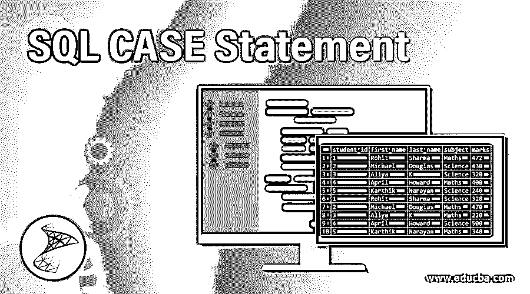
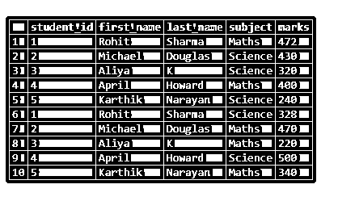
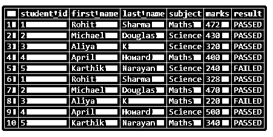
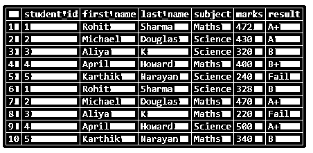
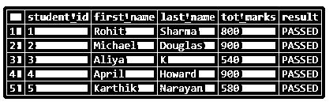

# SQL CASE 语句

> 原文：<https://www.educba.com/sql-case-statement/>

## SQL CASE 语句简介

CASE 是标准查询语言(SQL)中的表达式语句，主要用于处理类似于其他编程语言中 IF-THEN-ELSE 的条件语句。case 语句评估 when 条件，如果发现为真，则返回语句的 THEN 部分并结束。如果不满足任何条件或发现条件为假，则它计算语句的 ELSE 部分并结束。

CASE 语句后面总是跟有 WHEN 和 THEN 部分。它也可以包含 ELSE 部分，但它们不是强制的。它总是以 END 关键字结束。CASE 语句通常用作 SELECT 子句的一部分，但是在使用聚合函数时，我们也可以将其用作 WHERE、ORDER BY、GROUP BY 等其他子句的一部分。

<small>Hadoop、数据科学、统计学&其他</small>

CASE 语句可以有两种类型。第一个是简单的 CASE 语句，我们将 WHEN 条件表达式与静态值进行比较。第二种类型是 searched CASE 语句，其中我们将 WHEN 条件表达式与多个逻辑条件进行比较。它更像是嵌套的 if-else 语句。

### 语法和参数

SQL 中 CASE 语句的基本语法如下:

`CASE
WHEN when_condition_1 THEN result_expression_1
WHEN when_condition_2 THEN  result_expression_2
.
.
.
WHEN when_condition_n THEN result_expression_n
ELSE result_expression
END AS case_name;`

上述语法中使用的参数如下:

*   **CASE:** 这是一个必不可少的关键字，总是用来标记 CASE 语句的开始。
*   **when when_condition_1:** 这是一个简单的条件表达式，类似于 IF 条件，其计算结果为 TRUE 或 FALSE，基于此，如果 WHEN 计算结果为 TRUE，则返回 _expression_1，如果 WHEN 计算结果为 FALSE，则计算 ELSE 语句。
*   **ELSE result_expression:** 当条件评估为 FALSE 时评估的简单条件表达式。
*   **END:** 这是一个必不可少的关键字，总是用来标记 CASE 语句的结束。我们可以使用 as 为案例提供一个别名。

在上述参数中，除 ELSE 之外的所有参数都是强制的。

#### 例子

这里有几个例子来说明 SQL 中 CASE 语句的语法和功能。

为了说明 SQL 中 CASE 语句的功能和应用，让我们创建一个假想的“学生”表。该表将包含学生的详细信息，如他们的学号、名、姓、分数、科目等。可以通过以下方式创建“学生”表。

**代码:**

`CREATE TABLE students(
student_id int,
first_name varchar(255),
last_name varchar(255),
subject varchar(255),
marks numeric
);`

让我们使用 insert 语句在表中插入一些值来填充数据集。

`INSERT INTO Students VALUES
(1,'Rohit','Sharma','Maths', 472),
(2,'Michael','Douglas','Science', 430),
(3,'Aliya','K','Science', 320),
(4,'April', 'Howard','Maths',400),
(5,'Karthik','Narayan', 'Science', 240),
(1,'Rohit','Sharma','Science', 328),
(2,'Michael','Douglas','Maths', 470),
(3,'Aliya','K','Maths', 220),
(4,'April', 'Howard','Science',500),
(5,'Karthik','Narayan', 'Maths', 340);`

插入后“学生”表中的数据如下所示:

`select * from Students;`

**输出:**

### 实现 SQL CASE 语句的示例

让我们讨论一些例子来更好地理解:

#### 示例#1

假设一个人应该在 500 分中获得至少 250 分才能通过某一科目，根据学生在某一科目中获得的分数，说明他是否通过了该科目。

**代码:**

`SELECT student_id, first_name, last_name, subject, marks,
CASE
WHEN marks > 250 THEN 'PASSED'
ELSE 'FAILED'
END AS result
FROM students;`

**输出:**

**解释:**在上面的例子中，CASE 语句检查 WHEN 部分，即标记> 250 是否为真。如果为真，则返回“通过”,否则移至语句的 ELSE 部分并返回“失败”。

#### 实施例 2

根据每个学生在某一科目中获得的分数给他们打分。以下分级标准可用于此目的。超过 450 : A+，400–450:A，350–400:B+，300-350 : B，250-300 : C，低于 250:'不及格'

**代码:**

`SELECT student_id, first_name, last_name, subject, marks,
CASE
WHEN marks >450 THEN 'A+'
WHEN marks > 400 AND marks <= 450 THEN 'A'
WHEN marks > 350 AND marks <= 400 THEN 'B+'
WHEN marks > 300 AND marks <= 350 THEN 'B'
WHEN marks > 250 AND marks <= 300 THEN 'C'
WHEN marks < 250 THEN 'Fail'
END AS result
FROM students;`

**输出:**

#### 实施例 3

根据每个学生在所有科目中获得的总分数，宣布他/她总体上是通过还是失败。假设一个人应该总共获得 500 分才能及格。

**代码:**

`SELECT student_id, first_name, last_name, sum(marks) as tot_marks,
CASE
WHEN SUM(marks) > '500' THEN 'PASSED'
ELSE 'FAILED'
END AS result
FROM students
GROUP BY student_id, first_name, last_name;`

**输出:**

**解释:**这个例子是为了说明 SQL 中的 CASE 条件下聚合函数的使用。

#### 实施例 4

说明嵌套 CASE 语句的 SQL 查询。

**代码:**

`SELECT student_id, first_name, last_name, sum(marks),
CASE
WHEN SUM(marks) > 500 THEN
CASE
WHEN sum(marks) > 800 THEN 'PASSED with distinction'
ELSE 'PASSED'
END
ELSE 'FAILED'
END AS result
FROM students
GROUP BY student_id, first_name, last_name;`

**输出:**

**解释:**在上面的例子中，我们刚刚扩展了 3 号例子。在这里，首先，我们试图检查第一个 WHEN 条件即 sum(marks) > 500 是否为真。如果它是真的，我们还有另一个 WHEN 条件，即 sum(marks) > 800。如果第二个条件为真，该学生被指定为“以优异成绩通过”，否则只是“通过”。

### 结论

SQL 中的 CASE 语句类似于 IF-THEN-ELSE 条件语句。它们帮助我们在 SQL 中执行选择、分组和排序任务时执行条件操作。

### 推荐文章

这是 SQL CASE 语句的指南。这里我们讨论 SQL CASE 语句的语法和参数以及要实现的示例。您也可以浏览我们的其他相关文章，了解更多信息——

1.  [SQL 选择随机](https://www.educba.com/sql-select-random/)
2.  [SQL 排名()](https://www.educba.com/sql-rank/)
3.  [SQL Server 子串](https://www.educba.com/sql-server-substring/)
4.  [SQL 中的 BETWEEN](https://www.educba.com/between-in-sql/)
5.  [SQL While 循环指南](https://www.educba.com/sql-while-loop/)

