# SQL While 循环

> 原文：<https://www.educba.com/sql-while-loop/>

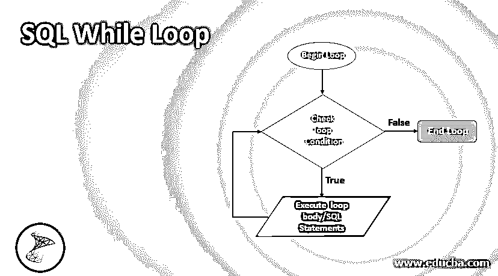

## SQL While 循环简介

标准查询语言(SQL)中的 While 循环是一种控制结构，它允许我们重复执行一组语句/函数，直到循环不变量或循环条件返回 false。当我们不确定一组语句应该运行多少次时，这非常有用。SQL While 循环以一组给定的关键字开始，如 BEGIN in SQL server 或 LOOP in PostgreSQL，并以 END 或 END LOOP 结束。如果 While 循环的条件为真，则执行循环体。否则，循环终止。

### SQL While 循环的流程图

让我们用下面提到的流程图来理解回路的工作流程:

<small>Hadoop、数据科学、统计学&其他</small>

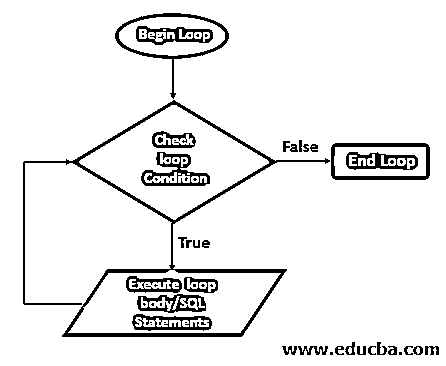

**语法**

SQL While 循环服务器的语法如下:

`WHILE condition_expression BEGIN
{statements} END`

MYSQL 中 WHILE 循环的语法如下:

`[label_name] WHILE condition_expression DO
{statements}
END WHILE [label_name]`

上述语法中使用的参数如下:

*   **WHILE condition _ expression:**是条件表达式，如果求值为 TRUE，将执行循环。如果条件评估为假，循环将被终止。
*   **语句:**定义 while 循环体。

### 实现 SQL While 循环的示例

以下是提到的一些例子:

#### 示例#1

在 PostgreSQL 中使用 SQL While 循环编写一个斐波那契函数:

在这个例子中，我们将尝试创建一个斐波纳契数列，它只是一个数字序列，其中每个新数字都是前面两个数字的总和。

举个例子，

0，1，1，2，3，5，8，13，21，…等等。

**代码:**

`CREATE OR REPLACE FUNCTION fibonacci(num integer) RETURNS integer AS $$
DECLARE
i integer = 0; j integer = 0; k integer = 1; BEGIN
IF (num < 1) THEN RETURN 0;
END IF;
WHILE(i < num)
LOOP
i = i+1;
SELECT k, j+k into j,k;
END LOOP; RETURN j; END;
$$ LANGUAGE plpgsql;`

**输出:**

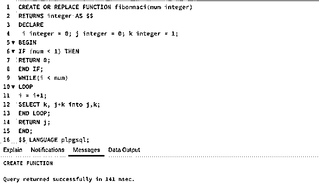

SQL 查询已成功执行。现在，我们可以检查该函数是否是在浏览器 schema 部分的 functions 选项卡下创建的。

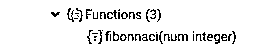

是的，事实上一个叫做“斐波那契”的新函数已经被成功创造出来了。

接下来，我们可以检查它的功能。让我们从 Fibonacci 的前 0 个数字开始。

`SELECT fibonnaci( 0 );`

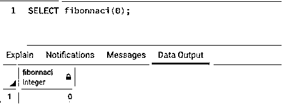

如函数中所述，函数返回 0，即如果数字的值小于 1，则返回 0。现在，让我们检查一下 WHILE 循环的工作情况。

`SELECT fibonnaci( 1 );`

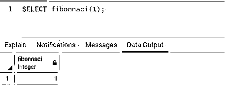

第一个 1 数字的斐波纳契数返回为 1，这是正确的。接下来让我们检查前 7 个数字的斐波那契数列。

`SELECT fibonnaci( 7 );`

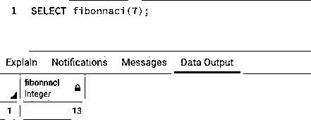

该函数返回 13 作为数字 7 的斐波那契，这也是正确的。

#### 实施例 2

使用 while 循环编写一个函数来计算自然数的总和:

在本例中，我们将尝试使用 while 循环来查找前 n 个自然数的总和。同样的公式是 n(n+1)/2。

**代码:**

`CREATE OR REPLACE FUNCTION nautral_sum(num integer) RETURNS integer AS $$
DECLARE
sum integer = 0; i integer = 1; BEGIN
IF (num <= 1) THEN RETURN 1;
END IF;
WHILE(i <= num) LOOP
sum = sum + i; i = i+1;
END LOOP; RETURN sum; END;
$$ LANGUAGE plpgsql;`

**输出:**

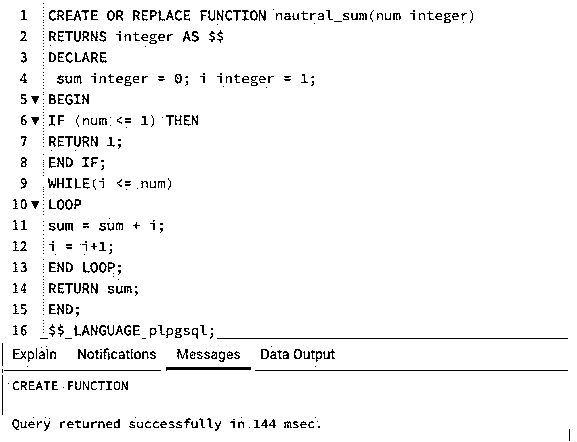

SQL 查询已成功执行。现在，我们可以检查该函数是否是在浏览器 schema 部分的 functions 选项卡下创建的。

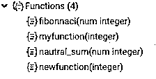

是的，确实有一个叫做“natural_sum”的新函数已经创建成功了。接下来，我们可以检查它的功能。让我们从寻找前 5 个自然数的和开始。

`SELECT public.natural_sum( 5 );`

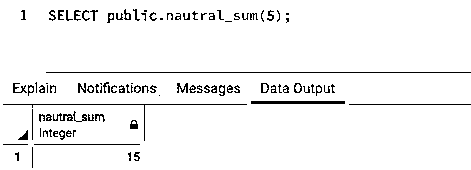

前五个自然数之和= (1+2+3+4+5) = 15。

接下来，我们试着分别求前 10 个和 100 个自然数的和。

`SELECT public.natural_sum( 10 );`

`SELECT public.natural_sum( 100 );`

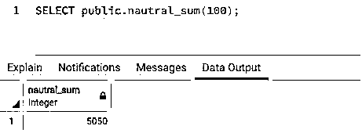

#### 实施例 3

使用 while 循环编写一个函数来计算一个数的阶乘:

在这个例子中，我们将尝试使用 while 循环找出一个数的阶乘。数字 n 的阶乘是从 1 到 n 的所有数字的乘积。

**代码:**

`CREATE OR REPLACE FUNCTION factorial(num integer) RETURNS integer AS $$
DECLARE
factorial integer = 1; i integer = 1; BEGIN
WHILE(i <= num) LOOP
factorial = factorial*i; i = i+1;
END LOOP;
RETURN factorial; END;
$$ LANGUAGE plpgsql;`

**输出:**

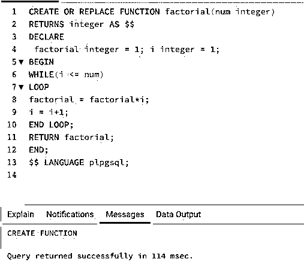

让我们检查一下函数是否已经创建。

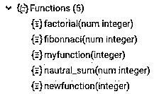

我们可以看到，在相关模式的 functions 部分已经成功地创建了函数。接下来，让我们通过尝试一些例子来检查阶乘函数的功能。首先，我们可以从寻找“0”的阶乘开始。

`SELECT public.factorial( 0 );`

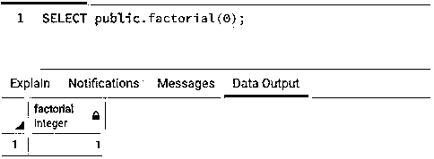

该函数返回 1，这是正确的。接下来，让我们检查 5 的阶乘。

`SELECT public.factorial( 5 );`

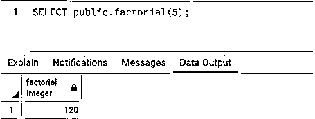

阶乘函数返回 120，这也是正确的。大于 0 的数的阶乘是该数之前所有数与该数本身的乘积。因此，5 的阶乘将由下式给出:

5*4*3*2*1 = 120

最后，让我们试着求 12 的阶乘。

`SELECT public.factorial( 12 );`

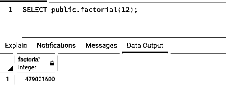

该函数返回 479001600，这也是正确的。12 的阶乘计算如下:12 * 11 * 10 * 9 * 8 * 7 * 6 * 5 * 4 * 3 * 2 * 1 = 479001600

### 结论

SQL 中的 While 循环是一种控制结构，它根据条件执行一组语句。只有当提到的条件表达式为真时，它才执行一组语句。否则，它终止并退出循环。WHILE 循环有助于高效地执行重复和递归任务。

### 推荐文章

这是一个 SQL While 循环的指南。这里我们讨论 SQL While 循环的介绍，流程图，语法，参数，以及各自的例子。您也可以浏览我们的其他相关文章，了解更多信息——

1.  [PL/SQL 集合](https://www.educba.com/pl-sql-collections/)
2.  [SQL 关键字](https://www.educba.com/sql-keywords/)
3.  [MySQL 中的光标](https://www.educba.com/cursor-in-mysql/)
4.  [PL/SQL 中的循环](https://www.educba.com/loops-in-pl-sql/)

