# SQL BIGINT

> 原文：<https://www.educba.com/sql-bigint/>

## SQL BIGINT 简介

BIGINT 是标准查询语言(SQL)中的一种数据类型，用于存储精确的数值。它用于存储超过 INT 数据类型支持的上限的值。对于有符号数值，BIGINT 数据类型的范围从-2 ^63 到 2 ^63-1 ，即(-9，223，372，036，854，775，808)到(9，223，372，036，854，775，807)。对于无符号值，其范围从 2 ^64-1 即(18，446，744，073，709，551，615)。BIGINT 数据类型表示大范围的整数，因此它的存储大小是 8 字节。

**语法:**

<small>Hadoop、数据科学、统计学&其他</small>

`BIGINT;`

BIGINT 是一种数据类型，因此每当我们必须在任何 SQL 查询(如 CREATE、CONVERT 或 CAST)中使用它时，只需使用关键字 BIGINT。

### SQL BIGINT 的示例

以下是 SQL BIGINT 的示例:

#### 示例#1

说明在表中创建 BIGINT 类型字段的 SQL 查询。

为了说明 BIGINT 数据类型的用法和范围，让我们看几个虚拟表上的例子。下面是 account_details 表的 CREATE TABLE 语句，该表包含非常大的 account_number、帐户持有人的年龄和帐户中的金额等详细信息。我们使用了三种不同类型的数值数据类型来说明它们之间的基本区别。

**代码:**

`CREATE TABLE Account_details (
account_number BIGINT,
age SMALLINT,
amount INT
);`

**输出:**

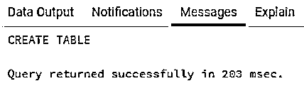

该表已成功创建。在这个表中，由于 account_numbers 的大小很大，我们对它使用了 BIGINT 人的年龄不能是 2000、3000 这样的大数字；因此，我们为这个字段保留了 SMALLINT 数据类型，最后，amount 是一个 INT 类型的字段。

下一个任务是在其中插入一些要处理的记录。

下面是一个介绍性的 INSERT 语句。

**代码:**

`INSERT INTO public.account_details(
account_number, age, amount)
VALUES (9223372036854775805,67,4512345);`

**输出:**

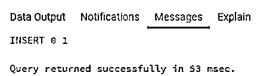

因为所有的数值都在为它们指定的范围内，所以让我们尝试几个例子，其中要插入的值不在允许的范围内。

#### 实施例 2

说明各种数字数据类型的上限和下限的 SQL 查询。

**代码:**

`INSERT INTO public.account_details(
account_number, age, amount)
VALUES (9223372,67,9223372036854775805);`

**输出:**

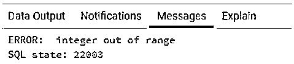

在本例中，当我们尝试在 INT 数据类型中插入 BIGINT 值时，服务器提示一个错误，如图所示。

**代码:**

`INSERT INTO public.account_details(
account_number, age, amount)
VALUES (9223372036854775810,67,4512345);`

**输出:**

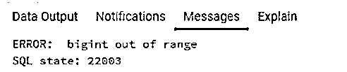

与上图类似，我们尝试在 BIGINT upper bound 前面插入一个数值。服务器抛出一个错误。因此，我们应该注意，当使用 INT 或 BIGINT 数据类型时，应该记住它们的具体范围。

#### 实施例 3

SQL 查询，以说明 BIGINT 范围溢出，而执行数学运算和方法来处理它。

为了说明对数值执行聚合操作时的范围溢出，让我们使用下面的 insert 语句在 account details 表中再插入几条记录。

**代码:**

`INSERT INTO public.account_details(
account_number, age, amount)
VALUES (9223372036854775806,32,45123),
(9223372036854775801,52,2147403648);`

**输出:**

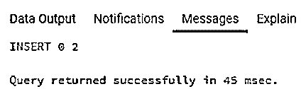

新行已成功插入。

现在我们准备尝试几个例子。

a .找出所有账户中的金额总和。

**代码:**

`SELECT SUM(amount)
FROM account_details;`

**输出:**

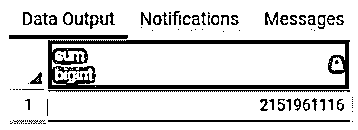

**Note:** The conversion to a higher data type in cases of range overflow is a very subjective matter. It varies across SQL database servers. You might even receive different results for the same query in two different database servers.

在本例中，我们比较了从 PostgreSQL 和 SQL server 数据库中的聚合查询获得的结果。在 PostgreSQL 中，如果出现范围溢出，结果会自动从 INT 转换为 BIGINT。

**输出:**

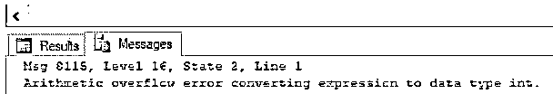

但是，当我们在 SQL server 中执行相同的查询时，不会自动转换到更大的数据类型。相反，服务器会抛出如图所示的错误。

现在您一定想知道我们应该如何在 SQL server 中处理这种情况。首先，我们可以使用 CAST 函数将值从 INT 数据类型转换为 BIGINT、DECIMAL 或 NUMERIC 数据类型，如下所示。

**代码:**

`SELECT SUM(CAST(amount AS BIGINT))
FROM account_details;`

**输出:**

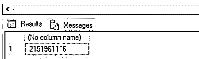

**代码:**

`SELECT SUM(CAST(amount AS DECIMAL))
FROM account_details;`

**输出:**

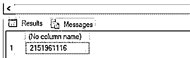

**b .求数据库表中存在的 account_numbers 的总和。**

**代码:**

`SELECT SUM(account_number)
FROM account_details;`

**输出:**

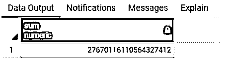

与前面的例子类似，在 POSTGRESQL 中，如果出现范围溢出，可以从 BIGINT 平滑地转换到 NUMERIC 数据类型。但是在 SQL server 的情况下，他们的服务器抛出一个范围溢出错误，如下所示。

**输出:**

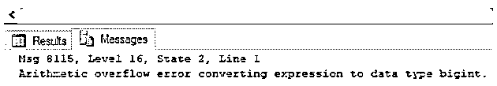

**Note:** We should note that the range of various numeric functions varies across database servers. So the numeric data type of two different servers might not be of the same storage capacity.

当我们尝试将 BIGINT 数据类型显式转换为 NUMERIC 数据类型时，服务器无法容纳新值。

**代码:**

`SELECT SUM(CAST(account_number AS NUMERIC))
FROM account_details;`

**输出:**

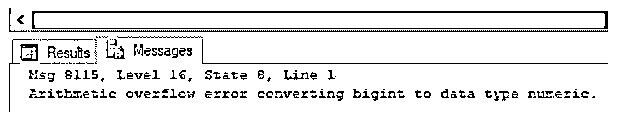

### 结论

在本文中，我们看到了 BIGINT 数据类型，这是 SQL 中的一种数值数据类型。在大多数数据库服务器中，它的存储大小为 8 位，范围从-2 ^63 到 2 ^63-1 。

### 推荐文章

这是一个 SQL BIGINT 的指南。这里我们分别讨论 SQL BIGINT 的介绍以及相应的例子。您也可以看看以下文章，了解更多信息–

1.  [SQL 选择顶部](https://www.educba.com/sql-select-top/)
2.  [SQL 集群](https://www.educba.com/sql-cluster/)
3.  [SQL 合并两个表](https://www.educba.com/sql-merge-two-tables/)
4.  [SQL 虚拟表](https://www.educba.com/sql-virtual-table/)

