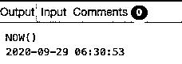
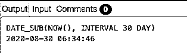
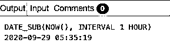
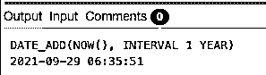
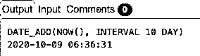
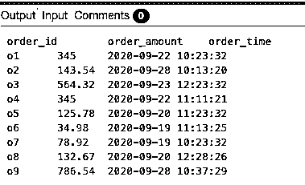
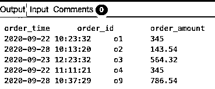

# SQL now

> 原文：<https://www.educba.com/sql-now/>

## SQL 简介

NOW()函数是标准查询语言(SQL)中的日期和时间函数，主要用于根据服务器/系统设置获取当前日期和时间戳。该函数根据所配置的时区返回“YYYY-MM-DD HH:MM:DD”或“YYYYMMDDHHMMSS.uuuu”格式的字符串。但是，在使用 NOW()函数时，必须注意这个函数只在少数数据库中有效，比如 MYSQL。对于其他流行的数据库，如 SQL Server 和 PostgreSQL，可以分别使用等效的函数，如 getdate()、getutcdate()和 CURRENT_TIMESTAMP()。

在本文中，我们将借助一些实例详细讨论 MYSQL 中的 NOW()函数。但是在开始之前，让我们讨论一下函数中使用的语法和参数。

<small>Hadoop、数据科学、统计学&其他</small>

### 语法和参数

NOW()函数的基本语法如下:

`NOW();`

该函数不需要任何用户定义的参数。

返回类型:该函数以“YYYY-MM-DD HH:MM:DD”(字符串)或“YYYYMMDDHHMMSS.uuuu”(数字)格式返回字符串/数值。

NOW()函数可以用作 SELECT 语句的一部分，用于根据系统设置获取当前日期和时间，根据过滤表达式中的当前时间过滤 WHERE 或 HAVING 子句，为输入当前日期和时间的数据插入语句，以便进行审计或将来引用等。

讨论了使用 NOW()函数的基本语法和参数之后，让我们继续讨论几个例子来更详细地理解该功能。

### SQL now 示例

下面给出了 SQL now 的例子:

#### 示例#1

SQL 查询来说明 MySQL 中 NOW()函数的功能。

`SELECT NOW();`

在这个例子中，您可以清楚地看到 NOW()函数返回当前的系统日期和时间。我们是接收数字输出还是字符串输出取决于系统设置中指定的格式。输出完全取决于系统，因此可能因系统而异。

#### 实施例 2

根据当前时间戳查找过去 30 天的日期和时间。

`SELECT DATE_SUB(NOW(), INTERVAL 30 DAY);`

在这个例子中，我们试图说明如何根据当前的日期和时间设置来计算过去持续时间的日期和时间。我们使用了系统定义的函数 DATE_SUB(arg，interval)。该函数基本上是从参数 date 中减去一个时间值(以时间间隔的形式给出)。在本例中，参数 date 是 NOW()函数的输出，间隔为 30 天。该函数从当前日期和时间中减去 30 天。

您可以使用 DATE_SUB()函数来获取其他时间间隔的值，例如月、小时、分钟、秒、年等。

#### 实施例 3

根据当前时间戳查找过去 1 小时的日期和时间。

`SELECT DATE_SUB(NOW(), INTERVAL 1 HOUR);`

这个示例主要是上一个示例的扩展。我们已经说明了如何使用 DATE_SUB()根据当前日期和时间获取过去 1 小时的日期和时间，即 NOW()函数的输出。

#### 实施例 4

根据当前时间戳查找间隔 1 年后的日期和时间。

`SELECT DATE_ADD(NOW(), INTERVAL 1 YEAR);`

在示例中，我们试图说明如何根据当前日期和时间计算指定间隔后的日期和时间。这里，我们使用了 DATE_ADD(arg，interval)函数。类似于 DATE_SUB()函数，这也是 MYSQL 中的一个系统定义函数，它给给定的 DATE 参数添加一个时间值(给定的间隔)。在这种情况下，该函数将给定的 1 年间隔添加到 NOW()函数的输出中，即当前日期和时间。我们可以使用其他时间间隔，如月、小时、分钟、秒、天等。，我们将在下一个例子中看到。

#### 实施例 5

根据当前时间戳查找未来 10 天后的日期和时间。

`SELECT DATE_ADD(NOW(), INTERVAL 10 DAY);`

在本例中，我们试图说明基于当前日期和时间的 10 天后的日期和时间计算。这个示例是上一个示例的扩展，因为我们使用了以天为间隔的 DATE_ADD()函数。

#### 实施例 6

根据给定的数据查找过去 1 周内下的订单的详细信息。

`CREATE TABLE orders(
order_id VARCHAR(10),
order_amount REAL,
order_time DATETIME
);
INSERT INTO orders (order_id,order_amount,order_time)
VALUES ('o1',345,'2020-09-22 10:23:32'),
('o2',143.54,'2020-09-28 10:13:20'),
('o3',564.32,'2020-09-23 12:23:32'),
('o4',345,'2020-09-22 11:11:21'),
('o5',125.78,'2020-09-20 11:23:32'),
('o6',34.98,'2020-09-19 11:13:25'),
('o7',78.92,'2020-09-19 10:23:32'),
('o8',132.67,'2020-09-20 12:28:26'),
('o9',786.54,'2020-09-28 10:37:29');`

表中的数据如下所示:

**SQL 查询查找过去 1 周内下的订单。**

`SELECT order_time, order_id, order_amount
FROM orders
WHERE order_time BETWEEN DATE_SUB(NOW(), INTERVAL 1 WEEK)
AND NOW();`

### 结论–SQL now

NOW()是 MYSQL 数据库中系统定义的函数，根据系统设置返回与当前日期和时间相对应的字符串或数值。当您希望在数据库中插入数据条目的时间戳以进行审计或跟踪时，或者当您希望过滤记录以进行群组分析时，比如说过去 30 天、过去 12 小时、下周等的交易，该函数非常重要。

### 推荐文章

这是一本 SQL 入门指南。在这里，我们讨论用于使用 NOW()函数的基本语法和参数，并讨论几个示例来更详细地理解该功能。您也可以看看以下文章，了解更多信息–

1.  [SQL 别名](https://www.educba.com/sql-alias/)
2.  [SQL 联合](https://www.educba.com/sql-union/)
3.  [SQL 小时()](https://www.educba.com/sql-hour/)
4.  [MySQL 修复表](https://www.educba.com/mysql-repair-table/)

