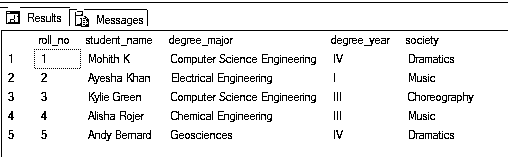
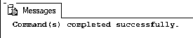
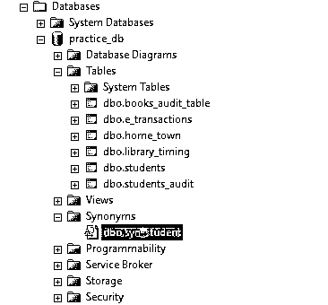
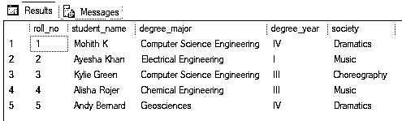
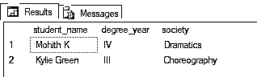

# SQL synonyms

> 原文：<https://www.educba.com/sql-synonyms/>

## SQL 同义词介绍

以下文章提供了 SQL 同义词的概述。标准查询语言(SQL)中的同义词是一个标识符，用于引用本地或远程数据库服务器中的另一个对象。它基本上为数据库对象(如表、函数、视图等)的长、多部分名称/位置提供了另一个简短的名称。同义词充当数据库对象的抽象层。它通过保护客户端应用程序免受基本数据库对象的位置或名称更改的影响，提供了额外的安全性。例如，像“db_name.schema_name.table_name”这样的位置可以简单地赋予一个同义词“table”它将以与原始位置/名称相同的方式运行。

在我们深入探讨这个主题之前，让我们从在 SQL Server 数据库引擎中创建和删除数据库对象的同义词所使用的基本语法和参数开始。

<small>Hadoop、数据科学、统计学&其他</small>

**语法和参数**

用于在数据库对象上创建同义词的基本语法如下:

`CREATE SYNONYM synonym_name FOR database_object;`

用于删除数据库对象上的同义词的基本语法如下:

`DROP SYNONYM [ IF EXISTS ] synonym_name;`

上述语法中使用的参数/自变量如下:

**同义词名称:**同义词的名称。为数据库对象名称或位置提供所需的名称。这样做通常是为了简化对象名称/位置或为其提供一个较小的名称。

**数据库对象:**要为其创建同义词的数据库对象的名称或位置。在 SQL Server 中，我们可以为以下类型的数据库对象创建同义词:

1.  用户定义的表
2.  用户定义的视图
3.  存储过程
4.  复制筛选过程
5.  各种类型的 SQL 函数:内联、表值和标量
6.  汇编(CLR)对象，如存储过程、内联函数、标量函数

**注意:**我们不能将基本数据库对象的同义词用于其他一些同义词。还应该注意，同义词不能用作用户定义的聚合函数的引用。

讨论了用于在 SQL Server 中处理同义词的基本语法和参数之后，让我们尝试几个例子来更详细地理解这个概念。

### SQL 同义词示例

以下是 SQL 同义词的示例:

#### 示例#1

说明在数据库表对象上创建同义词的 SQL 查询。

为了便于说明，考虑一个名为“students”的虚拟表。该表存在于数据库“practice_db”中，并存储在名为“dbo”的模式中。该表包含以下数据。

`/****** Script for SelectTopNRows command from SSMS  ******/
SELECT TOP 1000 [roll_no] ,[student_name] ,[degree_major] ,[degree_year] ,[society] FROM [practice_db].[dbo].[students]`

现在我们已经准备好为这个表创建同义词了。

**1。创建同义词**

`CREATE SYNONYM syn_student
FOR practice_db.dbo.students
GO`

同义词创建查询已成功执行。我们可以检查新创建的同义词是否已经成功创建，方法是转到 object explorer 部分，在相关数据库的同义词标题下查找指定的同义词，如下所示。

从上图中我们可以清楚地看到,“syn_student”同义词已经在数据库对象“students”表上成功创建。

在本节中，我们已经学习了同义词的创建，在下一节中，我们将看到在执行 SELECT、UPDATE、INSERT、EXECUTE、DELETE、SUB-SELECT 语句时，同义词与原始名称和位置一样有效。

**2。使用和处理同义词**

在 SQL Server 中使用同义词时，基本数据库对象受到的影响与使用对象的原始名称或位置时受到的影响相同。例如，如果您尝试在同义词中插入一个新行或更新一个列值，那么所述更改将在基本对象本身中进行。

`SELECT * FROM syn_student;`

下面是一个简单的 SELECT *语句，使用同义词从“students”表中选择所有记录。到目前为止，您可能已经观察到 SELECT 语句返回了与本文第一个查询的 SELECT 语句相同的输出。

现在，您一定想知道是否有可能使用它的同义词来使用原始数据库对象的列。你的问题的答案是一个大大的“是！”.是的，我们可以使用同义词从上述表中获取特定的列和记录，如下所示。

`SELECT student_name, degree_year,society
FROM syn_student
WHERE degree_major = 'Computer Science Engineering';`

在本例中，我们使用学生表的同义词，只获取了专业为“计算机科学工程”的学生的详细信息，如学生姓名、学位年份和社团。从查询的输出可以看出，结果似乎是正确的。

#### 实施例 2

删除数据库对象上的同义词的 SQL 查询。

`DROP SYNONYM syn_student;`

该命令已成功执行，这意味着“学生”表上的“syn_student”同义词已被成功删除。

### 结论

在这篇文章中，我们学习了同义词及其用法。同义词用作数据库对象(如表、视图、存储过程和函数)的简单标识符。它们为客户端应用程序提供了一个抽象层。

### 推荐文章

这是一本 SQL 同义词指南。这里我们讨论用于在 SQL Server 中处理同义词的基本语法和参数。您也可以看看以下文章，了解更多信息–

1.  [SQL 别名](https://www.educba.com/sql-alias/)
2.  [SQL 小时()](https://www.educba.com/sql-hour/)
3.  [MySQL 修复表](https://www.educba.com/mysql-repair-table/)
4.  [PostgreSQL 文本](https://www.educba.com/postgresql-text/)

