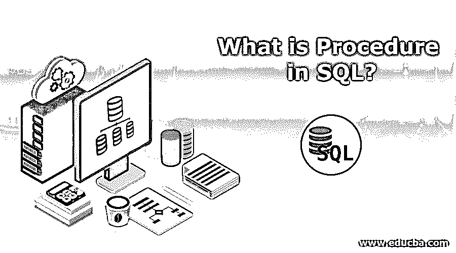

# SQL 中的过程是什么？

> 原文：<https://www.educba.com/what-is-procedure-in-sql/>

## SQL 中的过程介绍

以下文章概述了什么是 SQL 中的过程？SQL 中的过程或存储过程是 SQL 查询的逻辑单元，只要需要重复相同的操作，就可以创建一次、提取并执行多次。它还允许传递参数，比如 OOPS 概念中的带参数的存储过程。它被归类在 SQL 编程的 DML(数据操作语言)下，因为它适用于涉及数据管理和操作的操作。

### 什么是 SQL？

结构化查询语言(SQL)有时发音为单个字符“S-QL”或“see-Quel”。它用于查询、操作或更新关系数据库中的数据。它用于在数据库中插入、更新或删除记录。SQL 的主要功能之一是维护数据库。

<small>Hadoop、数据科学、统计学&其他</small>

获取所有记录的 SQL 查询语法如下:

`select * from table_name`

### SQL 中的存储过程

什么是存储过程？存储过程是结构化查询语言(SQL)语句的集合，这些语句都有一个指定的名称。这些存储过程存储在关系数据库管理系统(RDBMS)中。因此，多次调用过程可以减少多次执行，从而减少执行时间。可以使用过程来修改数据，主要优点是它不依赖于特定的应用程序。

存储过程可以接受参数作为输入，并可以返回多个值作为输出参数。在 SQL Server 中，存储过程在数据库中执行操作，并可以向应用程序或批处理调用过程返回状态值。用户定义的过程是使用用户定义的数据库创建的，除非我们有一个只读数据库。为此，我们需要在 Transact SQL (T-SQL)中开发它。Tempdb 是存储所有临时过程的地方。

有两种类型的存储过程。

*   本地程序
*   全球程序

局部过程仅对在连接中使用它的用户可见，而全局过程对同一连接中的任何用户都可见。

### 创建过程的结构

这里，所有者表示数据库名称，为了传递参数，我们需要添加' @ '符号。

**代码:**

`CREATE PROCEDURE <owner>.<procedure name>
<param> <datatype>
AS
<Body>
Execute a Stored Procedure
Exec is the command for the execution of the procedure.
EXEC Procedure_name`

### 存储过程和函数的比较

*   存储过程和函数可以用来实现相同的功能。
*   我们可以定制过程和函数。
*   它们之间的区别在于，函数被设计为将其输出发送到 Transact SQL，而存储过程被设计为将输出返回到查询，并且它们也可以将输出返回到 T-SQL。
*   应用程序可以从存储过程中获得输入，而用户定义的函数可以返回表变量，并且它们无权更改环境设置和操作系统环境。

### 数据库公司

下面给出的是数据库公司:

| **公司** | **类别** | **项目** |
| 塔尔勒 | 食物 | 饼干 |
| 塔尔勒 | 食物 | 炸薯条 |
| Lakme | 化妆品 | 口红 |
| 牛腩 | 食品杂货店 | 亚麻种子 |
| 牛腩 | 食物 | 饼干 |
| 牛腩 | 食品杂货店 | 油 |
| 旧的 | 化妆品 | 指甲油 |
| 旧的 | 化妆品 | 发刷 |

### 存储过程示例

以下 SQL 语句创建了一个选择公司的存储过程。

**代码:**

`CREATE PROCEDURE SelectAllExample
AS
SELECT * FROM company GO;`

**执行上述存储过程，如下所示:**

执行上面的存储过程，我们可以使用下面的命令:

**代码:**

`EXEC SelectAllExample;`

### 带一个参数的存储过程示例

下面的 SQL 语句创建了一个只传递一个参数的存储过程，该存储过程选择一个以项目作为参数的公司。

**代码:**

`CREATE PROCEDURE SelectAllExample @item nvarchar(30)
AS
SELECT * FROM company WHERE item = @item GO;`

**执行上述存储过程，如下所示:**

要用一个参数执行上述存储过程，我们可以使用以下命令:

**代码:**

`EXEC SelectAllExample item = "cookies";`

### 具有多个参数的存储过程示例

以下 SQL 语句创建了一个具有多个参数的存储过程，这些参数选择 company with item and category 作为参数

**代码:**

`CREATE PROCEDURE SelectAllExample @item nvarchar(30), @ category nvarchar(10)
AS SELECT * FROM company WHERE item = @ item AND category = @ category GO;`

**执行上述存储过程，如下所示:**

要执行上述带有多个参数的存储过程，我们可以使用下面的命令，我们需要用逗号分隔来传递多个参数:EXEC selectall example item = " cookies "，category = " edibles

### SQL 中过程的优缺点

下面是提到的优点和缺点:

#### 优势:

*   应用程序的改进可以通过程序来实现。如果在一个应用程序中多次调用一个过程，则使用该过程的编译版本。
*   数据库和应用程序之间的流量可以减少，因为大的语句已经输入到数据库中，我们不必一次又一次地发送它。
*   使用过程，可以实现代码的可重用性，类似于 java 和其他编程语言中的函数和方法。

#### 缺点:

*   存储过程消耗大量内存。数据库管理员的职责是决定对于特定的应用程序有多少存储过程是可行的。
*   不能使用 MySQL 调试存储过程。

### 结论–SQL 中的过程是什么

简单的非选择语句，包括 DML、Insert 和 delete 等语句，以及 Drop 和 Create 等 DDL 语句，都可以包含在存储程序中。内存消耗较多，但可以降低寻道率，有利于代码重用。存储过程可以在有或没有变量的情况下实现，如果需要，可以通过传递参数来执行。

### 推荐文章

这是一个什么是 SQL 中的过程的指南？这里我们讨论了 SQL 中的过程的结构、例子、优点和缺点。您也可以看看以下文章，了解更多信息–

1.  [什么是 SQL Server？](https://www.educba.com/what-is-sql-server/)
2.  [SQL GROUP BY WHERE](https://www.educba.com/sql-group-by-where/)
3.  [SQL Server 版本](https://www.educba.com/sql-server-versions/)
4.  [什么是 SQL](https://www.educba.com/what-is-sql/)

