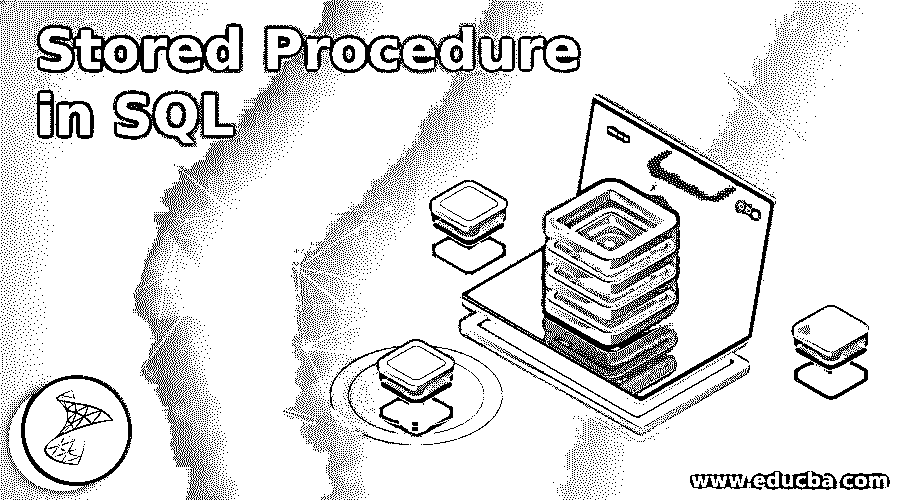
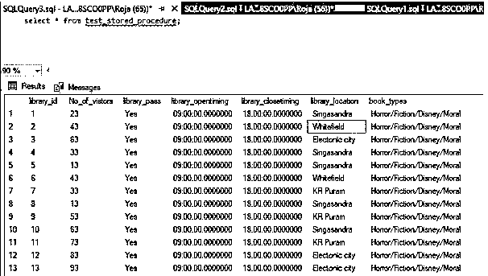
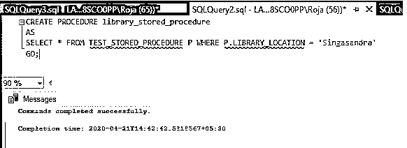
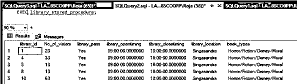
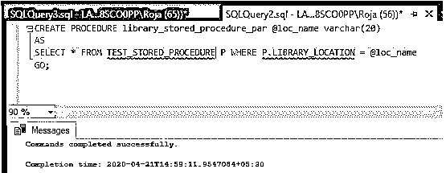
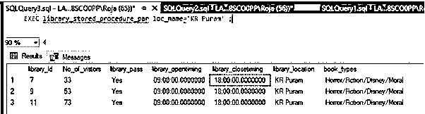
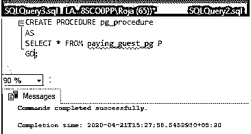
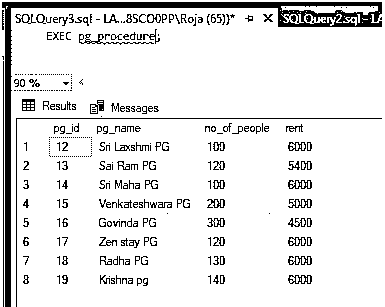
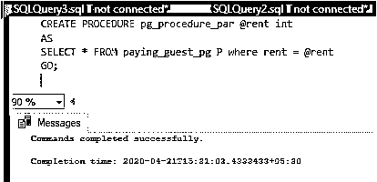
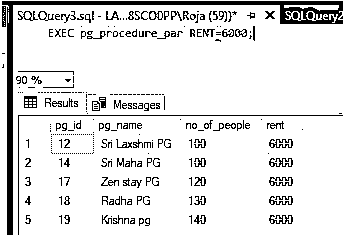

# SQL 中的存储过程

> 原文：<https://www.educba.com/stored-procedure-in-sql/>

## SQL 存储过程简介

如果你想反复执行一个特定的操作，那么我们使用存储过程。存储过程是一个 SQL 代码，它被保存并可以被重用。一旦存储过程，我们只需要调用过程来利用它。存储过程可以是参数化的，也可以是普通过程。在本节课中，让我们学习更多关于存储过程的知识，以及如何使用和调用它来执行。参数化存储过程要求将参数传递给它，以便存储过程根据传递的参数值进行操作。

### 句法

下面是存储过程的语法:

<small>Hadoop、数据科学、统计学&其他</small>

`create procedure<procedure_name>
as
/* - - - -  SQL statement - - - */
GO;`

下面是执行存储过程的语法:

`exec<procedure_name>;`

下面是参数化存储过程的语法:

`create procedure<procedure_name> @<parameter_name><datatype>
as
/* - - - -  SQL statement - - - */
GO;`

下面是执行带参数的存储过程的语法:

`exec<procedure_name>@<parameter_name> = ‘parameter_value’;`

### 如何在 SQ **L 中使用存储过程？**

**步骤 1:** 现在让我们考虑并创建一个表，并创建一个存储过程来从表中获取数据:

**代码:**

`create table test_stored_procedure
(
library_id int,
No_of_vistors int,
library_pass varchar(10),
library_opentiming time,
library_closetiming time,
library_location varchar(20),
book_types varchar(40)
);`

**步骤 2:** 让我们将数据插入表格:

**代码:**

`insert into test_stored_procedure values (1, 23,'Yes','9:00AM','6:00PM','Singasandra','Horror/Fiction/Disney/Moral');
insert into test_stored_procedure values (2, 43,'Yes','9:00AM','6:00PM','Whitefield','Horror/Fiction/Disney/Moral');
insert into test_stored_procedure values (3, 63,'Yes','9:00AM','6:00PM','Electonic city','Horrinsert into test_stored_procedure values (5, 13,'Yes','9:00AM','6:00PM','Singasandra','Horror/Fiction/Disney/Moral');
insert into test_stored_procedure values (6, 43,'Yes','9:00AM','6:00PM','Whitefield','Horror/Fiction/Disney/Moral');
insert into test_stored_procedure values (7, 33,'Yes','9:00AM','6:00PM','KR Puram','Horror/Fiction/Disney/Moral');or/Fiction/Disney/Moral');
insert into test_stored_procedure values (4, 33,'Yes','9:00AM','6:00PM','Singasandra','Horror/Fiction/Disney/Moral');
insert into test_stored_procedure values (8, 13,'Yes','9:00AM','6:00PM','Singasandra','Horror/Fiction/Disney/Moral');
insert into test_stored_procedure values (9, 53,'Yes','9:00AM','6:00PM','KR Puram','Horror/Fiction/Disney/Moral');
insert into test_stored_procedure values (10, 63,'Yes','9:00AM','6:00PM','Singasandra','Horror/Fiction/Disney/Moral');
insert into test_stored_procedure values (11, 73,'Yes','9:00AM','6:00PM','KR Puram','Horror/Fiction/Disney/Moral');
insert into test_stored_procedure values (12, 83,'Yes','9:00AM','6:00PM','Electonic city','Horror/Fiction/Disney/Moral');
insert into test_stored_procedure values (13, 93,'Yes','9:00AM','6:00PM','Electonic city','Horror/Fiction/Disney/Moral');`

**输出:**

**步骤 3:** 现在让我们为上表创建一个存储过程，以获取“library_location”为“Singasandra”的数据。不带参数的存储过程创建:

**代码:**

`CREATE PROCEDURE library_stored_procedure
AS
SELECT * FROM TEST_STORED_PROCEDURE P WHERE P.LIBRARY_LOCATION ='Singasandra'
GO;`

**输出:**

**步骤 4:** 现在让我们执行程序:

存储过程的执行命令如下:

**代码:**

`EXEC library_stored_procedure;`

**输出:**

**步骤 5:** 带参数的存储过程创建:

**代码:**

`CREATE PROCEDURE library_stored_procedure_par @loc_name varchar(20)
AS
SELECT * FROM TEST_STORED_PROCEDURE P WHERE P.LIBRARY_LOCATION = @loc_name
GO;`

**输出:**

**步骤 6:** 执行存储过程的命令如下:

**代码:**

`EXEC library_stored_procedure_par loc_name='KR Puram';`

**输出:**

### 在 SQL 中实现存储过程的示例

下面是提到的例子:

#### 示例#1

**步骤 1:** 现在让我们考虑并创建一个表，并创建一个存储过程来从表中获取数据:

**代码:**

`create table paying_guest_pg
(
pg_id int,
pg_name varchar(20),
no_of_people int,
rent int
);`

**步骤 2:** 现在让我们将数据插入表格:

**代码:**

`insert into paying_guest_pg values (12 ,'Sri Laxshmi PG',100 ,6000);
insert into paying_guest_pg values (13 ,'Sai Ram PG',120 ,5400);
insert into paying_guest_pg values (14 ,'Sri Maha PG',100 ,6000);
insert into paying_guest_pg values (15 ,'Venkateshwara PG',200 ,5000);
insert into paying_guest_pg values (16 ,'Govinda PG',300 ,4500);
insert into paying_guest_pg values (17 ,'Zen stay PG',120 ,6000);
insert into paying_guest_pg values (18 ,'Radha PG',130 ,6000);
insert into paying_guest_pg values (19 ,'Krishna pg',140 ,6000);
Stored Procedure creation without parameters: -
CREATE PROCEDURE pg_procedure
AS
SELECT * FROM paying_guest_pg P
GO;`

**输出:**

**第三步:**执行存储过程的命令如下:

**代码:**

`EXEC pg_procedure;`

**输出:**

**步骤 4:** 带参数的存储过程创建:

**代码:**

`CREATE PROCEDURE pg_procedure_par @rent int
AS
SELECT * FROM paying_guest_pg P where rent = @rent
GO;`

**输出:**

**第五步:**

**代码:**

`EXEC pg_procedure_par RENT=6000;`

**输出:**

### 结论

在上面的会话中需要记住的是:如果你想反复执行一个特定的操作，那么我们使用存储过程。存储过程是一个 SQL 代码，它被保存并可以被重用。一旦存储过程，我们只需要调用过程来利用它。存储过程可以是参数化的，也可以是普通过程。

### 推荐文章

这是一个 SQL 存储过程的指南。这里我们讨论 SQL 中存储过程的介绍、语法、用途和编程实例。您也可以浏览我们的其他相关文章，了解更多信息——

1.  [PostgreSQL TRIM()](https://www.educba.com/postgresql-trim/)
2.  [MySQL 中的光标](https://www.educba.com/cursor-in-mysql/)
3.  [PostgreSQL 过程](https://www.educba.com/postgresql-procedures/)
4.  [什么是 SQL](https://www.educba.com/what-is-sql/)

