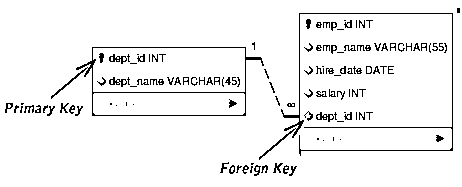

# SQL Server 约束

> 原文：<https://www.educba.com/sql-server-constraints/>

## SQL Server 约束简介

顾名思义，SQL Server 约束是应用于数据库、表或列的一组条件和限制，目的是保持准确性、减少冗余或没有冗余、稳定性和完整性等。，系统中的数据。这些约束确保应用于数据库的操作只有在符合所建立的条件或规则的情况下才能通过，否则操作将停止或失败，并显示错误或异常消息。

### 如何指定约束？

我们可以使用 create table 语句在开发表时定义约束。创建表后，我们还可以使用 ALTER TABLE 语句指定约束。

<small>Hadoop、数据科学、统计学&其他</small>

**语法**

使用以下语法创建一个表

`Create TABLE Information_ table
(
Column1 data_type(Size) Constraints_name,
Column2 data_type(Size) Constraints_name,
Column3 data_type(Size) Constraints_name,
);`

*   **Information_table:** 应该创建的表的名称。
*   **Data_type:** 字段中可以存储的数据类型。
*   **约束名称:**这代表约束的名称。因此，该示例不是空的、唯一的、主要的等。

### SQL 中的约束

SQL 中的一些约束如下:

#### 1.不为空

这些 NOT NULL 约束表明我们不能在列中存储 NULL 值。这意味着如果一个列被指定为 NOT null，我们就不能再在这个特定的列中存储 NULL。如果不在此字段中指定任何值，将不允许在表中插入新行。

**例子**

我们正在创建一个名为 college 的表，其字段 ID name 和 Email 不为 NULL。因此，如果不在该字段中指定任何值，将不允许向表中插入新行。

**语法**

`Create Table College
(
ID name (10) NOT NULL,
Email (15) NOT NULL,
ADDRESS varchar(50)
);`

#### 2.独一无二的

这种独特的限制有助于将表中的每一行都标识为唯一的。例如单数列，所有行必须有不同的值。在一个表中，我们可以有多个唯一的列。SQL 使用一个特殊的约束来检查子查询在结果中是否有重复的元组。

**点记**

1.  空子查询的计算结果为 true。
2.  如果子查询中有两个 double 行，并且至少有一个属性为 NULL，则返回 true。

**语法**

`Create Table College
(
ID int (6 ) NOT NULL UNIQUE,
NAME varchar(15),
ADDRESS Varchar(50),
);`

#### 3.主关键字

主键用于标识表中的唯一行。如果表包含主键作为字段，那么该字段不能包含空值，并且因为主键唯一地标识每一行，所以所有行都应该包含唯一的值。所以我们可以说，换句话说，这是一个非空和唯一限制的组合。下面将创建一个名为 Student 的表，并将字段 ID 指定为主键。

**语法**

`Create Table College
(
ID INT(8) NOT NULL UNIQUE,
Address varchar(50),
Email Varchar(20),
Primary Key (ID)
);`

#### 4.外键

[外键(FK)](https://www.educba.com/foreign-key-in-sql/) 是在两个表中用于建立和实施数据关系的列或列组合。下面是一个显示雇员-部门表关系的示例图。如果仔细观察，您会注意到雇员表的 dept_id INT 列与部门表的主键列相匹配。因此，雇员表的部门 id 列是部门表的外键。

在 MySQL 中，当创建如下所示的表时，可以通过设置外键限制来创建外键。以下语句在 employee 表的 College 列上设置一个外键，该外键引用 department 表的 College id 列。

**语法**

`Create table College (
Emp_id Int NOT NULL PRIMARY KEY,
emp _Name VArchar(20) NOT NULL,
hire_DATE NOT NULL,
salary INT,
Dept_ID INT,
Foreign Key (Dept_id)References Departments (dept_Id)
);`

#### 5.检查约束

使用检查限制，我们可以指定在为该字段输入值时应该满足的字段条件。例如，下面的查询创建了一个学生表，并将年龄字段条件指定为(年龄> = 18)。换句话说，不允许用户在年龄< 18 岁的表中输入任何记录。

**语法**

`Create table dogs(
IDINT NOT NULL,
Name VARCHAR (25) NOT NULL,
Breed Name Varchar (30) NOT NULL,
AGE OF BREED INT,
GENDER VARCHAR(9),
PRIMARY KEY (ID),
Check (Gender in (‘male’ , ‘female’ , ‘UNKNOW’))
);`

**注意:**上述 [SQL 命令](https://www.educba.com/sql-commands/)中的检查约束将性别限制为只属于指定的类别。如果添加了新的元组或者用不属于上述三个类别中的任何一个的性别更新了绑定中的现有元组，则数据库的相应更新将被中止。

### 结论

因此，在本约束 SQL 教程中，我们学习了 SQL 中的各种约束。首先，我们看到了对 SQL 约束的简要介绍。然后我们转到 [SQL 约束类型](https://www.educba.com/sql-constraints/)。我们还讨论了 SQL 外键、SQL 主键。我们还学习了 SQL Server 中的 SQL Server Drop 约束和 Integrity 约束。

### 推荐文章

这是 SQL server 约束的指南。在这里，我们讨论了如何指定约束、约束的类型以及它们各自的具体定义和例子。您也可以浏览我们推荐的其他文章，了解更多信息——

1.  [什么是 SQL 注入？](https://www.educba.com/what-is-sql-injection/)
2.  [SQL 中的过程是什么？](https://www.educba.com/what-is-procedure-in-sql/)
3.  [SQL Server 中的联接类型](https://www.educba.com/types-of-joins-in-sql-server/)
4.  [MySQL 中最常见的 6 种连接类型及示例](https://www.educba.com/joins-in-mysql/)

