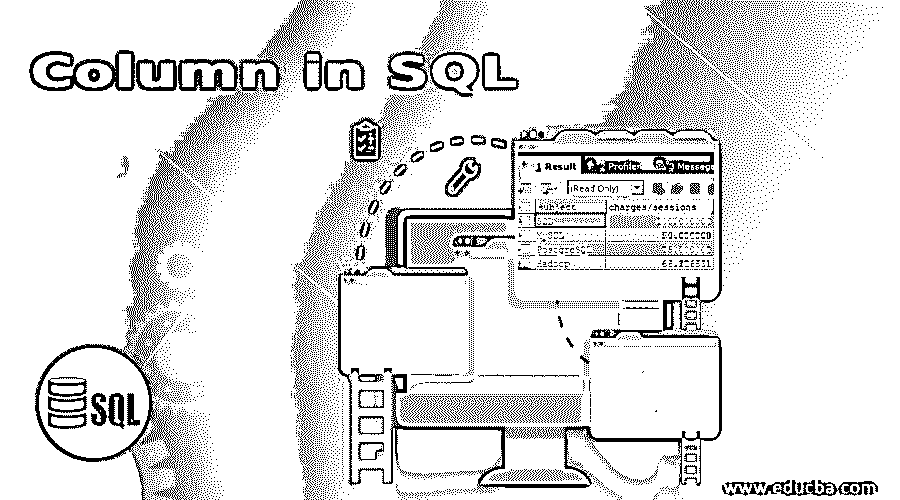
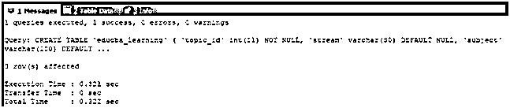
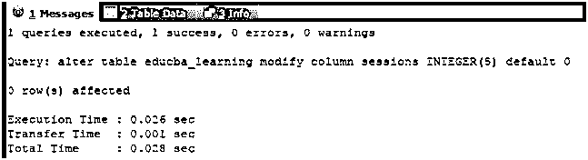
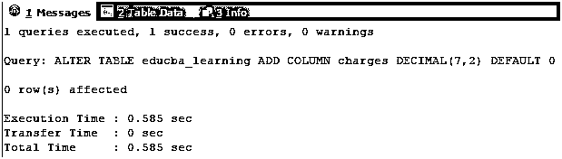
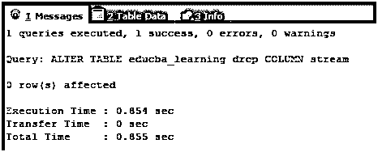
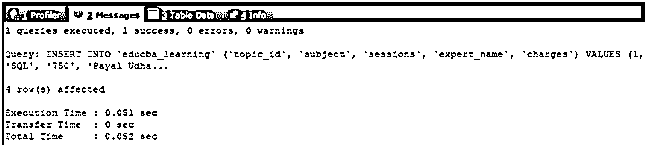
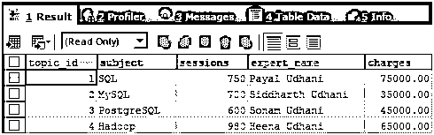
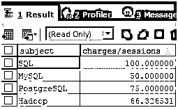
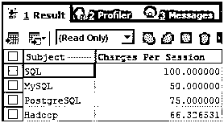

# SQL 中的列

> 原文：<https://www.educba.com/column-in-sql/>

## SQL 中的列简介

SQL 是一种结构化查询语言，用于向数据库服务器发出命令以执行某些操作，如检索数据、插入、更新和删除数据。这种语言最常用于关系数据库。关系数据库是将数据存储在表中的数据库。这些表包含行和列，共同帮助我们以结构化格式存储数据。列是我们希望存储在表中的属性，在关系数据库的情况下也称为关系，对于关系数据库，SQL 被用作与数据库服务器通信的查询语言。

### SQL 中的列是什么？

每当创建表时，我们都需要指定不同的属性，这些属性将使用列存储在 SQL 表中。我们可以定义一个或多个列，并为这些列分配不同的约束。定义列的语法如下

<small>Hadoop、数据科学、统计学&其他</small>

`name_of_column data_type [constraints]`

我们需要在 name_of_column 部分中指定希望存储在表中的列或属性的名称，并通过指定其 data_type 进一步指定将存储在该列中的值的类型。这两件事是定义该列所必需的。此外，我们可以为该列分配一个或多个约束，如 NOT NUL、IDENTITY、PRIMARY KEY、FOREIGN KEY、UNIQUE 等，以定义该列的行为。可以在创建表或更改表时定义列，以添加列或通过更改表来修改列。

### 在 SQL 中实现列的示例

以下是 SQL 中列的示例:

考虑一个例子，我们将创建一个名为 educba_learning 的表，其中包含五个列，分别为 topic_id、stream、subject、sessions 和 expert_name，它们的定义如下面的查询语句所示

**查询:**

`CREATE TABLE `educba_learning` (
`topic_id` INT(11) NOT NULL,
`stream` VARCHAR(50) DEFAULT NULL,
`subject` VARCHAR(100) DEFAULT NULL,
`sessions` INT(11) DEFAULT NULL,
`expert_name` VARCHAR(100) DEFAULT NULL
) ;`

**输出:**

#### 1.更改列

我们可以使用 SQL ALTER TABLE ALTER/MODIFY COLUMN 语句修改特定表中现有列的列定义。例如，假设 sessions 列的值不是 INT(11)并且将 NULL 作为该列的默认值，我们必须用 INT(5)将该列定义为默认值 0。我们可以使用下面的 ALTER 查询来实现这一点:

**查询:**

`ALTER TABLE educba_learning
MODIFY COLUMN sessions INTEGER(5) DEFAULT 0;`

**输出:**

#### 2.添加列

我们可以使用 ALTER TABLE ADD COLUMN 语句向 SQL 中的现有表添加一列。我们需要像创建修改列的表时那样定义列，即指定列的名称、数据类型和附加约束(如果有的话)。考虑一个例子，我们必须在 educba_learning 表中添加一个名为 charges 的列，其数据类型为 decimal，默认值为 0，那么我们的查询语句将如下所示

**查询:**

`ALTER TABLE educba_learning
ADD COLUMN charges DECIMAL(7,2) DEFAULT 0;`

**输出:**

#### 3.删除列

我们可以使用 ALTER TABLE DROP COLUMN 语句删除表中的现有列。假设我们必须从 educba_learning 表中删除名为 stream 的列，那么我们可以简单地通过指定列名来执行下面的查询语句

**查询:**

`ALTER TABLE educba_learning
DROP COLUMN stream;`

**输出:**

#### 4.列的别名

别名是替代名称，可以通过指定不同的列和列的组合，将别名分配给从查询语句中检索的值。别名也可以分配给表名。使用别名的优点是，当列名很大时，可以分配较短的名称当使用不同联接的查询中使用的多个表具有相同名称的列时，表的别名可以帮助确定应该检索哪个表的哪一列或应用哪个条件当执行聚合函数和列值的其他组合操作时，可以为检索的值分配一个名称，而不是执行整个表达式，这使得以有意义且更容易的方式读取结果记录以进行分析。

让我们在 educba_learning 表中插入一些记录:

**查询:**

`INSERT INTO `educba_learning` (`topic_id`, `subject`, `sessions`, `expert_name`, `charges`) VALUES
(1, 'SQL', '750', 'Payal Udhani', 75000),
(2, 'MySQL', '700', 'Siddharth Udhani', 35000),
(3, 'PostgreSQL', '600', 'Sonam Udhani', 45000),
(4, 'Hadoop', '980', 'Heena Udhani', 65000);`

**输出:**

让我们首先通过简单地使用下面的查询语句来检索表中的所有记录，该查询语句检索表中的所有列和行:

**查询:**

`SELECT * FROM educba_learning;`

**输出:**

现在，假设我们想要检索记录，结果必须包含主题的名称和每次会话的费用。这可以通过简单地将费用列除以会话列来计算。我们的查询语句如下

**查询:**

`SELECT subject, charges/sessions FROM educba_learning;`

**输出:**

如果我们不得不使用其他名称(比如“每次会话的费用”)和主题(如“主题”)来检索列，而不是收费/会话，则可以使用别名，如下所示:

**查询:**

`SELECT SUBJECT AS "Subject", charges/sessions AS "Charges Per Session" FROM educba_learning;`

**输出:**

### 结论

SQL 中的列是存储在表中的属性，这些属性可以在创建表时定义，甚至可以在现有表上修改、添加和删除。此外，我们可以使用别名来重命名从使用别名的列中检索到的值。其他操作和函数也可用于 MIN()、MAX()、COUNT()、AVG()和 SUM()等列。

在本文中，我们学习了如何定义表的列，如何在 SQL 中为表的列分配不同的属性、限制和约束。此外，我们如何为表中的列分配别名，同时在示例的帮助下检索数据。我们还看了一些操作，比如修改和删除它，这些操作可以根据需要使用 SQL 应用于表的列。

### 推荐文章

这是一个 SQL 中列的指南。这里我们讨论 SQL 中列的引入和实际例子以及不同的子查询表达式。您也可以浏览我们推荐的文章，了解更多信息——

1.  [SQL Server 子串](https://www.educba.com/sql-server-substring/)
2.  [SQL 中的触发器](https://www.educba.com/triggers-in-sql/)
3.  [SQL 算术运算符](https://www.educba.com/sql-arithmetic-operators/)
4.  [SQL 中的任何一个](https://www.educba.com/any-in-sql/)

