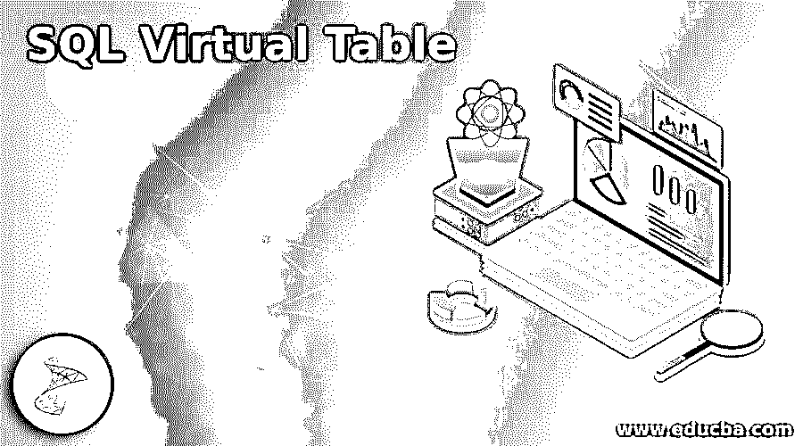
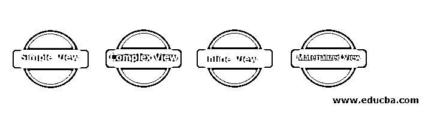
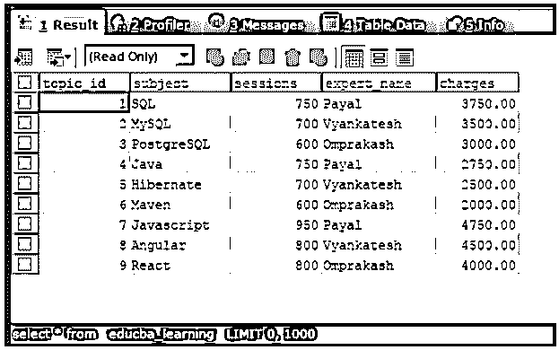
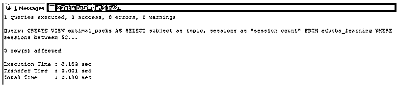
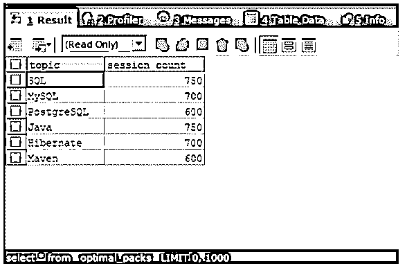
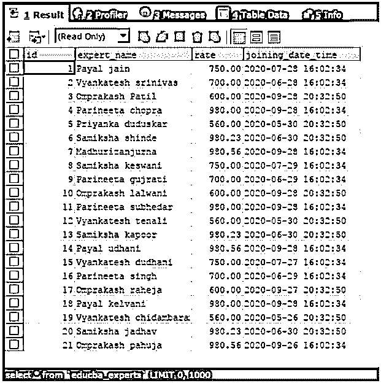
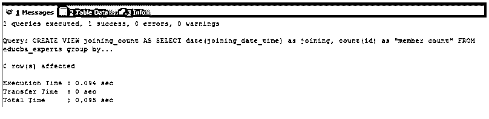

# SQL 虚拟表

> 原文：<https://www.educba.com/sql-virtual-table/>

## SQL 虚拟表简介

SQL 中的虚拟表是帮助我们添加功能的逻辑结构和实体，这些功能简化了复杂查询的结果集或表的部分内容，以用作实际上不存在于物理内存中但在工作中类似于物理内存的独立表。虚拟表也被称为视图，其优点是为允许访问的数据提供安全性，创建类似复杂查询的逻辑结构的表，并在多个查询中将其用作子查询，这最终简化了查询并向用户提供了抽象。

在本文中，我们将了解视图的虚拟表的类型，借助某些示例了解它们的实现，以及使用它们的优缺点。

<small>Hadoop、数据科学、统计学&其他</small>

### 什么是虚拟表？

虚拟表是基于一个或多个表创建的逻辑结构视图，并在可选的基础上应用复杂的函数和子句，如 GROUP BY。这只是存储在数据字典中的查询语句。这通常被称为表格的特殊版本。它们通常不消耗数据库中的任何物理内存来存储它的内容。每当我们在虚拟表上执行查询时，它在内部执行创建视图时定义的查询，然后将结果集放在使用该视图的主查询中。因此，在某种程度上，它帮助我们存储复杂的查询，然后在其他查询的子查询中简单地使用它们。

经常会出现这样的情况，我们只想允许某些用户访问满足某些约束的部分表数据。出于这些安全原因，我们可以做的是为满足这些特定约束的特定表定义一个虚拟表视图，并将该虚拟表的特权授予该用户，而不是原始表。除此之外，虚拟表也被证明是有帮助的，因为我们只需要从表中检索汇总的数据，并通过定义包含 group 语句的视图在原始表的基础上添加抽象。另外，请注意，如果对简单视图的任何记录进行更改，都会自动影响表。

### 虚拟表的类型

视图(即虚拟表)分为以下四种类型:

*   简单视图
*   复杂视图
*   嵌入式视图
*   物化视图

让我们详细了解每种类型的虚拟表

#### 1.简单视图

它是基于单个表的内容定义的视图，不涉及任何复杂函数或 group by 语句的使用。我们可以对简单虚拟表的记录执行数据操作语言命令，如插入、更新和删除，这将自动影响原始表。考虑一个示例，其中有一个名为 educba_articles 的现有表，其结构和内容如以下查询语句的输出所示

`SELECT * FROM `educba_learning`;`

上述查询语句的执行给出了如下所示的输出

现在，我们将创建一个简单的视图，该视图的会话值范围为 500 到 750，并将其命名为 optimal_packs，使用以下查询语句将唯一主题的列值作为主题和会话计数

`CREATE VIEW optimal_packs AS
SELECT SUBJECT AS topic, sessions AS "session count"
FROM educba_learning
WHERE sessions BETWEEN 500 AND 750;`

上述查询语句的执行给出了如下所示的输出

让我们从虚拟表中选择记录，并检查其内容

`SELECT * FROM `optimal_packs`;`

上述查询语句的执行给出了如下所示的输出

#### 2.复杂虚拟表

这些视图是基于多个表甚至单个表定义的，涉及到复杂函数的使用，如聚合函数和 group by 语句。注意，这些类型的虚拟表不允许通过数据操作语言命令进行操作。这主要用于抽象，提供汇总数据，并在多个查询的子查询中使用这些数据。让我们考虑一个例子，

`SELECT * FROM `educba_experts`;`

上述查询语句的执行给出如下所示的输出。

现在，我们将创建一个复杂视图，该视图包含 joining_date 和每天加入的成员计数，并使用以下查询语句将其命名为 joining_count。

`CREATE VIEW joining_count AS
SELECT DATE(joining_date_time) AS joining, COUNT(id) AS "member count"
FROM educba_experts
GROUP BY DATE(joining_date_time);`

上述查询语句的执行给出了如下所示的输出。

`SELECT * FROM `joining_count`;`

上述查询语句的执行给出了如下所示的输出。

#### 3.嵌入式视图

内联视图是子查询中最常用的虚拟表术语。创建这个虚拟表的唯一目的是拥有一个可以被进一步引用和使用的临时表，甚至被称为原始表的副本，因为内容实际上没有被修改，并且从这个虚拟表获取的数据没有存储在内存中的任何物理位置。

#### 4.物化虚拟表

这是甚至存储在数据库中的视图，它是创建并存储在内存中的原始表的副本。这些是物理存储的逻辑结构。这也称为复制，使用这种类型的虚拟表时出现的主要困难是，复制中所做的更改需要在原始表中更新。

### 结论

在这里，我们讨论了什么是 SQL 虚拟表，以及我们如何出于各种原因使用虚拟表，例如出于抽象目的、安全原因、汇总、通过在子查询中使用虚拟表来进行查询。然而，缺点包括当原始表结构改变时改变视图和计算时间，因为每次在内部使用视图时都会触发查询来生成结果集，并且它不像实际的表那样存储结果。

### 推荐文章

这是一个 SQL 虚拟表的指南。这里我们还讨论了虚拟表的介绍和类型，以及不同的例子和代码实现。您也可以看看以下文章，了解更多信息–

1.  [PostgreSQL 限制偏移量](https://www.educba.com/postgresql-limit-offset/)
2.  [MySQL NOW](https://www.educba.com/mysql-now/)
3.  [MySQL 获取](https://www.educba.com/mysql-fetch/)
4.  [MySQL 更新加入](https://www.educba.com/mysql-update-join/)

