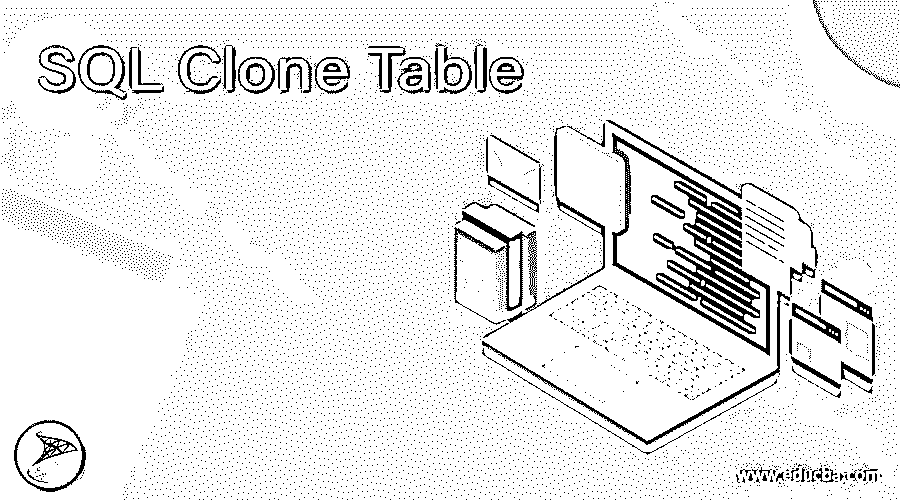
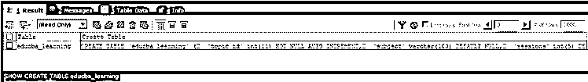
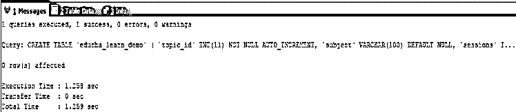
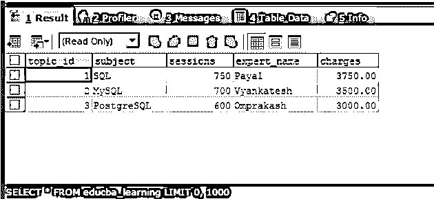
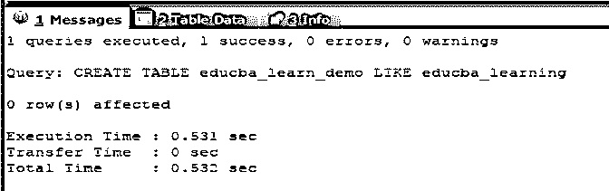
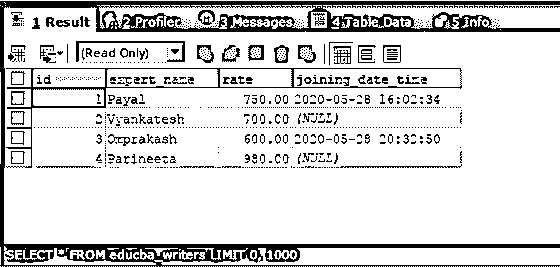
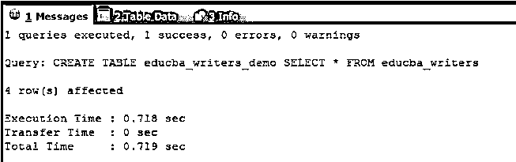

# SQL 克隆表

> 原文：<https://www.educba.com/sql-clone-table/>

## SQL 克隆表简介

SQL 克隆表是使用查询语句在 SQL 中创建一个与原始表完全相同的副本或拷贝。有时，可能会出现这样的情况，您希望执行某些操作并测试表上的更改，这样原始表的内容就不会受到影响。在这种情况下，我们所能做的只是创建一个新表，它具有与原始表相同的结构、索引和内容，也称为原始表的克隆，并在新创建的克隆表上而不是原始表上执行所有操作、试验和测试，这样原始表就不会受到影响。

### 使用简单的显示创建表查询

创建现有表的新克隆表的第一步是创建包含相同列、属性和索引的表。为此，我们可以使用 SQL 语句 SHOW CREATE TABLE name of original TABLE 来获取查询语句 CREATE TABLE for original TABLE。然后，您可以简单地复制粘贴检索到的查询语句，并用您希望创建的克隆表名替换查询语句中的原始表名。

<small>Hadoop、数据科学、统计学&其他</small>

下一步是将原始表的内容和记录复制到克隆的表中。为此，您可以一起使用 INSERT INTO 和 SELECT 语句。让我们通过一个例子来了解如何使用第一种方法创建克隆。

假设存在一个名为 educba_learning 的表，我们必须克隆该表，并为该表创建一个名为 educba_learn_clone 的新副本或克隆。让我们一个接一个地遵循上面讨论的步骤。首先，我们将执行下面的查询语句来获得创建原始表 educba_learning 的表的查询语句

`SHOW CREATE TABLE educba_learning;`

上述查询语句的执行将给出以下输出，以及 CREATE TABLE for educba_learning 表的查询语句，该表包含所有列、属性和索引

现在，我们将简单地复制从上述输出中检索到的输出查询语句，并将表 educba_learning 的名称替换为 educba_learn_clone，并执行以下查询语句来创建表的克隆

`CREATE TABLE `educba_learning` (
`topic_id` INT(11) NOT NULL AUTO_INCREMENT,
`subject` VARCHAR(100) DEFAULT NULL,
`sessions` INT(5) DEFAULT '0',
`expert_name` VARCHAR(100) DEFAULT NULL,
`charges` DECIMAL(7,2) DEFAULT '0.00',
KEY `topic_id` (`topic_id`)
) ;`

上述查询的执行给出了以下输出–

执行上面的表将创建一个与 educba_learning 表具有相同结构的新表，名为 educba_learn_clone，其中没有记录。我们可以通过使用以下查询简单地描述该表来检查该表的结构

`DESC educba_learn_demo;`

执行后会产生以下输出–

现在，下一步是将 educba_learning 表的所有记录复制到我们使用 INSERT INTO clone table SELECT * FROM original table 创建的名为 educba_learn_clone 的表的克隆中。我们的查询语句如下所示

`INSERT INTO educba_learn_demo SELECT * FROM educba_learning;`

上述查询的执行给出了以下输出–

让我们检查克隆表的内容，并验证原始表的内容，看看是否所有记录都复制成功了。这些陈述大致如下

`SELECT * FROM educba_learning;`

上述查询的执行给出了以下输出–

我们可以看到，已经成功地创建了 educba_learning 表的克隆，其名称为 educba_learn_demo table，您希望在不影响原始表 edcba_learning 的情况下执行的所有操作和测试都可以在它的克隆表 edcba_learn_demo table 上完成。

### 创建表的克隆的另一种方法

我们可以使用 CREATE TABLE LIKE 语句代替 SHOW CREATE TABLE query 语句，然后复制查询并替换表名。使用 CREATE TABLE LIKE 语句的语法如下所示

`CREATE TABLE clone_table LIKE existing_table;`

在上面的例子中，我们可以使用

`CREATE TABLE educba_learn_demo LIKE educba_learning;`

上述查询的执行给出了以下输出–

然后一起使用相同的 INSERT INTO 和 SELECT 语句进一步复制记录。

创建克隆表并向其中插入记录的另一种方法是使用下面的查询语句，该语句结合了 CREATE TABLE 和 SELECT 查询语句。

`CREATE TABLE clone _table SELECT * FROM existing _table;`

让我们考虑一个例子，我有一个名为 educba_writers 的表，它包含以下列和记录，如下面提到的 select 查询语句的输出所示

`SELECT * FROM educba_writers;`

现在，我们必须同时使用 CREATE TABLE 和 SELECT 语句来创建一个名为 educba_writers_demo table 的表 educba_writers 的克隆。为此，我们的查询语句如下

`CREATE TABLE educba_writers_demo SELECT * FROM educba_writers ;`

上述查询的执行给出了以下输出–

让我们使用下面的查询语句检索新创建的克隆表 educba_writer_demo 的内容

`SELECT * FROM educba_writers_demo ;`

上述查询的执行给出了以下输出–

从上面的输出中，我们可以看到，通过使用一条查询语句和一个步骤，已经成功地创建了一个克隆表。同时使用 CREATE TABLE 和 SELECT 被认为是创建表的克隆的最简单和最容易的方法之一。这个克隆表可以进一步用于我们创建克隆表的任何目的。

### 结论

我们可以通过同时使用 CREATE TABLE、SELECT 和 INSERT 查询语句来创建 SQL 中现有表的克隆，如上面在 SQL 中创建原始表的副本的两种方法所示。

### 推荐文章

这是一个 SQL 克隆表的指南。在这里我们讨论介绍，使用简单的显示创建表查询，替代的方法来创建一个表的克隆随着例子分别。您也可以看看以下文章，了解更多信息–

1.  [SQL 临时表](https://www.educba.com/sql-temporary-table/)
2.  [SQL 表分区](https://www.educba.com/sql-table-partitioning/)
3.  [SQL NOT 运算符](https://www.educba.com/sql-not-operator/)
4.  [SQL 选择顶部](https://www.educba.com/sql-select-top/)

