# SQL 重命名表

> 原文：<https://www.educba.com/sql-rename-table/>

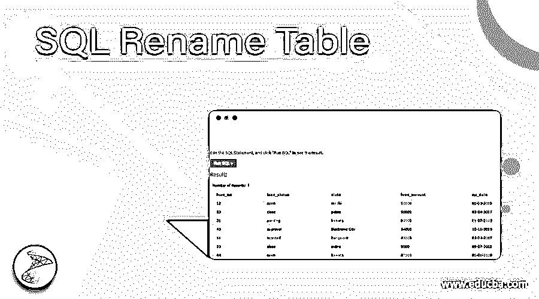

## SQL 重命名表简介

为了将表的名称或列更改为适当的业务可理解的名称，我们引入了“重命名”这一概念。我们使用' ALTER '命令重命名表，重命名/修改列，删除列，并将列添加到表中。

让我们看看添加列、重命名或修改列、重命名表名和删除列的命令。

<small>Hadoop、数据科学、统计学&其他</small>

**向表中添加列:**

`ALTER TABLE < table_name >
ADD < column_name > < data_type > ; - - Adding the column to table - - - -`

**将列拖放到表中:**

`ALTER TABLE < table_name >
DROP COLUMN < column_name > ; - - Dropping the column to table - - - -`

**将列重命名为表:**

`ALTER TABLE < table_name >
RENAME COLUMN <old_column_name> TO < new_column_name >;
- - Rename the existing column to new column name in the table - - - -`

**将表名重命名为新表:**

`ALTER TABLE < table_name >
RENAME TO < new_tablename > ; - - Rename the column to table - - -`

**语法:**

`ALTER TABLE < table_name >
RENAME TO < new_tablename > ; - - Syntax to rename the table to new table name - - -`

### 如何在 SQL 中重命名表？

让我们考虑下面的表并对其进行重命名:–下面是在将其重命名为“loan_data”表之前带有“Loan”的表名

**贷款表**:

`Select * from Loan;`

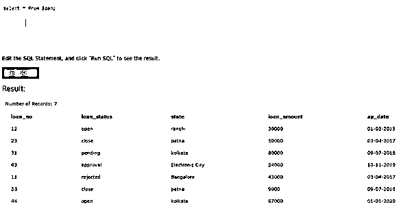

现在让我们将该表“重命名”为“LOAN_DATA”。

`ALTER TABLE LOAN
RENAME TO LOAN_DATA ;`

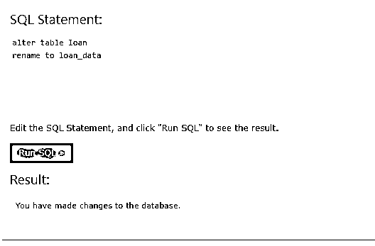

现在让我们选择旧名称为“Loan”的表。

`select * from LOAN;`

我们将看到没有这样的表存在错误。下面是上面的截图:

`SELECT * FROM LOAN_DATA;`

下面是上面的截图:

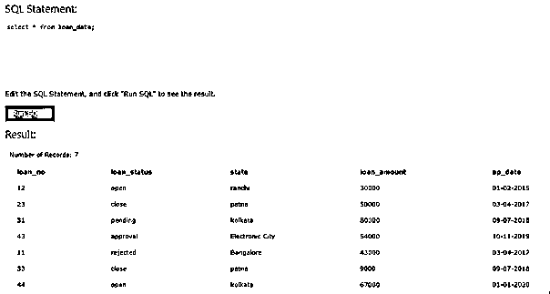

### 例子

让我们考虑几个例子。

*   **借款人表:**

`Select * from Borrower;`

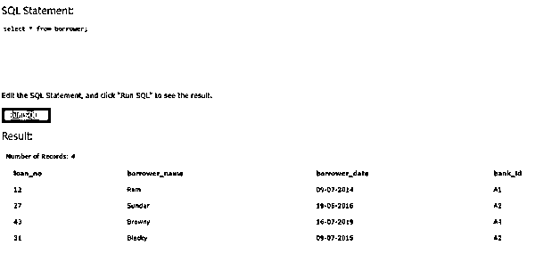

`ALTER TABLE BORROWER
RENAME TO BORROWER _DATA ;`

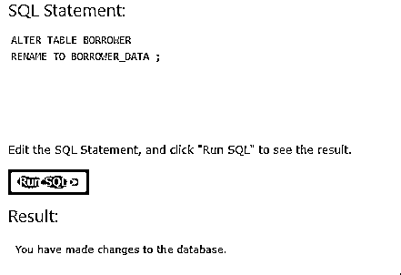

*   **向表中添加列:**

`ALTER TABLE < table_name >
ADD < column_name > < data_type > ;`

现在让我们在上面的“借款人数据”表中添加一列。

`ALTER TABLE BORROWER_DATA
ADD LOAN_TYPE VARCHAR(20) ;`

下面是上面的截图:

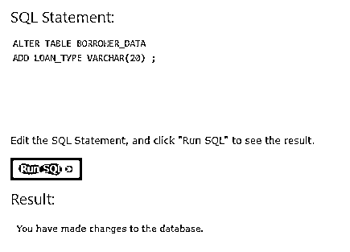

`SELECT * FROM BORROWER_DATA;`

下面是上面的截图:

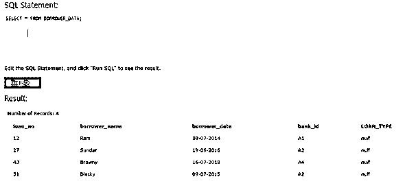

现在，让我们将数据插入“loan_type”列。

`insert into borrower_data values (24,'Suppe','12-09-2019','A2','Premium');
insert into borrower_data values (25,'Sam','18-05-2019','A1','Fast Track');
insert into borrower_data values (98,'Ashok','13-01-2018','A3','Fast Track');
insert into borrower_data values (60,'Ramya','15-10-2014','A4','Standard');
select * from borrower_data;`

**输出:**

下面是上面的截图:

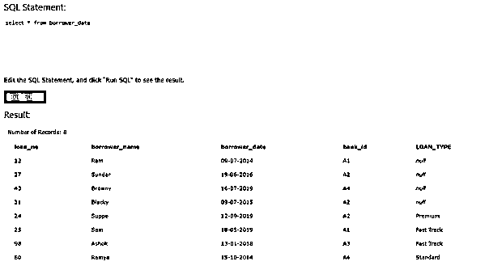

*   **将列重命名为表:**

`ALTER TABLE < table_name >
RENAME COLUMN <old_column_name> TO < new_column_name >;`

现在让我们将“借款人姓名”列重命名为“借款人名字”

`ALTER TABLE Borrower_data
RENAME COLUMN borrower_name to Borrower_first_name ;`

下面是上面的截图:

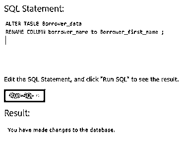

在重命名列“借款人姓名”之前，以下查询的输出。下面是上面的截图:

`select * from Borrower_data;`

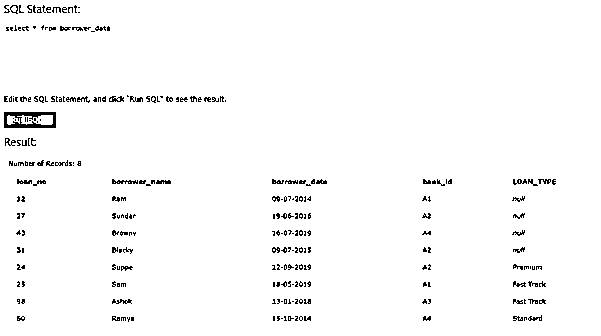

在这里，您可以看到在重命名列名后，列名已更改为“借款人名字”。

`select * from Borrower_data;`

下面是上面的截图:

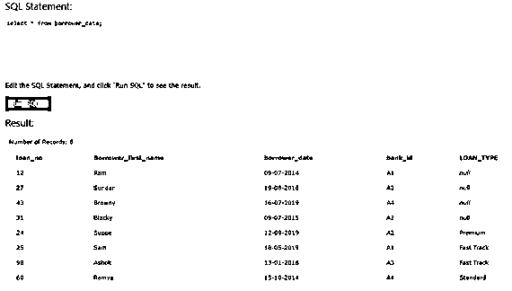

*   **将列拖放到表中:**

`ALTER TABLE < table_name >
DROP COLUMN < column_name > ;`

现在，让我们删除之前创建的列“Loan _ type”:-

`ALTER TABLE borrower_data
DROP COLUMN loan_type;`

**注意:**有些数据库不允许从表中删除列。

### 结论

*   我们使用“Alter”命令来执行重命名表和列、删除列以及将列添加到表中的操作。
*   从表中删除列时，我们需要小心。
*   我们需要记住，不是所有的数据库都允许从表中删除列。
*   我们得到了“重命名”的概念。我们使用' ALTER '命令重命名表，重命名/修改列，删除列，并将列添加到表中。

### 推荐文章

这是一个 SQL 重命名表的指南。这里我们分别讨论介绍、语法、参数和代码实现的例子。您也可以看看以下文章，了解更多信息–

1.  [SQL 模式()](https://www.educba.com/sql-mod/)
2.  [SQL 滞后()](https://www.educba.com/sql-lag/)
3.  [SQL 比较字符串](https://www.educba.com/sql-compare-string/)
4.  [SQL 更新触发器](https://www.educba.com/sql-update-trigger/)

