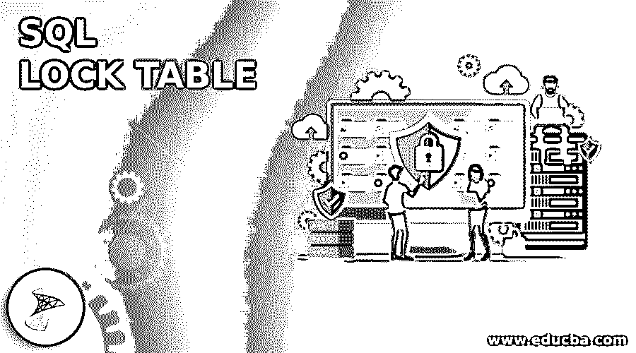
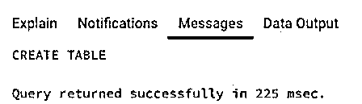
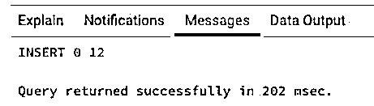
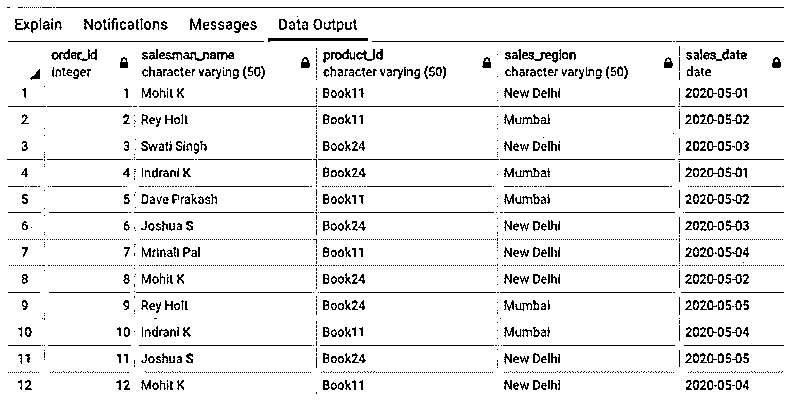
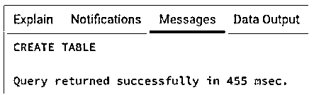
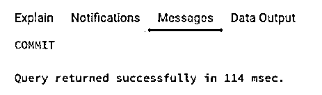
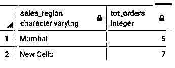
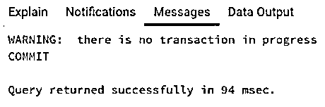
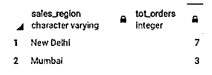
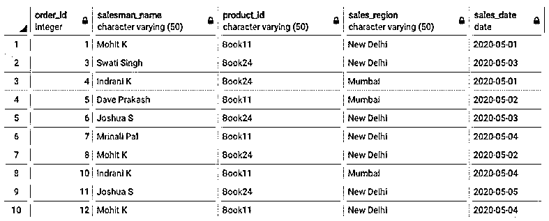

# SQL 锁表

> 原文：<https://www.educba.com/sql-lock-table/>

## SQL 锁表简介

SQL 标准中的锁用于确保读写操作等数据库事务以原子、一致和持久的方式执行。在 SQL 数据库中，我们通常有两种类型的锁，即读锁和写锁，前者的作用是防止对数据库表进行任何新的更新或插入，后者的作用是防止其他用户使用该表。锁的命名可能因 DBMS 而异，但基本原理是相同的。

对于那些仍然想知道锁在实际生活中是用来做什么的人来说，这里有一个例子。考虑一个在银行中使用的数据库表，它同时被多个用户使用。假设两个银行员工试图为两个不同的交易更新同一个银行帐户。雇员 1 和雇员 2 都从同一个表中检索帐户详细信息。雇员 1 更新了一些内容并提交了一个事务。雇员 2 还根据原始记录细节更新了一些内容并保存了结果。但是在这个过程中，他覆盖了员工 1 的交易。该记录不再反映员工 1 所做的更改。这个问题的简单解决方案是独占使用表，一次一个，这可以通过使用 LOCK 命令来实现

<small>Hadoop、数据科学、统计学&其他</small>

出于本文的目的，我们使用 PostgreSQL 作为我们的 SQL 数据库。语法基本保持不变。

### SQL 锁表的语法

在 SQL 中用于锁定表的基本语法如下:

`LOCK [ TABLE ] [ ONLY ] table_name
[ IN lock_mode MODE ] [ NOWAIT ];`

上述语法中使用的参数如下:

*   **table_name:** 要应用锁的表的名称。
*   **lock_mode:** 你想放在表上的锁的种类。您可以从{访问共享}中选择一个。row share，share update exclusive，share，exclusive，access exclusive，row exclusive，share row exclusive}。每种模式都有不同的用途。

**Note:** By default, ACCESS EXCLUSIVE lock is acquired. This lock guarantees that only one session can have this lock and only the session with this lock can execute transactions on the mentioned table.

### SQL 锁表示例

下面是提到的例子:

为了说明 SQL 锁在关系数据库中的用法，让我们创建一个名为“sales”的虚拟表。

它的 CREATE TABLE 语句如下所示:

**代码:**

`CREATE TABLE sales (
order_id int,
salesman_name character varying(50),
product_id character varying(50),
sales_region character varying(50),
sales_date date
);`

**输出:**

销售表已成功创建。我们的下一个任务是在其中插入一些要处理的记录。下面是相同的 insert 语句。

**代码:**

`INSERT INTO public.sales(
order_id, salesman_name, product_id, sales_region, sales_date)
VALUES (1,'Mohit K','Book11','New Delhi','2020-05-01'),
(2,'Rey Holt','Book11','Mumbai','2020-05-02'),
(3,'Swati Singh','Book24','New Delhi','2020-05-03'),
(4,'Indrani K','Book24','Mumbai','2020-05-01'),
(5,'Dave Prakash','Book11','Mumbai','2020-05-02'),
(6,'Joshua S','Book24','New Delhi','2020-05-03'),
(7,'Mrinali Pal','Book11','New Delhi','2020-05-04'),
(8,'Mohit K','Book24','New Delhi','2020-05-02'),
(9,'Rey Holt','Book24','Mumbai','2020-05-05'),
(10,'Indrani K','Book11','Mumbai','2020-05-04'),
(11,'Joshua S','Book24','New Delhi','2020-05-05'),
(12,'Mohit K','Book11','New Delhi','2020-05-04');`

**输出:**

在 sales 表中插入记录后，让我们检查使用 SELECT 语句是否成功地插入了所需的行。

**代码:**

`SELECT * FROM sales;`

**输出:**

数据已成功插入。

#### 示例#1

在 locktable 模式下，根据 sales 表中提到的记录，在名为“sales_count”的新表中插入每个地区的订单总数。相同的 create 语句如下。

**代码:**

`CREATE TABLE sales_count(
sales_region VARCHAR,
tot_orders INT
);`

**输出:**

**代码:**

`BEGIN WORK;
LOCK TABLE sales IN SHARE MODE;
INSERT INTO sales_count(sales_region,tot_orders)
SELECT sales_region, count(order_id) as tot_orders
FROM sales
GROUP BY sales_region;
COMMIT WORK;`

**输出:**

交易已成功完成。

让我们检查在 sales_count 表中是否已经进行了所需的更改。

**代码:**

`SELECT * FROM sales_count;`

**输出:**

您可能已经注意到，我们在这里使用了共享模式锁。你一定想知道这有什么区别？共享模式中的 SELECT 命令获得了上述表上的一个锁，当事务在这个锁模式中执行时，其他用户可以读取该表，但不能修改它。

#### 实施例 2

假设“雷伊·霍尔特”是一个虚构的人物，他没有进行过真正的销售。因此，在“Rey Holt”以锁表模式进行销售的地方，删除两个表中的所有记录。

**代码:**

`ROLLBACK;
BEGIN WORK;
LOCK TABLE sales IN SHARE ROW EXCLUSIVE MODE;
UPDATE sales_count
SET tot_orders =  (SELECT tot_orders FROM (SELECT sales_region, count(order_id) as tot_orders
FROM sales
WHERE salesman_name <>'Rey Holt'
GROUP BY sales_region)s WHERE sales_region = 'Mumbai')
WHERE sales_region = 'Mumbai';
DELETE FROM sales WHERE salesman_name = 'Rey Holt';
COMMIT WORK;`

**输出:**

**Note:** In order to ensure that no other transaction is interfering with the current transaction use ROLLBACK command.

交易成功执行。

让我们使用 SELECT 语句检查两个表中是否都进行了所需的更改。

**代码:**

`SELECT * FROM sales;`

**输出:**

**代码:**

`SELECT * FROM sales_count;`

**输出:**

在本例中，您可能已经注意到我们使用了行独占模式。到底是什么？这种锁模式保护上述表免受并发数据更改和修改，并且本质上是排他的。一次只有一个会话可以使用它。此外，它永远不会自动获得。

**Note:** In postgreSQL, we do not have any command such as UNLOCK TABLE. The LOCK is nullified once the transaction is complete.

### 结论

在本文中，我们看到了 SQL 锁。SQL 中的 LOCK TABLE 命令用于防止死锁和并发数据更改和修改，以保持数据库表上事务的一致性和原子性。

### 推荐文章

这是一个 SQL 锁表指南。在这里，我们将讨论 SQL 锁表的介绍以及一些示例，以便更好地理解。您也可以看看以下文章，了解更多信息–

1.  [SQL UNION ALL](https://www.educba.com/sql-union-all/)
2.  [SQL DECODE()](https://www.educba.com/sql-decode/)
3.  [SQL LIKE 子句](https://www.educba.com/sql-like-clause/)
4.  [SQL DATEPART()](https://www.educba.com/sql-datepart/)

