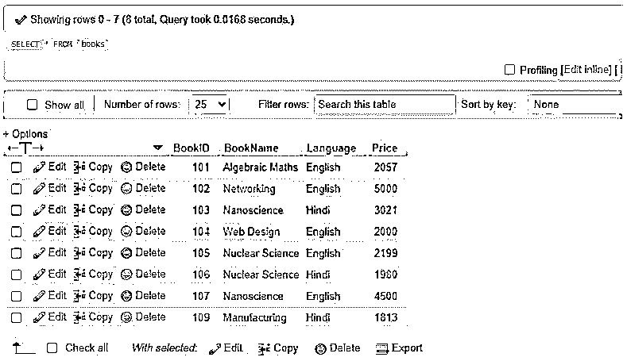
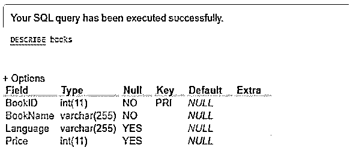
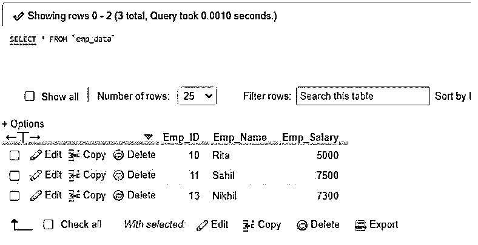
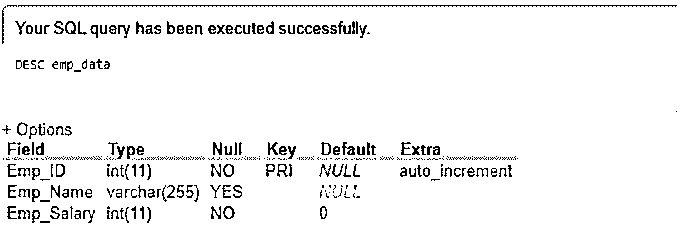
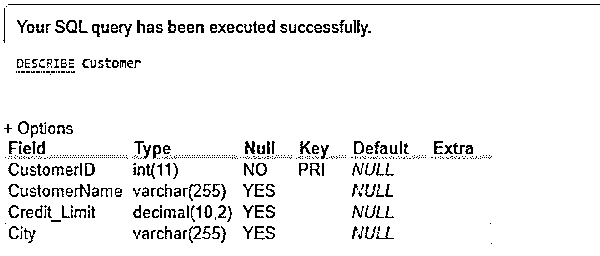
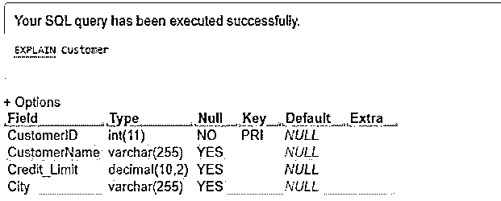

# SQL 描述表

> 原文：<https://www.educba.com/sql-describe-table/>

## SQL 描述表简介

SQL DESCRIBE TABLE 是一个 SQL 语句，负责说明数据库中特定表的一些信息。如果我们想显示服务器中一个或多个数据库表的结构，我们将使用 SQL 命令 DESCRIBE 或其他关键字 DESC，这与 DESCRIBE one 是相同的。为了获得数据库中表的信息并找到与之相关的属性，我们将使用 DESCRIBE 或 DESC，两者都不区分大小写并产生相似的输出。我们实现了 DESCRIBE TABLE 语句来获取关于列名、列的数据类型、列的 NULL 或非 NULL 属性的信息，以及具有数据库大小精度和数字类型小数位数的表。

### SQL 描述表的语法

让我们详细说明基本语法，以显示 SQL server 中 DESCRIBE TABLE 命令的结构:

<small>Hadoop、数据科学、统计学&其他</small>

`DESCRIBE | DESC [TableName | ViewName];`

上述术语描述如下:

*   TableName 表示我们想要查看其结构的数据库中的表的名称。
*   ViewName 还表示为表创建的视图的名称，我们希望描述视图结构。

我们还可以提前监控另一种语法类型，如下所示:

`[DESCRIBE | DESC] TABLE{name}[ TYPE = (STAGE | COLUMNS) ];`

*   这里,{name}为提到的特定表定义了一个标识符来描述它。当标识符包含空格或特殊字符时，我们可以使用区分大小写的双引号将整个字符串括起来。
*   TYPE = (STAGE | COLUMNS)术语定义是显示表列，还是显示由表的默认值和当前值组成的阶段属性。
*   但是默认情况下，如果查询中没有提供 TYPE 关键字，服务器会使用 TYPE = COLUMNS。
*   此外，应该记住，条件类型=阶段的查询不能应用于视图，因为视图不包含阶段属性。

### 如何用 SQL 描述表？

*   DESCRIBE 可以说是命令 EXPLAIN TABLE 的同义词。这两个语句在执行时将提供关于所有表列的信息。
*   因此，在 SQL 中使用 DESCRIBE TABLE 将告诉您特定表中存在的列或其当前值类型，以及表的阶段属性的默认值。
*   当我们在数据库中执行 DESCRIBE TABLE 命令时，我们将能够在 DESCRIBE 选项卡中查看表的结构，但不能在系统软件的 console 选项卡中查看。
*   SQL DESCRIBE TABLE 查询将使我们了解表的组织，该表由表列的名称和数据类型值组成，如 VARCHAR、CHAR、INT、FLOAT、TIME、DATE、NUMBER 或任何 XML 类型，用于表中的各个字段，它还显示具有 null 或非 NULL 数据库对象的列，这些对象表明该列是否包含 NULL 值。
*   因此，SQL DESCRIBE 表有利于获取数据库中当前表的详细信息。

### SQL 描述表示例

下面给出了 SQL 描述表的示例:

#### 示例#1

使用 DESCRIBE TABLE 命令的简单示例。

假设，我们以一张桌子作为演示来使用 DESCRIBE。表命令并查看结果。我们的数据库中有一个名为 Books 的表，其中包含 BookID、BookName、Language、Price 等字段，每个字段在创建表时都定义了不同的数据类型。

该表的内容如下所示:

**代码:**

`SELECT * FROM Books;`

**输出:**

**<u>

</u>** 

现在，让我们简单地应用如下编写的描述表查询:

**代码:**

`DESCRIBE Books;`

**输出:**

正如您在上面的输出中所看到的，DESCRIBE TABLE 语句描述了带有类型、空属性、键、默认值甚至额外属性的表 Books 的列名。

表的结构中还提供了数据类型值及其长度，以及 NULL 属性及其存在和主键的是/否值。注意，NULL 列中的 YES 表示表中特定列的值可以是 NULL，NO 表示我们不能放置或插入 NULL 值。

#### 实施例 2

使用 DESC 表格命令的示例。

假设我们的数据库中有一个名为 Emp_Data 的表，创建如下:

**代码:**

`CREATE TABLE Emp_Data(Emp_ID INT AUTO_INCREMENT PRIMARY KEY, Emp_Name VARCHAR(255), Emp_Salary INT NOT NULL DEFAULT 0);`

完成表格结构后，让我们填写一些记录如下:

**代码:**

`INSERT INTO `emp_data`(`Emp_ID`, `Emp_Name`, `Emp_Salary`) VALUES
(10,'Rita',5000),
(11, 'Sahil',7500)
(13, 'Nikhil',7300);`

现在，显示表 Emp_Data 的内容:

**代码:**

`SELECT * FROM Emp_Data;`

**输出:**

接下来，我们将使用 DESC 表查询命令通过下面的语句来获取表的详细信息:

**代码:**

`DESC Emp_Data;
OR,
DESCRIBE Emp_Data;`

**输出:**

正如您在创建时看到的，我们已经为 Emp_Salary 列添加了默认值，因此在描述时，结果在 Emp_Salary 行中显示默认值为 0。类似地，在 Emp_ID 行中，您可以在额外的列中看到 auto_increment 值，这是在上面的查询中提到的表制作时间中添加的属性。

#### 实施例 3

DESCRIBE TABLE 命令与 EXPLAIN TABLE 命令的示例。

让我们以带有字段的表 Customer 为例:CustomerID、CustomerName、Credit_Limit 和 City 具有各自的数据类型和其他属性。

查看表格:

**代码:**

`SELECT * FROM Customer;`

**输出:**

EXPLAIN Table 和 DESCRIBE Table 命令的工作方式相似，并且生成相同的结果行。我们可以说两者是同义词，SQL server 中的任何一个都可以用于检索特定表的信息。

请同时查看以下带有输出的查询:

**代码:**

`DESCRIBE Customer;`

**输出:**

**<u>

</u>** 

**代码:**

`EXPLAIN Customer;`

**输出:**

正如您所看到的，DESCRIBE 和 EXPLAIN 表命令的输出也是相同的。

### 结论

实现 SQL 中的 DESCRIBE 查询是为了显示指定数据库表的列列表的定义。SQL DESCRIBE Table 命令应该只在我们的系统软件上执行，而不是在任何编辑器上，因为它不会在那里运行。我们需要在我们自己的系统服务器上安装的数据库上运行这个 DESCRIBE 查询。

### 推荐文章

这是一个 SQL 描述表的指南。这里我们讨论一下入门，如何用 SQL 描述表？和示例。您也可以看看以下文章，了解更多信息–

1.  [SQL DML 命令](https://www.educba.com/sql-dml-commands/)
2.  [什么是 SQL](https://www.educba.com/what-is-sql/)
3.  [带子句的 SQL](https://www.educba.com/sql-with-clause/)
4.  [SQL TRUNCATE()](https://www.educba.com/sql-truncate/)

