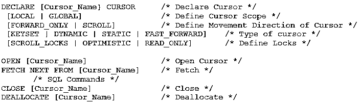
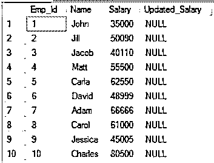

# SQL 中的游标

> 原文：<https://www.educba.com/cursors-in-sql/>

## SQL 中的游标简介

SQL 中的游标是每当运行 SQL 语句时在计算机内存中形成的瞬时内存空间，它用于定位当前正在处理的行。它用于管理表中的记录，方法是在按每次跟踪一行的顺序运行查询后，从数据库中提取数据。在查询执行期间，该游标可以保持多条记录的“活动集”,但不能保持主动处理多条记录。

因此，游标创建一个临时工作区，其中包含一组选定的行和一个指向当前行的指针。光标将在其上执行所需操作的这组行称为活动数据集。指针从结果集中逐个检索行。然后，您可以一次一行地执行任何 SQL 操作。

<small>网页开发、编程语言、软件测试&其他</small>

### 隐式光标

顾名思义，隐式游标是由 SQL 解析器为 DML 查询生成的。DML 查询是数据操作查询。这些查询操作或更改数据。它们不会干扰数据库的结构或模式。SELECT、INSERT、UPDATE 和 DELETE 等查询会生成隐式游标。隐式游标对最终用户是隐藏的。

### 显式光标

显式游标是用户生成的游标。当用户指示 SQL 解析器为活动集创建游标时，这样创建的游标称为显式游标。活动集由用户通过选择查询来定义。我们将在本文中详细讨论显式游标。

### 光标操作–光标的生命周期

游标的生命周期通常包括五个阶段:

**1。声明:**第一步是声明一个游标。该步骤指示系统使用给定的数据集生成光标。数据集是使用 SQL 语句构建的。在这个阶段，活动集被创建，但是光标的临时工作区还没有在内存中打开。

**2。打开:**接下来，系统被指示打开光标。在此阶段，临时工作空间与活动集一起加载到内存中，并生成一个指针，该指针指向活动集中的第一行。

**3。Fetch:** 这是整个流程中反复出现的步骤。获取指针的当前行，并对行数据执行所需的任务。指针移动到光标的下一行。

**4。关闭:**数据操作完成后，需要关闭光标。

**5。Deallocate:** 这是删除游标并释放分配给游标的内存、处理器和其他系统资源的最后一步。

### 显式光标–实际应用！

好了，现在我们对什么是游标以及它们如何工作有了一个基本的了解。是时候亲自动手创建一个明确的光标了。

### SQL 中的游标术语

让我们来理解这个语法中使用的术语。

#### 光标范围

*   光标范围可以是全局的，也可以是局部的*。*全局光标在整个连接中都可用。局部游标的作用域仅限于保存该游标的存储过程、函数或查询。
*   这是 MS SQL Server 特有的功能。MySQL 只支持本地范围的游标。

#### 光标移动

*   MS SQL Server 还提供了设置光标移动的选项。它可以是传统的 Forward_Only 模式，将指针从第一行移动到最后一行。或者，可以滚动到第一行、最后一行、上一行或下一行。
*   MySQL 中的游标是不可滚动的。

#### 光标类型

*   游标可以是静态的，因为它可以缓存活动集直到释放，并且可以在缓存的活动集中向前和向后移动。游标只能在静态模式下 fast_forward。
*   它也可以是动态的，允许在游标打开时添加或删除活动集中的行。在键集模式下，游标的其他用户看不到这些更改。MySQL 中的游标只能快进。

#### 光标锁定

*   游标锁在多用户环境中非常有用。它们锁定行，这样就不会有两个用户同时操作相同的数据。这确保了数据的完整性。
*   只读锁表明该行无法更新。
*   当在游标中提取行时，滚动锁会锁定行，从而确保任务成功并且更新的数据在游标之外可用。乐观尝试在没有任何锁的情况下更新行。因此，如果该行已在游标之外被更新，该任务将不会成功。
*   MySQL 只支持只读锁。这意味着 MySQL 不会更新实际的表；相反，它会复制数据来执行更新命令。

因此，我们看到这些选项仅在 MS SQL Server 中可用。这使得 MySQL 游标的语法更加简单。

### 例子

现在让我们更新雇员表中雇员的工资。

在 SQL 示例中，我们将在这些游标中使用以下数据。

我们的光标代码如下:

`DECLARE @sal float
DECLARE @newsal float
DECLARE Emp_Cur CURSOR FOR SELECT Salary, Updated_Salary FROM Employees
OPEN Emp_Cur
FETCH NEXT FROM Emp_Cur INTO @sal, @newsal
WHILE @@FETCH_STATUS = 0
BEGIN
SET @newsal = @sal*1.25
UPDATE Employees SET Updated_Salary = @newsal WHERE CURRENT OF Emp_Cur
FETCH NEXT FROM Emp_Cur INTO @sal, @newsal
END
CLOSE Emp_Cur
DEALLOCATE Emp_Cur`

执行上述光标命令后的输出将是:

### 结论–SQL 中的游标

因此，我们已经看到了什么是光标，如何使用它们以及在哪里避免使用它们。事实证明，游标对开发人员来说确实是一个有用的工具，但这是以牺牲性能为代价的。因此，选择游标时要小心。

### 推荐文章

这是 SQL 中的游标指南。这里我们用例子讨论 SQL 中的游标的类型、生命周期和术语。您还可以浏览我们推荐的其他文章——

1.  [SQL 视图](https://www.educba.com/sql-views/)
2.  [PL/SQL 中的游标](https://www.educba.com/pl-sql-in-cursors/)
3.  [MySQL 中的光标](https://www.educba.com/cursor-in-mysql/)
4.  [PostgreSQL 中的游标](https://www.educba.com/cursors-in-postgresql/)

