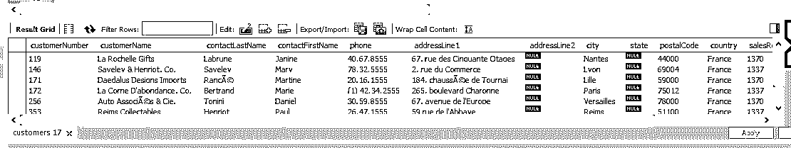
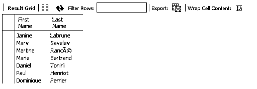
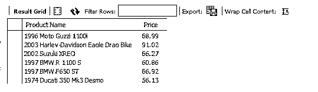
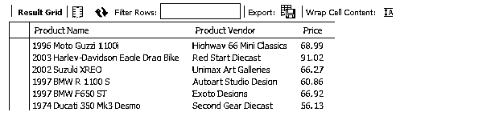
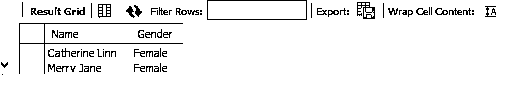

# 在 SQL 中

> 原文：<https://www.educba.com/and-in-sql/>

## SQL 中的和简介

在 SQL 中处理数据时，分析师经常会遇到需要过滤数据的情况。过滤是数据准备中非常常见的一部分，在 [SQL 中，可以通过某些逻辑运算符](https://www.educba.com/what-is-sql/)进行过滤。AND 运算符就是这样的运算符之一。顾名思义，它考虑了与之相关的所有条件。要获得必需的数据，请在 WHERE 子句中指定条件，用 AND 运算符分隔。如果条件和操作符使用得当，那么结果将只返回那些满足条件的记录。

**语法:**

<small>Hadoop、数据科学、统计学&其他</small>

SQL 中 AND 运算符的语法如下:

`SELECT    column_1,        column_2, ...,   column_n
FROM   table_name
WHERE   condition_1      AND      condition_2        AND  …. condition_n`

### SQL 中的 AND 是如何工作的？

SQL 中的 AND 运算符检查运算符的所有条件是否都为真，并返回满足这些条件的记录。从技术上讲，AND 运算符的意思是“如果两个布尔表达式都为真，则为真”。对于那些满足条件的记录，返回必需的字段。在某种程度上，AND 运算符起到了过滤器的作用，它允许我们只获取在上下文中有意义的那部分数据。这里，另一件重要的事情是 SQL 查询的执行顺序。WHERE 子句在顺序中的位置更高，因此 and 运算符在查询处理中更早出现，这实际上有助于过滤任务。

### 在 SQL 中实现和的示例

SQL 中的和示例如下:

#### 示例#1

在本演示中，我们考虑“客户”数据集。数据集包含与客户相关的各种详细信息，例如他们的姓名、联系方式和信用额度。我们的任务是只获取信用额度大于或等于 75000 英镑的法国客户的记录。在这里，我们有两个条件，首先，客户应该属于某个特定的国家，即在这种情况下是法国。一旦满足了这个条件，下一个任务就是在所有来自法国的客户中识别出那些信用限额为 75000 或者超过 75000 的客户。为了组合这两个条件，并获得必要的数据，我们必须使用 and 运算符。

**代码:**

`SELECT * FROM customers
WHERE creditLimit > 75000 AND country = 'France';`

**输出:**

如果我们只想知道满足这两个条件的客户的名字和姓氏，该怎么办？我们将重写上面的查询，只明确提到我们感兴趣的列名，如下所示。

**代码:**

`SELECT contactFirstName 'First Name', contactLastName 'Last Name’
FROM customers
WHERE creditLimit > 75000 AND country = 'France';`

正如我们在上面看到的，联系人名字意味着客户的名字。同样，联系姓氏意味着客户的姓氏。注意，现在 AND 运算符将检查两个条件是否都为真，并从相应的记录中返回名字和姓氏。

**输出:**

我们可以根据需要在输出中引入任意多的字段。比如，在上面的查询中，我们还可以将信用额度与姓名一起输入。

#### 实施例 2

在本演示中，我们希望获得价格大于或等于 50 辆的自行车的名称。产品数据集由各种字段组成，包括产品代码、产品名称、产品线、产品供应商、产品描述、库存数量和购买价格。在这里，最重要的领域是产品线。该数据集包含各种车辆产品线的详细信息，如老爷车、摩托车、飞机、轮船、火车、卡车和公共汽车以及老爷车。由于我们有兴趣了解自行车的价格，我们将从产品线字段中选择“摩托车”。通过这样做，我们根据第一个标准过滤数据。现在，第二个任务是识别价格大于或等于 50 辆的自行车。因此，我们将在 WHERE 子句中使用 AND 运算符将这两个条件加在一起，获取这种自行车的查询如下。

**代码:**

`SELECT productName 'Product Name', buyPrice 'Price'
FROM products
WHERE productLine = 'Motorcycles' AND buyPrice >= 50</code?`

**输出:**

在上面的查询中，我们为 productName 和 buy price 字段提供了一个别名。输出将包含这两个字段。我们将通过向查询中添加产品供应商字段来对查询进行一些更新。更新后的查询如下所示。

**代码:**

`SELECT productName 'Product Name', productVendor 'Product Vendor', buyPrice 'Price'
FROM products
WHERE productLine = 'Motorcycles' AND buyPrice >= 50;`

请注意，上面的查询将为我们提供符合特定价格标准的自行车的详细信息。最重要的是，现在，我们可以看到哪些供应商提供了哪辆自行车以及价格。这是使用和筛选数据的一个非常重要的方面。非常重要的一点是，SQL 查询应该提供对数据的一些见解，而过滤是允许我们更深入地挖掘数据的工具之一。

**输出:**

#### 实施例 3

在本演示中，我们的目标是获得属于 X 班的那些女学生的姓名。因此，本质上，两个条件是该学生应该属于 X 班，并且该学生的性别应该是女性。获取必要数据的查询如下所示:

**代码:**

`SELECT student_name 'Name', student_gender 'Gender'
FROM students
WHERE student_class = 'x' AND student_gender = 'Female';`

**输出:**

所以，我们 x 班只有两个女同学。

### 结论

SQL 中的 AND 操作符是一个非常重要的操作符，没有它就不可能获得所需的数据部分。除了使用 WHERE 子句，操作符还可以有效地使用 UPDATE 和 DELETE。因此，在处理数据的多个条件时，AND 运算符非常有用。

### 推荐文章

这是 SQL 中的和的指南。在这里，我们讨论了 SQL 中的和是如何工作的，并给出了示例及其代码实现。您也可以阅读以下文章，了解更多信息——

1.  [不同种类的 SQL 约束](https://www.educba.com/sql-constraints/)
2.  [高级 SQL 命令](https://www.educba.com/sql-commands/)
3.  [SQL 选择查询示例](https://www.educba.com/sql-select-query/)
4.  [如何用 SQL 创建数据库？](https://www.educba.com/database-in-sql/)

