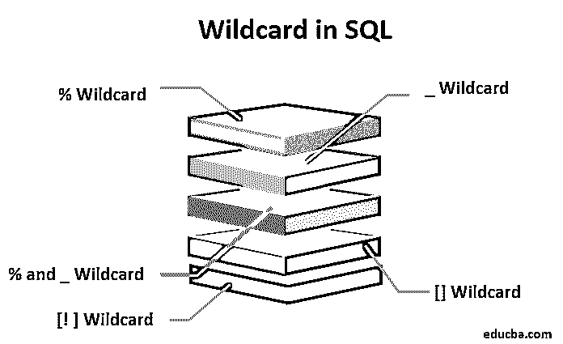

# SQL 中的通配符

> 原文：<https://www.educba.com/wildcard-in-sql/>

## SQL 中的通配符概述

SQL 中的通配符在字符串中替换零到任意数量的字符。通常，这些通配符可以在 SQL 操作符中找到，比如。这是一个通常在 SQL 的 [WHERE 子句中使用的操作符，用于搜索特定的字符排列。](https://www.educba.com/sql-where-clause/)

通配符的目标与正则表达式相似。通配符是一种替代字符，用于替换字符串中的其他特定字符。当我们想要在数据库中完成快速搜索时，这些通配符非常有用。

<small>Hadoop、数据科学、统计学&其他</small>

SQL 中有两个常见的通配符。百分号表示零个、一个或任意数量的字符。下划线符号表示单个字符，可以是字母或数字。这些标志可以组合成几种排列方式。我们还有[查理斯特]、[^charlist]和[！它可以在 SQL 和 MS Access 中使用。

我们将详细研究这些通配符，以及其他一些有用的通配符。

| **通配符** | **描述** | **例子** |
| 百分号:% | 此通配符匹配零个或多个字符 | 哈%发现哈，帽子，快乐，和发生 |
| 下划线:_ | 此通配符仅匹配特定的单个字符 | p_t 找锅，坑，放 |
| 方括号:[] | 此通配符匹配括号内指定的单字符 | 找不到锅和坑，却放不下 |
| 插入:^ | 此通配符匹配不在此符号后的括号中的字符 | p[^oi]t 找到了 put，但没有 pot 和 pit |

我们注意到，MS Access 使用星号(*)字符代替百分号(%)通配符来匹配零个或多个字符，并使用问号(？)作为通配符，代替下划线通配符来表示单个字符。

**SQL 通配符的语法**

让我们看看通配符“%”和“_”的几种写法:

`SELECT FROM table_name
WHERE column LIKE 'AAAA%'`

或者

`SELECT FROM table_name
WHERE column LIKE '%AAAA%'`

或者

`SELECT FROM table_name
WHERE column LIKE ‘_AAAA'`

或者

`SELECT FROM table_name
WHERE column LIKE 'AAAA_’`

或者

`SELECT FROM table_name
WHERE column LIKE '_ AAAA _'`

AAAA%帮助我们寻找任何以 AAAA 开头，以另一个或多个字符结尾的字符串。

%AAAA%帮助我们查找以任意数量的字符开头，但中间包含字符串 AAAA，并以从 0 到无穷大的任意数量的字符结尾的任何字符串。

_AAAA 帮助我们查找以单个独特字符开头并以字符串 AAAA 结尾的任何字符串。

AAAA_ 帮助我们寻找任何以 AAAA 模式开始，以一个独特的字符结束的字符串。

_AAAA_ 帮助我们查找以独特字符开头、中间包含 AAAA 模式并以单一独特字符结尾的任何字符串。

### SQL 中每个通配符的示例

下面是一些通配符的例子

#### 1)使用%通配符

在本例中，我们可以选择以“the”开头的城市的所有雇员:

`SELECT * FROM Employees
WHERE City LIKE 'the%';`

#### 2)使用 _ 通配符

在这个例子中，我们可以选择一个城市的所有雇员，以一个独特的字符开头，但以“elhi”结尾:

`SELECT * FROM Employees
WHERE City LIKE '_elhi';`

让我们看另一个例子，我们可以选择城市中的雇员，他们的名字以“B”开头，后面是一个单独的字符，再后面是“r”，再后面是一个单独的字符，再后面是“in”:

`SELECT * FROM Employees
WHERE City LIKE 'B_r_in';`

#### 3)组合%和 _ 通配符

我们可以结合使用这两个通配符来优化我们的搜索过程。

在这个例子中，我们可以找到第二个位置有“a”的任何字符串。

`WHERE StringName LIKE '_a%'`

在这个例子中，我们可以找到任何以“x”开头且长度至少为三个字符的字符串。

`WHERE StringName LIKE 'x_%_%'`

在这个例子中，我们可以找到任何以“x”开头，以“y”结尾，中间至少有一个字符的字符串。

`WHERE StringName LIKE 'x%_y'`

#### 4)使用[]通配符

在这个例子中，我们可以选择名称以“a”、“b”或“c”开头的城市的所有雇员。

`SELECT * FROM Employees
WHERE City LIKE '[abc]%';`

我们可以用另一种方式写这个例子，使用连字符(-)。该语句还将选择名称以“a”、“b”或“c”开头的城市的所有雇员。可以这样写:

`>SELECT * FROM Employees
WHERE City LIKE '[a-c]%';`

#### 5)与[！]通配符

在这个例子中，我们可以选择一个城市中名字不以“a”、“b”或“c”开头的所有雇员。

`SELECT * FROM Employees
WHERE City LIKE '[!abc]%';`

该语句也可以写成如下形式:

`SELECT * FROM Employees
WHERE City NOT LIKE '[abc]%';`

### 结论

在这篇 SQL 通配符文章中，我们研究了 SQL 中的所有通配符。此外，我们还查看了各种 SQL 通配符的示例，以便更好地理解和理解。

总之，通配符的作用与正则表达式相似。我们可以将多个通配符组合在一个单独的字符串中，以获得更好的搜索结果。像 MS Access 这样的一些数据库可以为类似的功能使用单独的 SQL 通配符。

### 推荐文章

这是一个关于 SQL 中通配符的指南。这里我们讨论 SQL 通配符的语法，并给出每个通配符的例子。您也可以阅读以下文章，了解更多信息——

1.  [SQL 视图](https://www.educba.com/sql-views/)
2.  [SQL 管理工具](https://www.educba.com/sql-management-tools/)
3.  [什么是 MySQL？](https://www.educba.com/what-is-mysql/)
4.  [MySQL 简介](https://www.educba.com/introduction-to-mysql/)

