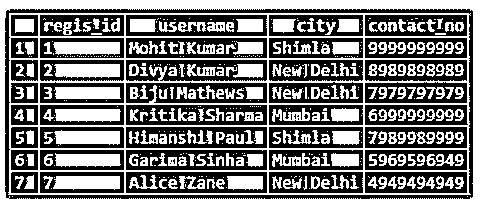
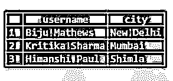
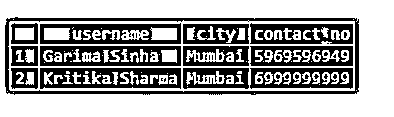

# SQL 获取下一个

> 原文：<https://www.educba.com/sql-fetch-next/>

## SQL FETCH 简介接下来

FETCH 是标准查询语言(SQL)中的一个命令，用于根据光标位置从选择查询中检索行。当我们将 NEXT 作为方向与 FETCH 结合使用时，我们得到 FETCH NEXT 来检索下一行。如果没有这样的行，则该命令返回一个空结果。我们可以使用其他方向，如优先、第一、最后、相对、绝对以及 FETCH 命令。它们都在指定的方向上检索一行。但是，如果我们没有用 FETCH 命令指定任何内容，默认情况下，它将作为 FETCH NEXT 运行，并将获取下一行。

**语法和参数:**

<small>Hadoop、数据科学、统计学&其他</small>

在选择查询中使用 FETCH NEXT 命令的基本语法如下:

`SELECT column_name1, column_name2, ...
FROM table_name
ORDER BY sort_expression
OFFSET n ROWS
FETCH NEXT m ROWS ONLY;`

上述语法中使用的参数如下:

*   **column_name1，column_name2，…:** 必须从表中提取的列或字段。
*   **table_name:** 必须从中提取所述列的数据库表。
*   sort _ expression:sort _ expression 是完全可选的，但经常与 FETCH 命令一起使用。如果必须使用它，请指定排列结果集所依据的顺序和表达式。
*   **偏移 n 行:**偏移用于排除前 n 条记录。它与 FETCH NEXT 一起使用，以获得所需的行窗口。假设如果我们想要排除前 10 行并从第 11 行开始获取，那么我们必须将偏移字段设置为 10。
*   **接下来的 m 行:**接下来的 m 是将要取出的 m 行的方向。

这里我们已经看到了 FETCH NEXT 命令使用的基本语法。你可以使用 WHERE，GROUP BY 等。根据你的要求。

### SQL FETCH NEXT 示例

为了讨论 FETCH NEXT 命令的几个例子，我们需要一个虚拟表。因此，让我们创建一个名为“注册”的数据库表。该表包含 regis_id、用户名、城市等。对应于每个用户。下面是相同的 create table 语句。

**代码:**

`CREATE TABLE registrations
(
regis_id SERIAL primary key,
username character varying(255),
city character varying(255),
contact_no character varying(50)
);`

该表已成功创建。我们的下一个任务是在其中插入一些记录。我们可以使用下面的 INSERT 语句。

**代码:**

`INSERT INTO registrations(
username, city, contact_no)
VALUES ('Mohit Kumar','Shimla','9999999999'),
('Divya Kumar','New Delhi','8989898989'),
('Biju Mathews','New Delhi','7979797979'),
('Kritika Sharma','Mumbai','6999999999'),
('Himanshi Paul','Shimla','7989989999'),
('Garima Sinha','Mumbai','5969596949'),
('Alice Zane','New Delhi','4949494949');`

注册表中的数据如下所示:

**代码:**

`select * from registrations;`

**输出:**

现在，我们准备在这张表格的帮助下尝试几个例子。

#### 示例#1

基本提取下一个命令

形容词（adjective 的缩写）在注册表的第一行中找到用户详细信息。

**代码:**

`SELECT *
FROM registrations
FETCH NEXT ROWS ONLY;`

**输出:**

b.找到用户名和城市对应表中的前两行。

**代码:**

`SELECT username,city
FROM registrations
FETCH NEXT 2 ROWS ONLY;`

**输出:**

#### 实施例 2

用偏移量提取下一个

从注册表的第三行开始，查找与前三条记录相对应的用户名和城市。

**代码:**

`SELECT username,city
FROM registrations
OFFSET 2 ROWS
FETCH NEXT 3 ROWS ONLY;`

**输出:**

#### 实施例 3

使用 ORDER BY 子句提取下一个

从升序注册表的第六行开始，查找对应于下两条记录的用户名、城市和联系人编号(按用户名)。

**代码:**

`SELECT username, city, contact_no
FROM registrations
ORDER BY username
OFFSET 5 ROWS
FETCH NEXT 2 ROWS ONLY;`

**输出:**

#### 实施例 4

用 WHERE 子句提取下一个

找到对应于前两条记录的用户名、城市和联系人编号，这样用户就属于孟买。

**代码:**

`SELECT username, city, contact_no
FROM registrations
WHERE city = 'Mumbai'
ORDER BY username
OFFSET 0 ROWS
FETCH NEXT 2 ROWS ONLY;`

**输出:**

#### 实施例 5

使用 GROUP BY 子句提取下一个

查找总注册数最高的城市。

**代码:**

`SELECT city, count(regis_id)
FROM registrations
GROUP BY city
ORDER BY count(regis_id) DESC
FETCH NEXT 1 ROW ONLY;`

**输出:**

#### 实施例 6

提取下一个和光标

创建一个游标，用于按 regis_id 的降序搜索注册表。

**代码:**

`DECLARE search_cursor cursor WITH HOLD FOR
SELECT username, city, contact_no
FROM registrations
ORDER BY regis_id DESC;`

在本例中，我们在注册表上创建了一个名为“search_cursor”的游标。

### 结论

在本文中，我们看到了 SQL 中的 FETCH NEXT 命令，该命令用于从 SELECT 语句的结果集中检索下一个指定数量的行。

### 推荐文章

这是 SQL FETCH NEXT 的指南。下面我们将分别讨论 SQL FETCH 的介绍和例子。您也可以看看以下文章，了解更多信息–

1.  [SQL DATEPART()](https://www.educba.com/sql-datepart/)
2.  [SQL 用户](https://www.educba.com/sql-users/)
3.  [SQL SELECT DISTINCT](https://www.educba.com/sql-select-distinct/)
4.  SQL 中的[列](https://www.educba.com/column-in-sql/)

