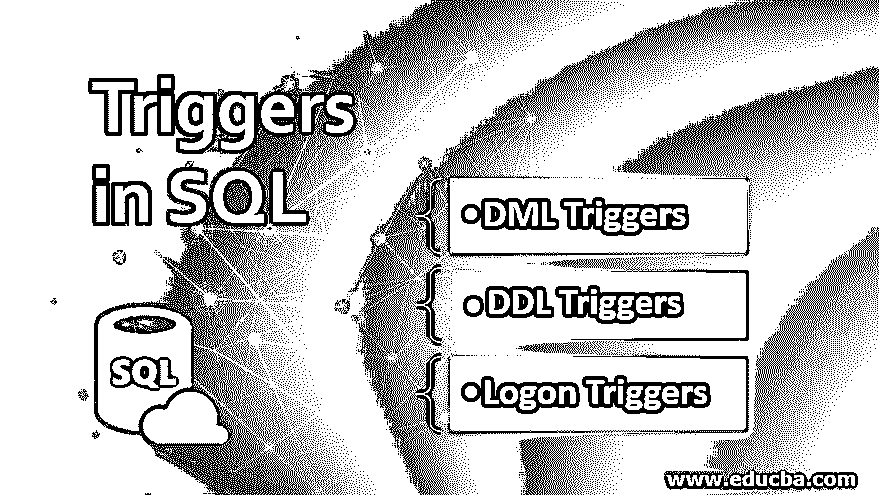
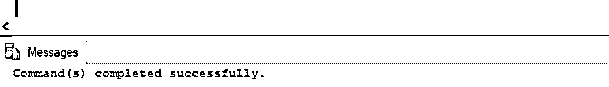
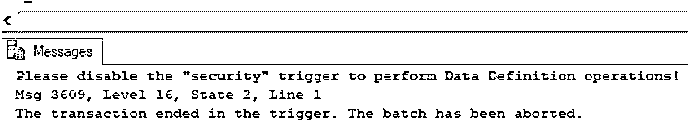
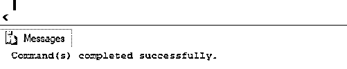

# SQL 中的触发器

> 原文：<https://www.educba.com/triggers-in-sql/>

## SQL 中的触发器概述

SQL 触发器是数据库中一种特殊类型的存储过程，每当数据库中发生特殊事件(如任何数据操作(插入、更新或删除)、定义(创建、更改和删除)或登录事件)时，就会自动执行该存储过程，通常是为了保护数据库的完整性或满足某些业务需求，更像是编程的 SQL 约束。

### SQL 中触发器的类型

使用关系数据库时，您会遇到以下类型的触发器:

<small>Hadoop、数据科学、统计学&其他</small>

| **SQL 触发器** | **功能** |
| **DML 触发器** | DML trigger 是 SQL 中的存储过程，每当发生数据操作语言事件时都会自动执行。 |
| **DDL 触发器** | DDL trigger 是 SQL 中的存储过程，每当发生数据定义语言事件时都会自动执行。 |
| **登录触发器** | Logon trigger 是 SQL 中的一个存储过程，每当发生登录事件但在用户会话开始之前，都会自动执行该过程。 |

接下来，我们将详细讨论上述触发因素。

#### 1.DML 触发器

DML trigger 是 SQL 中的存储过程，每当发生数据操作语言事件时都会自动执行。数据操作(DML)事件可以是插入、更新或删除查询。

当对数据库执行不正确的 DML 语句时，DML 触发器有助于防止恶意攻击，并保护数据库的完整性和安全性。它们还可以用来执行一些复杂的 SQL 查询。它们或多或少类似于约束，但更复杂。

有两种类型的 DML 触发器:

**1。AFTER 触发器:**在执行了插入、删除或更新查询之后，执行 AFTER 触发器。因此，它们的主要目的不是检查违反约束的情况。

**2。INSTEAD OF 触发器:** INSTEAD OF 触发器在执行插入、删除或更新查询之前执行。因此，它们可用于约束处理。

编写 DML 触发器的基本语法如下:

`CREATE [ OR ALTER ] TRIGGER trigger_name
ON table_name
[BEFORE | AFTER] {INSERT , UPDATE, DELETE}
AS
Trigger_body`

上述语法中使用的参数是:

*   **CREATE[OR ALTER]TRIGGER TRIGGER _ name:**该语句使用所提供的名称创建一个触发器，或者更改所提到的触发器。
*   **ON table_name:** 指定要在其上创建触发器的表的名称。
*   **[BEFORE | AFTER]:** 指定要创建的触发器种类:在执行语句之前或执行之后。
*   **{插入、更新、删除}:** 指定 DML 事件，在该事件之后触发器将被自动触发。你可以选择其中任何一个或全部。
*   **AS Trigger_body:** 指定本节的触发操作。

理论上的解释有时会令人难以置信。让我们借助几个例子来更好地理解 DML 触发器。

**示例:说明 DML 触发器的 SQL 语句。**

在本例中，我们试图为数据输入专家创建一个提醒，让他在每次输入数据时输入一个唯一的 customer_id。

**代码:**

`CREATE TRIGGER reminder1
ON dbo.customers_dec
AFTER INSERT
AS
RAISERROR ('Please do not forget to mention a unique customer_id !!', 16,10);`

**输出:**

现在让我们通过在 customers_dec 表上尝试一个 insert 查询来检查是否已经创建了触发器。

尝试以下查询来检查:

`INSERT INTO customers_dec([customer_id],[name],[city])
VALUES(1,'Mike Cole', 'Alberta');`

**输出:**

正如您在上面看到的，DML 触发器已经成功创建。

#### 2.DDL 触发器

DDL trigger 是 SQL 中的存储过程，每当发生数据定义语言事件时都会自动执行。更常用的数据定义语言(DDL)事件是 CREATE、ALTER、GRANT 和 DROP。

DDL 触发器主要用于记录对数据库执行的 DDL 事件列表，以确保其完整性或防止数据库发生变化。

编写 DDL 触发器的简化语法如下:

`CREATE [ OR ALTER ] TRIGGER trigger_name
ON database_name
FOR {CREATE_TABLE,DROP_TABLE, ALTER_TABLE, ...}
AS
Trigger_body`

上述语法中使用的参数是:

*   **CREATE[OR ALTER]TRIGGER TRIGGER _ name:**该语句使用所提供的名称创建一个触发器，或者更改所提到的触发器。
*   **ON database_name:** 指定要在其上创建触发器的数据库的名称。
*   **FOR:** FOR 用于指定要应用触发器的 DDL 语句。
*   **{CREATE_TABLE，DROP_TABLE，ALTER_TABLE，…}:** 指定自动触发前的 DDL 语句。你可以选择其中任何一个或全部。
*   **AS Trigger_body:** 指定本节的触发操作。

现在让我们借助一个例子来更好地理解 DDL 触发器。

**示例:说明 DDL 触发器的 SQL 语句。**

在这个例子中，我们试图创建一个 DDL 触发器，每当我们在“practice_art”(这是一个虚拟数据库)中执行一个创建、删除或更改事件时，它就会自动触发。

**代码:**

`CREATE TRIGGER security
ON DATABASE
FOR CREATE_TABLE,ALTER_TABLE,DROP_TABLE
AS
PRINT 'Please disable the "security" trigger to perform Data Definition operations!'
ROLLBACK;`

**输出:**

现在让我们通过在 practice_art 数据库中创建一个表来检查触发器是否已经创建。

尝试以下查询来检查:

`CREATE TABLE new_table(
Column_1 int,
Column_2 varchar(255)
);`

**输出:**

正如您在上面看到的，DDL 触发器已经成功创建。

#### 3.登录触发器

Logon trigger 是 SQL 中的一个存储过程，每当发生登录事件但在用户会话开始之前，都会自动执行该过程。

创建这些触发器是为了防止对数据库的未授权访问，从而增强其安全性。

编写登录触发器的简化语法如下:

`CREATE [ OR ALTER ] TRIGGER trigger_name
ON ALL SERVER
WITH logon_trigger_options
{FOR | AFTER} LOGON
AS
Trigger_body`

上述语法中使用的参数是:

*   **CREATE[OR ALTER]TRIGGER TRIGGER _ name:**该语句使用所提供的名称创建一个触发器，或者更改所提到的触发器。
*   **在所有服务器上:**默认情况下，登录触发器应用于所有当前支持的 SQL 服务器(例如 MS SQL server 中的 SQL Server 2008 及更高版本)。
*   **WITH logon _ trigger _ options:**指定所需的触发器类型，例如，是否必须加密。这是一个可选语句。
*   **{ FOR |AFTER }登录:**针对登录事件指定触发器的执行顺序。
*   **AS Trigger_body:** 指定本节的触发操作。

现在让我们借助一个例子来更好地理解登录触发器。

**示例:说明登录触发器的 SQL 语句。**

**代码:**

`CREATE TRIGGER logon_message
ON ALL SERVER
AFTER LOGON
AS
PRINT ‘You have successfully logged in!’
ROLLBACK;`

**输出:**

在上面的例子中，我们在登录后简单地打印了一条消息。但是我们可以使用登录触发器来执行更复杂的操作，例如可以使用它来限制用户可以执行的登录事件的数量，记录每天的登录次数，等等。

### 结论

SQL 触发器是在特定事件发生时触发或执行的预定过程。它们主要用于增强数据库的安全性和完整性。

### 推荐文章

这是 SQL 中触发器的指南。在这里，我们讨论了简介、SQL 中的触发器类型、查询、语法、示例以及代码和输出。您也可以浏览我们推荐的其他文章，了解更多信息——

1.  [PostgreSQL 排序依据](https://www.educba.com/postgresql-order-by/)
2.  [SQL 集合运算符](https://www.educba.com/sql-set-operators/)
3.  [SQL 右连接](https://www.educba.com/sql-right-join/)
4.  [MySQL 中的左外连接](https://www.educba.com/left-outer-join-in-mysql/)

