# SQL 更新触发器

> 原文：<https://www.educba.com/sql-update-trigger/>

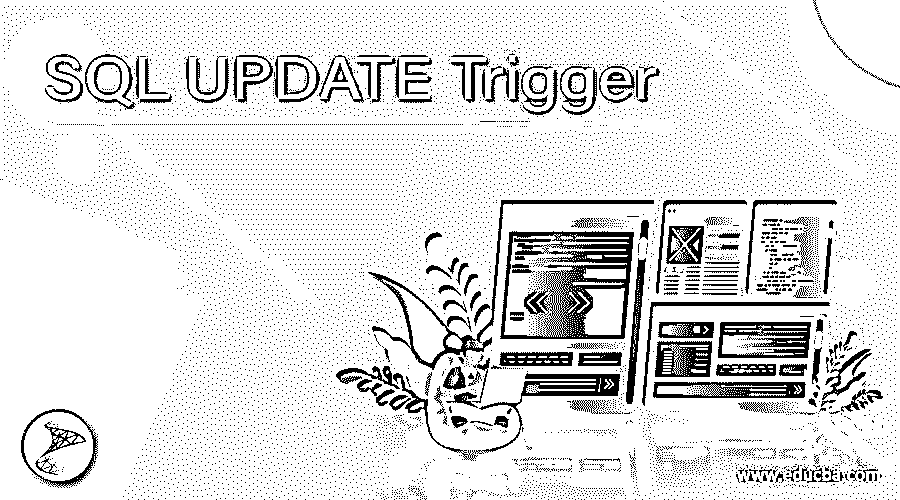

## SQL 更新触发器简介

标准查询语言(SQL)中的 UPDATE Trigger 是数据库对象上的存储过程，在对所述数据库对象成功执行 UPDATE 语句之前或之后自动触发。对于 SQL 新手来说，UPDATE 语句用于修改现有数据表中的数据记录。

更新触发器通常在我们想要跟踪某些数据库值的修改细节的情况下使用。例如，我们想要捕捉用户从网站、餐馆、办公室等登录和注销的时间。在前一种情况下，我们可以为后一种情况使用更新前触发器和更新后触发器..

<small>Hadoop、数据科学、统计学&其他</small>

在本帖中，我们将借助一些例子详细讨论更新触发器。首先，让我们学习一下用于在 SQL 中创建更新触发器的语法和参数。

**语法和参数:**

使用 SQL 编写更新触发器的基本语法如下:

`CREATE TRIGGER [schema_name. ] trigger_name ON table_name
{AFTER| BEFORE | INSTEAD OF } UPDATE
AS
BEGIN
[SET NOCOUNT {ON/OFF}] {SQL statements}
END`

上述语法中使用的参数如下:

*   **schema_name:** 此处的 schema_name 对应于将在其中创建新更新触发器的模式的名称。模式名完全是一个选项，因此可以忽略。当我们不提及 schema_name 时，触发器将在当前或默认模式上创建。
*   **trigger _ name:**trigger _ name 是我们将要创建的新更新触发器的名称。
*   **table_name:** table_name 是所提到的模式中的表的名称，新的更新触发器将在该表中创建。
*   **AFTER | BEFORE | INSTEAD:**此参数用于记录触发器将被调用的时间，如果它将在所述更新语句执行之前或之后被调用。
*   **SQL 语句:** SQL 语句是构成更新触发器主体的一组 SQL 操作。这些语句正好在触发器之前或之后(根据规范)执行。

讨论了用于在 SQL 中创建更新触发器的语法和参数之后，让我们尝试几个例子来更详细地理解它。

### SQL 更新触发器的示例

为了说明 SQL 中更新触发器的工作原理，还有什么比在虚拟表上尝试一些例子更好的呢？因此，让我们创建一个名为“orders”的表，其中包含订购的项目、ordered_at、shipped_at、status 等详细信息。我们可以使用下面的 CREATE 命令来创建所说的表。

**代码:**

`CREATE TABLE orders(
order_id INT NOT NULL IDENTITY PRIMARY KEY,
customer_name VARCHAR(100) NOT NULL,
product_id INT,
amount NUMERIC,
ordered_at DATETIME,
shipped_at DATETIME,
status VARCHAR(100)
);`

创建了上述表之后，让我们使用下面的 insert 语句在其中插入一些记录。

**代码:**

`INSERT INTO [master].[dbo].[orders] ([customer_name] ,[product_id] ,[amount] ,[ordered_at] ,[shipped_at] ,[status])
VALUES
('R K Sharma',11,456,'2020-06-06',NULL,NULL),
('B K Varma',17,600,'2020-06-16',NULL,NULL),
('Kritika Singh',20,5600,'2020-06-18',NULL,NULL),
('R K Sharma',12,1200,'2020-06-16',NULL,NULL)
GO`

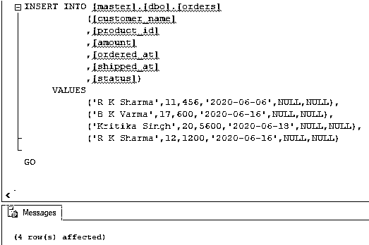

成功插入后，订单表中的数据如下所示:

**代码:**

`SELECT * FROM orders;`

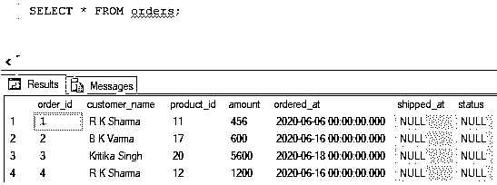

现在我们准备使用这个表来尝试几个关于更新触发器的例子。

#### 示例 1:在 SQL 中创建一个触发器，一旦订单状态更改为 shipped，该触发器就会自动更新发货日期和时间。

**代码:**

`CREATE TRIGGER update_trigger ON orders
AFTER UPDATE
AS
BEGIN
SET NOCOUNT ON;
UPDATE orders set shipped_at = GETDATE()
from orders b
INNER JOIN inserted i on b.order_id=i.order_id
AND i.status = 'Shipped'
END
GO`

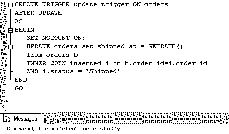

该命令已成功创建了一个更新触发器，该触发器将在成功执行 UPDATE 语句后被调用。可以在对象资源管理器的 orders 表下看到触发器名称。

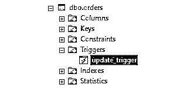

现在让我们在 orders 表上尝试几个更新查询。

**代码:**

`UPDATE orders
SET status= 'Shipped'
WHERE order_id = 1;`

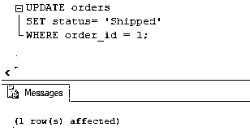

更新查询返回成功。因此，我们的 update_trigger 必须已被调用，shipped_at 日期必须已被填充。我们可以使用 SELECT 查询来检查这一点。

**代码:**

`SELECT * FROM orders;`

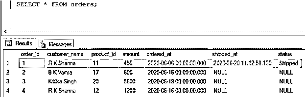

**代码:**

`UPDATE orders
SET status= 'Shipped'
WHERE amount > 5000;`

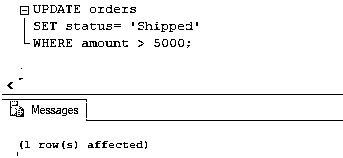

与前面的查询类似，该查询返回成功。因此，我们的 update_trigger 必须已被调用，shipped_at 日期必须已被填充。我们可以使用 SELECT 查询来检查这一点。

**代码:**

`SELECT * FROM orders;`

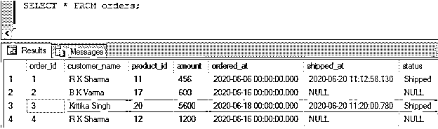

#### 示例 2:在 SQL 中创建一个触发器，当订单值小于 500 时，该触发器会自动被调用并将 shipped_at 时间设置为 NULL，并将状态设置为“不能发货”。

**代码:**

`CREATE TRIGGER update_trigger ON orders
INSTEAD OF UPDATE
AS
BEGIN
SET NOCOUNT ON;
UPDATE orders
set shipped_at = NULL, status = 'Cannot be Shipped'
from orders b
INNER JOIN inserted i on b.order_id=i.order_id
AND i.amount < 500
END
GO`

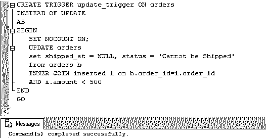

这个更新触发器是前一个触发器的变体。在这种情况下，触发器在执行更新查询之前被触发。

让我们尝试一个更新查询来进一步说明它。

**代码:**

`UPDATE orders
SET status = 'Shipped'
WHERE amount < 500;`

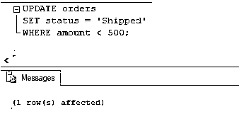

可以使用 SELECT 语句检查更新查询的结果。

**代码:**

`SELECT * FROM orders;`

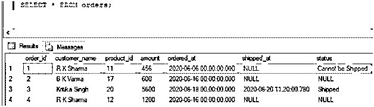

最后，可以使用 DROP TRIGGER 命令删除或丢弃更新触发器。

**代码:**

`DROP TRIGGER update_trigger;`

### 结论

SQL 中的 update 触发器在对所述数据库对象执行 UPDATE 语句之前或之后被调用。它最常用于跟踪和记录数据库中的修改时间。

### 推荐文章

这是一个 SQL 更新触发器指南。这里我们分别讨论介绍，语法，参数，代码实现的例子。您也可以看看以下文章，了解更多信息–

1.  [SQL 删除行](https://www.educba.com/sql-delete-row/)
2.  [SQL 克隆表](https://www.educba.com/sql-clone-table/)
3.  [SQL ORDER BY CASE](https://www.educba.com/sql-order-by-case/)
4.  [SQL 按字母顺序排序](https://www.educba.com/sql-order-by-alphabetical/)

