# 更新触发器后的 SQL

> 原文：<https://www.educba.com/sql-after-update-trigger/>

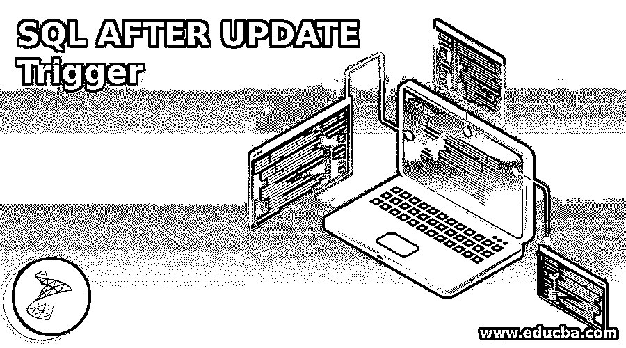

## 更新触发器后的 SQL 简介

SQL 中的 AFTER UPDATE Trigger 是数据库表上的存储过程，在指定表上成功执行更新操作后，将自动调用或触发该存储过程。对于初学者，UPDATE 语句用于修改数据表现有行中的数据。在我们希望记录状态更改的时间或根据其他字段值的修改记录评级字段中的更改等情况下，AFTER UPDATE 触发器非常有用。它基本上帮助我们记录、审计和跟踪变更。

### 句法

在 SQL 中更新触发器后编写 SQL 的基本语法如下:

<small>Hadoop、数据科学、统计学&其他</small>

`CREATE TRIGGER [schema_name. ] trigger_name ON table_name
AFTER UPDATE
AS
BEGIN
[SET NOCOUNT {ON/OFF}] {SQL statements}
END`

#### 因素

上述语法中使用的参数如下:

**schema_name:** 这是我们将在其中创建新触发器的模式的名称。您可以忽略它，因为模式名称是可选的。默认情况下，将在您当前使用的模式中创建触发器。

**触发器名称:**这是您要创建的触发器的名称。

**table_name:** 这是将应用触发器的表的名称。

**SQL 语句:** SQL 语句构成了触发器的主体。这些是调用 AFTER UPDATE 触发器后将执行的一组 SQL 操作。

### 更新触发器后实现 SQL 的示例

让我们试着举几个例子来详细理解它:

为了说明 AFTER UPDATE 触发器的功能，让我们创建一个名为“books_audit_table”的虚拟表。这个表格包含了图书馆里所有书籍的详细情况。我们可以使用下面的代码片段来创建上述表格。

**代码:**

`CREATE TABLE books_audit_table (
book_id INT NOT NULL IDENTITY PRIMARY KEY,
title VARCHAR(100)  NOT NULL,
author_name  VARCHAR(100),
genre VARCHAR(100),
updated_at DATETIME,
status VARCHAR(100)
);`

**输出:**

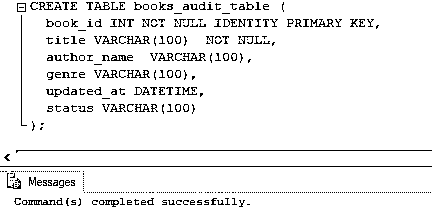

查询成功返回。接下来，使用下面的 INSERT 查询在表中插入一些要处理的记录。

**代码:**

`INSERT INTO [practice_db].[dbo].[books_audit_table] ([title] ,[author_name] ,[genre] ,[updated_at] ,[status])
VALUES
('The Choice','Edith Eva Eger','Memoir',NULL, NULL),
('Deep Work','Carl Newport','Self Help',NULL, NULL),
('A Man Called Ove','Fredrik Backman','Fiction',NULL, NULL),
('When Breath Becomes Air','Paul Kalanithi','Memoir',NULL, NULL),
('Man Search for Meaning','Viktor Frankl','Memoir',NULL, NULL),
('The Third Pillar','Raghuram Rajan','Economics',NULL, NULL)
GO`

**输出:**

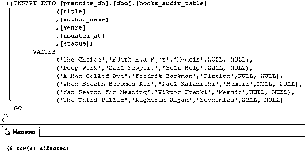

我们已经成功创建了“books_audit_table”。现在，我们已经准备好尝试几个基于 AFTER UPDATE 触发器的例子。

#### 示例#1

**第一步:**在 SQL 中创建一个触发器，它自动更新从集合中借书的日期和时间。

**代码:**

`CREATE TRIGGER update_trigger ON books_audit_table
AFTER UPDATE
AS
BEGIN
SET NOCOUNT ON;
UPDATE books_audit_table set updated_at = GETDATE()
from books_audit_table b
INNER JOIN inserted i on b.book_id=i.book_id
AND i.status = 'Borrowed'
END
GO`

**输出:**

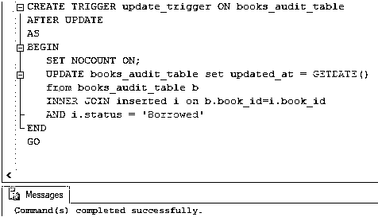

**步骤 2:** 查询已经成功创建了 update_trigger。我们可以在对象资源管理器中检查新创建的触发器。

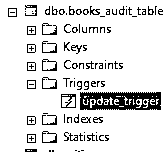

**步骤 3:** 现在，让我们使用下面的语句将第一本书的状态更新为“借阅”。

**代码:**

`UPDATE books_audit_table
SET Status='Borrowed'
WHERE book_id = 1;`

**输出:**

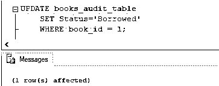

**步骤 4:** 由于更新查询成功，update_trigger 必须被自动调用，updated_at 列必须被自动填充当前时间戳。下面的 select 查询可用于检查相同的内容。

**代码:**

`SELECT * FROM books_audit_table;`

**输出:**

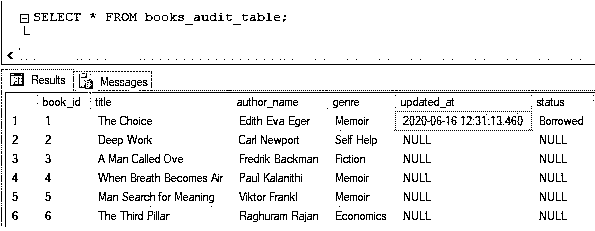

**步骤 5:** 我们可以在图像中观察到，对于 book_id = 1，updated_at 列已经被填充。让我们根据同样的概念再举一个例子。这一次让我们为 book_id = 5 这样做。

**代码:**

`UPDATE books_audit_table
SET Status='Borrowed'
WHERE book_id = 5;`

**输出:**

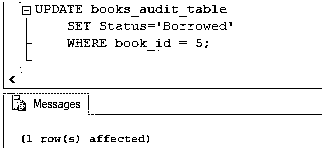

**第六步:**

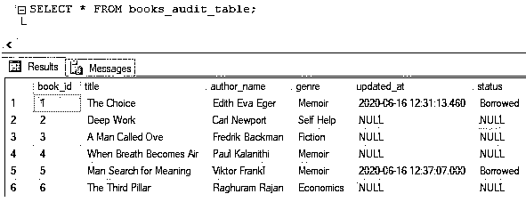

**解释:**这里，update_trigger 也被自动调用，updated_at 列被更新为当前时间戳。

#### 实施例 2

假设 books_audit_table 中添加了两个新列，比如 borrowed_at 和 returned_at。当图书的状态变为“借阅”或“归还”时，这些列必须填充时间戳。

**步骤 1:** 您可以使用下面的 ALTER 语句来修改表。

**代码:**

`ALTER TABLE books_audit_table
DROP COLUMN updated_at;
ALTER TABLE books_audit_table
ADD borrowed_at DATETIME;
ALTER TABLE books_audit_table
ADD returned_at DATETIME;`

**输出:**

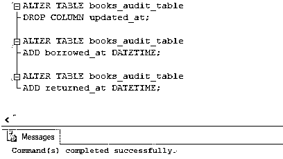

**步骤 2:** 修改后的表格如下所示:

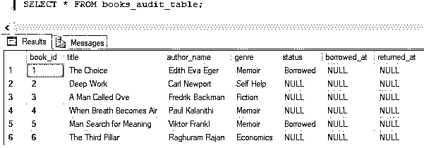

**步骤 3:** 接下来，让我们使用下面的查询创建一个名为“update_trigger_new”的更新后触发器。

**代码:**

`CREATE TRIGGER update_trigger_new ON books_audit_table
AFTER UPDATE
AS
BEGIN
SET NOCOUNT ON;
UPDATE books_audit_table set borrowed_at = GETDATE()
FROM books_audit_table b
INNER JOIN inserted i on b.book_id=i.book_id
AND i.status = 'Borrowed'
UPDATE books_audit_table set returned_at = GETDATE()
FROM books_audit_table b
INNER JOIN inserted i on b.book_id=i.book_id
AND i.status = 'Returned'
END
GO`

**输出:**

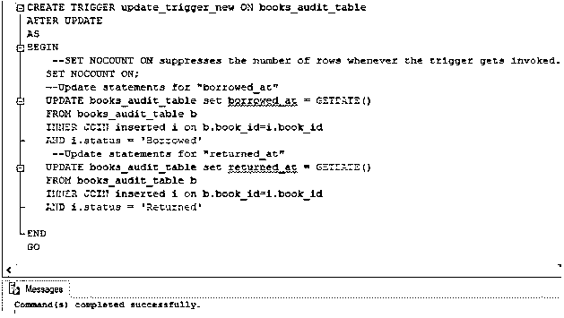

触发器已成功创建。可以在对象资源管理器中看到它。

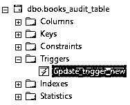

**第四步:**接下来，让我们将 book_id 3 的状态更新为“已归还”。

**代码:**

`UPDATE books_audit_table
SET Status='Returned'
WHERE book_id = 3;`

**输出:**

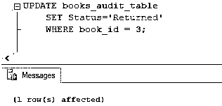

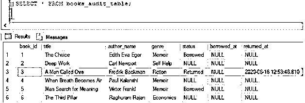

**步骤 5:** 突出显示的行显示了更新查询和触发器所做的更改。很有趣对吧。让我们尝试下面的更新查询。

**代码:**

`UPDATE books_audit_table
SET status = 'Returned'
WHERE book_id = 1;`

**输出:**

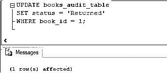

**解释:**哇，触发器已经做了所有必要的更改。

### 结论

AFTER UPDATE Trigger 是 SQL 中的一种触发器，一旦执行了指定的 UPDATE 语句，就会自动触发该触发器。它可以用于创建审计和日志文件，这些文件保存了特定表上最后一次更新操作的详细信息。

### 推荐文章

这是一个更新触发器后的 SQL 指南。这里我们讨论一个介绍 SQL AFTER UPDATE Trigger 的例子，以便更好地理解。您也可以浏览我们的其他相关文章，了解更多信息——

1.  [PostgreSQL 授权](https://www.educba.com/postgresql-grant/)
2.  [PostgreSQL if else](https://www.educba.com/postgresql-if-else/)
3.  [PostgreSQL 中的游标](https://www.educba.com/cursors-in-postgresql/)
4.  [SQL 中的触发器](https://www.educba.com/triggers-in-sql/)

