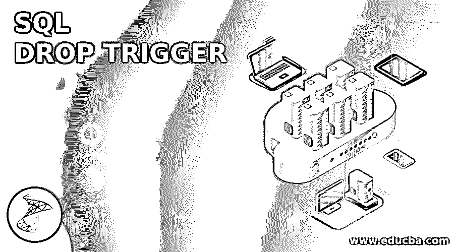
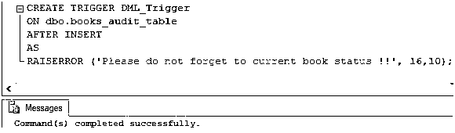
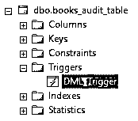
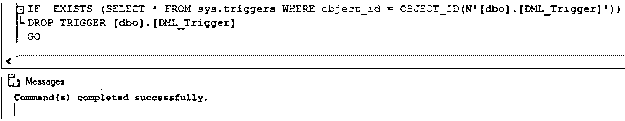
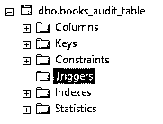
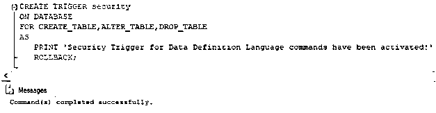
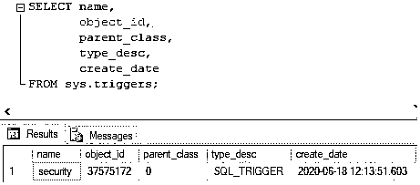
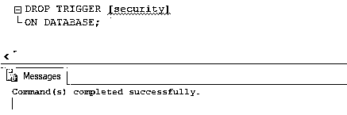
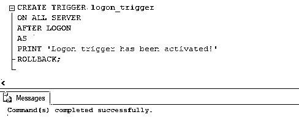
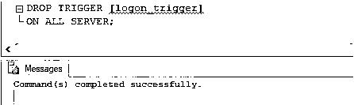

# SQL 删除触发器

> 原文：<https://www.educba.com/sql-drop-trigger/>

## SQL 删除触发器简介

标准查询语言(SQL)中的 DROP TRIGGER 命令用于从当前数据库中删除一个或多个数据操作语言(DML)或数据定义语言(DDL)触发器。对于外行来说，触发器是一组 SQL 语句或命令，当执行更新、创建、删除、登录等操作时，会自动调用这些语句或命令。已成功执行。有两种方法可以删除触发器，第一种是使用 DROP TRIGGER 并删除它。其次，通过在触发器表上使用 DROP TABLE。在后一种情况下，删除一个表相当于删除所有关联的触发器。而在前一种情况下，删除触发器会从 sysobjects 和 syscomments 表中删除有关该特定触发器的信息。

在这篇文章中，我们将借助一些例子详细讨论 DROP TRIGGER 命令。让我们从讨论用于编写它的语法和参数开始。

<small>Hadoop、数据科学、统计学&其他</small>

### 句法

编写用于在 SQL 中删除 DML 触发器的 DROP TRIGGER 命令的基本语法如下:

`DROP TRIGGER [ IF EXISTS ] [ schema_name. ] trigger_name;`

编写用于在 SQL 中删除 DDL 触发器的 DROP TRIGGER 命令的基本语法如下:

`DROP TRIGGER [ IF EXISTS ]trigger_name
ON { DATABASE | ALL SERVER };`

使用 SQL 编写用于删除登录触发器的 DROP TRIGGER 命令的基本语法如下:

`DROP TRIGGER [ IF EXISTS ] trigger_name
ON ALL SERVER;`

#### 因素

上述语法中使用的参数如下:

*   **schema_name:** Schema_name 是要从中删除触发器的模式的名称。这是一个可选参数。默认情况下，当前模式将被视为目标模式。
*   **触发器名称:**触发器名称是我们要删除的触发器的名称。
*   **IF EXISTS:** If exists 是一个条件子句，用于确保所述触发器的存在。
*   **数据库:**该关键字表示仅在当前数据库上删除触发器。
*   **ALL SERVER:** ALL SERVER 关键字确保从当前服务器中删除触发器。

### 实现 SQL DROP 触发器的示例

下面是提到的例子:

#### 示例 1:说明删除 DML 触发器的 SQL 命令

**步骤 1:** 为了说明 DML 类型的 DROP Trigger 命令，让我们创建一个名为“DML_trigger”的虚拟触发器。我们可以使用下面的 CREATE TRIGGER 语句来创建上述触发器。

**代码:**

`CREATE TRIGGER DML_Trigger
ON dbo.books_audit_table
AFTER INSERT
AS
RAISERROR ('Please do not forget to current book status !!', 16,10);`

**输出:**

**步骤 2:** 我们可以从 sys.triggers 表中获得在数据库对象上创建的触发器列表，或者我们可以在对象资源管理器窗口中的所述数据库对象下直接看到它。这里，我们可以在 books_audit_table 的 Triggers 部分清楚地看到，已经创建了一个名为“DML_Trigger”的新触发器。

**第三步:**在 SQL Server 中，我们要按照下面的方式编写 IF EXISTS 条件。虽然，在 MYSQL 等其他数据库服务器中，我们可以如语法所示直接提及。下面是删除 DML 触发器的完整 DROP TRIGGER 命令。

**代码:**

`IF  EXISTS (SELECT * FROM sys.triggers WHERE object_id = OBJECT_ID(N'[dbo].[DML_Trigger]'))
DROP TRIGGER [dbo].[DML_Trigger] GO`

**输出:**

查询成功返回。我们可以在对象资源管理器中看到，DML_Trigger 不再是 books_audit_table 的一部分。

#### 示例 2:说明删除 DDL 触发器的 SQL 命令

**步骤 1:** 为了说明 DDL 类型的 DROP Trigger 命令，让我们创建一个名为“security”的虚拟触发器。我们可以使用下面的 CREATE TRIGGER 语句来创建上述触发器。

**代码:**

`CREATE TRIGGER security
ON DATABASE
FOR CREATE_TABLE,ALTER_TABLE,DROP_TABLE
AS
PRINT 'Security Trigger for Data Definition Language commands has been activated!'
ROLLBACK;`

**输出:**

**步骤 2:** 正如前面所承诺的，这一次我们将使用 sys.triggers 表来查看“security”DDL 触发器是否已经创建。下面的 SELECT 语句可以帮助我们做到这一点。

**步骤 3:** 该查询显示安全触发器已经成功创建。接下来，使用一个基本的 DROP TRIGGER 命令，让我们删除“安全”触发器。

**代码:**

`DROP TRIGGER [security] ON DATABASE;`

**输出:**

这里我们没有使用 IF EXISTS 条件，而是直接删除了它。

**说明:**上述 DROP TRIGGER 命令成功完成。因此，我们在 sys.triggers 表中不再有“安全”触发器。

#### 示例 3:说明删除登录触发器的 SQL 命令。

**步骤 1:** 为了说明 logon 类型的 DROP Trigger 命令，让我们创建一个名为“logon_trigger”的虚拟触发器。我们可以使用下面的 CREATE TRIGGER 语句来创建上述触发器。

**代码:**

`CREATE TRIGGER logon_trigger
ON ALL SERVER
AFTER LOGON
AS
PRINT 'Logon trigger has been activated!'
ROLLBACK;`

**输出:**

**说明:**logon _ trigger 创建成功。请注意，在创建登录触发器时，请确保您已将其添加到安全列表中。否则，您可能根本无法访问 SQL server。

**第二步:**这里是一个 DROP TRIGGER 命令，用于 drop logon_trigger。

**代码:**

`DROP TRIGGER [logon_trigger] ON ALL SERVER;`

**输出:**

**说明:**命令已成功完成，logon_trigger 已删除。我们可以从 sys.triggers 表中检查它。

### 结论

SQL 中的 DROP TRIGGER 命令用于删除数据库对象和服务器上不同类型的 DML、DDL 和登录触发器。

### 推荐文章

这是一个 SQL 删除触发器指南。这里我们讨论 SQL DROP TRIGGER 的介绍，包括适当的语法、参数和相应的查询示例。您也可以浏览我们的其他相关文章，了解更多信息——

1.  [PostgreSQL 变量](https://www.educba.com/postgresql-variables/)
2.  [MySQL 触发器](https://www.educba.com/mysql-trigger/)
3.  [SQL 的使用](https://www.educba.com/uses-of-sql/)
4.  [用 SQL 解释](https://www.educba.com/explain-in-sql/)

