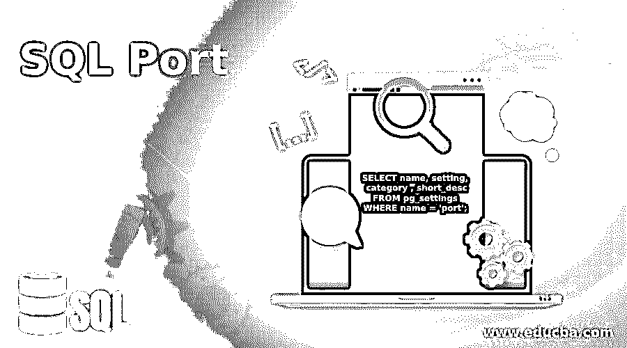
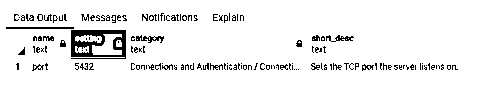
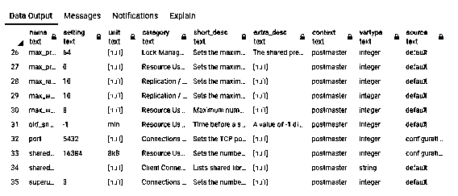
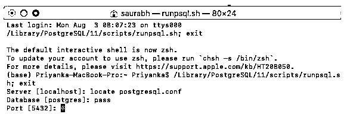
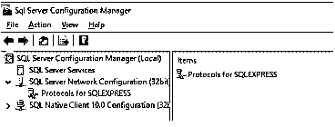
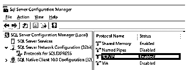
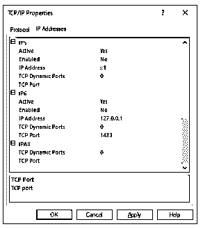
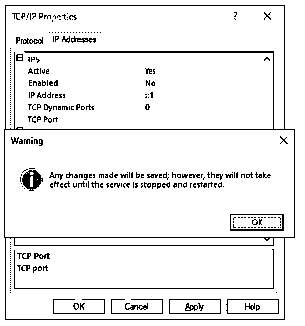

# SQL 端口

> 原文：<https://www.educba.com/sql-port/>

## SQL 端口介绍

在网络中，端口是一个停靠端点，通过它在服务器和客户端之间建立通信，信息从用户计算机中的程序流向 internet 上的服务器。同样在 SQL 中，我们有多种类型的数据库引擎，如 SQL SERVER、POSTGRESQL、MYSQL 等。它们通过端口进行通信。当端口号与 IP 地址结合使用时，它决定了信息流动的方向。这些端口是传输层的一部分，通常有两种类型:TCP(传输控制协议)和用户数据报协议(UDP)。SQL 数据库引擎中的每个端口都有独特的服务要执行。例如，TCP 1433 是 SQL Server 中的默认端口号，它用于管理网络上的 SQL 实例。而 PostgreSQL 使用 TCP 5432 来执行相同的任务。

您一定想知道，我知道有指定的通信端口，但是谁来决定哪个服务将获得哪个端口号呢？这些端口号由互联网号码分配机构(IANA)提供给服务。它还负责管理网络世界中这些端口的使用。

<small>Hadoop、数据科学、统计学&其他</small>

在本文中，我们将尝试说明如何检查运行 SQL 数据库引擎的端口号，如何更改端口号，以及其他一些事情。在本文中，我们编写了 PostgreSQL 和 SQL Server 的示例。但是一旦在任何数据库引擎中掌握了窍门，它在其他引擎中就非常直观了。

### SQL 端口的示例

下面是一些例子:

#### 示例#1

如何找到 PostgreSQL 数据库服务器监听的端口号，并将其更改为新的端口号？

我们可以使用 pg_settings 表中的 SELECT 语句找到服务器正在监听的端口号和其他详细信息，如下所示。

`SELECT name, setting, category , short_desc
FROM pg_settings
WHERE name = 'port';`

在本例中，我们刚刚从表中获取了端口号、类别和描述。您可以使用 SELECT *来获取所有的细节。现在，观察端口号‘5432’和与之对应的短 _desc。TCP 端口 5432 是服务器监听的默认端口。出于好奇，您可以从 postmaster 文件中找到有关 SQL 数据库服务器中网络的更多详细信息，或者使用下面给出的查询。

`select *
from pg_settings
where context = 'postmaster';`

您将设置一些输出，如上图所示。

**将端口号更改为不同的端口号。**

**第一步:**打开 SQL shell，在 shell 中编写以下命令。

`locate postgresql.conf`

**第二步:**最后一步给出了当前的端口号。接下来，要更改它，在 shell 中编写以下命令并重启 postgres 服务器。

`port = 5433
listen_addresses='*'`

上面提到的命令会将对应于所有 IP 地址的端口号更改为“5433”。您可以在这里通过提及特定的 IP 地址而不是“*”来获得具体信息。

#### 实施例 2

如何找到 MS SQL server 监听的端口号，如何更改？

在 SQL server 中，我们有 SQL Server 配置管理器，其中保存了所有的配置详细信息。如果您想查看您的数据库服务器正在监听的端口号，请遵循以下步骤。

**第一步:**打开 SQL Server 配置管理器。(如果您无法直接找到它，请在搜索选项卡中查找)

**步骤 2:** 打开 SQL Server 配置管理器后，打开 SQL Server 网络配置，如下图所示。

**第 3 步:**选择 SQL Server 网络配置后，单击 SQLExpress 的协议。将出现如下图所示的菜单。从中选择 TCP/IP。(如果尚未启用，请启用它。)

**步骤 4:** 当您从协议菜单中选择时，将出现如下所示的 TCP/IP 对话框。这里没有提到端口号，因为它运行在动态 TCP 上。TCP 动态端口= '0 '意味着您的服务器正在侦听动态分配的端口号。TCP 端口是为我们提供所需端口号的字段。

**T2】**

 ****步骤 5:** 如果您希望更改 TCP 端口号，请在空白处提供一个与 IP 地址 127.0.0.1 相对应的新端口号，这与您的本地主机相对应。如果您想更改所有地址，可以在 IPALL 中进行更改。

**步骤 6:** 完成所有必要的更改后，点击 Ok。将会出现如下所示的警告弹出窗口。单击“确定”并重新启动 SQL Server。

您已经完成了端口号的更改。

### 结论

在这篇文章中，我们介绍了如何找到 SQL 数据库服务器监听的端口号，并学习了如何将它更改为一个特定的端口号。SQL 端口基本上是一个 TCP 端口，充当本地计算机和网络上的数据库服务器之间的通信端点。

### 推荐文章

这是一个 SQL 端口的指南。这里我们还讨论了 SQL 端口的介绍和解释，以及不同的例子和它的代码实现。您也可以阅读以下文章来了解更多信息—

1.  [SQL DECODE()](https://www.educba.com/sql-decode/)
2.  [MySQL 分组依据](https://www.educba.com/mysql-group-by/)
3.  [SQL 用户](https://www.educba.com/sql-users/)
4.  [MySQL 区间](https://www.educba.com/mysql-interval/)

**