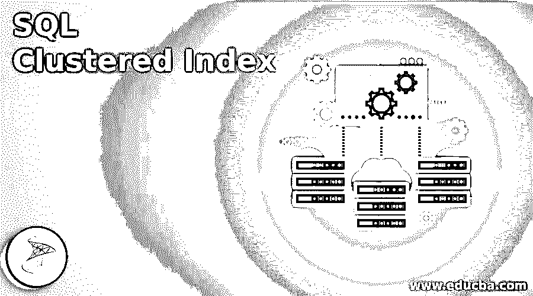
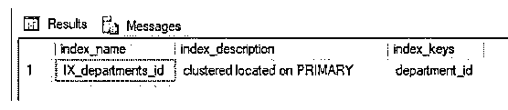
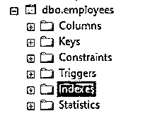
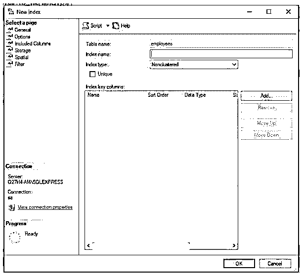
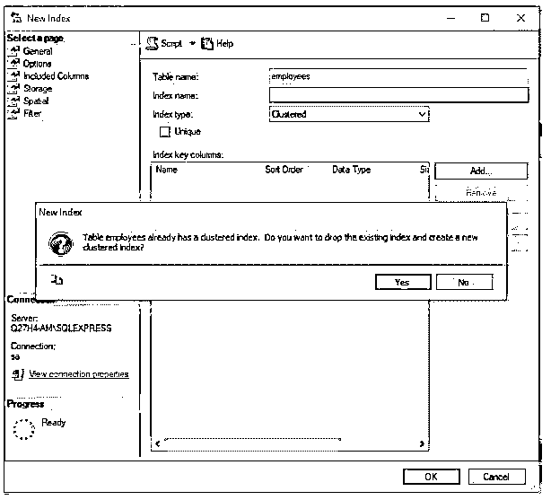
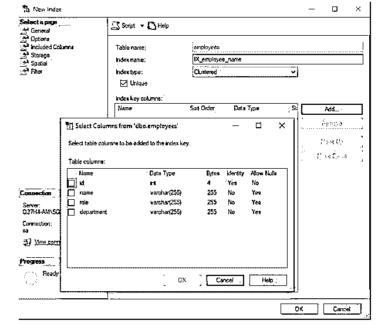
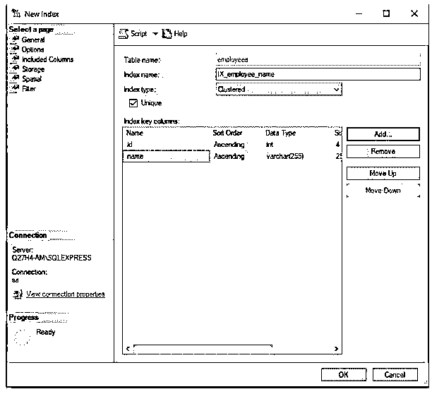
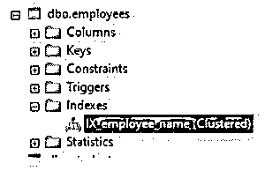

# SQL 聚集索引

> 原文：<https://www.educba.com/sql-clustered-index/>

## SQL 聚集索引简介

以下文章概述了 SQL 聚集索引。聚集索引是一种索引，它根据特定的列值对数据库表中的行进行排序，并定义表中的数据在磁盘上的存储方式。当我们创建带有主键约束的表时，默认情况下会基于该主键自动创建聚集索引。一个表只能有一个聚集索引。为了创建新的聚集索引，我们必须删除以前的聚集索引。对于外行来说，关系数据库中的索引是与表相关联的附加数据结构，有助于更快地从表中检索记录。索引基本上是基于表中的列构建的键，并存储在 B 树中。b 树是一种数据结构，有助于更快的搜索和访问。

**语法和参数:**

<small>Hadoop、数据科学、统计学&其他</small>

用于在 SQL 中创建聚集索引的基本语法如下:

`CREATE CLUSTERED INDEX  index_name
ON schema.table_name(column_name);`

上述语法中使用的参数如下:

*   **索引名称:**索引的名称。当给定索引名为 IX_tablename_columnname 时，会遵循对流。
*   **schema.table_name:** 要创建索引的模式和表名。
*   **column_name:** 将作为索引键的列的名称。这是记录排序和存储所依据的列。

### SQL 聚集索引的示例

下面是一些例子:

#### 示例#1

说明了如何在主键上自动创建聚集索引。

下面的例子说明了当我们在数据库表中创建主键时，聚集索引是自动创建的。为了观察它，让我们创建一个名为“employees”的带有主键的表。

**代码:**

`CREATE TABLE employees (
id integer IDENTITY (1,1) PRIMARY KEY,
name varchar (255),
role varchar (255),
department varchar (255),
);`

**输出:**

该表已成功创建。现在，让我们检查是否已经在这个表上创建了聚集索引。

在 SQL server 中，我们有一个名为“sp_helpindex”的系统存储过程，它获取表中索引的所有信息。它返回索引的名称、简要描述以及在其上创建索引的列。

**代码:**

`EXEC sp_helpindex 'dbo.employees'
GO`

**输出:**

#### 实施例 2

在没有主键的表上创建聚集索引。

说明在没有任何主键的表上创建聚集索引的示例。为了查看示例，让我们创建一个名为“departments”的没有任何主键的新表。下面是相同的 create table 语句。

**代码:**

`CREATE TABLE departments
(department_id int NOT NULL,
department_name nchar(10) NULL,
location nvarchar(50) NULL);`

**输出:**

该表已成功创建。

让我们继续使用下面的代码片段创建聚集索引。

**代码:**

`CREATE CLUSTERED INDEX IX_departments_id
ON dbo.departments(department_id);`

**输出:**

使用 sp_helpindex 存储过程，让我们获取新创建的索引的详细信息。

**代码:**

`EXEC sp_helpindex 'dbo.departments'
GO`

**输出:**

聚集索引已成功创建。

#### 实施例 3

从 SQL server management studio 创建聚集索引。

现在，这一切都已经使用了查询工具。让我们尝试使用 SQL Server Management Studio 创建一个聚集索引。

请遵循以下步骤:

**步骤 1:** 在对象资源管理器中，移动到要创建索引的数据库表。从表中移动到索引。

**第二步:**从扩展菜单中选择一个新的索引，会出现如下所示的对话框。

**第三步:**在对话框中，选择索引类型为“聚簇”。等等，刚刚发生了什么！!是的，正如我们在上面看到的，一个表上只能有一个聚集索引。因此，服务器提示我们删除以前的索引。如果您希望创建新的索引，请单击“是”。

**步骤 4:** 单击“是”后，转到索引键列并单击“添加”。将出现一个新对话框，如下所示。勾选您希望创建索引的列。

**第 5 步:**单击 Ok，您将看到所需的列已经被添加为键列。

**第 6 步:**点击 Ok，一切就绪。

现在，为了查看索引是否已经成功创建，转到 indexes，您将看到新创建的索引的名称，如下所示。

#### 实施例 4

删除聚集索引。

在 SQL Server 中删除索引的基本语法如下:

`DROP INDEX table_name.index_name;`

下面是一个删除 IX_departments_id 索引的示例。

**代码:**

`DROP INDEX departments.IX_departments_id;`

**输出:**

部门表上的 IX_departments_id 索引已成功。

### 结论

聚集索引是默认情况下在 SQL server 的主键上创建的索引。它根据主键对表中的记录进行排序，并以主键作为索引将数据存储在磁盘上。一个表上只能有一个聚集索引。如果您希望以不同的方式存储数据，请删除以前的索引并创建一个新的索引。

### 推荐文章

这是一个 SQL 聚集索引指南。这里我们分别讨论 SQL 聚集索引的介绍和例子。您也可以看看以下文章，了解更多信息–

1.  [SQL DATEPART()](https://www.educba.com/sql-datepart/)
2.  [SQL 用户](https://www.educba.com/sql-users/)
3.  [SQL DECODE()](https://www.educba.com/sql-decode/)
4.  [SQL 窗口函数](https://www.educba.com/sql-window-functions/)

