# SQL 提交

> 原文：<https://www.educba.com/sql-commit/>

## SQL 提交简介

结构化查询语言(SQL)中的提交命令是事务命令，用于保存自上次提交或回滚命令以来由关系数据库管理系统中的特定事务做出的所有改变。它标志着一次成功交易的结束。由于成功的提交操作释放了所有涉及的事务资源，所以自事务开始以来由提交命令进行的所有数据或系统修改本质上是永久的，并且它们不能被撤消或回滚。因此，数据库开发人员的主要责任应该是，他或她只在操作顺序和逻辑正确的情况下执行提交操作，否则，他或她可能会丢失数据库中的主要关系。

**语法和参数:**

<small>Hadoop、数据科学、统计学&其他</small>

在 SQL SERVER 中使用提交命令的基本语法如下:

`BEGIN TRANSACTION;
{a set of SQL statements};
COMMIT TRANSACTION;`

MYSQL 等其他关系数据库的语法的一个更简化的版本如下:

`{a set of SQL statements};
COMMIT;`

上述语法中使用的参数是:

1.**开始交易:**标志着交易操作或变更的开始。

**2。{一组 SQL 语句}:** 这是您提到必须提交的任务的部分。

**3。COMMIT:** COMMIT 是一个 SQL 事务语句，用于将上一步中 SQL 语句所做的更改永久保存在数据库中。

### SQL 中的提交是如何工作的？

SQL 中的 COMMIT 命令是在插入、删除和更新事务等数据操作语言(DML)操作之后使用的基本命令。SQL 中的事务是一组 SQL 语句。当您在没有 COMMIT 语句的情况下执行 DML 操作时，更改仅对您可见。您可以使用 SELECT 语句从修改的数据中检查更新的记录。但是，一旦在事务后使用 COMMIT 命令，表或数据库中的更改对其他数据库用户是可见的。

SQL 中的所有事务命令(如 ROLLBACK 和 COMMIT)都遵循 ACID 属性的基本原则。

下面给出了基本属性:

*   **原子性**:要么执行整个事务，要么不执行该事务的任何内容。意思是没有什么比部分交易更好的了。
*   **一致性**:保证数据库的一致性。例如，如果您将一本书归还给图书馆，那么该书的详细信息将在数据库的所有相关表中更新。
*   **隔离**:部分完成的事务的结果对其他用户不可见。
*   **持久性**:提交事务所做的所有更改本质上都是永久性的。

这里我们将采用 employees 表(包含所有雇员的个人详细信息)。

“雇员”表中的数据如下:

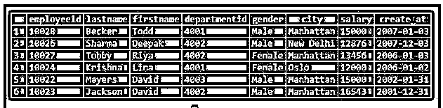

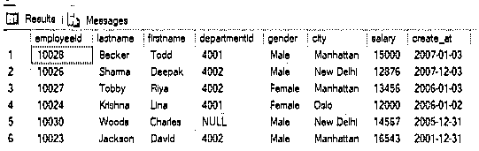

| **员工 id** | **姓氏** | **名字** | **部门编号** | **性别** | **城市** | **工资** | **创建 _ 在** |
| Ten thousand and twenty-eight | １９８９．　贝克尔 | 托德 | Four thousand and one | 男性的 | 曼哈顿 | Fifteen thousand | 2007-01-03 |
| Ten thousand and twenty-six | 夏尔马 | 迪帕克（男子名） | Four thousand and two | 男性的 | 新德里 | Twelve thousand eight hundred and seventy-six | 2007-12-03 |
| Ten thousand and twenty-seven | Tobby | 丽雅 | Four thousand and two | 女性的 | 曼哈顿 | Thirteen thousand four hundred and fifty-six | 2006-01-03 |
| Ten thousand and twenty-four | 克利须那 | 丽娜 | Four thousand and one | 女性的 | 奥斯陆 | Twelve thousand | 2006-01-02 |
| Ten thousand and twenty-two | 迈耶斯 | 大卫 | Four thousand and three | 男性的 | 曼哈顿 | Fifteen thousand | 2002-01-31 |
| Ten thousand and twenty-three | 杰克逊 | 大卫 | Four thousand and two | 男性的 | 曼哈顿 | Sixteen thousand five hundred and forty-three | 2001-12-31 |

### SQL 提交的示例

下面给出了提交事务命令的示例:

#### 示例#1

演示在 DELETE 语句中使用 COMMIT 命令的程序。

**代码:**

`BEGIN TRANSACTION;
DELETE FROM employees
WHERE employeeid = 10022;
COMMIT TRANSACTION;`

**输出:**

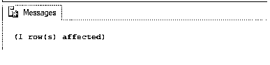

#### 实施例 2

演示在 INSERT 语句中使用 COMMIT 命令的程序。

**代码:**

`BEGIN TRANSACTION;
INSERT INTO employees(employeeid,lastname,firstname,gender,salary,city,create_at)
VALUES(10030,'Woods','Charles','Male','14567','New Delhi','2005-12-31');
COMMIT TRANSACTION;`

**输出:**

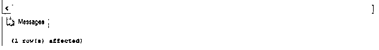

对于上面的例子，我们可以使用 select 查询来检查插入操作是否成功完成。我们可以看到，已经为员工 id“10030”创建了一个新行。

**代码:**

`select * from employees;`

**输出:**

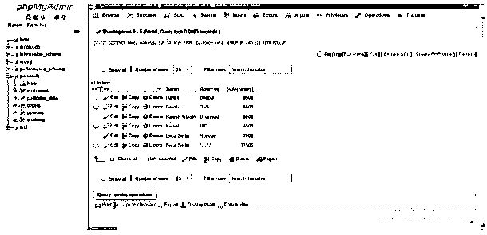

#### 实施例 3

说明在更新语句中使用提交命令的程序。

**代码:**

`BEGIN TRANSACTION;
UPDATE employees
SET departmentid = '4002'
WHERE employeeid = 10030
COMMIT TRANSACTION;`

**输出:**

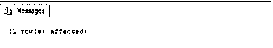

对于上面的例子，我们可以使用 select 查询来检查更新操作是否已经成功完成。我们可以清楚地看到部门 id 已经更新。

**代码:**

`select * from employees;`

**输出:**

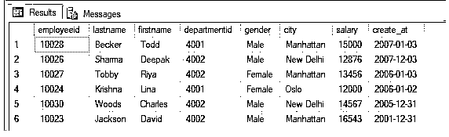

#### 实施例 4

演示在嵌套事务中使用提交命令的程序。

**代码:**

`--Starting of transaction 1
BEGIN TRANSACTION
INSERT INTO employees
(employeeid,departmentid,city,salary,gender,create_at,firstname,lastname)
VALUES
(10031,'4003','Manhattan','14325','Female','2012-03-03','Priyanka','M')
--Starting of transaction 2
BEGIN TRANSACTION
INSERT INTO employees
(employeeid,departmentid,city,salary,gender,create_at,firstname,lastname)
VALUES
(10034,'4001','Manhattan','12325','Male','2015-08-03','Lucas','Martin')
COMMIT TRANSACTION
--Committing/Saving of transaction 2
COMMIT TRANSACTION
--Committing/Saving of transaction 1`

**输出:**

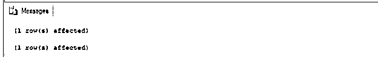

在这个例子中，我们试图说明嵌套事务上的提交。使用 SELECT 查询，我们可以检查是否已经创建了与员工 id 10031 和 10034 相对应的两行。

**代码:**

`select * from employees;`

**输出:**

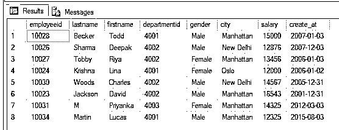

#### 实施例 5

SQL 程序，说明在包含多个表的嵌套事务中使用 COMMIT 命令。

**代码:**

`--Starting of transaction 1
BEGIN TRANSACTION
UPDATE employees
SET departmentid = 4004
WHERE departmentid = 4003
--Starting of transaction 2
BEGIN TRANSACTION
DELETE FROM department
WHERE departmentid = 4003
COMMIT TRANSACTION
--Committing/Saving of transaction 2
--Starting of transaction 3
BEGIN TRANSACTION
INSERT INTO employees
(employeeid,departmentid,city,salary,gender,create_at,firstname,lastname)
VALUES
(10032,'4003','Manhattan','13425','Female','2014-02-03','Kristina','Saffiz')
COMMIT TRANSACTION
--Committing/Saving of transaction 3
COMMIT TRANSACTION
--Committing/Saving of transaction 1`

**输出:**

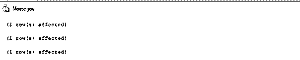

从下面的截屏中，我们可以看到所有需要的更改都已经按照预期的顺序进行了。

**代码:**

`select departmentid, departmentname, head from department;`

**输出:**

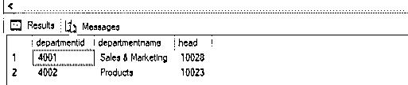

**代码:**

`select * from employees;`

**输出:**

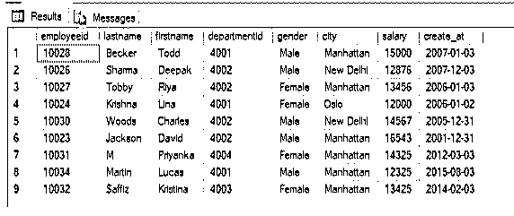

### 结论

COMMIT 是 SQL 中的一个事务命令，主要用于永久保存数据操作更改(插入、删除和更新)。提交后，其他用户也可以看到更改。提交应该始终小心谨慎，因为一旦做出更改就无法撤消。

### 推荐文章

这是一个 SQL 提交指南。在这里，我们讨论引言，SQL 中的提交是如何工作的？还有例子。您也可以看看以下文章，了解更多信息–

1.  [PostgreSQL 中的游标](https://www.educba.com/cursors-in-postgresql/)
2.  [T-SQL 命令](https://www.educba.com/t-sql-commands/)
3.  [MySQL 查询](https://www.educba.com/mysql-queries/)
4.  [SQL 的使用](https://www.educba.com/uses-of-sql/)
5.  [PostgreSQL 提交指南](https://www.educba.com/postgresql-commit/)
6.  [PostgreSQL 汇总指南](https://www.educba.com/postgresql-rollup/)

