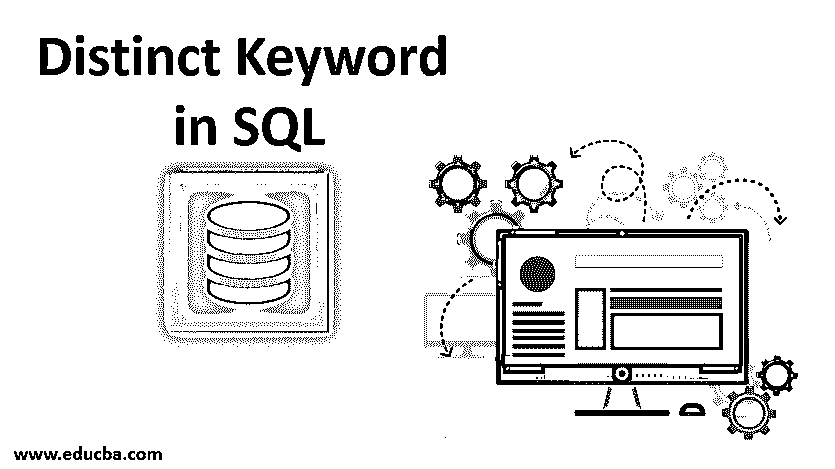
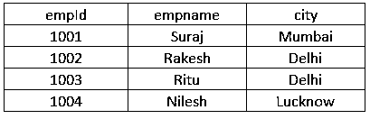
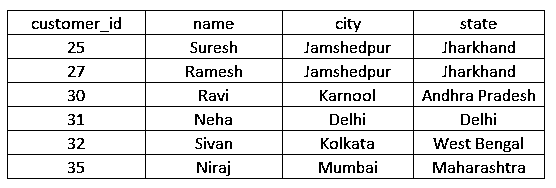
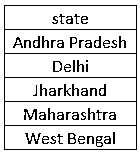
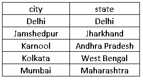
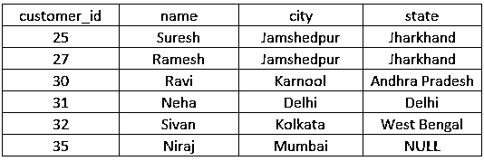
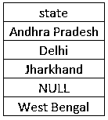

# SQL 中的独特关键字

> 原文：<https://www.educba.com/distinct-keyword-in-sql/>

## SQL 中的 Distinct 关键字介绍

SQL 中的 Distinct 命令与 Select 命令一起使用，以便只从表中检索不同或不相似的值。它主要用作过滤重复记录并从给定的表中仅获取唯一记录的方法，在给定的表中，字段可能有多个重复记录。SQL 中的 Distinct 关键字在 Select 语句中用作' Select Distinct * from table_name '。

**带解释的语法**

<small>Hadoop、数据科学、统计学&其他</small>

让我们通过一个示例来看看 distinct 关键字语法:

让我们有一个包含三列的 employee 表:empId、empname 和 city，如下所示:

`Select DISTINCT(column_name) from table_name;`

在上面的示例中，我们可以看到城市是具有重复值的列，因此我们将城市放在 column_name 的位置，将雇员放在 table_name 的位置。运行时，它将返回独特的城市名称，即孟买，德里，勒克瑙。如果我们删除一个独特的关键字，它将检索四个值，而不是三个。

### 用于 SQL 中 Distinct 关键字的参数

现在让我们来看一下 distinct 关键字中的各种参数。下面是 distinct 关键字的语法。

**语法:**

`Select DISTINCT(expressions) from tables [where conditions];`

*   **表达式:**在这里，我们提供我们想要的列名或计算。
*   **Tables:** 我们提供想要从中获取记录的表名。需要注意的一点是，在 from 子句之后至少应该有一个表名。
*   **条件:**这是纯可选的；当我们希望数据首先满足特定条件时，我们提供条件来选择记录。

**Note: **In SQL, a distinct keyword also retrieves the null value, which means it considers null also as a distinct value. So if we have null values, then the result set for a distinct keyword will also include a null value.

### 如何在 SQL 中使用 Distinct 关键字？

正如我们已经讨论过的参数。现在让我们借助例子来学习在哪里使用 distinct 关键字。

让我们使用 DDL 语句(数据定义语言)创建一个表 CUSTOMER，然后使用 [DML(数据操作语言)](https://www.educba.com/data-manipulation-language/)填充它们。

**DDL(创建表格):**

`CREATE TABLE customer ( customer_id int NOT NULL, name char(50) NOT NULL, city varchar2, state varchar2);`

这将创建一个包含四列 customer_id、姓名、城市和州的表。现在我们将使用 DML 语句在表中输入数据。

**插入报表以输入数据:**

`INSERT INTO customer (customer_id, name, city, state) VALUES (25, ‘Suresh’,’Jamshedpur’,’Jharkhand’);`

`INSERT INTO customer (customer_id, name, city, state) VALUES (27, ‘Ramesh’, ’Jamshedpur’, ’Jharkhand’);`

`INSERT INTO customer (customer_id, name, city, state) VALUES (30, ‘Ravi’, ’Karnool’, ’Andhra Pradesh’);`

`INSERT INTO customer (customer_id, name, city, state) VALUES (31, ‘Neha’, ’Delhi’, ’Delhi’);`

`INSERT INTO customer (customer_id, name, city, state) VALUES (32, ‘Sivan’, ’Kolkata’, ’West Bengal’);`

`INSERT INTO customer (customer_id, name, city, state) VALUES (35, ‘Niraj’, ’Mumbai’, ’Maharashtra’);`

在执行上面的语句时，我们得到下面的客户表。

现在，让我们使用 distinct 查询来执行一些查询，以了解如何使用 distinct 关键字。

1.首先，我们将在一列中找到唯一的值。

**查询:**

`select DISTINCT state from customer order by state;`

我们将在执行查询时获得 5 个值，因为我们只有 5 个不同的状态，因为 Jharkhand 重复了两次。因为我们使用了 ORDER BY，所以结果集将按升序排序。下面是我们在执行查询时应该得到的结果集。

2.其次，我们将来自多个列的唯一值。

**查询:**

`select DISTINCT city, state from customer order by city, state;`

上述查询将返回每个唯一的城市和州的组合。在上面的例子中，distinct 适用于写在 distinct 关键字之后的每个字段。因此，我们将有五对城市和国家，因为有 Jamshedpur 城市，这已重复了两次。所以我们会让贾坎德邦的贾姆谢德布尔来一次。城市将按升序排列。执行查询的结果集如下所示。

3.我们现在将看到 distinct 关键字如何处理空值。

首先，我们将 state 列中的一个字段更新为 NULL，然后使用 distinct 关键字获得结果集。

在 customer 表的一个字段中设置 NULL 值的更新查询。

**查询:**

`update customer set state=”” where customer_id = 35;`

这将在 state 列的最后一个字段中插入一个空值。该表将更新如下。

现在，让我们使用 select 查询执行一个 distinct 关键字。

**查询:**

`select DISTINCT state from customer order by state;`

在执行上述查询时，我们将设置五个值，因为 distinct 关键字认为 NULL 也是一个惟一的值。Jharkhand 重复两次，结果集中只有一个值。因为我们使用了 ORDER BY 子句，所以结果集将按升序排序。下面是我们在执行上述查询时应该看到的结果集。

### 结论

总结本文，我们可以说 distinct 关键字是一个非常强大和有用的关键字，它用于基于不同条件的 SELECT 语句中，这些条件取决于从一列或多列中检索唯一/不同值的业务需求。

### 推荐文章

这是 SQL 中 Distinct 关键字的指南。这里我们讨论的介绍，如何使用 SQL 中的 distinct 关键字，及其参数和一些例子。您也可以阅读以下文章，了解更多信息——

1.  [SQL 中的外键](https://www.educba.com/foreign-key-in-sql/)
2.  [SQL 中的事务](https://www.educba.com/transactions-in-sql/)
3.  [SQL 中的通配符](https://www.educba.com/wildcard-in-sql/)
4.  [Java 中的这个关键字](https://www.educba.com/this-keyword-in-java/)

