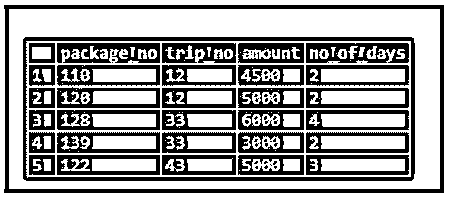
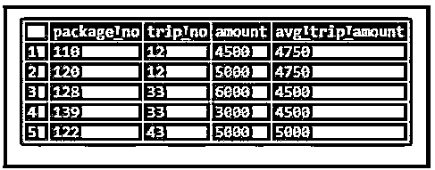
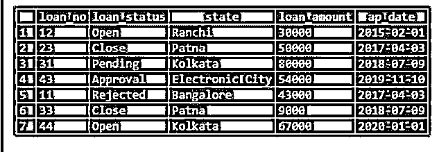
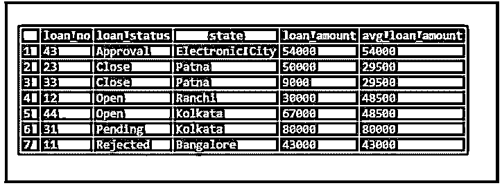
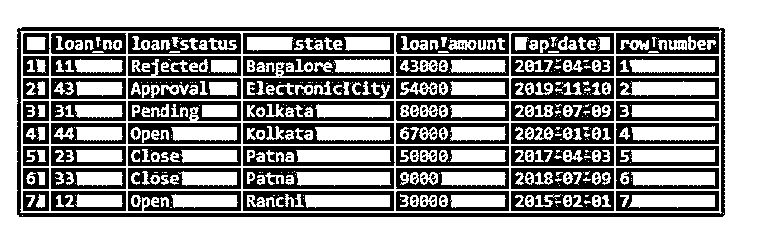
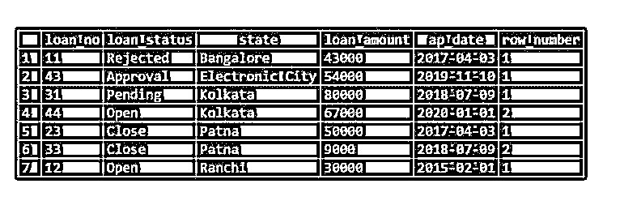
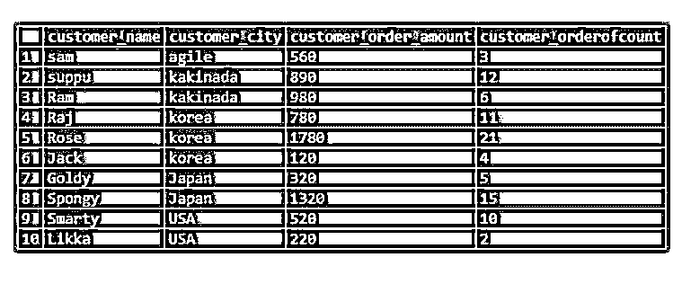
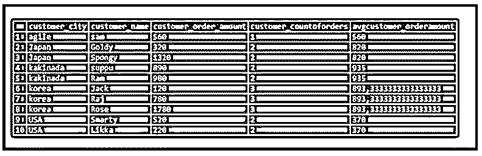
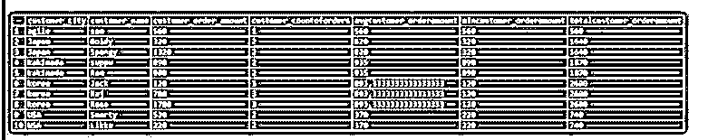

# SQL 中的分区依据

> 原文：<https://www.educba.com/partition-by-in-sql/>

## SQL 中的 PARTITION BY 简介

下面的文章提供了 SQL 中 PARTITION BY 的概要。PARTITION BY 用于将结果集划分为多个分区。之后，对分区数据的每个数据子集执行计算。我们使用' partition by '子句来定义表的分区。partition by 子句与 over 子句一起使用。我们使用窗口函数分别操作分区并重新计算数据子集。窗口函数定义为 RANK()、LEAD()、MIN()、ROUND()、MAX()和 COUNT()等。“partition by”子句是一个标量子查询。它总是返回单个值。

**语法:**

<small>Hadoop、数据科学、统计学&其他</small>

`window_function ( expression ) OVER (
PARTITION BY expression_1, expression_2...
order_clause
)`

在这里的表达式中，我们可以使用两个或多个列来划分数据结果集。expression_1、expression_2 仅通过“FROM”子句引用列。我们不能在 select 语句中引用别名。

### 如何在 SQL 中实现 PARTITION BY？

让我们拿下面两个表和实现

下面是“套餐”和“贷款”表。在这里，一旦我们应用了“PARTITION BY”连接，我们就获得了两个表之间的公共行。

**包装表**

下面是根据“trip_no”划分的“金额”应用的条件划分。

**代码:**

`SELECT
Package_no,
Trip_no,
Amount,
ROUND (AVG(Amount) OVER ( PARTITION BY Trip_no )) AS avg_trip_amount
FROM
Package;`

**输出:**

**贷款表:**

下面的 partition by 条件是根据“loan_amount”和“loan_no”的分区来应用的。

**代码:**

`SELECT
loan_no,
loan_status,
state,
loan_amount,
ROUND (AVG(loan_amount) OVER ( PARTITION BY loan_status )) AS avg_loan_amount FROM
LOAN;`

**输出:**

### 带有 PARTITION BY 子句的 ROW_NUMBER

在 SQL 中，我们使用 ROW_NUMBER 进行分页。它用于通过“ORDER”子句为结果集中的行提供连续编号。序列从 1 开始。

不一定，当我们使用 row_number 概念时，我们需要一个 partition by 子句。

**语法:**

`ROW_NUMBER() OVER( PARTITION BY exp1,exp2,.. ORDER BY col1,col2,..)`

**举例:**

**a .不使用‘Partition by’子句。**

**代码:**

`SELECT *, ROW_NUMBER() OVER (ORDER BY state) AS Row_Number
FROM LOAN;`

**输出:**

通过使用 partition by 子句。

**代码:**

`SELECT *, ROW_NUMBER() OVER (PARTITION BY state ORDER BY state) AS Row_Number
FROM LOAN;`

**输出:**

### SQL 中的 PARTITION BY 示例

下面给出了 SQL 中 PARTITION BY 的示例:

让我们来创建表格。

**代码:**

`create table customer_order_data(
customer_name varchar(20),
customer_city varchar(20),
customer_order_amount int,
customer_orderofcount int
);`

下面的命令将数据插入到表中。

**代码:**

`insert into customer_order_data values ('sam','agile',560,3),
('suppu','kakinada',890,12),
('Ram','kakinada',980,6),
('Raj','korea',780,11),
('Rose','korea',1780,21),
('Jack','korea',120,4),
('Goldy','Japan',320,5),
('Spongy','Japan',1320,15),
('Smarty','USA',520,10),
('Likka','USA',220,2)`

现在让我们选择表。

**代码:**

`SELECT * FROM customer_order_data;`

**输出:**

现在让我们通过应用上表得到分区:

#### 示例#1

**代码:**

`SELECT Customer_city,
Customer_Name,
customer_order_amount,
COUNT(customer_orderofcount) OVER(PARTITION BY Customer_city) AS customer_CountOfOrders,
AVG(customer_order_amount) OVER(PARTITION BY Customer_city) AS Avgcustomer_OrderAmount from CUSTOMER_ORDER_DATA;`

**输出:**

#### 实施例 2

**代码:**

`SELECT Customer_city,
Customer_Name,
customer_order_amount,
COUNT(customer_orderofcount) OVER(PARTITION BY Customer_city) AS customer_CountOfOrders,
AVG(customer_order_amount) OVER(PARTITION BY Customer_city) AS Avgcustomer_OrderAmount,
MIN(customer_order_amount) OVER(PARTITION BY Customer_city) AS Mincustomer_OrderAmount,
SUM(customer_order_amount) OVER(PARTITION BY Customer_city) AS Totalcustomer_OrderAmount
from
CUSTOMER_ORDER_DATA;`

**输出:**

### 结论

在 sql 的“partition by”主题中需要考虑的是,“partition by”子句与子子句“over”一起使用。我们使用窗口函数分别操作分区并重新计算数据子集。窗口函数被定义为 RANK()、LEAD()、MIN()、ROUND()、MAX()和 COUNT()等。partition by 子句是一个标量子查询。它总是返回单个值。在 SQL 中，我们使用 ROW_NUMBER 进行分页。它用于通过“ORDER”子句为结果集中的行提供连续编号。序列从 1 开始。不一定，当我们使用 row_number 概念时，我们需要一个 partition by 子句。

### 推荐文章

这是一个 SQL 分区指南。在这里，我们讨论对 SQL 中 PARTITION BY 的介绍，以及用 PARTITION BY 子句实现 ROW_NUMBER 的示例。您也可以看看以下文章，了解更多信息–

1.  [什么是 SQL Developer？](https://www.educba.com/what-is-sql-developer/)
2.  [SQL 排名()](https://www.educba.com/sql-rank/)
3.  [SQL 中的 roll up](https://www.educba.com/rollup-in-sql/)
4.  [SQL 选择随机](https://www.educba.com/sql-select-random/)

