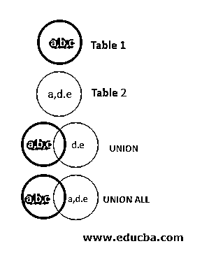
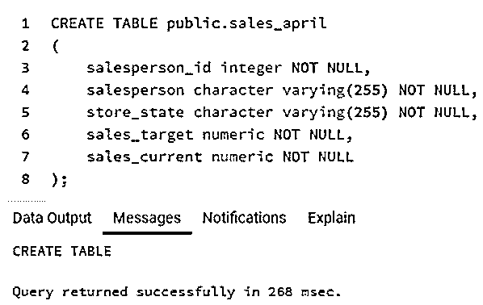
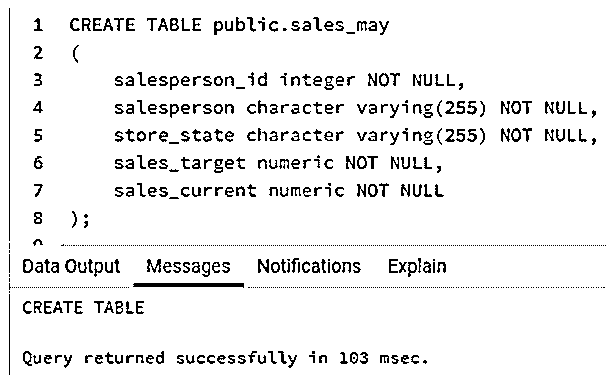
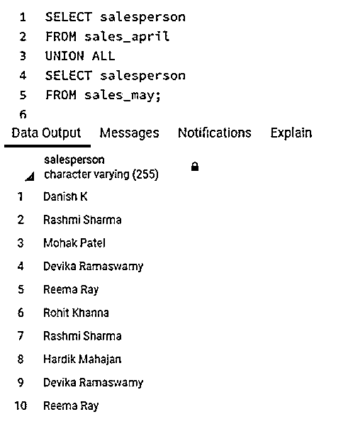
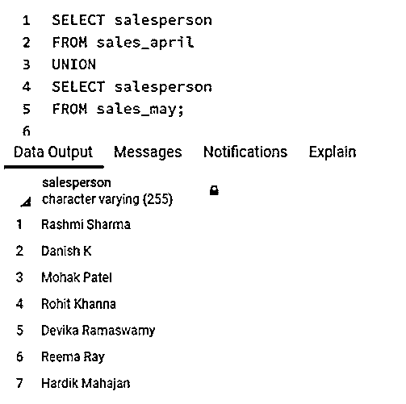
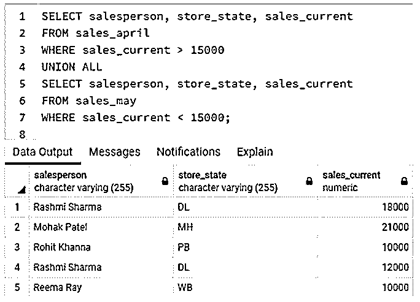
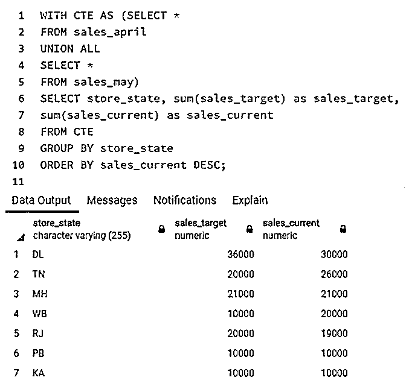

# SQL UNION ALL

> 原文：<https://www.educba.com/sql-union-all/>

## SQL UNION 简介全部

标准查询语言(SQL)中的 UNION ALL 运算符用于将两个或多个 SELECT 查询的结果组合成一个结果集。组合结果时，UNION ALL 不会从最终结果集中删除重复的记录。UNION 是这种操作符的一个非常受欢迎的伙伴，它用于组合从两个或多个 SELECT 语句获得的结果，但是在组合结果时，它会从最终结果集中删除重复的记录。

在与 UNION 或 UNION ALL 运营商合作时，我们应牢记以下几点:

<small>Hadoop、数据科学、统计学&其他</small>

*   我们要对其使用 UNION ALL 运算符的 SELECT 语句中的列数必须相同。
*   选定的列应该具有相同的数据类型。如果没有，它们至少应该有可以转换成相同数据类型的数据类型。
*   列的顺序必须与 SELECT 语句中提到的顺序相同。

对于门外汉来说，这是一幅关于联合司令部的图画。

### 语法和参数

使用 UNION ALL 运算符编写选择查询的基本语法如下:

`SELECT column_name
FROM table_name_1
UNION ALL
SELECT column_name
FROM table_name_2
UNION ALL
SELECT column_name
FROM table_name_3
.
.
.`

上述语法中使用的参数如下:

*   **column_name:** 指定要对其执行 UNION ALL 操作并希望其出现在结果集中的列名。
*   **FROM table_name_1:** 指定要从中提取列的第一个表名。
*   **FROM table_name_2:** 指定要从中提取列的第二个表名。

在上述参数中，所有参数都是强制性的。您可以根据需要随意使用 WHERE、GROUP BY 和 HAVING 子句。

### SQL UNION ALL 示例

下面是提到的例子:

为了说明 UNION ALL 运算符在 SQL 中的用法和功能，让我们创建两个虚拟表“sales_april”和“sales_may”。这些表格具有相似的结构，它们包含与销售人员、销售额、销售目标、商店位置等相关的详细信息。

**代码:**

`CREATE TABLE public.sales_april
(
salesperson_id integer NOT NULL,
salesperson character varying(255) NOT NULL,
store_state character varying(255) NOT NULL,
sales_target numeric NOT NULL,
sales_current numeric NOT NULL
);`

**输出:**

**代码:**

`CREATE TABLE public.sales_may
(
salesperson_id integer NOT NULL,
salesperson character varying(255) NOT NULL,
store_state character varying(255) NOT NULL,
sales_target numeric NOT NULL,
sales_current numeric NOT NULL
);`

**输出:**

让我们在 sales_april 和 sales_may 表中插入一些数据记录。

**代码:**

`INSERT INTO sales_april
(salesperson_id
,salesperson
,store_state
,sales_target
,sales_current)
VALUES
(101,'Danish K','KA',10000,10000),
(102,'Rashmi Sharma','DL',23000,18000),
(103,'Mohak Patel','MH',21000,21000),
(104,'Devika Ramaswamy','TN',10000,8000),
(105,'Reema Ray','WB',0,10000);
INSERT INTO sales_may
(salesperson_id
,salesperson
,store_state
,sales_target
,sales_current)
VALUES
(106,'Rohit Khanna','PB',10000,10000),
(102,'Rashmi Sharma','DL',13000,12000),
(107,'Hardik Mahajan','RJ',20000,19000),
(104,'Devika Ramaswamy','TN',10000,18000),
(105,'Reema Ray','WB',10000,10000);`

#### 示例#1

找出在四月和五月期间在百货商店工作的所有销售人员。

**代码:**

`SELECT salesperson
FROM sales_april
UNION ALL
SELECT salesperson
FROM sales_may;`

**输出:**

在本例中，我们使用了 UNION ALL 运算符来合并 sales_april 和 sales_may 表的结果。我们注意到我们收到了重复的值，如 Reema Ray、Rashmi Sharma 等。

现在考虑这个查询。

**代码:**

`SELECT salesperson
FROM sales_april
UNION
SELECT salesperson
FROM sales_may;`

**输出:**

这里，我们使用了 UNION 操作符来组合 sales_april 和 sales_may 表的结果，类似于前面的查询。但是与 UNION ALL 操作符不同，在 UNION 操作符的情况下，我们没有得到重复的值。

#### 实施例 2

查找所有在 4 月和 5 月期间在部门商店工作并销售额超过 15000 美元的售货员和商店地址。

**代码:**

`SELECT salesperson, store_state, sales_current
FROM sales_april
WHERE sales_current > 15000
UNION ALL
SELECT salesperson, store_state, sales_current
FROM sales_may
WHERE sales_current < 15000;`

**输出:**

这里，我们使用了 UNION ALL 函数来合并 sales_april 和 sales_may 表的结果。

#### 实施例 3

查找所有商店位置以及总销售目标和当前总销售额。

**代码:**

`WITH CTE AS (SELECT *
FROM sales_april
UNION ALL
SELECT *
FROM sales_may)
SELECT store_state, sum(sales_target) as sales_target, sum(sales_current) as sales_current
FROM CTE
GROUP BY store_state
ORDER BY sales_current DESC;`

**输出:**

在此示例中，我们首先组合了 sales_april 和 sales_may 表的结果，然后通过按 store_state 字段对记录进行分组，找到了每个商店的合计 sales_target 和 sales_current。

### 结论

UNION ALL 运算符用作组合子来组合两个或多个 SELECT 语句的结果。但是，它会在最终结果集中返回重复的记录。

### 推荐文章

这是一个 SQL 联合指南。这里我们分别用例子讨论 SQL UNION 的介绍。您也可以看看以下文章，了解更多信息–

1.  [SQL 中的数组](https://www.educba.com/array-in-sql/)
2.  [SQL While 循环](https://www.educba.com/sql-while-loop/)
3.  [SQL 中的元数据](https://www.educba.com/metadata-in-sql/)
4.  [SQL REGEXP](https://www.educba.com/sql-regexp/)

