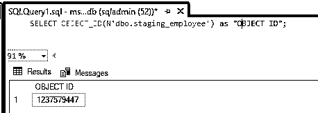
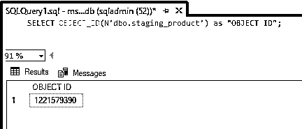
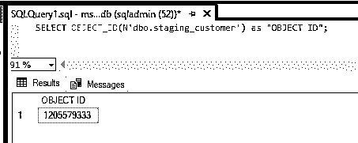
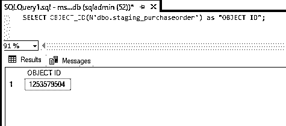
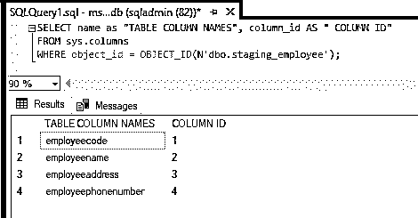
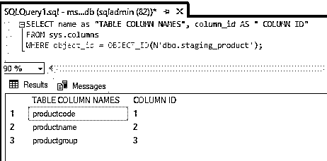
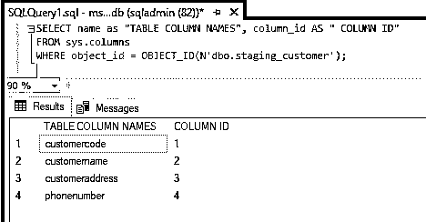
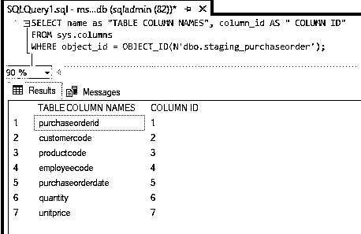
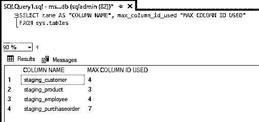

# SQL 中的元数据

> 原文：<https://www.educba.com/metadata-in-sql/>

## SQL 中的元数据简介

元数据用简单的话来描述就是关于数据的数据。通常，元数据返回关于数据库、数据库对象、数据库文件等的信息。，在 SQL server 中。在关系数据库中，元数据据说由关于模式、存储等的信息组成。模式数据库中的元数据由有关表、列、约束、外键、索引和序列的信息组成。它还包含关于视图、过程、函数和触发器的信息。对这种元数据的访问是以一组称为系统目录或数据字典的表或视图的形式提供的。

**语法:**

<small>Hadoop、数据科学、统计学&其他</small>

要查找以下模式对象的 ID，请使用以下语法格式:

`SELECT OBJECT_ID(N'dbo.tablename’);`

**举例:**

`SELECT OBJECT_ID(N'dbo.staging_employee');`

为了找到数据库中所有列的信息，我们使用下面的语法:-

`SELECT nameas "TABLE COLUMN NAMES",column_id AS " COLUMN ID"
FROM sys.columns/* - - - Predefined columns- - - */
WHERE object_id = OBJECT_ID(N’dbo.tablename’);`

**举例:**

`SELECT name as " TABLE COLUMN NAMES",column_id AS " COLUMN ID"
FROM sys.columns/* - - - Predefined columns - - - */
WHERE object_id = OBJECT_ID(N'dbo.staging_employee');`

为了找到与表格相关的信息，我们使用下面的语法:

`SELECT name AS "COLUMN NAME",max_column_id_used "MAX COLUMN ID USED"
FROM sys.tables`

为了找到与模式相关的信息，我们使用下面的语法:

`SELECT name AS "SCHEMA NAME",schema_id AS "SCHEMA ID"
FROM sys.schemas   /* - - - Predefined Schema - - - */
WHERE principal_id = DATABASE_PRINCIPAL_ID(N'DATABASENAME');`

**举例:**

`SELECT name AS "SCHEMA NAME",schema_id AS "SCHEMA ID"
FROM sys.schemas/* - - - Predefined Schema - - - */
WHERE principal_id=DATABASE_PRINCIPAL_ID(N'dbo');`

### 元数据在 SQL 中是如何工作的？

在我们的日常应用中，会用到元数据相关的结果集操作。例如，我们有一个列的数据类型，与数据类型相关的信息可以在元数据中找到。我们还可以获得与列的长度相关的信息，以及占用了多少存储空间。

元数据的主要用途尤其是在即席查询中；我们不会知道结果集的元数据。为了获得这些元数据，我们需要使用函数 SQLNumResultCols、SQLDescribeCol 和 SQLColAttribute。

为了检索结果集元数据，我们使用 SQLDescribeCol 和 SQLColAttribute。SQLDescribeCol 总是返回相同的五条信息(列名、数据类型、精度、小数位数和空能力。SQLCOLAttribute 返回一条信息。但是，SQLColAttribute 可以返回复杂的元数据选择，包括列的区分大小写、显示大小、可更新性和搜索能力等信息。

大多数应用程序只需要 SQLDescribeCol 返回的元数据。SQLDescribeCol 比 SQLColAttribute 快，因为信息是在单个调用中返回的。应用程序的其余部分使用 SQLColAttribute 来要求额外的元数据，并使用这两个函数。

从数据源获取元数据通常非常昂贵。由于这个原因，我们需要驱动程序来缓存任何元数据。这个驱动程序将从服务器中检索并保存它。对于应用程序来说，只请求绝对需要的元数据会更容易。

### SQL 中的元数据示例

1.要查找下面的架构对象的 ID，请使用语法格式。

`SELECT OBJECT_ID(N'dbo.tablename’);`

**以上例子:**

`SELECT OBJECT_ID(N'dbo.staging_employee')as "OBJECT ID";`

`SELECT OBJECT_ID(N'dbo.staging_product')as "OBJECT ID";`

`SELECT OBJECT_ID(N'dbo.staging_customer')as "OBJECT ID";`

`SELECT OBJECT_ID(N'dbo.staging_purchaseorder')as "OBJECT ID";`

2.为了找到数据库中所有列的信息，我们使用下面的语法:

`SELECT name as "TABLE COLUMN NAMES",column_id AS " COLUMN ID"
FROM sys.columns
WHERE object_id = OBJECT_ID(N’dbo.tablename’);`

**以上例子:**

`SELECT name as "TABLE COLUMN NAMES",column_id AS " COLUMN ID"
FROM sys.columns /* - - - Predefined column table - - - */
WHERE object_id = OBJECT_ID(N'dbo.staging_employee');`

`SELECT name as "TABLE COLUMN NAMES",column_id AS " COLUMN ID"
FROM sys.columns /* - - - Predefined column table - - - */
WHERE object_id = OBJECT_ID(N'dbo.staging_product');`

`SELECT name as "TABLE COLUMN NAMES",column_id AS " COLUMN ID"
FROM sys.columns /* - - - Predefined column table - - - */
WHERE object_id = OBJECT_ID(N'dbo.staging_customer');`

`SELECT name as "TABLE COLUMN NAMES",column_id AS " COLUMN ID"
FROM sys.columns
WHERE object_id = OBJECT_ID(N'dbo.staging_purchaseorder');`

3.为了找到与表格相关的信息，我们使用下面的语法:

`SELECT name AS "COLUMN NAME",max_column_id_used "MAX COLUMN ID USED"
FROM sys.tables`

4.为了找到与模式相关的信息，我们使用下面的语法:

`SELECT name AS "SCHEMA NAME",schema_id AS "SCHEMA ID"
FROM sys.schemas
WHERE principal_id = DATABASE_PRINCIPAL_ID(N'DATABASENAME');`

以上示例:

`SELECT name AS "SCHEMA NAME",schema_id AS "SCHEMA ID"
FROM sys.schemas
WHERE principal_id = DATABASE_PRINCIPAL_ID(N'dbo');`

### 结论

元数据用简单的话来描述就是关于数据的数据。通常，元数据返回关于数据库、数据库对象、数据库文件等的信息。，在 SQL server 中。在关系数据库中，元数据据说由关于模式、存储等的信息组成。模式数据库中的元数据由有关表、列、约束、外键、索引和序列的信息组成。

### 推荐文章

这是一个 SQL 元数据指南。在这里，我们还将讨论 SQL 中元数据的介绍和工作原理，以及不同的示例和代码实现。您也可以看看以下文章，了解更多信息–

1.  [SQL 中的 roll up](https://www.educba.com/rollup-in-sql/)
2.  [SQL 中的多维数据集](https://www.educba.com/cube-in-sql/)
3.  [NoSQL 数据库的类型](https://www.educba.com/types-of-nosql-databases/)
4.  [什么是 MySQL 模式？](https://www.educba.com/what-is-a-mysql-schema/)
5.  [SQL While 循环指南](https://www.educba.com/sql-while-loop/)

