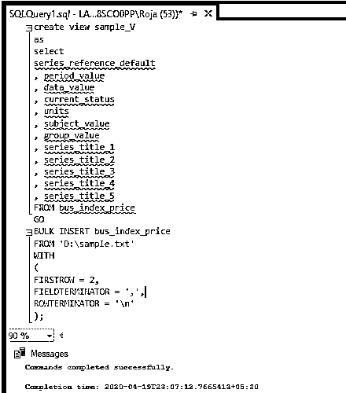
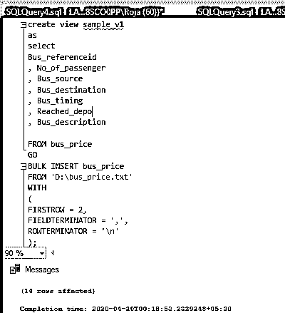
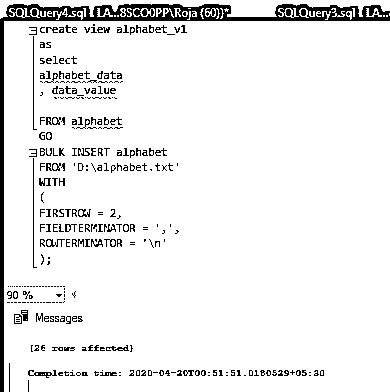

# SQL 大容量插入

> 原文：<https://www.educba.com/sql-bulk-insert/>

## SQL 大容量插入简介

普通的 insert 语句一次只能在数据库中插入一行。但是如果你想将多个行插入数据库表，那么我们使用 SQL bulk insert。批量插入允许我们导入 CSV 文件并插入文件中的所有数据。

大容量插入还具有“批量”装载数据的优势。在加载数据时，如果我们遇到错误，想要中止插入过程，我们有一个名为“MAXERRORS”的参数。我们还可以提到像“字段终止符”这样的参数，它定义了字段是如何分隔的。“ROWTERMINATOR”定义如何分隔行。“FIRSTROW”用于指定插入需要从哪一行开始。通常，我们跳过头部，所以值将是 FIRSTROW = 2。

<small>Hadoop、数据科学、统计学&其他</small>

**语法:**

具有以下参数的最常用语法:

`/ * - - - - - - -  -  Bulk insert query is given below - - - - - */
BULK INSERT    { database_name.schema_name.table_or_view_name |
schema_name.table_or_view_name | table_or_view_name }
FROM 'data_file_name'
[   [ WITH
( [  ,  FORMAT = 'CSV' ] [ , FIRSTROW = ‘first_row’  ] [  , FIELDQUOTE = 'quote_characters'] [ , FORMATFILE = 'format_file_path' ] [  ,  FIELDTERMINATOR = 'field_terminator' ] [  ,  ROWTERMINATOR = 'row_terminator' ] )]`

我们还有其他可以提及的参数如下:–

*   ，批次大小:批次大小
*   ，DATA_SOURCE:“数据源名称”
*   ,ERRORFILE: ‘file name’
*   ，ROWS_PER_BATCH: rowsperbatch
*   ，行终止符:“行终止符”
*   ，TABLOCK
*   ，检查约束条件
*   ，代码页:{ 'RAW' }
*   ，数据文件类型:{ ' char }
*   ，错误文件数据来源:“数据源名称”
*   ，FIRSTROW:第一行
*   ，FIRE _ 触发器
*   ，FORMATFILE_DATA_SOURCE:'数据源名称'
*   ，保持身份
*   ，KEEPNULLS
*   ，千字节每批:千字节每批
*   ，LASTROW:最后一行
*   ,MAXERRORS: max errors
*   ，顺序({列[ ASC | DESC ] } [，…n ])

### 如何在 SQL 中批量插入？

为了更好地了解批量插入，我下载了一个包含大量数据的文件，并尝试将其加载到 SQL 中。该文件由 10 行组成。现在让我们执行批量装载。下面是我们为其加载大量数据而创建的表。

**代码:**

`create table bus_index_price
(
series_reference_default varchar(20),
period_value decimal(10,3),
data_value int,
current_status varchar(10),
units varchar(10),
subject_value varchar(30),
group_value varchar(30),
series_title_1 varchar(20),
series_title_2 varchar(20),
series_title_3 varchar(20),
series_title_4 varchar(20),
series_title_5 varchar(20)
);`

现在让我们将数据批量插入到表中:-

`/ * - - - - - - -  -  Bulk insert query is given below - - - - - */
create view sample_V
as
select
series_reference_default
,period_value
,data_value
,current_status
, units
,subject_value
,group_value
, series_title_1
, series_title_2
, series_title_3
, series_title_4
, series_title_5
FROM bus_index_price
GO
BULK INSERT bus_index_price
FROM'D:\sample.txt'
WITH
(
FIRSTROW= 2,
FIELDTERMINATOR=',',
ROWTERMINATOR='\n'
);`

我们正在创建视图并将表中的列映射到 CSV 文件，这样我们就不会出现任何与映射相关的错误:-输出的屏幕截图也是如此:–

**输出:**

### 实现 SQL 大容量插入的示例

下面是提到的例子:

#### 示例#1

下面是我们为其加载大量数据而创建的表。

**代码:**

`create table bus_price
(
Bus_referenceid varchar(20),
No_of_passenger int,
Bus_source varchar(20),
Bus_destination varchar(30),
Bus_timing varchar(10),
Reached_depo varchar(10),
Bus_description varchar(30)
);`

现在让我们将数据批量插入到表中:-

`create view sample_v1
as
select
Bus_referenceid
,No_of_passenger
,Bus_source
,Bus_destination
,Bus_timing
,Reached_depo
,Bus_description
FROM bus_price
GO
BULK INSERT bus_price
FROM 'D:\bus_price.txt'
WITH
(
FIRSTROW= 2,
FIELDTERMINATOR=',',
ROWTERMINATOR='\n'
);`

我们正在创建视图并将表中的列映射到 CSV 文件，这样我们就不会出现任何与映射相关的错误:-输出的屏幕截图也是如此:–

**代码:**

`SELECT * FROM bus_price;`

**输出:**

#### 实施例 2

现在让我们看另一个例子，并插入大量数据:-

**代码:**

`create table Alphabet
(
alphabet_data varchar(10),
data_value int
)`

现在让我们将数据批量插入到表中:-

`create view alphabet_v1
as
select
alphabet_data
,data_value
FROM alphabet
GO
BULKINSERT alphabet
FROM 'D:\alphabet.txt'
WITH
(
FIRSTROW= 2,
FIELDTERMINATOR=',',
ROWTERMINATOR='\n'
);`

下面是上面向表中插入数据的屏幕截图:

### 推荐文章

这是一个 SQL 大容量插入指南。在这里，我们讨论了 SQL 批量插入的介绍，语法，如何插入与样本查询批量。您也可以浏览我们的其他相关文章，了解更多信息——

1.  [SQL 时间戳](https://www.educba.com/sql-timestamp/)
2.  [SQL 管理](https://www.educba.com/sql-administration/)
3.  [SQL 中的三元运算符](https://www.educba.com/ternary-operator-in-sql/)
4.  [SQL 中的任何一个](https://www.educba.com/any-in-sql/)

