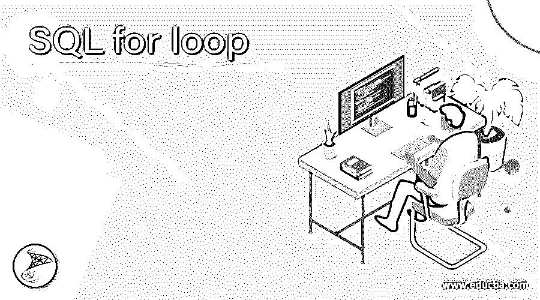
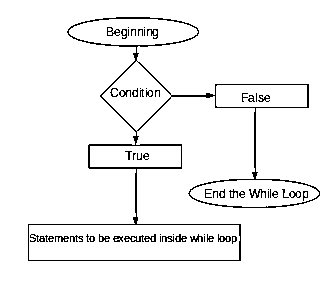
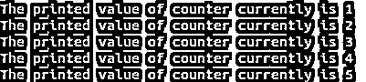
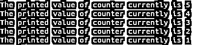

# SQL For 循环

> 原文：<https://www.educba.com/sql-for-loop/>

## SQL For 循环简介

SQL 为我们提供了可以用来向 SQL 服务器传达指令和给出命令的语言。这种语言带有许多语句和功能来实现多个语句执行的条件和循环行为。循环语句用于重复执行某项任务。SQL 中有许多循环语句可用，如 while loop、使用简单循环和 exit 关键字和标签的循环等。但是，在 SQL 中没有用于循环的功能。仍然可以使用 while 循环模拟 for 循环的行为。

在本文中，我们将学习使用 while 循环的 for 循环类实现的语法，它的工作和内部实现，并用一些示例来说明，这些示例将增强对 while 循环用法的掌握，以便根据我们的要求以 for 循环的方式多次执行语句。

<small>Hadoop、数据科学、统计学&其他</small>

**语法:**

`WHILE condition
BEGIN
[statements inside the loop];
END;`

**在 SQL 中实现 for 循环功能的简单定制 WHILE 循环的语法:**

`counting variable = beginning value;
WHILE condition usually counting variable < ending value
BEGIN
[statements inside the loop];
counting variable = counting variable + step value
END;`

通常，我们维护一个计数器变量，该变量将在 while 循环中递增或递减，以使用 SQL 中的 while 循环实现类似 for 循环的功能。提供条件的方式是，在 while 循环中继续执行语句，直到计数器变量的值达到结束值。

*   **计数变量的名称–**这可以是任何变量，它将保存值作为计数器，以维护正在迭代的值，并了解循环已经完成的次数以及在任何时间点已经执行的语句。简而言之，它可以被认为是存储循环计数器值的临时变量。
*   **起始值–**这是循环开始的起始值，也是它将保存的计数变量的第一个值。
*   **结束值–**这是计数变量的最后一个值，while 循环将迭代并执行语句。
*   **步长值–**这是计数变量从开始值增加到结束值的增量值。
*   **循环内的语句—**我们可以指定在每次迭代 while 循环时重复执行的多条语句。当 while 循环的每次迭代都应该在 BEGIN 和 END 关键字之间指定时应该执行的所有语句。

我们可以通过从开始值开始递减计数器变量的值，直到递减导致计数变量达到结束值的值，通过简单地将条件称为条件通常计数变量>结束值而不是上面的条件，并且通过使用计数变量=计数变量-步长值减少步长值来递减计数器变量。

### while 循环的工作

执行首先将起始值赋给计数器变量，然后开始执行语句。while 循环在内部执行循环体中声明的语句，从 BEGIN 开始，以 END 关键字结束。在执行完循环关键字内的语句后，如果我们没有减少计数器变量，while 循环的执行将再次按步长值增加计数变量的值。如果我们正在递减计数器变量，那么计数变量的值将递减步长值，然后再次执行循环语句。这个过程不断重复，直到计数器变量的值达到结束值部分中指定的值，然后最后一次执行循环语句。参考下图，了解 while 循环是如何工作的:

### 例子

考虑一个例子，我们将通过使用 while 循环打印 counter 变量的值，并通过简单地将循环外的 counter 变量声明为 1 并迭代 while 循环，直到 counter 变量的值小于 5，然后在 while 循环体内，我们将打印当前计数器的值，然后像在其他语言的 for 循环中一样将其值递增 1。我们的代码如下

`DECLARE @counterVariable INT
SET @counterVariable=1
WHILE ( @counterVariable <= 5)
BEGIN
PRINT 'The printed value of counter currently is ' + CONVERT(VARCHAR,@counterVariable)
SET @counterVariable = @counterVariable + 1
END`

在 function 的存储过程中执行上述语句，然后调用该语句，将在执行后给出以下输出，计数器变量的值从 1 到 5 打印出来，因为我们已经循环了 while 循环来指定这些条件–

现在让我们使用 while 循环来实现类似 for 循环的功能，并递减计数器变量，如下所示

`DECLARE @counterVariable INT
SET @counterVariable=5
WHILE ( @counterVariable >= 5)
BEGIN
PRINT 'The printed value of counter currently is ' + CONVERT(VARCHAR,@counterVariable)
SET @counterVariable = @counterVariable - 1
END`

**输出:**

### 结论

即使 for 循环语句在使用 while 循环语句的 SQL 中不可用，我们也可以在 SQL 中实现 for 循环的功能。我们需要做的就是维护一个计数器变量，然后在 while 循环中指定条件，就像我们在其他语言的 for 循环中指定它一样，然后在 while 循环体中递增或递减计数器变量，以迭代计数器变量。我们可以使用 SQL 中简单的 while 循环来模拟 for 循环功能的工作。

### 推荐文章

这是一个 SQL for 循环的指南。这里我们分别讨论 while 循环的介绍、语法、工作原理和例子。您也可以看看以下文章，了解更多信息–

1.  [SQL 克隆表](https://www.educba.com/sql-clone-table/)
2.  [SQL ORDER BY CASE](https://www.educba.com/sql-order-by-case/)
3.  [SQL ORDER BY DATE](https://www.educba.com/sql-order-by-date/)
4.  [SQL 升序排序](https://www.educba.com/sql-order-by-ascending/)

