# 用 SQL 解释

> 原文：<https://www.educba.com/explain-in-sql/>

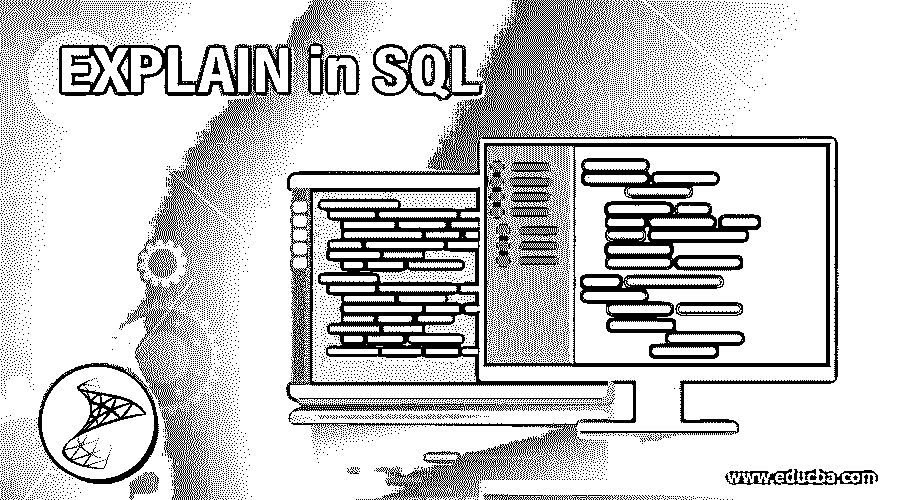

## SQL 中的解释介绍

SQL EXPLAIN 是一个可以在各种关系数据库中使用的关键字，比如 MYSQL。PostgreSQL 等。，主要用于描述如何执行每个 SELECT 语句或 SQL 查询的各个部分，以及将在查询执行过程中使用的表和联接的信息。

SQL EXPLAIN 的主要目的是通过提供关于执行的每个步骤的信息来帮助开发人员调试 SQL 查询。当它与 ANALYZE 关键字一起使用时，它进一步为我们提供了执行估计的细节。例如，执行每个连续步骤需要多少时间等。

<small>Hadoop、数据科学、统计学&其他</small>

### 语法和参数

编写 SQL 解释查询的基本语法如下:

`EXPLAIN SELECT  column_names(s) FROM table_name;`

EXPLAIN 关键字本身不会运行 SQL 语句。如果您想检查 EXPLAIN 信息中给出的统计数据是如何实现的，您可以将 ANALYZE 关键字与 EXPLAIN 一起使用。相同的语法如下所示。

`EXPLAIN ANALYZE SELECT  column_names(s) FROM table_name;`

#### 因素

上述语法中使用的参数是:

*   **EXPLAIN:** 关键字获取与 SQL 查询执行过程相关的所有信息。
*   **SELECT column _ names FROM table _ name:**要获取其执行信息的 SQL select 语句。您可以在此部分编写任何您选择的查询。

随意添加其他关键字和子句，如 WHERE、HAVING、GROUP BY、ORDER BY 等。在您的选择查询中。接下来，我们将尝试更详细地理解 EXPLAIN 关键字。

### 用 SQL 实现 EXPLAIN 的示例

这里有一些例子来理解 SQL 中的 EXPLAIN。我们已经使用 PostgreSQL 执行了以下示例。考虑下面的 Employees1 表:

**代码:**

`select * from Employees1;`

**输出:**

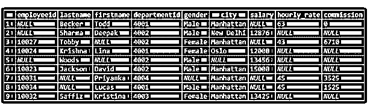

#### 示例#1

一个基本的 SQL 查询来说明解释和分析关键字的用法。

**代码:**

`EXPLAIN SELECT * FROM Employees1;`

**输出:**

我们可以在上面的语句中观察到，EXPLAIN 为我们提供了关于 SQL 查询是如何执行的信息。它还为我们提供了估计的成本、将要扫描的行数和宽度。但上述统计数字并不是实际数字。为了达到这个目的，我们将同时使用 ANALYZE 和 EXPLAIN，如下所示。

**代码:**

`EXPLAIN ANALYZE SELECT * FROM Employees1;`

**输出:**

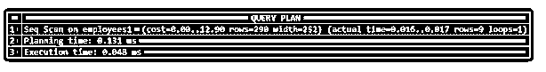

这将返回顺序扫描的实际时间、行数和查询进行的迭代次数。

#### 实施例 2

带有 WHERE 子句的 SQL 查询，用于说明解释和分析关键字的用法。

**代码:**

`EXPLAIN SELECT * FROM Employees1 WHERE city = 'Manhattan';`

**输出:**

**解释:**在上面的例子中，我们可以看到解释为我们提供了在查询执行过程中将要执行的所有步骤的信息。首先，对“employees”表进行顺序扫描，然后对“city”列进行筛选。我们还对这次行动的估计费用有了一些了解。

接下来，让我们尝试使用“ANALYZE”关键字执行相同的查询。

**代码:**

`EXPLAIN ANALYZE SELECT * FROM employees1 WHERE city = 'Manhattan';`

**输出:**

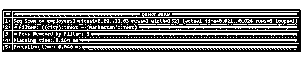

在上图中，我们可以看到查询计划有两个步骤，顺序扫描和过滤以及它们的估计和实际执行成本。它还向我们显示了过滤器删除的行数。

#### 实施例 3

带有 ORDER BY 子句的 SQL 查询，用于说明解释和分析关键字的用法。

**代码:**

`EXPLAIN SELECT * FROM employees1 WHERE city = 'Manhattan'
ORDER BY employeeid;`

**输出:**

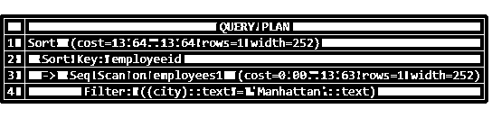

现在我们可以清楚地看到，查询执行过程中涉及到三个步骤，即排序，顺序扫描，以及后面的过滤器。感觉上可能是先排序，然后是其他语句。但这不是真的，实际上，排序是主要步骤，它试图从顺序扫描中提取数据。

现在让我们尝试使用“ANALYZE”关键字执行相同的查询。

**代码:**

`EXPLAIN ANALYZE SELECT * FROM Employees1 WHERE city = 'Manhattan'
ORDER BY employeeid;`

**输出:**

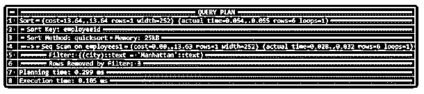

**说明:**使用 ANALYZE 关键字后，我们可以清楚地看到，排序是使用“quicksort”作为排序算法，使用“employeeid”作为关键字进行的，占用了“25 KB”的内存空间。像往常一样，它为我们提供了每个步骤的实际执行时间的进一步信息，以及整个查询的总运行时间。

到目前为止，如果您足够细心，您可能已经注意到，随着 SELECT 语句中子句数量的增加，步骤的数量也会增加。最后，让我们来看看执行 GROUP BY 时会发生什么。

#### 实施例 4

SQL 查询用 GROUP BY 子句来说明解释和分析关键字的功能。

**代码:**

`EXPLAIN SELECT  city, count(employeeid)
FROM employees1
GROUP BY city;`

**输出:**

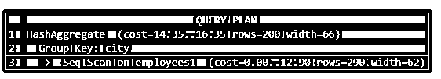

**代码:**

`EXPLAIN ANALYZE SELECT  city, count(employeeid)
FROM employees1
GROUP BY city;`

**输出:**

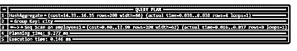

考虑下表中的下一个例子

**代码:**

`select * from department1;`

**输出:**

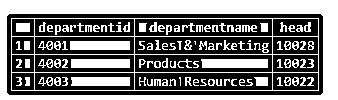

#### 实施例 5

SQL 查询用表连接来说明解释和分析关键字的功能。

**代码:**

`EXPLAIN SELECT e.employeeid,d.departmentname,e.city
FROM employees1 as e INNER JOIN department1 as d
ON e.departmentid = d.departmentid::int;`

**输出:**

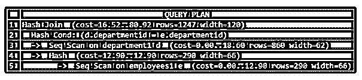

现在让我们尝试使用“ANALYZE”关键字执行相同的查询。

**代码:**

`EXPLAIN ANALYZE SELECT e.employeeid,d.departmentname,e.city
FROM employees1 as e INNER JOIN department1 as d
ON e.departmentid = d.departmentid::int;`

**输出:**

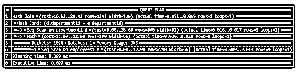

在上面的例子中，我们可以观察到有多个缩进。这些凹痕告诉我们哪一步进入另一步。我们可以假设这些步骤是自下而上的。因此，顺序扫描被输入到哈希函数中，哈希函数进一步被输入到顺序扫描中。查询计划中提到的成本和实际时间通常是针对所有行的。

### 结论

正如我们在本文中看到的，EXPLAIN 关键字在调试复杂的 SQL 查询时非常有用。它有助于获得查询计划的所有信息。但是，应该注意的是，这些统计数据是估计的，解释不运行查询。

### 推荐文章

这是一个用 SQL 解释的指南。在这里，我们讨论一个用 SQL 解释的介绍，用语法和相应的例子来理解。您也可以浏览我们的其他相关文章，了解更多信息——

1.  [Tableau 中的自定义 SQL](https://www.educba.com/custom-sql-in-tableau/)
2.  [SQL 子句](https://www.educba.com/sql-clauses/)
3.  [PostgreSQL UNION ALL](https://www.educba.com/postgresql-union-all/)
4.  [SQL 中的事务](https://www.educba.com/transactions-in-sql/)

