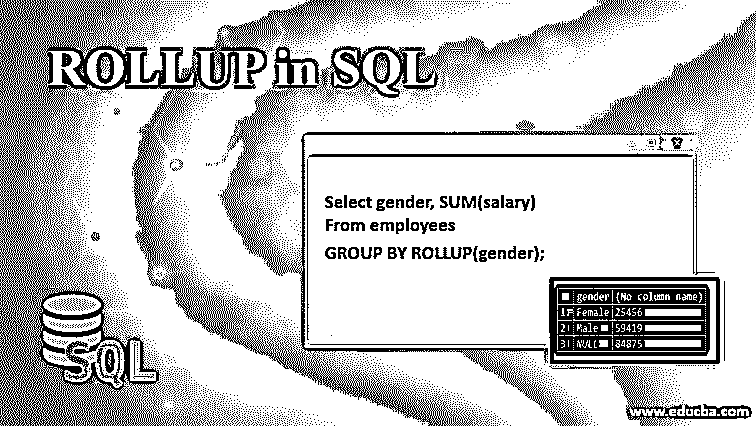
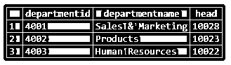
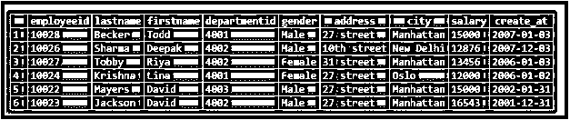
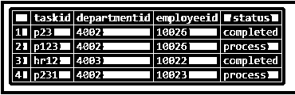
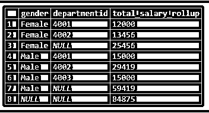
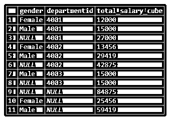
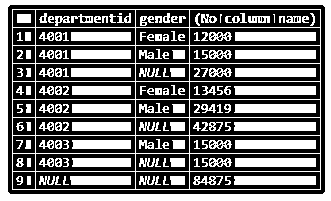
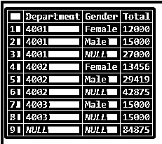
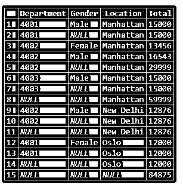
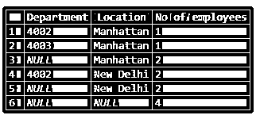

# SQL 中的汇总

> 原文：<https://www.educba.com/rollup-in-sql/>

## SQL 汇总简介

SQL ROLLUP 是 GROUP BY 子句的子子句或扩展，它可以在多个轴上聚合值和准备摘要报告，并通过在只使用一个查询的情况下沿列的层次结构创建多个分组集来提供更详细的分析。

SQL ROLLUP 或多或少类似于 SQL CUBE 元数据，因为它们都使用多个分组集来汇总数据值，但它们的不同之处在于，CUBE 创建所有可能的数据组，而 ROLLUP 则沿着假定的数据列层次结构来创建分组集。因此，与使用 CUBE 相比，使用 ROLLUP 时的组数较少。

<small>Hadoop、数据科学、统计学&其他</small>

**Note:** A SQL ROLLUP performs grouping along an assumed hierarchy of data columns.

### 句法

创建 SQL 汇总的基本语法如下:

`SELECT aggregate_function {MIN,MAX,SUM,COUNT,AVG}(column_name),
column_name1, column_name2, column_name3,...
FROM table_name
GROUP BY
ROLLUP(column_name1,column_name2,column_name3,...);`

#### 因素

*   **选择:**用于从数据库中选择需要的数据。
*   **Aggregate_function {MIN，MAX，SUM，COUNT，AVG}:** 指定用于汇总列中数据的聚合函数。
*   **column_name:** 指定将要执行聚合操作的列名。
*   **列名 1，列名 2，列名 3:** 指定要创建组集的列名。
*   **FROM:** 用于指定要从哪个来源提取数据。
*   **分组依据:**用于将具有相似值的行分组为汇总行。
*   **ROLLUP (column_name1，column_name2，column_name3):** 用于沿多个轴对数据进行分组。以分层方式指定相同的列名，因为 ROLLUP 将以分层方式形成组。

在上述参数中，所有参数都是强制性的。您可以根据需要使用连接、WHERE、ORDER BY 和 HAVING 子句。

接下来，我们将详细讨论上述 SQL ROLLUP 子子句。

### SQL 汇总子子句

为了更好地理解这个概念，我们将借助于三个表:雇员(包含所有雇员的个人详细信息)、部门(包含部门 id、名称及其负责人等详细信息)和任务(包含项目的详细信息和状态)。

“部门”表中的数据如下所示:

“雇员”表中的数据如下:

“任务”表中的数据如下所示:

### 在 SQL 中实现 ROLLUP 的示例

这里有几个例子可以更详细地理解 SQL ROLLUP。

#### 示例#1

说明简单 GROUP BY、ROLLUP 和 CUBE 操作之间差异的 SQL 查询。

##### 案例 1

**代码:**

`select gender, SUM(salary)
From employees
GROUP BY gender;`

**输出:**

##### 案例 2

**代码:**

`select gender, SUM(salary)
From employees
GROUP BY ROLLUP(gender);`

**输出:**

在第一种情况下，我们只是使用一个简单的 GROUP BY 子句来汇总雇员的工资和性别维度。

在第二种情况下，我们将使用 ROLLUP 子类和 GROUP BY 子句来执行相同的任务。在第二个例子中，我们可以注意到一个额外的行显示了一个额外的未命名组，显示了雇员的总工资，而不考虑他们的性别。

#### 实施例 2

说明带有 ROLLUP 的 GROUP BY 和带有 CUBE 操作的 GROUP BY 之间差异的 SQL 查询。

##### 案例# 1–分组依据和汇总

**代码:**

`select gender,departmentid, SUM(salary) as 'total_salary_rollup'
From employees
GROUP BY ROLLUP(gender,departmentid);`

**输出:**

##### 案例 2——使用多维数据集进行分组

**代码:**

`select gender,departmentid, SUM(salary) as 'total_salary_cube'
From employees
GROUP BY CUBE(gender,departmentid);`

**输出:**

在上面的例子中，我们可以看到 CUBE 给出了所有可能的组，而 ROLLUP 只给出了层次上可能的组。

#### 示例 3

汇总每个部门和性别的员工工资。

##### 案例 1

**代码:**

`SELECT departmentid, gender, SUM(salary)
From employees
GROUP BY ROLLUP(departmentid,gender);`

**输出:**

让我们使用上面示例中的 CASE 和 GROUPING 函数来重命名空值。我在所有这些例子中使用的都是 SQL SERVER，所以 MYSQL 和 PostgreSQL 的语法可能会稍有不同。

##### 案例 2

**代码:**

`SELECT departmentid AS 'Department', gender AS 'Gender', SUM(salary)
AS 'Total' FROM employees GROUP BY ROLLUP(departmentid,gender);`

**输出:**

#### 实施例 4

汇总每个城市、部门和性别的员工工资。

**代码:**

`SELECT departmentid AS 'Department', gender AS 'Gender', city AS 'Location', SUM(salary) AS 'Total'
FROM employees GROUP BY ROLLUP(city,departmentid,gender);`

**输出:**

#### 实施例 5

汇总每个城市和部门中当前从事某个项目的员工人数。

**代码:**

`SELECT e.departmentid AS 'Department', e.city AS 'Location', COUNT(e.employeeid) as 'No of employees'
FROM employees as e INNER JOIN tasks as t
ON e.employeeid = t.employeeid
GROUP BY ROLLUP(e.city,e.departmentid);`

**输出:**

### 结论

SQL ROLLUP 是 GROUP BY 的扩展，用于沿列的层次结构对数据进行分组。它非常有助于沿多个轴汇总数据。因此，有助于加快数据分析和报告。

### 推荐文章

这是一个 SQL 中的 ROLLUP 指南。这里我们讨论 SQL 中 ROLLUP 的语法和参数，以及三个子句表和用代码和输出实现的示例。您也可以浏览我们的其他相关文章，了解更多信息——

1.  [SQL 删除连接](https://www.educba.com/sql-delete-join/)
2.  [SQL 内部连接](https://www.educba.com/sql-inner-join/)
3.  [SQL 中的 TOP](https://www.educba.com/top-in-sql/)
4.  [SQL 外部连接](https://www.educba.com/sql-outer-join/)
5.  [PostgreSQL 汇总指南](https://www.educba.com/postgresql-rollup/)

