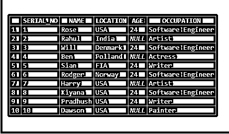
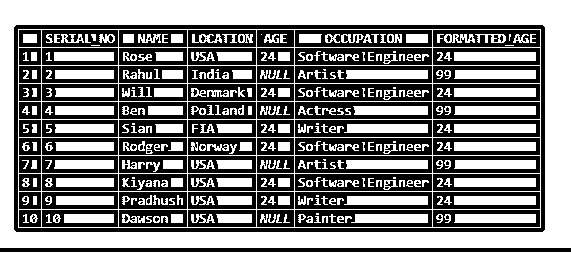
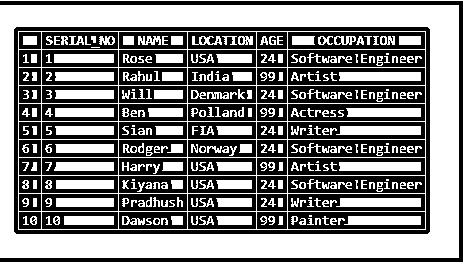
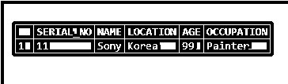
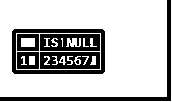
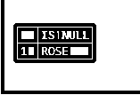
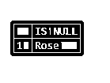

# ISNULL SQL Server

> 原文：<https://www.educba.com/isnull-sql-server/>

## ISNULL SQL Server 简介

ISNULL()函数用于当表达式值为空时需要返回特定值的情况。如果将返回表达式值，则表达式值不为空。在本主题中，我们将了解 ISNULL SQL Server。

我们在 ISNULL()函数中得到两个参数。一个是表达，一个是价值。根据表达式，它决定是返回表达式值(如果表达式值不为空)还是定义值(如果表达式值为空)。

<small>Hadoop、数据科学、统计学&其他</small>

现在，在这个会话中，让我们看看 ISNULL()函数的用法，并找到 ISNULL()函数的示例。

**语法:–**

以下是 ISNULL()函数的语法:–

`isnull(<expression>,<value>); /* - - - -  ISNULL () SYNTAX - - - */`

根据表达式，它决定是返回表达式值(如果表达式值不为空)还是定义值(如果表达式值为空)。

### SQL Server 中的 ISNULL 是如何工作的？

现在让我们看看 ISNULL()函数在 SQL server 中的用法。

`select isnull('Hello','replace value of the NULL')AS "IS NULL";`

**输出:**

这里，表达式值不为空，因此返回实际值。

`select isnull(NULL,'replace value of the NULL')AS "IS NULL";`

**输出:**

这里，表达式值为 NULL，因此返回替换值。

现在让我们在一个表中应用 ISNULL()函数。

**创建表格:–**

`CREATE TABLE test_NULL
(
SERIAL_NO INT
,NAME VARCHAR(20)
,LOCATION VARCHAR(20)
, AGE INT
, OCCUPATION VARCHAR(20)
)`

现在让我们将数据插入表中:–

`INSERT INTO TEST_NULL VALUES (1,'Rose','USA', 24,'Software Engineer');
INSERT INTO TEST_NULL VALUES (2,'Rahul','India',NULL,'Artist');
INSERT INTO TEST_NULL VALUES (3,'Will','Denmark', 24,'Software Engineer');
INSERT INTO TEST_NULL VALUES (4,'Ben','Polland',NULL,'Actress');
INSERT INTO TEST_NULL VALUES (5,'Sian','FIA', 24,'Writer');
INSERT INTO TEST_NULL VALUES (6,'Rodger','Norway', 24,'Software Engineer');
INSERT INTO TEST_NULL VALUES (7,'Harry','USA',NULL,'Artist');
INSERT INTO TEST_NULL VALUES (8,'Kiyana','USA', 24,'Software Engineer');
INSERT INTO TEST_NULL VALUES (9,'Pradhush','USA', 24,'Writer');
INSERT INTO TEST_NULL VALUES (10,'Dawson','USA',NULL,'Painter');`

让我们选择该表，下面显示输出行:–

`select * from TEST_NULL;`

在上面的输出中，您可以看到有几行人的年龄为空。如果下面的语句中没有提到年龄，我们可以插入默认值 99，而不是输入 NULL 值。

`SELECT *,ISNULL(AGE, 99)AS "FORMATTED_AGE" FROM TEST_NULL;`

**输出:**

NULL 值被替换为默认值 99。

如果要用相同的值更新现有的表，请使用下面的语句:–

`UPDATE TEST_NULL
SET AGE =ISNULL(AGE, 99);
SELECT*FROM TEST_NULL;`

**输出:**

我们可以在 insert 语句以及下面的语句中使用该函数:–

`INSERT INTO TEST_NULL VALUES (11,'Sony','Korea',ISNULL(NULL, 99),'Painter');`

让我们快速选择提到的行。将保存 99 值，而不是空值。

`SELECT * FROM TEST_NULL WHERE SERIAL_NO = 11;`

截图也是一样的:–

### ISNULL SQL Server 的示例

下面是提到的例子:

#### 示例#1

现在让我们看看 ISNULL()函数在 SQL server 中的用法。

**代码:**

`select isnull('234567','replace value of the NULL')AS "IS NULL";`

**输出:**

#### 实施例 2

在上面的表达式中，这里的值不为空，因此返回实际值。

**代码:**

`select isnull(NULL,'replace value of the NULL')AS "IS NULL";`

**输出:**

#### 实施例 3

在上面的表达式中，值为 NULL，因此返回替换值。

**代码:**

`select isnull('ROSE','Dawson')AS "IS NULL";`

**输出:**

#### 实施例 4

在上面的表达式中，value 不为 NULL，因此返回实际值。

**代码:**

`select isnull(NULL,'Rose')AS "IS NULL";`

**输出:**

在上面的表达式中，值为 NULL，因此返回替换值。

### 结论

ISNULL()函数用于当表达式值为空时需要返回特定值的情况。如果表达式值不为空，那么将返回表达式值。

我们在 ISNULL()函数中得到两个参数。一个是表达，一个是价值。根据表达式，它决定是返回表达式值(如果表达式值不为空)还是定义值(如果表达式值为空)。

### 推荐文章

这是一个 ISNULL SQL Server 指南。在这里，我们讨论 SQL Server 中的 ISNULL 是如何工作的，并使用相应的示例和表达式，以便于理解。您也可以阅读以下文章，了解更多信息——

1.  [SQL IN 运算符](https://www.educba.com/sql-in-operator/)
2.  [SQL INSTR()](https://www.educba.com/sql-instr/)
3.  [SQL Server 子串](https://www.educba.com/sql-server-substring/)
4.  [SQL Server 数据类型](https://www.educba.com/sql-server-data-types/)

