# SQL 导入 CSV

> 原文：<https://www.educba.com/sql-import-csv/>

## SQL 导入 CSV 简介

在 MySQL 中，我们将数据以表格的形式存储在数据库中。很多时候，有必要从其他格式如 CSV、JSON 或 SQL 格式获取存储在 MySQL 数据库表中的数据。这通常是我们在多个公司和个人之间进行数据传输和共享时的需求。

如果我们必须从其他平台(如 google docs、open office 或 Microsoft Excel)导入数据，以便将结果集进一步分析到 MySQL 的表中，那么我们可以这样做，并通过对导入的数据执行各种操作来得出必要的统计数据，从而得出某些结论。

<small>Hadoop、数据科学、统计学&其他</small>

在本文中，我们将了解如何使用命令行 MySQL shell，利用 LOAD DATA INFILE 语句将数据从任何 CSV 格式导入 MySQL 数据库及其表内容，并且在使用 MySQL Workbench 编辑器时，我们可以借助一个示例将数据从 CSV 格式导入 MySQL 表。

### 使用命令行 MySQL 查询导入

在从 CSV 格式导入之前，我们需要确保数据库中存在具有相同数量和类型的列的表，我们试图为其导入具有匹配列的数据，并且用户必须具有该表的插入权限和文件权限。

假设我有一个在 Microsoft Excel 或 LibreOffice Calc 中创建的 CSV 文件，名为 R_developers_cmd.csv，其中包含以下内容，如下所示

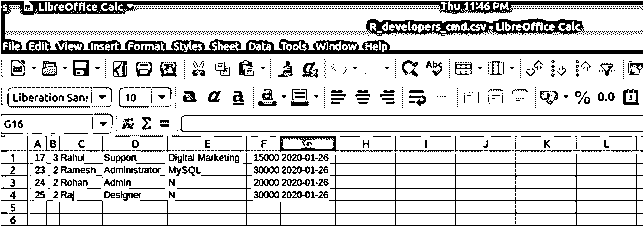

让我们在数据库 educba 中创建开发人员的命名表，该表将保存所有上述数据

`CREATE TABLE `developers` (
`developer_id` int(11) NOT NULL AUTO_INCREMENT,
`team_id` int(11) NOT NULL,
`name` varchar(100) DEFAULT NULL,
`position` varchar(100) DEFAULT NULL,
`technology` varchar(100) DEFAULT NULL,
`salary` int(11) DEFAULT NULL,
`joining_date` date DEFAULT '2012-05-01',
PRIMARY KEY (`developer_id`),
UNIQUE KEY `name` (`name`)
) ENGINE=InnoDB AUTO_INCREMENT=28 DEFAULT CHARSET=latin1;`

**输出:**

要从 CSV 文件导入结果集，我们将使用如下所示的 LOAD DATA INFILE 子句

`LOAD DATA INFILE 'https://cdn.educba.com/var/lib/mysql-files/R_developers_cmd.csv'
INTO TABLE developers
FIELDS ENCLOSED BY '"'
TERMINATED BY ';'
ESCAPED BY '"'
LINES TERMINATED BY '\n';`

**输出:**

我们可以看到有四行受到影响，并且所有四行都成功插入，没有任何警告或错误。为了确认导入的 CSV 数据是否正确地插入到表中，让我们检索开发人员表的内容，并使用以下查询语句将它们与之前的 CSV 文件进行比较

`SELECT * FROM developers;`

**输出:**

### 将数据从 CSV 导入工作台的表格内容

还可以将 CSV 文件的内容导入到 Workbench 的表内容中，只需单击 import 按钮，然后指定文件的路径和名称。注意，在使用命令行的 MySQL 中，我们可以通过使用 LOAD DATA INFILE 语句将 CSV 文件的内容导入到表内容中。让我们借助一个例子来看看如何将 CSV 文件的内容导入 workbench 的表中。考虑下面的 CSV 文件，它与前面的文件同名，但内容不同，开发人员的名字是 Mahesh、Suresh、Ganesh 和 Saheeh

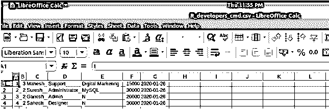

*   让我们尝试在工作台中导入这些内容。首先，我们将截断表格，以使概念更清晰和更好地理解。但是，请注意，我们可以通过以相同的方式导入已经包含记录的表中的 CSV 来添加数据，这不会对现有记录产生任何影响。以防万一，如果它们在导入时重复，那么将给出一个错误。让我们首先使用下面的语句截断开发人员的表格

`TRUNCATE TABLE developers;`

**输出:**

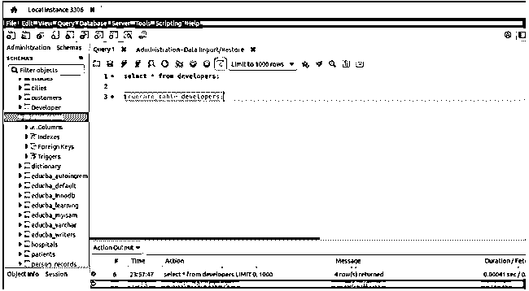

*   使用 SELECT * FROM developers 简单地选择 developers 表的内容；查询语句，在导入 CSV 文件内容之前检查其内容，在 workbench 平台中执行后，CSV 文件内容会给出以下输出

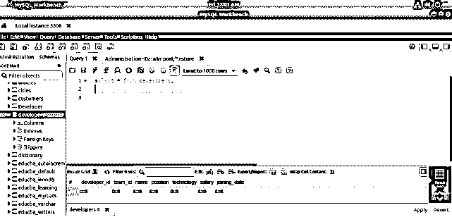

*   现在让我们从导入过程开始。正如您所看到的，在它上面的 resultset 面板中提供了一个导出/导入按钮。您必须从中选择导入按钮。将鼠标移动到“导出/导入”附近的按钮上后，它会自动在工具提示上显示是哪个按钮。单击导入按钮后，将出现以下屏幕提示

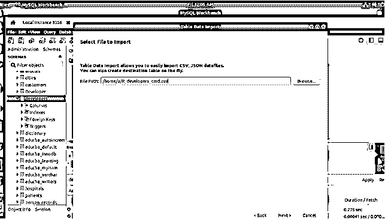

*   在这里，您需要浏览您希望导入其内容的路径和文件。该文件可以是 CSV 或 JSON 格式。我们将选择我们已经创建的 CSV 文件或开发人员，然后单击下一步按钮。当您单击“下一步”时，会出现以下屏幕提示

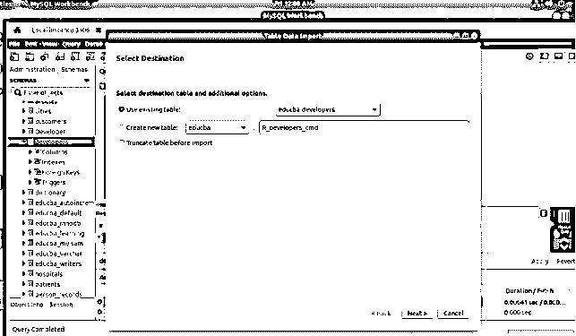

*   您将看到两个选项，即您是否希望将数据导入到现有的表中如果是，那么您必须在提供的现有表的下拉列表中提到表的名称，并且如果您希望，还需要选择是否希望在导入前截断表选项。在这里要小心。另一个选项是，您可以创建一个新表，将文件名作为表名，并将该 CSV 文件的内容导入到新创建的表中。这里，您需要在创建表之前指定是否希望删除它。选择选项后，单击“下一步”,这将产生以下输出–

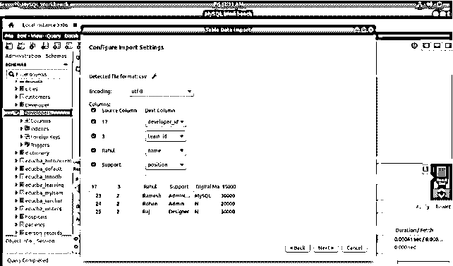

*   在这里，您可以看到 CSV 文件内容如何映射到表内容。如果您认为合适且正确，请单击“下一步”,否则根据您的要求对表格或 CSV 进行更改，然后尝试导入。点击“下一步”后，将出现以下屏幕，显示将要执行的导入流程

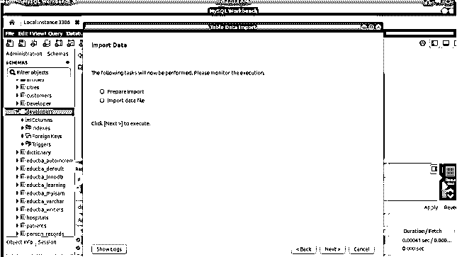

*   只需点击“下一步”,将出现如下状态更新窗口

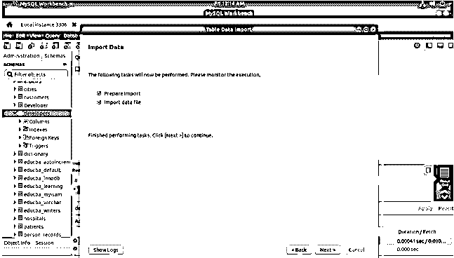

*   现在，单击 next 将出现以下屏幕，显示导入过程的结果。最后，点击“完成”完成整个过程——

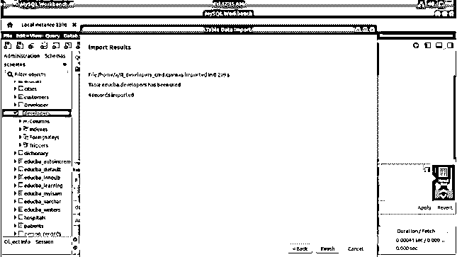

*   现在，通过执行 SELECT * FROM developers 来选择表的内容；执行查询后产生以下输出的查询语句–

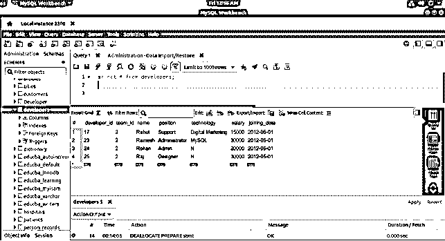

### 结论—**SQL 导入 CSV**

我们可以使用命令行、MySQL 查询语句甚至 MySQL Workbench 客户端工具中提供的各种选项来导入文件。在上述两种方法中，我们可以指定回车符、文件和行分隔符，甚至可以指定列值应该包含的值。

### 推荐文章

这是一个 SQL 导入 CSV 的指南。这里我们讨论 SQL Import CSV 的介绍，包括适当的语法和查询示例。您也可以浏览我们的其他相关文章，了解更多信息——

1.  [SQL 批量插入](https://www.educba.com/sql-bulk-insert/?source=leftnav)
2.  [SQL 中的数组](https://www.educba.com/array-in-sql/?source=leftnav)
3.  [SQL REGEXP](https://www.educba.com/sql-regexp/?source=leftnav)
4.  [SQL 中的 JSON](https://www.educba.com/json-in-sql/?source=leftnav)

