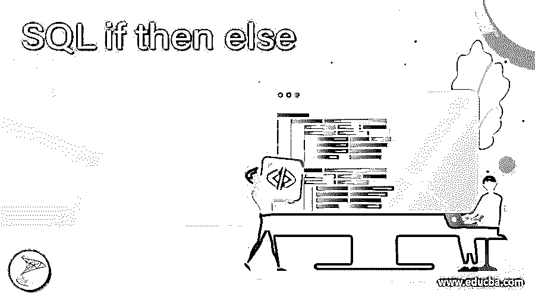
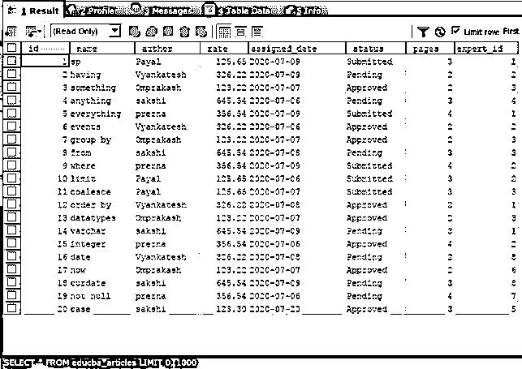
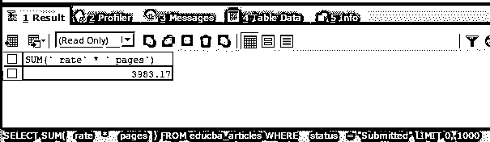
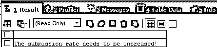
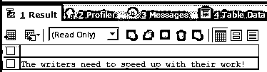
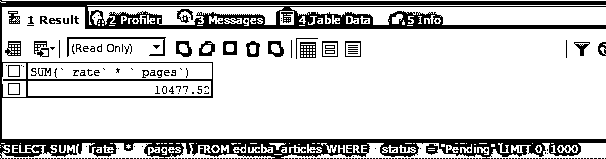
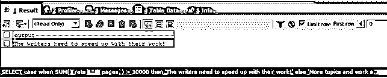
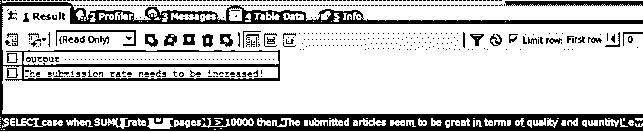

# SQL 如果然后否则

> 原文：<https://www.educba.com/sql-if-then-else/>

## SQL 简介 if then else

当处理条件语句和执行基于满足特定条件的 SQL 代码或语句时，我们可以使用 SQL 中可用的条件语句。其中一个基本且重要的功能是 if then else 语句，在该语句中，我们检查包含变量比较的表达式或条件、从查询比较中检索的数据，或者从函数或存储过程参数中检索的任何文字值或参数变量值检查。

如果条件或表达式的计算结果为 true 或可以推导为 true 值的值，则执行 BEGIN 和 END 子句之间的 If 之后或 then 子句之后提到的语句，如果条件或表达式的计算结果为 false 或类似 false 的值，则执行 ELSE 子句之后提到的语句。在本文中，我们将学习 SQL 中 if then else 语句的一些实现，通过一些例子来帮助我们在 SQL 中执行条件行为。

<small>Hadoop、数据科学、统计学&其他</small>

**语法**

if then else 语句的语法如下所示

`IF condition or expression evaluating to a boolean value
BEGIN
{ statements to be executed if the condition evaluates to true }
END
ELSE
BEGIN
{ statements to be executed if the condition evaluates to false }
END`

语法由 IF、BEGIN、END 和 ELSE 等关键字组成。除此之外，有必要在 IF 关键字之后提到最终计算为布尔值的条件或表达式。此外，如果布尔表达式或条件评估为真，则无论要执行哪个语句，它们都将在 if 关键字和表达式之后指定的 BEGIN 和 END 关键字之间被提及，并且还提及如果布尔表达式或条件评估为 false，则它们将在 then 关键字之后指定的 BEGIN 和 END 关键字之间被提及。

### 例子

让我们考虑一个名为 educba_articles 的现有表，它存在于我们的 educba 命名数据库中。我们将通过执行以下查询语句来检查表的内容和结构

`SELECT * FROM educba_articles;`

执行上述查询语句的输出如下

现在，我们必须检查已经提交的文章的总成本的总和。为此，我们将通过计算费率和页面的乘积来计算单篇文章的成本。此外，我们将使用 SUM()函数来计算总成本。以下是我们的查询语句

`SELECT
SUM(` rate` * ` pages`)
FROM
educba_articles
WHERE
` status` = "Submitted";`

执行上述查询语句的输出如下

现在，我们将使用上述语法中提到的 IF 和 ELSE 关键字来显示适当的输出——

`BEGIN
DECLARE @totalCost INT;
SELECT
@totalCost = SUM(` rate` * ` pages`)
FROM
educba_articles
WHERE
` status` = "Submitted";
SELECT @totalCost;
IF @totalCost > 10000
BEGIN
PRINT 'The submitted articles seem to be great in terms of quality and quantity!';
END
ELSE
BEGIN
PRINT 'The submission rate needs to be increased!';
END
END`

执行上述查询语句的输出如下，因为总成本不超过 10000，流程执行 else 块打印中提到的语句“需要提高提交率！”消息–

现在，假设我们根据尚未提交的待定文章执行以下语句来打印消息

`BEGIN
DECLARE @totalCost INT;
SELECT
@totalCost = SUM(` rate` * ` pages`)
FROM
educba_articles
WHERE
` status` = "Pending";
SELECT @totalCost;
IF @totalCost > 10000
BEGIN
PRINT 'The writers need to speed up with their work!';
END
ELSE
BEGIN
PRINT 'More topics and work should be allocated to the writers!';
END
END`

执行上述查询语句的输出如下

当挂起文章的总成本超过 10000 时，if 关键字中提到的表达式计算为 true，然后在输出中打印 IF 块中提到的消息。让我们执行下面的查询语句来确认待处理文章的总数，并交叉检查 IF then ELSE 语句的工作。

`SELECT
SUM(` rate` * ` pages`)
FROM
educba_articles
WHERE
` status` = "Pending";`

执行上述查询语句的输出如下

**使用案例语句**

或者，我们可以使用 CASE 语句来执行与上面在单个查询语句中显示的 IF-ELSE 关键字相同的功能，从而在单个查询中压缩实现。考虑同样的例子来打印消息“作者需要加速他们的工作！”金额超过 10000 的待决费用。我们将使用以下查询语句来实现 case 语句，以实现 SQL 中的 if else 功能

`SELECT
CASE
WHEN SUM(` rate` * ` pages`) > 10000
THEN 'The writers need to speed up with their work!'
ELSE 'More topics and work should be allocated to the writers!'
END AS output
FROM
educba_articles
WHERE ` status` = "Pending" ;`

执行上述查询语句的输出与 if-else 关键字用法的输出相同

让我们也执行 case 语句来实现我们提交文章的第一个例子——

`SELECT
CASE
WHEN SUM(` rate` * ` pages`) > 10000
THEN 'The submitted articles seem to be great in terms of quality and quantity!'
ELSE 'The submission rate needs to be increased!'
END AS output
FROM
educba_articles
WHERE ` status` = "Submitted" ;`

执行上述查询语句的输出如下

### 结论–SQL if then else

我们可以在 SQL 中使用 IF 和 ELSE 关键字，根据评估为布尔值的条件来执行语句的条件执行。或者，我们可以使用 CASE 语句在 SQL 中实现 if then else 功能。

### 推荐文章

这是一个 SQL if then else 的指南。在这里，我们讨论可以使用 CASE 语句来实现 if then else 功能和带有输出的示例。您也可以看看以下文章，了解更多信息–

1.  [SQL 删除触发器](https://www.educba.com/sql-drop-trigger/)
2.  [SQL 选择顶部](https://www.educba.com/sql-select-top/)
3.  [MySQL 交叉连接](https://www.educba.com/mysql-cross-join/)
4.  [SQL 集群](https://www.educba.com/sql-cluster/)

