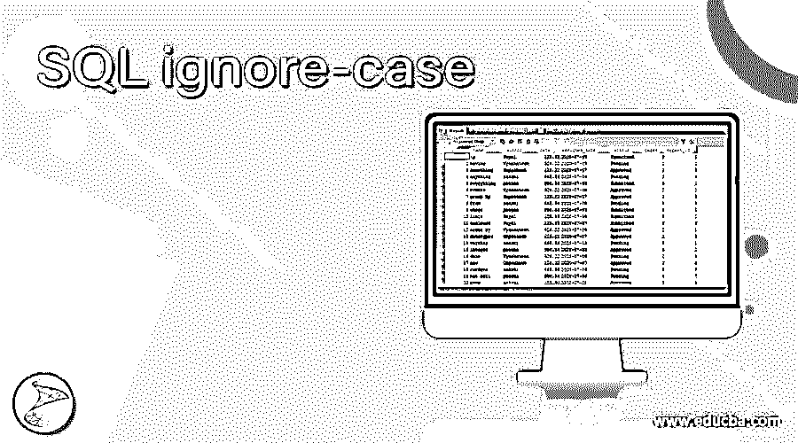
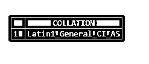
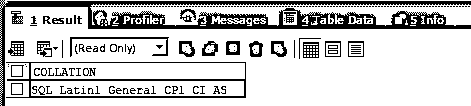
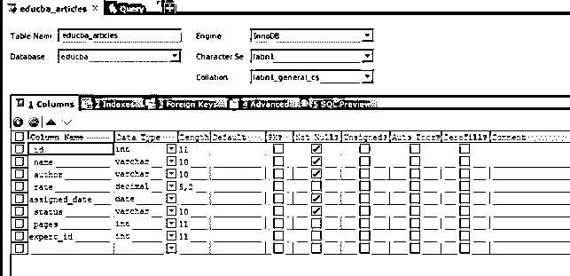
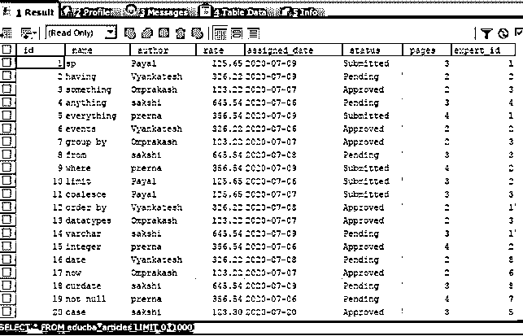
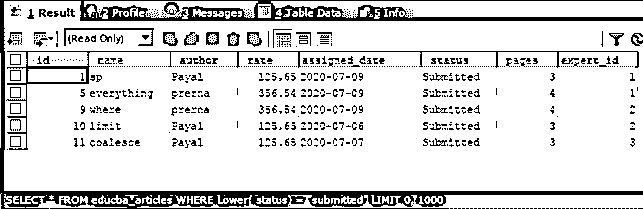
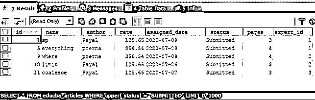
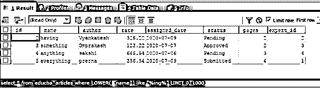
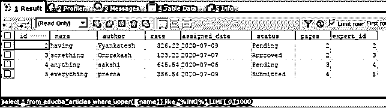

# SQL 忽略-案例

> 原文：<https://www.educba.com/sql-ignore-case/>

## SQL 忽略案例简介

SQL 区分大小写是通过用大写或小写字母指定查询语句和关键字表和列来使用它们。 [SQL 关键字](https://www.educba.com/sql-keywords/)默认设置为不区分大小写，这意味着关键字允许使用小写或大写。在 SQL 数据库服务器上，表和列规范的名称设置为不区分大小写；但是，可以通过在 SQL 中配置设置来启用和禁用它。排序规则是决定并帮助我们指定 SQL 中除关键字之外的元素是否允许不区分大小写的属性。在本文中，我们将了解如何检查确定 SQL 区分大小写的指定排序规则值，并进一步了解如何使用 lower 和 upper 函数进行查询，从而在搜索或应用限制时忽略列值的大小写。在本主题中，我们将学习 SQL ignore-case。

### 检查 SQL server 是否区分大小写

我们可以编写关键字 SELECT、FROM、WHERE、GROUP BY 等。无论是大写还是小写，因为它们在 SQL 中是不区分大小写的。关键字以外的对象，如列名、表名、视图名、触发器名、存储过程名等。可以区分大小写，也可以不区分大小写。默认情况下，它们被设置为不区分大小写。SQL server 的排序规则属性可以通过使用 SQL 的名为 Sevrverproperty()的函数进行检查，并将 collion 作为参数传递给该函数，以获取设置为该 SQL server 排序规则的值。在执行它之后，大多数情况下，您将获得如下查询语句输出所示的排序规则值——

<small>Hadoop、数据科学、统计学&其他</small>

`SELECT Serverproperty('COLLATION') AS COLLATION;`

执行上述查询语句的输出如下

排序规则值中包含 CI 或 CS。它们分别代表不区分大小写和区分大小写。在上面的输出中，我们可以看到排序规则值包含区分大小写的 CI，因此在数据库服务器上查询时，除了关键字之外的对象可以用大写或小写指定。这同样适用于关键字，因为它们允许在任何情况下输入，但大多数时候，根据约定使用全部大写是一个好习惯。

或者，也可以通过查询 SQL server 的 sys 数据库中存在的名为 databases 的表来检查 SQL database server 的排序规则属性，通过将 name 列的值作为正在检查排序规则的数据库名称的值来检查特定数据库是否区分大小写。让我们查询我的 SQL server 上名为 educba 的现有数据库，并使用名为 sys database 的 table 数据库的内容和以下查询语句检查排序规则值

`SELECT collation_name AS COLLATION
FROM sys.databases
WHERE name = 'educba';`

执行上述查询语句的输出如下，给出的排序规则值为 SQL_Latin1_General_CP1_CI_AS，其中 CI 代表不区分大小写，这允许我们通过以大写或小写指定非关键字来查询数据库

**使用 LOWER()和 UPPER()函数区分大小写，即忽略查询中的大小写。**

假设我的 educba 数据库中名为 educba_articles 的表的排序规则设置为区分大小写，如下图所示

让我们通过对表执行以下查询语句来检查表的内容

`SELECT * FROM educba_articles;`

执行上述查询语句的输出如下

现在，使用 lower 函数执行以下查询有助于检索所有提交的记录

`SELECT * FROM educba_articles WHERE LOWER(status) = "submitted";`

执行上述查询语句的输出如下

现在，我们将使用函数进行不敏感的比较，使用 UPPER 函数进行比较，如下面的查询语句所示

`SELECT * FROM educba_articles WHERE UPPER(status) = "SUBMITTED";`

执行上述查询语句的输出如下

以类似的方式，可以在 LIKE 子句中使用 UPPER()和 LOWER()函数来获取相似的记录，并进行搜索，忽略表或数据库中的大小写，该表或数据库的排序规则显示 CS 在其排序规则中区分大小写。假设我们必须找出表 educba_articles 的所有记录，表“ing”的值在其名称列中。我们可以使用 LIKE 子句搜索名称中包含“ing”值的内容，为了进一步搜索以忽略大小写，我们将首先使用 LOWER()函数。我们的查询语句如下

`SELECT * FROM educba_articles WHERE LOWER(` name`) LIKE "%ing%";`

执行上述查询语句的输出如下

现在，让我们使用 upper()函数来使用搜索工具进行忽略情况搜索。为此，我们的查询语句如下

`SELECT * FROM educba_articles WHERE UPPER(` name`) LIKE "%ING%";`

执行上述查询语句的输出如下

### 结论–SQL 忽略案例

可以为非关键字对象(如表和列)设置 SQL 区分大小写，方法是在数据库、表和列级别指定排序规则，在排序规则中提到 CI 或 CS，分别代表不区分大小写和区分大小写。如果将排序规则设置为包含不区分大小写的值的 CI，那么就没有必要使用 LOWER()或 UPPER()之类的函数来进行搜索以忽略大小写。此外，当 collation 包含 CS 时，我们可以使用 LOWER()和 UPPER()函数进行搜索并指定忽略 SQL 中的大小写。这可以在应用带有等于运算符的限制或带有相似关键字的搜索时使用，以使搜索不区分大小写，即忽略大小写的搜索或限制。

### 推荐文章

这是一个 SQL 忽略案例的指南。这里我们讨论如何检查确定 SQL 区分大小写的指定排序规则值。您也可以看看以下文章，了解更多信息–

1.  [SQL 集群](https://www.educba.com/sql-cluster/)
2.  [PostgreSQL 文本搜索](https://www.educba.com/postgresql-text-search/)
3.  [MySQL 交叉连接](https://www.educba.com/mysql-cross-join/)
4.  [SQL 删除触发器](https://www.educba.com/sql-drop-trigger/)

