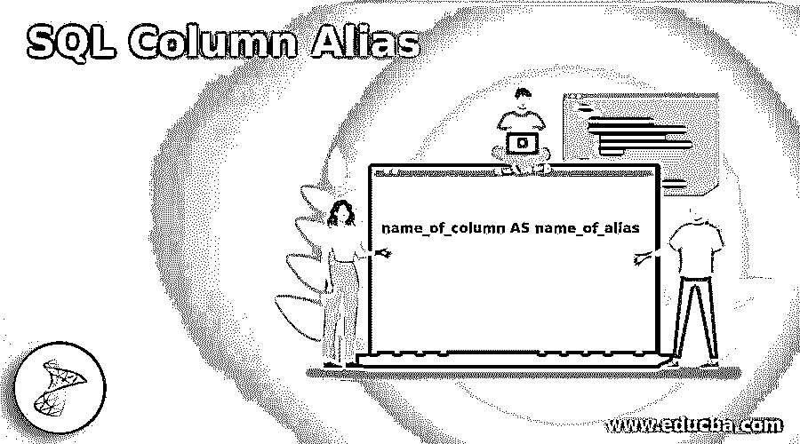
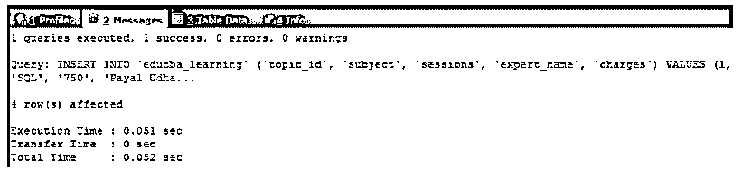
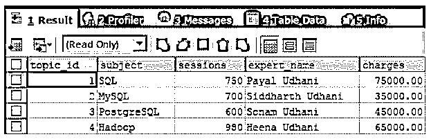
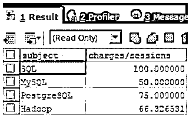
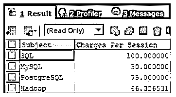
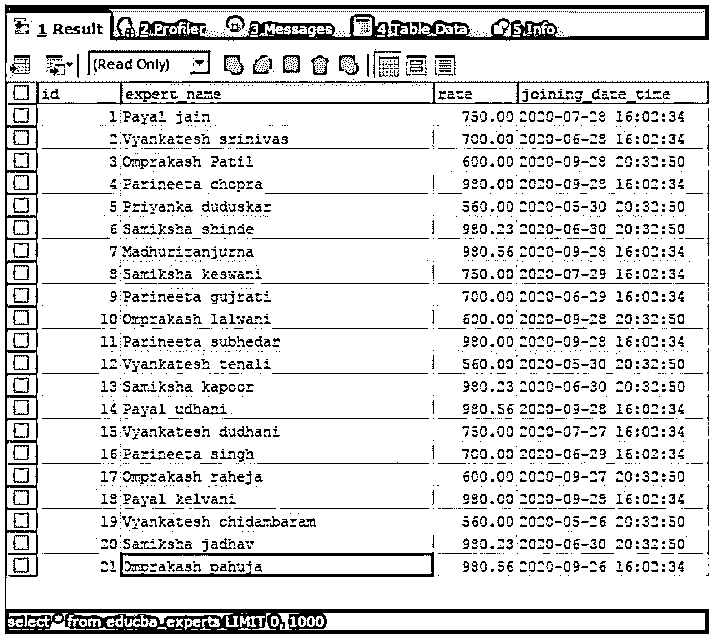
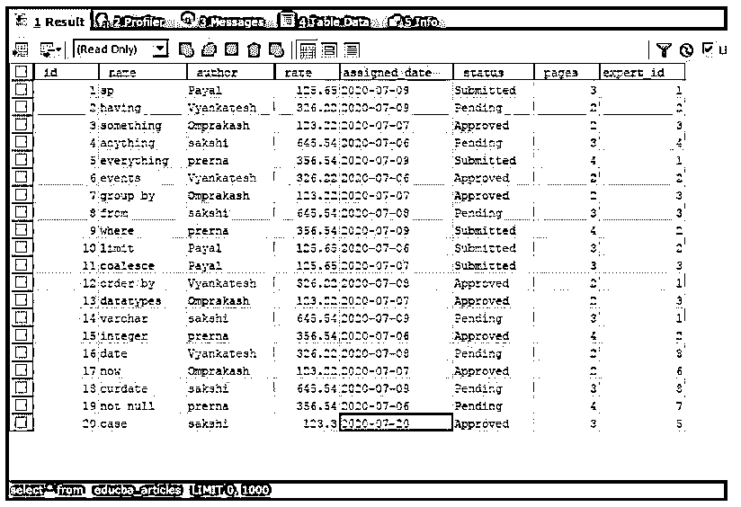
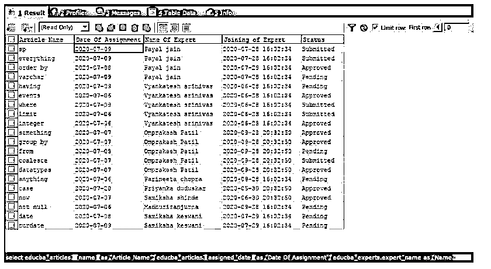

# SQL 列别名

> 原文：<https://www.educba.com/sql-column-alias/>

## SQL 列别名介绍

SQL 列别名是可以分配给 SQL 查询语句中任何对象的替代名称，包括表和列的名称，这些名称有助于使用替代的小词(别名)来访问和引用这些对象，从而便于指定。在使用别名时，我们必须小心，只考虑我们用来指定别名的名称。别名的名称应该是有意义的，并且与它被分配到的对象相关。别名的使用范围仅限于使用它的查询语句。

**语法和用法:**

<small>Hadoop、数据科学、统计学&其他</small>

`name_of_column AS name_of_alias`

其中 name_of_column 是我们必须为其分配替代名称的表名的列，name_of_alias 是替代或临时名称，使用该名称可以在查询语句中进一步引用它被分配到的列的表。我们可以为列和表使用别名。

### 列的别名

别名是替代名称，可以通过指定不同的列和列的组合，将别名分配给从查询语句中检索的值。别名也可以分配给表名。使用别名的优点是，当列名很大时，可以分配较短的名称。当使用不同联接的查询中使用的多个表具有相同名称的列时，表的别名可以帮助确定应该检索哪个表的列或应用条件。当执行聚合函数和列值的其他组合操作时，可以为检索的值分配名称，而不是执行整个表达式，这使得以有意义且更容易的方式读取结果记录以进行分析。

让我们使用下面的查询语句创建一个名为 educba_learning 的表。

**代码:**

`CREATE TABLE educba_learning (
topic_id INT NOT NULL ,
subject VARCHAR(100) DEFAULT NULL,
sessions INT DEFAULT '0',
expert_name VARCHAR(100) DEFAULT NULL,
charges DECIMAL(7,2) DEFAULT '0.00')`

让我们在 educba_learning 表中插入一些记录。

**代码:**

`INSERT INTO educba_learning (topic_id, subject, sessions, expert_name, charges) VALUES
(1, 'SQL', '750', 'Payal Udhani', 75000),
(2, 'MySQL', '700', 'Siddharth Udhani', 35000),
(3, 'PostgreSQL', '600', 'Sonam Udhani', 45000),
(4, 'Hadoop', '980', 'Heena Udhani', 65000);`

**输出:**

让我们首先通过使用下面的查询语句来检索表中的所有记录，该查询语句检索表中的所有列和行。

**代码:**

`SELECT * FROM educba_learning;`

**输出:**

现在，假设我们想要检索记录，结果必须包含主题的名称和每次会话的费用。这可以通过简单地将费用列除以会话列来计算。

**代码:**

`SELECT subject, charges/sessions FROM educba_learning;`

**输出:**

如果我们必须检索具有其他名称的列(比如“每次会话的费用”)和作为“主题”的主题，而不是费用/会话，则可以使用别名，如下所示。

**代码:**

`SELECT SUBJECT AS "Subject", charges/sessions AS "Charges Per Session" FROM educba_learning;`

**输出:**

让我们通过引用一个名为 educba_experts 的表来考虑另一个示例，该表的内容如以下查询语句的输出所示。

**代码:**

`SELECT * FROM educba_experts;`

执行上述查询语句的输出如下，包含表 educba_experts 的结构和内容。

**输出:**

正如我们所观察到的，expert_name 和 joining_date_time 列的名称太大，当在查询中使用它们时，我们可以为这些列分配别名，并通过这些别名引用它们。考虑另一个名为 educba_articles 的表，该表中存储了专家撰写的主题。educba_articles 表中对专家的引用是由名为 expert_id 的列完成的，该列存储了表 educba_experts 的 id 值，以引用哪篇文章是由哪位专家撰写的。educba_articles 表的结构和内容如以下查询语句的输出所示。

**代码:**

`SELECT * FROM `educba_articles`;`

执行上述查询语句的输出如下，其中包含表 educba_ articles 的结构和内容。

**输出:**

现在，我们想要检索文章的名称、专家的姓名、专家的加入日期和时间，以及文章被分配的日期和文章的状态。为此，我们必须对表 educba_articles 和 educba_experts 执行连接，因为专家的详细信息(如姓名和连接日期时间)存储在该表中。我们的查询语句如下所示，其中我们将使用列的别名来重命名它们，同时检索它们的值。

**代码:**

`SELECT
educba_articles. ` name` AS "Article Name",
educba_articles. `assigned_date` AS "Date Of Assignment",
educba_experts. expert_name AS "Name Of Expert",
educba_experts. joining_date_time AS "Joining of Expert",
educba_articles. ` status` AS "Status"
FROM
educba_articles
JOIN educba_experts
ON educba_articles.expert_id = educba_experts.id ;`

执行上述查询语句的输出如下，包含我们选择检索的表和列的内容，以及使用别名时修改的列标题。

**输出:**

### 结论–SQL 列别名

别名使对列的引用更加容易，因为它们提供了一种工具，可以在查询语句的范围内临时使用替代名称来引用这些对象。当列名太大或者没有意义时，别名证明是有用的。

### 推荐文章

这是一个 SQL 列别名的指南。这里我们分别讨论查询语句、代码和输出列的简介和别名。您也可以看看以下文章，了解更多信息–

1.  [SQL NOT 运算符](https://www.educba.com/sql-not-operator/)
2.  [SQL 选择顶部](https://www.educba.com/sql-select-top/)
3.  [SQL 删除触发器](https://www.educba.com/sql-drop-trigger/)
4.  [SQL 合并两个表](https://www.educba.com/sql-merge-two-tables/)

