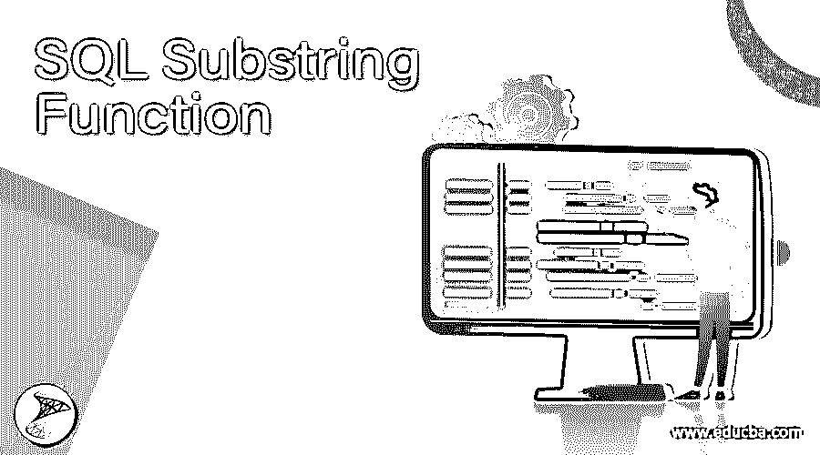
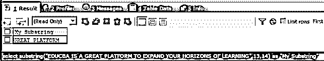
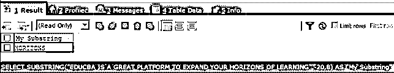
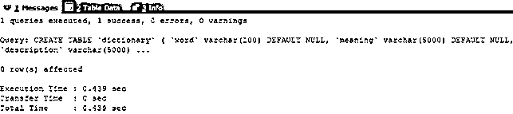
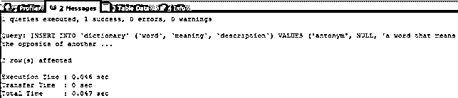
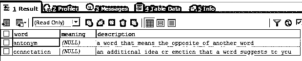
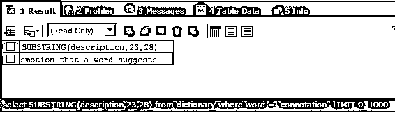

# SQL 子串函数

> 原文：<https://www.educba.com/sql-substring-function/>

## SQL 子串函数介绍

SQL substring 函数用于从原始字符串中检索从我们指定的位置开始的字符串部分，并且应该只包含我们在函数参数中指定的字符数。SQL substring 函数可以用于任何用单引号或双引号括起来的字符串值，或者存储在 varchar 类型变量中的字符串值，甚至可以用于存储字符串值、二进制、文本格式值和图像的列值。本文将研究 substring 函数的语法、它的工作原理，并在多个示例中实现该函数，以使概念更加清晰。

### 句法

SQL 中 substring 函数的语法如下所示

<small>Hadoop、数据科学、统计学&其他</small>

`SUBSTRING ( expression_value ,start_position , length )`

其中，表达式值是原始字符串，可以是字符串文字、具有 varchar 数据类型的表的列值、二进制、文本，甚至是图像。表达式值被认为是原始字符串，其一部分将使用 SQL 的 substring 函数作为子字符串进行检索。Start position 是一个整数值，它帮助[s]指定子字符串应该开始考虑的第一个字符的位置。表达式中字符的位置总是从 1 开始。

长度是正整数值，表示从原始字符串或表达式的起始位置开始添加的字符数，以检索子字符串。如果我们在函数中指定负的整数值，那么查询将返回一个错误。另外，请注意，如果起始位置和长度参数的值不应该超过原始字符串的实际长度，否则查询将生成一个错误，将表达式的起始位置+长度< =长度或值视为原始字符串。

### 子串函数的工作

每当使用 substring 函数时，都会迭代其中的所有字符，然后从第二个参数中指定的位置开始，开始生成新的字符串。从起始位置开始的所有迭代字符相加的字符数取决于第三个参数中指定的 length 参数值。一旦该长度结束，字符的迭代就停止，然后最后一个新准备的字符串作为 substring 函数的返回值返回。如果起始位置被指定为负整数，则位置计数被认为是从索引值的结尾开始，并且从字符串的结束位置到字符串的起始位置，负刻度递增。

### 例子

让我们考虑从字符串值中检索子串的第一个例子。在这个例子中，我们的原始字符串是“EDUCBA 是一个扩展您学习视野的伟大平台”，我们必须从原始字符串中检索子字符串“伟大平台”。我们可以观察到 GREAT 的 G 字符位于字符串开头第 13 个位置。因此，我们的开始位置将是 13，我们必须检索“GREAT PLATFORM”的子字符串中的字符数是 14；因此，长度参数值将为 14。我们检索子字符串的最终查询语句如下

`SELECT SUBSTRING("EDUCBA IS A GREAT PLATFORM TO EXPAND YOUR HORIZONS OF LEARNING",13,14) AS "My Substring";`

上述查询语句的执行将产生以下输出

现在，我们将尝试使用负的起始位置，而不是正的。考虑同样的原串“EDUCBA 是拓展你学习视野的绝佳平台”。现在，我们必须从中检索子字符串“HORIZONS”。如果我们使用负定位，那么字符 H 或地平线位于从末尾起的第 20 个位置，并且其中有 8 个字符。因此，我们的起始位置是-20，长度参数的值是 8。我们的查询语句如下

`SELECT SUBSTRING("EDUCBA IS A GREAT PLATFORM TO EXPAND YOUR HORIZONS OF LEARNING",-20,8) AS "My Substring";`

上述查询语句的执行将产生以下输出

现在让我们考虑列值而不是字符串文字。为此，我们将创建一个名为 dictionary 的表，其中包含三列，分别是名称、单词、描述和含义。我们将使用下面的查询语句来创建表。

`CREATE TABLE `dictionary` (
`word` varchar(100) DEFAULT NULL,
`meaning` varchar(5000) DEFAULT NULL,
`description` varchar(5000) DEFAULT NULL
);`

这在执行后给出了以下输出–

让我们在表格中插入一些记录——

`INSERT INTO `dictionary` (`word`, `meaning`, `description`) VALUES
('antonym', NULL, 'a word that means the opposite of another word'),
('connotation', NULL, 'an additional idea or emotion that a word suggests to you');`

这在执行后给出了以下输出–

我们将通过使用以下查询语句检索来检查表的内容

`SELECT * FROM dictionary;`

上述查询语句的执行将产生以下输出

现在，我们必须从字典记录的描述列中检索子字符串“单词暗示的情感”,该字典记录的单词是有含义的。为此，我们必须找到字符 e 在原始字符串中的位置，即 23。我们要检索的子字符串包含 28 个字符。我们的查询语句如下所示

`SELECT SUBSTRING(description,23,28) FROM dictionary WHERE word = "connotation";`

上述查询语句的执行将产生以下输出

### 结论

我们可以使用 substring 函数仅从原始字符串中检索字符串的一部分，并且可以通过提及开始位置和要包含在子字符串中的字符数来指定要包含在子字符串中的字符。

### 推荐文章

这是一个 SQL 子串函数的指南。在这里，我们通过多个示例来讨论函数的工作和实现，以澄清概念。您也可以看看以下文章，了解更多信息–

1.  [MySQL 拆分](https://www.educba.com/mysql-split/)
2.  [SQL NOT 运算符](https://www.educba.com/sql-not-operator/)
3.  [SQL 更新后触发器](https://www.educba.com/sql-after-update-trigger/)
4.  [PostgreSQL 描述表](https://www.educba.com/postgresql-describe-table/)

