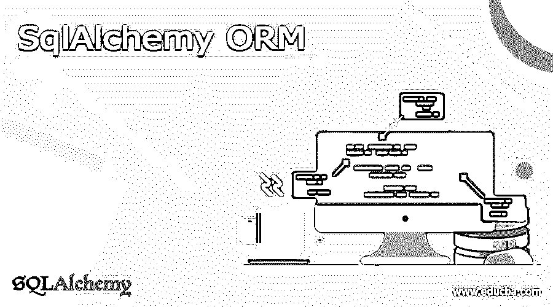
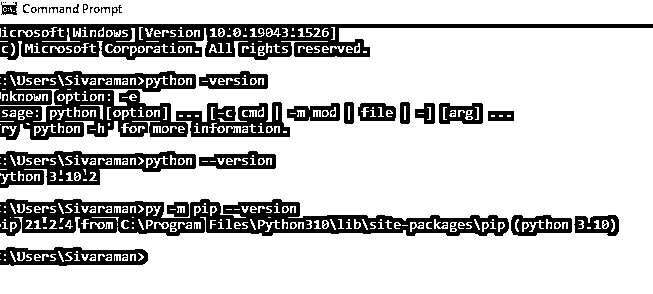
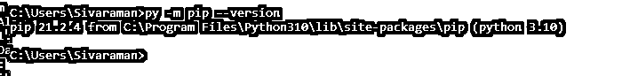
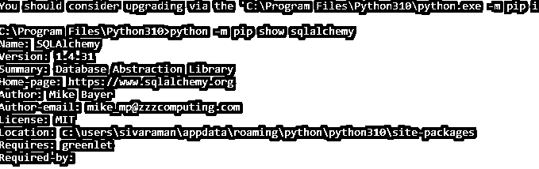
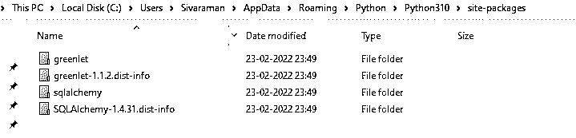
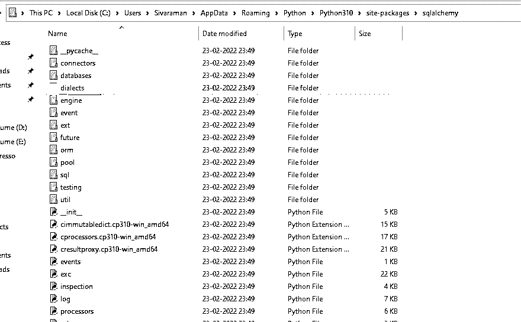
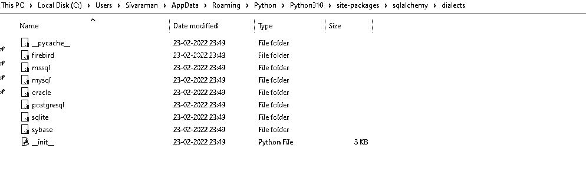
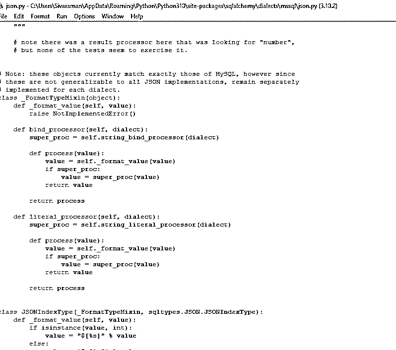

# SqlAlchemy 表单

> 原文：<https://www.educba.com/sqlalchemy-orm/>

## SqlAlchemy ORM 简介

SQLAlchemy 是 python 和 java 这样的程序员可以有效地与数据库进行通信的包之一。该库主要用于 ORM[对象关系映射器]工具，它自动转换函数调用来执行 SQL 查询。它将 Python 类翻译成在关系数据库系统上映射数据库表。

### 什么是 SqlAlchemy ORM？

可以为 python 程序员制作与数据库系统通信的包。然后大多数时候，这个库是用 ORM[对象关系映射器]工具来使用和映射的，它会自动把函数调用转换成 SQL 查询。它通过关系数据库管理系统转化为数据库表上的 python 类。SQLAlchemy 主要提供标准接口，使程序员能够通过各种数据库引擎编写与数据库无关的代码。具体来说，开发人员在处理 SQLAlchemy 应用程序之前会理解。

<small>Hadoop、数据科学、统计学&其他</small>

### 创建 SqlAlchemy 表单

基于抽象表和数据库行的大小和巨大的性能，SQL 数据库的行为类似于所有部门和集合类的对象。SQL Alchemy ORM 由一些部分组成；与小节一样，它将更侧重于 SQL Alchemy 核心的一般参考。它更侧重于关系数据库模型，在对象关系模型[ORM]组件上添加了 SQLAlchemy，该组件更侧重于由程序员开发的数据模型和类。在 SQLAlchemy 中，带有可选数据库对象关系映射的 ORM 更有能力提供 SQLAlchemy ORM，它建立在核心之上。它还包括设置层，允许用户定义的类和方法映射到每个数据库表，即使 SQL 构造和会话对象将是数据库的更持久的机制，尤其是在 SQL 表达式语言中。

此外，它将被扩展以允许 n 个 SQL 查询，这些查询必须用用户术语和定义的对象来编写和调用。这个概念最常与 ORM 工具一起使用，它将在每一节中讨论，在左边有一个浅蓝色的边框。该用户将利用核心和 ORM 类型。要创建和安装 SQLAlchemy ORM，我们应该首先在机器上安装 python，

[https://www.python.org/](https://www.python.org/)。这个官方链接将帮助在设备上安装 python。

在 python 安装期间，使用定制选项选择 python 包中的 pip。

接下来，我们需要在下面命令的帮助下将 sqlalchemy 安装到 python 文件夹中，比如

`python -m pip show sqlalchemy`

`from sqlalchemy import create_engine
from sqlalchemy.orm import sessionmaker
from sqlalchemy.ext.declarative import declarative_base
basedirectory
engine = create_engine(connection path,echo=True)
session=sessionmaker`

以上代码是在 python 脚本中创建 SQLAlchemy ORM 的基本代码。

主要需要以下类型:

1.  创建引擎
2.  创建会话
3.  创建表格

在 python 脚本中创建和使用 SQLAlchemy 需要这三个要求。

### SqlAlchemy ORM 方言

sqlalchemy 的方言将主要与几种类型进行通信，包括使用方言的数据库 DBAPI 实现。它有几个部分，包括材料参考和每个后端使用的独特注释，以及各种 DBAPIs 类型的注释。所有方言都需要安装 DBAPI 驱动程序；它包括一些方言类型，如

一种数据库系统

关系型数据库

SQLite

甲骨文，

Microsoft SQL Server

上述数据库使用方言通信在 python 中执行 SQLAlchemy ORM。

我们可以看到安装的机器对于上述区域或路径的方言。此外，我们可以看到所有的数据库。

在内部，我们可以看到每个数据库配置所需的 python 文件。

### SqlAlchemy 表单方法

它有 n 种利用 SQLAlchemy ORM 的方法，这些方法使用由查询对象构造的 select 语句。每当我们创建并调用 return 一个新的查询对象时，它还提供生成式接口。主要地，查询对象更多地最初是通过使用 query()方法生成的，

`Variable name=session.query(mapped class)`

下面是一些方法，

1.  **Add_entity():** 这是用来添加与数据库列结果相映射的实体的方法之一。
2.  **Count():** 这个方法有助于计算查询返回的行数。
3.  **Filter():** 使用查询执行 SQL 表达式；此时，过滤方法应用查询副本的过滤条件或标准。
4.  **Get():** 我们可以获得标识符的主键，以提供对用户会话映射的直接访问。
5.  **Join():** 我们已经知道了 SQL 连接，所以当我们使用这种方法时，SQLAlchemy 将根据查询对象标准创建 SQL 连接，并真正应用以查询格式返回结果。

### SqlAlchemy ORM 类

SQLAlchemy ORM 类是一个用户定义的 python 类，它连接数据库表并创建这些特定类的实例。每个类在这里都有单独的行；类表示包含系统的实例或对象，该系统透明地同步对象和相关行之间的所有更改。类可以用作声明性系统，它属于基类的范畴，基类维护与命名为声明性基类的基类相对应的表。从 sqlalchemy . ext . declarative import declarative _ base 使用此导入，我们可以声明和利用类和对象。

**语法:**

`Class _name(object):
def _method(parameter1, parameter2):
----some logic codes depends upon the requierment---`

上面的截图是已经在 python 方言上创建的初级类程序，比如 MYSQL json.py 程序。

### 结论

其他 ORM 工具的许多比较包括关系数据库管理系统和 ORM 对象。但是在每一种情况下，我们使用不同的技术来适应更大的差异，并根据用户的决定来执行编程语言中的操作。

### 推荐文章

这是一个 SqlAlchemy ORM 的指南。这里我们讨论介绍，如何创建 SqlAlchemy ORM 和方言，以及方法和类。您也可以看看以下文章，了解更多信息–

1.  [SQL 执行](https://www.educba.com/sql-execute/)
2.  [SQL 性能调优](https://www.educba.com/sql-performance-tuning/)
3.  [PostgreSQL 数据库链接](https://www.educba.com/postgresql-dblink/)
4.  [MySQL COALESCE()](https://www.educba.com/mysql-coalesce/)

