# SQLAlchemy 原始 SQL

> 原文：<https://www.educba.com/sqlalchemy-raw-sql/>

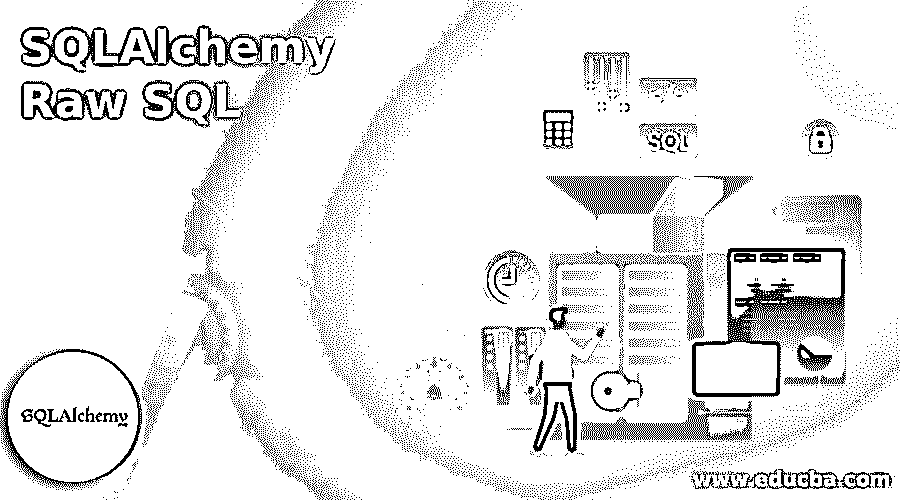


## SQLAlchemy 原始 SQL 简介

SQLAlchemy Raw SQL 是一个工具包，可以使用 python 编程语言构建，具有高级功能，如设计和管理高质量和高性能的数据库。它还将探索和深入研究 sql 语句和查询的主要类型；它将需要更舒适的语言，如 python 脚本来执行从 UI 到后端的用户操作。

### 什么是 SQLAlchemy 原始 SQL？

SQLAlchemy Raw toolkit 是一个内置特性，它将使用数据库处理用户数据事务。它将被所有数据库驱动程序和所需的导入包(如方法、类和其他默认关键字)所接受和满足。所有其他所需的软件包将与指定的模块一起导入，以便可以轻松地访问它们来执行用户数据操作，并且主要是对关键字、密码等数据进行加密。当我们加密时，数据是安全可靠的。如果我们想解除加密，我们可以使用解密技术来恢复原始数据。

<small>Hadoop、数据科学、统计学&其他</small>

### 使用 SQLAlchemy 原始 SQL

按照基于 python 的编程语言，使用预定义的库调用和执行 API，并且需要其他内置函数来开始安装 sqlalchemy 库。安装完成后，将使用基于 python 的脚本代码创建和执行操作，并且可以通过 sqlalchemy 数据库引擎轻松访问其他预定义模块。此外，create_engine 包将主要与整个数据集一起导入和利用；导入许多模块的操作将在新表中创建和执行。不仅是为了创建表，还需要附加模块来访问和执行更多需求的其他用户操作。

#### 创建表格

创建表对于构建 sqlalchemy raw 工具来说是非常重要的，它的基本功能更加复杂。数据库中的任何表列都将被映射到已经在 sqlalchemy 上配置的特定属性。表达式是根据用户输入执行和自动触发属性或列值的另一个重要部分。它将通过使用客户端和服务器端脚本语言进行验证。

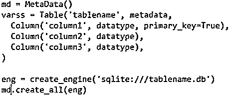


在上面的屏幕截图中，我们可以首先创建元数据来初始化包含表格行和列的表格事件。然后，我们可以声明新的变量，在元数据的帮助下创建表，并添加额外的列来计算 n 个表列以及数据类型。使用数据库引擎，我们可以为所需的列连接数据库，并使用 create_engine()和 create_all()方法调用必要数量的数据库驱动程序和其他 util 包。在 table()方法中，我们可以将表名作为必需的输入，完成后，当我们检查将表列作为视图处理并在彼此之间展开数据的模块时，表将彼此匹配。

接下来，我们可以使用下面的场景执行 sql 语句。

#### 执行 SQL 语句

这是主要用于数据库执行部分的其他方法之一。另一个原始 sql 使用带有文本模块的 sqlalchemy，这些文本模块将通过使用数据库引擎导入和连接，数据库引擎已经创建为数据库实例，它在对数据库执行 sql 查询之前定义文本 sql 语句。

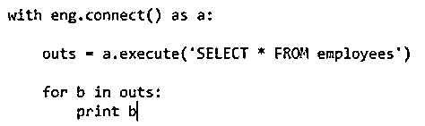


我们可以看到上面的截图；导入 sqlalchemy 包后，数据库引擎应该与后端数据库连接，后端数据库位于已经与引擎创建相关联的所需驱动程序上。之后，我们可以借助引擎实例(如 eng.connect())调用 connect()方法。它将被称为名为“a”的单独变量，然后我们可以通过使用实例来执行()方法，它将像 outs 一样存储在单独变量上。最后，我们可以使用条件循环语句来检索和迭代这些值，比如迭代它们并将它们打印在控制台屏幕上。

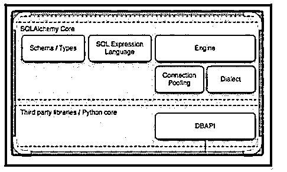


sqlalchemy 核心是核心部分，将在数据库模式和类型之间进行计算。接下来，它将被移动到 sql 表达式语言，然后它将前进到引擎。一旦连接被执行，它就验证连接池和方言是引擎的两个基本特性。如果我们想要验证并包含第三方库，可能是 DBAPI 中基于 Python 的包。

### SQLAlchemy 原始 SQL 的示例

下面提到了不同的例子:

#### 示例#1

**代码:**

```
from sqlalchemy import create_engine
eng = create_engine('sqlite:///Mar9.db', echo = True)
with eng.connect() as a:
outs = a.execute('SELECT * FROM employees')
ress = outs.fetchone()[0]
print "Welcome To My Domain: %s" % res
for b in outs:
print b
```

**输出:**

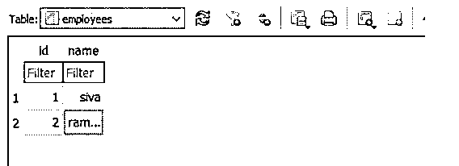


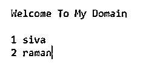


在上面的例子中，我们可以创建原始数据 sql 查询。

但是，首先，我们可以导入所需的 sqlalchemy 包以及数据库驱动程序和所需的文件。

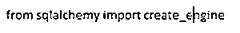


使用 create_engine()方法创建数据库引擎，以在此处创建数据库引擎；我使用 sqlite 将 UI 数据连接到后端。

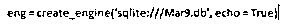


将成功创建数据库引擎；然后，我们可以创建局部变量，调用默认的连接方法，并将它存储在一个单独的变量中。最后，控制台屏幕上会显示同样的内容。

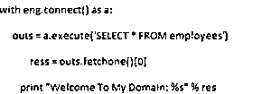


使用 for 循环在所需循环条件的帮助下迭代值。

#### 实施例 2

**代码:**

```
from sqlalchemy import create_engine
from sqlalchemy.sql import text
eng = create_engine('sqlite:///Mar9.db', echo = True)
with eng.connect() as connec:
connec.execute(text('DROP TABLE IF EXISTS employees'))
connec.execute(text('''CREATE TABLE employees(Id INTEGER PRIMARY KEY,
Name TEXT)'''))
x= ( { "Id": 1, "Name": "Sivaraman" },
{ "Id": 2, "Name": "raman"},
{ "Id": 3, "Name": "arun" },
{ "Id": 4, "Name": "sanjay" },
{ "Id": 5, "Name": "brandon" },
{ "Id": 6, "Name": "Chidramabam"},
{ "Id": 7, "Name": "Hogen" },
{ "Id": 8, "Name": "Vietnamvidusundaram"}
)
for y in x:
connec.execute(text("""INSERT INTO employees(Id, Name)
VALUES(:Id, :Name)"""), **y)
```

**输出:**

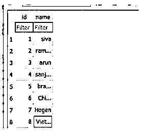


在第二个例子中，与前面的例子相似，我们必须导入所有需要的包并连接数据库。

此外，我们还在 sqlalchemy 导入中添加了文本包。


其余代码和功能与之前相同；我们创建了变量，并在默认函数中调用了相同的变量。

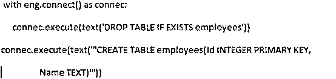


DROP 关键字用于检查和验证表条件；如果已经创建，它将删除现有的表并创建一个新表。

最后，我们可以使用 insert query 语句和 for 循环迭代根据需求插入表值。

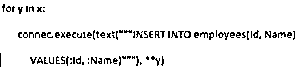


### 结论

SQLAlchemy 具有许多用于执行数据操作的特性和功能；其中，它拥有处理大量数据所需的工具数量。这将计算数据库性能，而 sqlalchemy raw 等其他调优顾问是优化数据库查询和实现基本 sql 语句集的工具包。

### 推荐文章

这是一个 SQLAlchemy 原始 SQL 的指南。这里我们分别使用 SQLAlchemy 原始 SQL 和示例来讨论介绍。您也可以看看以下文章，了解更多信息–

1.  [desc 的 SQL 订单](https://www.educba.com/sql-order-by-desc/)
2.  [SQL 执行](https://www.educba.com/sql-execute/)
3.  [SQL 排除](https://www.educba.com/sql-exclude/)
4.  [MySQL InnoDB 集群](https://www.educba.com/mysql-innodb-cluster/)


