# 列表中的 SQLAlchemy 筛选器

> 原文：<https://www.educba.com/sqlalchemy-filter-in-list/>

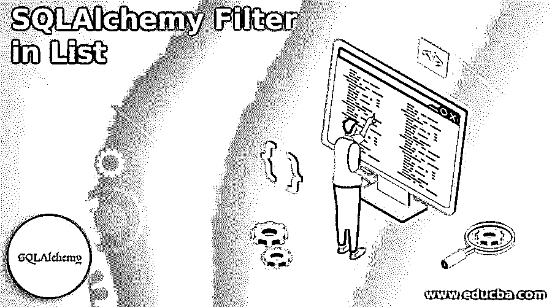


## 列表中 SQLAlchemy 筛选器的介绍

列表中的 SQLAlchemy 筛选器是。同时，我们在大多数查询中使用 filter()方法，相当于 SQL 语句，特别是对于条件语句，比如 where 和 other 子句将只返回大量的行，这些行将通过使用特定的标准来匹配，这些标准调用带有 filter()和 filter_by()方法的查询，这些方法都在带有关键字参数的列表中。

### 列表中的 SQLAlchemy 筛选器概述

SQLAlchemy ORM 是对象关系映射器，主要关注在文件中创建和应用的过滤器。我们获得结果集中的数据结果，使用查询对象表示并符合特定的标准。同时，我们在任何应用程序代码区域中调用 filter()方法。每个查询都有自己的用户会话，可以按照一定的过滤条件在特定用户表的数据中进行存储和检索。调用入站和出站参数，并在应用程序后端阶段操作用户函数，这将产生带有基本要素(如 GROUP BY)的聚合值，用于在 sqlalchemy 的集合列表中的特定属性列中排列顺序。

<small>Hadoop、数据科学、统计学&其他</small>

### 如何在列表中进行 SQLAlchemy 过滤？

SQLAlchemy filter()是帮助从后端到前端 UI 过滤数据的方法。这里，我们可以使用 ORM 技术，对象关系映射器，来创建用户和数据库会话。它还操作和接近被称为原始 SQL 的替代方法；该模式将根据某些筛选条件计算 SQLAlchemy 表列。最后，在每个用户会话上调用查询列，该用户会话处理单独的用户会话管理器，以执行从前端到后端的数据。

SQL Alchemy ORM 提供了与用户定义的类(可能是基于 Python 的脚本语言)相关联的默认方法，以及数据库表和类的对象实例以及相应表中的其他默认行，包括系统可用性，并且透明地用于同步对象状态变化及其在数据库查询中的默认行。我们可以将成功的应用程序用于 ORM 的更多构造方法，这些方法专门影响 ORM 数据库领域的应用程序。

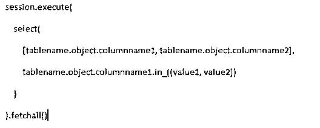


在上面的屏幕截图中，我们使用会话实例来调用已经在 sqlalchemy 数据库表中执行的用户会话区域。缺省情况下，session 将被用作缺省类和导入包，并使用 execute()方法，表名、对象名和列名已经被后端数据库表使用。因此，我们可以在同一个表名中分离和调用两个不同的参数或自变量，并存储和检索与 sqlalchemy 数据库模式相关的所有记录。因此，像 In 这样的关键字对于比较和调用具有相应列名的同一 tablename 的不同值是至关重要的。

### 列表中的 SQLAlchemy 列筛选器

sqlalchemy-oso 是一个可以强制执行的库，它覆盖了 sqlalchemy 模型的策略，这些策略主要用于对象集合，并且需要特定的对象来根据过滤条件单独授权数据。在现有的 sqlalchemy ORM 模型中，不需要修改，数据就可以知道模型类型和在访问许可期间授权数据的会话。数据是授权的，并且使用 sqlalchemy _ oso . authorized _ session maker()将 sqlalchemy 会话与默认 sqlalchemy sessionmakers 的会话工厂集成是 sqlalchemy 导入的默认类。但是在执行查询之前，在认证用户数据时，数据策略和其他创建条件列表满足数据模型。我们可以使用分步过程在列表集合中创建 sqlalchemy 过滤器列。

1.首先，我们必须安装 sqlalchemy-oso 和其他默认的必需导入包。

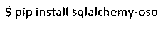


2.在上述命令的帮助下，pip 是基于 python 的安装命令，用于安装所需的 util 包。

3.我们必须使用默认方法 create_engine()方法创建并连接数据库引擎，并使用合适的参数。

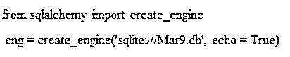


4.这里，我们首先导入所需的 sqlalchemy 的 create_engine 类，并使用名为 eng 的引用来创建数据库引擎，并调用所需的参数，如数据库驱动程序。

5.然后，我们可以创建类来声明基类和表名。此外，列和行通过将在整个代码中调用的单个实例连接在一起。

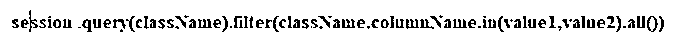


6.我们可以在会话中使用 filter()方法。查询(类名)。filter(class name . column name . in(value 1，value2))。all())这些代码行与表名和列名一起被称为用户会话。

### 列表中 SQLAlchemy 筛选器的示例

下面是提到的例子:

#### 示例#1

**代码:**

```
from sqlalchemy.engine import result
import sqlalchemy
from sqlalchemy import create_engine, MetaData,Table, Column, Numeric, Integer, VARCHAR, update
eng = create_engine(
'sqlite:///Mar9.db', echo = True)
varss = MetaData(bind=eng)
MetaData.reflect(varss)
employees = varss.tables['employees']
a = update(employees)
a = a.values({"'name'": "sivaraman"})
a = a.where(employees.c._id' == 3)
eng.execute(a)
res = text("SELECT * from employees")
outs = eng.execute(res).fetchall()
for x in outs:
print("Welcome To My Domain \n", x)
conclu = session.query(employees).filter(employees.id.in_([2,3]))
for y in conclu:
print ("ID:", y.id, "Name: ",y.name) 
```

**输出:**

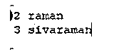


1.在上面的例子中，我们首先创建数据库引擎和所需的驱动程序来执行特定的表，如 employees。

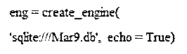


2.在数据库连接之后，我们调用已经在 sqlite 数据库上创建的名为 employees 的现有表。

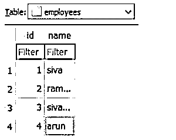


3.然后，我们可以使用更新查询语句进行更新操作，最后，我们可以在结果中执行同样的操作。

4.a =更新(员工)

5.最后，我们可以使用默认关键字过滤 tablename 列和列表格式，比如 In，以便映射和获取特定条件下的结果。

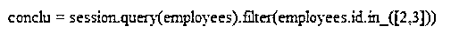


#### 实施例 2

**代码:**

```
import sqlalchemy
from sqlalchemy import create_engine, MetaData,Table, Column, Numeric, Integer, VARCHAR, update
from sqlalchemy import update
from sqlalchemy import and_
eng = create_engine(
'sqlite:///Mar9.db', echo = True)
varsq = MetaData(bind=eng)
MetaData.reflect(varsq)
std = Table(
'studenst', vars,
Column('rollno', Integer, primary_key=True),
Column('name', VARCHAR),
Column('city', VARCHAR)
)
res = session.query(studenst).filter(and_(studenst.rollno>2, studenst.name.like('ca%')))
for i in res:
print ("Rollno:", i.rollno, "Name: ",i.name, "City:",i.city)
```

**输出:**

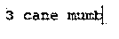


1.在上面的场景中，我们按照上一个示例中的方式进行了数据库引擎连接。

2.但是在这里，我们将借助在 sqlalchemy ORM 中创建表查询来创建名为“studenst”的表

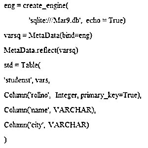


3.此外，我可以使用它们和 _ 作为列表的过滤条件来显示来自后端数据库的具有特定条件的数据。

4.在这里，我提到了 rollno>2，其名称将以“ca”开头，它用一个实例创建并调用两个不同的条件。

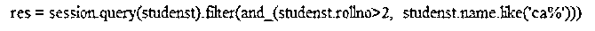


### 结论

SQLAlchemy 有许多功能来访问用户数据和 python 导入库，以执行从 UI 到后端的操作，反之亦然。更多的是需要过滤条件来满足用户在一定条件下从后端到 UI 查看表格数据的数据操作。

### 推荐文章

这是一个列表中 SQLAlchemy 过滤器的指南。在这里我们讨论一下引言、SQLAlchemy 列表中的列过滤器和例子。您也可以看看以下文章，了解更多信息–

1.  [desc 的 SQL 订单](https://www.educba.com/sql-order-by-desc/)
2.  [SQL 执行](https://www.educba.com/sql-execute/)
3.  [SQL 排除](https://www.educba.com/sql-exclude/)
4.  [MySQL InnoDB 集群](https://www.educba.com/mysql-innodb-cluster/)


