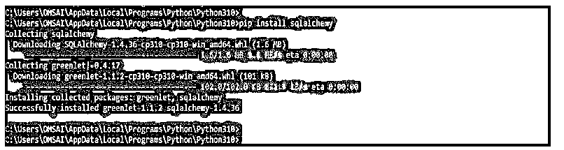
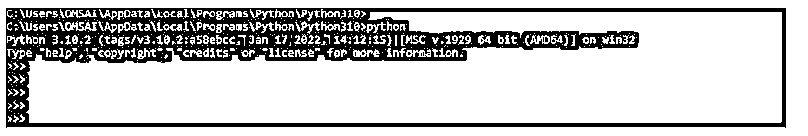
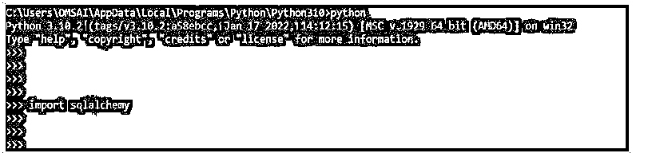
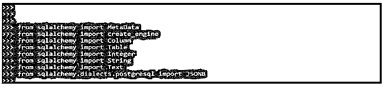
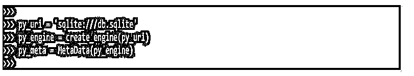
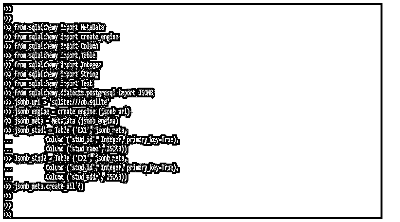
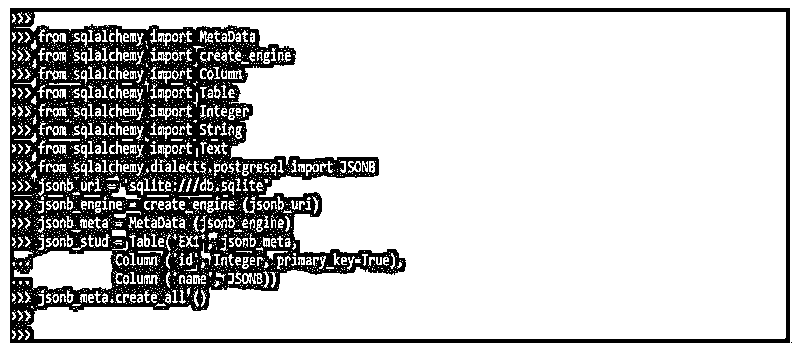

# SQLAlchemy JSONB

> 原文：<https://www.educba.com/sqlalchemy-jsonb/>


## SQLAlchemy JSONB 简介

SQLAlchemy 中支持 SQLAlchemy JSONB 数据类型；这对 json 和 jsonb 数据类型都有帮助。它包括 json 中支持的所有操作；它对索引操作也同样有效。它还添加了 json 数据类型中没有的附加操作符。它不会检测 json 数据类型所看到的变化。

### 什么是 SQLAlchemy JSONB？

在 sqlalchemy jsonb 中，使用 JSON 类共享自定义的反序列化程序和序列化程序。它将使用 json_serializer 和 json _ desrializer 参数进行序列化和反序列化。它将通过使用 create_engine 方法使用方言级别来指定。这是按行存储结构化数据的一种简单方便的方式。Json 和 jsonb 类似；唯一的区别是 jsonb 在它上面添加了更多的额外特性。json 和 jsonb 都允许嵌套所有数据类型。Hstore 数据类型只支持 string 数据类型，只允许一级嵌套，所以使用 jsonb 数据类型非常有用。

<small>Hadoop、数据科学、统计学&其他</small>

索引操作将通过使用 python 的括号运算符调用表达式来调用。它将返回表达式对象，其类型默认为 JSON。将 json 类型定义为缺省类型后，使用结果类型调用进一步的 jsonb 指令。我们可以说，使用 sqlalchemy jsonb 数据类型时，索引创建更常见；它将返回标量元素，一个整数类型。

为了提供对 sqlalchemy jsonb 数据类型中的数据元素的访问，我们使用了如下数据转换程序:

*   **Comparator.as_string:** 这个数据 caster 会返回 string 元素。这个数据广播在 it 中非常重要。
*   **Comparator.as_boolean:** 这个数据 caster 将返回布尔元素。这个数据广播器在 it 中非常有用。
*   **Comparator.as_float:** 这个数据 casters 将返回 float 元素。这个数据广播在 it 中非常重要。
*   **Comparator.as_integer:** 这个数据 caster 会返回 integer 元素。这个数据广播器在 it 中非常有用。

以上数据，将通过支持方言来实现 caster，以确保数据 caster 的比较将按预期工作。

### 如何创建 SQLAlchemy JSONB？

要创建 sqlalchemy jsonb 数据类型，我们必须首先在系统中安装 sqlalchemy 包。如果不在我们的代码中安装这个包，我们就不能使用 sqlalchemy jsonb 数据类型。不幸的是，在我们的系统中安装 python 包时，没有 Sqlalchemy 模块。因此，要使用 sqlalchemy，我们需要使用 pip 命令安装 sqlalchemy 模块。

以下步骤显示了如何创建 sqlalchemy jsonb，如下所示:

1.第一步，我们使用 pip 命令安装 sqlalchemy 模块。我们可以在任何安装了 python 的操作系统中安装 sqlalchemy 模块。在下面的例子中，我们按照如下方式安装 sqlalchemy 模块。

**代码:**

```
pip install sqlalchemy
```

**输出:**




2.安装完所有模块后，我们使用 python 命令打开 python shell。

**代码:**

```
python
```

**输出:**




3.在这一步登录到 python shell 之后，我们检查 sqlalchemy 包是否安装在我们的系统中。

**代码:**

```
import sqlalchemy
```

**输出:**




4.在检查是否安装了 sqlalchemy 包之后，我们使用 sqlalchemy 包导入以下模块。我们使用 sqlalchemy 包导入元数据、create_engine、列、表、整数、文本、JSONB 和字符串包。我们在执行单独命令的同时导入所有模块。我们使用 import 关键字导入所有模块。

**代码:**

```
from sqlalchemy import MetaData
from sqlalchemy import create_engine
from sqlalchemy import Column
from sqlalchemy import Table
from sqlalchemy import Integer
from sqlalchemy import String
from sqlalchemy import Text
from sqlalchemy.dialects.postgresql import JSONB
```

**输出:**




5.在这一步中导入所有模块之后，我们给出数据库服务器的 sqluri，并且调用 create_engine 方法在数据库服务器中创建表。此外，我们正在为 SQL 引擎定义元数据。

**代码:**

```
py_uri = 'sqlite:///db.sqlite'
py_engine = create_engine (py_uri)
sql_meta = MetaData (py_engine)
```

**输出:**




6.在这一步中定义 sql_uri 并调用 create_engine 方法之后，我们创建了多个表。

在下面的例子中，我们创建了一个表名 py_stud1。

**代码:**

```
sql_stud1 = Table ('EX1', py_meta,
Column ('id', Integer, primary_key=True),
Column ('name', JSONB))
```

**输出:**


7.创建表后，我们调用 create_all 方法将表创建到数据库服务器中。

**代码:**

```
py_meta.create_all ()
```

**输出:**


### SQLAlchemy JSONB 的示例

下面提到了不同的例子:

#### 示例#1

在下面的示例中，我们创建了两个数据类型为 sqlalchemy jsonb 的表。在下面的例子中，我们已经导入了元数据、create_engine、列、表、整数、jsonb 和字符串模块。

导入模块后，我们提供数据库 url，调用 create_engine 方法；然后，我们定义元数据方法。然后我们创建这两个，并将列数据类型指定为 jsonb。

**代码:**

```
from sqlalchemy import MetaData
from sqlalchemy import create_engine
from sqlalchemy import Column
from sqlalchemy import Table
from sqlalchemy import Integer
from sqlalchemy import String
from sqlalchemy import Text
from sqlalchemy.dialects.postgresql import JSONB
jsonb_uri = 'sqlite:///db.sqlite'
jsonb_engine = create_engine (jsonb_uri)
jsonb _meta = MetaData (jsonb_engine)
jsonb_stud1 = Table ('EX1', jsonb_meta,
Column ('stud_id', Integer, primary_key=True),
Column ('stud_name', JSONB))
Jsonb_stud2 = Table ('EX2', jsonb_meta,
Column ('stud_id', Integer, primary_key=True),
Column ('stud_addr', JSONB))
jsonb_meta.create_all ()
```

**输出:**




#### 实施例 2

在下面的例子中，我们通过提供列数据类型 jsonb 来创建单个表。

**代码:**

```
from sqlalchemy import MetaData
from sqlalchemy import create_engine
from sqlalchemy import Column
from sqlalchemy import Table
from sqlalchemy import Integer
from sqlalchemy import String
from sqlalchemy import Text
from sqlalchemy.dialects.postgresql import JSONB
jsonb_uri = 'sqlite:///db.sqlite'
jsonb_engine = create_engine (jsonb_uri)
jsonb_meta = MetaData (jsonb_engine)
jsonb_stud = Table('EX1', jsonb_meta,
Column ('id', Integer, primary_key=True),
Column ('name', JSONB))
jsonb_meta.create_all ()
```

**输出:**




### 结论

sqlalchemy jsonb 将避免创建新表及其关系；它将在正确设置 sqlalchemy jsonb 之后执行用例。此外，Sqlalchemy 在使用 jsonb 时支持 jsonb 数据类型；我们可以在 ORM 的模型中加入同样的支持。

### 推荐文章

这是一个 SQLAlchemy JSONB 的指南。这里我们讨论一下入门，如何创建 SQLAlchemy JSONB？还有例子。您也可以看看以下文章，了解更多信息–

1.  [desc 的 SQL 订单](https://www.educba.com/sql-order-by-desc/)
2.  [SQL 执行](https://www.educba.com/sql-execute/)
3.  [PL/SQL 不等于](https://www.educba.com/pl-sql-not-equal/)
4.  [SQL 不在](https://www.educba.com/sql-not-in/)中


