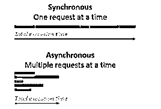
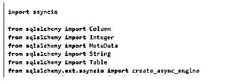
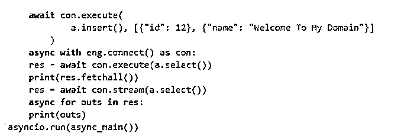
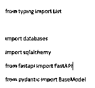

# SQLAlchemy 异步

> 原文：<https://www.educba.com/sqlalchemy-async/>


## SQLAlchemy 异步简介

SQLAlchemy 异步是扩展类型之一。在 create_async_engine()方法的帮助下，使用 AsyncEngine 可以更好地连接，这有助于基于传统引擎 API 的版本创建 ayncengine 的实例，还有 connect()和 begin()事务方法，这两个方法提供了异步上下文类型管理器，有助于 AyncConnection 调用服务器端 aync 结果中的语句。

### 什么是 SQLAlchemy Async？

SQLAlchemy async 是特性之一，它有从前端到后端操作应用程序功能的默认方法。它总是使用 create_aync_engine()方法为 AsyncEngine 创建实例，这为传统引擎 API 的异步版本提供了更多功能。Asyncio 平台指导并扩展了所需的 python 版本库，使用该平台依赖于默认机器上的 greenlet 库。借助 pip 命令安装 sqlalchemy asyncio 库。greenlet 库不支持当前的默认文件。它满足了在异步编程线程的帮助下设置额外工具的平台用途上的架构。

<small>Hadoop、数据科学、统计学&其他</small>

### 如何使用 SQLAlchemy Async？

异步编程是一种编程模式，它主要使代码能够与单独的应用程序线程一起运行。它由 ORM 和 Core 支持，包括调用和使用产品的 asyncio 导入类特性。该限制适用于具有 ORM 映射的异步功能，并通过延迟加载概念通知以上传核心和 ORM 包功能。此外，还有一种新的方式来创建带有样板代码的 SQLAlchemy 的重要版本的查询，用于对直接为用户调用的每个会话对象必不可少的语法查询进行破坏警报，并相应地映射 id，以支持带有数据类和属性的声明性映射。异步功能的 ORM 层与具有不同路由的其他类型的查询相结合，以添加条目。

sqlalchemy 模型将在声明性样式的子类中声明模型，这种样式与 sqlalchemy 引擎在 create_async_engine()方法的帮助下创建的详细样式配合得很好。为此，使用带有附加参数(如 echo=True)的 AsyncSession 类来计算每个用户会话，以传递引擎实例初始化，从而基于用户依赖关系生成 sql 查询，并且使用参数 expire_on_commit= true 或 false 布尔语句来计算其行为。这主要是因为使用 sqlalchemy sql 查询的异步设置来执行已经在访问提交的对象的数据库操作。




上图显示了 sqlalchemy 模型上同步和异步请求之间的区别。在同步模式中，一次执行一个请求，但异步模式是一次传递多个请求。

### SQLAlchemy 异步创建模型

有不同的方法来使用和声明 sqlalchemy 模型，这些模型将使用声明性的子类类型，并且在不太冗长的情况下运行良好。它有 n 个列字段，使用从 sqlalchemy.ext.asyncio 导入的 AsyncSession 类来存储和检索值。create_async_engine 类是从 sqlalchemy.ext.asyncio 包中导入的。


我们必须使用创建引擎将数据库从前端连接到后端操作。

#### 1.Init_model()

这是一个默认函数，可用于声明带有特定定义的 async。此外，我们还可以调用 engine.begin()方法从 sqlalchemy 包中执行数据库引擎连接操作。但是，首先，我们需要使用下面的 pip 命令安装 sqlalchemy async。


然后我们可以使用 docker 这样的 devops 工具和 Postgres、sqlite 这样的数据库来执行用户操作。这里，init_model()函数最初使用默认用户会话实例执行 async 和 sync()方法来注入模型。
主要我们可以使用下面的 API，叫做 Fastapi。首先安装并导入 fastapi_asyncalchemy 包，以利用模型的类。

**代码:**

```
from fastapi_asyncalchemy.models import *
```

init_model()是事件循环的类型，只有在 python 执行附加参数时才使用 CLI 命令。

#### 2.FastAPI 路线

fast api 是独立于 asyncalchemy 的主包，用于 sqlalchemy 用户和 asyncsessions。

**代码:**

```
From fastapi import FastAPI
From fastapi import Depends
From sqlalchemy.ext.asyncio import AsyncSession
```

在异步操作开始之前，首先导入上面的包，然后导入下面的包，以将数据库模型与附加服务连接起来。

**代码:**

```
From fastapi_asyncalchemy.db.base import init_models
From fastapi_asyncalchemy.db.base import get_session
From fastapi_asyncalchemy import service
```

基于用户需求及其依赖关系，会话可以注入依赖于路由的新会话。最后，我们可以使用 await()函数检索数据。

**代码:**

**雇员. py:**

```
from fastapi_users.authentication import JWTAuthentication
from fastapi_users.db import SQLAlchemyUserDatabase
from core.db import database
from .models import Employee
from .schemas import EmployeeDB
emp = Employee.__table__
a = SQLAlchemyUserDatabase(EmployeeDB, database, emp)
SECRET = "dhfh67ewtf8wgf6ewgc8y28g8q893hc7808fwh7w4bynw74y7"
tests= [
JWTAuthentication(secret=SECRET, lifetime_seconds=3600),
]
```

**Models.py:**

```
from empls_EmployeeDB import SQLAlchemyBaseUserTable, SQLAlchemyUserDatabase
from sqlalchemy import Column, String, Integer, DateTime, Boolean
from core.db import Base
class Employee(Base, SQLAlchemyBaseUserTable):
name = Column(String, unique=True)
dob = Column(DateTime)
emp = Employee.__table__
```

**Schema.py:**

```
import uuid
from typing import Optional
import pydantic
from empls import models
from pydantic import EmailStr, BaseModel
class Employee(models.BaseUser):
class Test1:
orm_mode = True
class Test2(BaseModel):
id: Optional[str]
name: str = "SIva"
@pydantic.validator("id", pre=True, always=True)
def default_id(cls, v):
return v or str(uuid.uuid4())
class Test1:
orm_mode = True
class Test3(Employee, models.BaseUserCreate):
name: str
class Test4(Employee, models.BaseUserUpdate):
pass
class EmployeeDB(Employee, models.BaseUserDB):
pass
```

**Routees.py:**

```
from fastapi import APIRouter
from emps import empl
rout = APIRouter()
rout.include_router(empl.router, prefix="/empl")
```

**main.py:**

```
from fastapi import FastAPI
from core.db import database
from routes import Routees
from core.empls import empls
app = FastAPI()
@app.on_event("empdet")
async def empdet():
await database.connect()
@app.on_event("empresign")
async def empresign():
await database.disconnect()
app.include_router(Routees)
app.include_router(empls.router, prefix="/employees", tags=["employees"])
```

**输出:**


以上代码是使用 python 库中的 fastAPI 导入包创建 sqlalchemy aync 模型的基本格式。路由对于将数据库模式模型从前端映射到后端至关重要。

### SQLAlchemy 异步示例

下面提到了不同的例子:

#### 示例#1

**代码:**

```
import asyncio
from sqlalchemy import Column
from sqlalchemy import Integer
from sqlalchemy import MetaData
from sqlalchemy import String
from sqlalchemy import Table
from sqlalchemy.ext.asyncio import create_async_engine
md = MetaData()
a = Table(
"emps", md, Column("id", Integer, primary_key=True), Column("name", String)
)
async def async_main():
eng = create_async_engine(
'sqlite:///Mar9.db',
echo=True,
)
async with eng.begin() as con:
await con.run_sync(md.drop_all)
await con.run_sync(md.create_all)
await con.execute(
a.insert(), [{"name": "12"}, {"name": "Welcome To My Domain"}]
)
async with eng.connect() as con:
res = await con.execute(a.select())
print(res.fetchall())
res = await con.stream(a.select())
async for outs in res:
print(outs)
asyncio.run(async_main())
```

**输出:**


在上面的例子中，我们首先导入了所有需要的库，比如 sqlalchemy import all table columns 和 asyncio import drivers。




我们主要使用 create_async_engine 来执行应用程序任务中的异步操作。

接下来，我们使用 table()方法创建了一个基本的类似表格的 emps，它带有附加的参数，比如带有值名称和数据类型的 columns()。

通过使用 asyncio.the run()方法将传递主函数作为参数。




最后，对 asyncio.run(async_main())参数执行 main 方法。

#### 实施例 2

**代码:**

```
from typing import List
import databases
import sqlalchemy
from fastapi import FastAPI
from pydantic import BaseModel
engs = 'sqlite:///Mar9.db'
db = databases.Database(engs)
md = sqlalchemy.MetaData()
news = sqlalchemy.Table(
"engss",
md,
sqlalchemy.Column("id", sqlalchemy.Integer, primary_key=True),
sqlalchemy.Column("name", sqlalchemy.String),
sqlalchemy.Column("city", sqlalchemy.String),
)
vars = sqlalchemy.create_engine(
engs, connect_args={"Welcome": "Tup"}
)
md.create_all(vars)
class funs(BaseModel):
name: str
city: str1
class funs1(BaseModel):
id: int
name: str
city: str1
app = FastAPI()
@app.on_event("first")
async def first():
await database.connect()
@app.on_event("second")
async def second():
await database.disconnect()
@app.get("/engs/", response_model=List[ab])
async def funsss2():
qury = engs.select()
return await database.fetch_all(qury)
@app.post("/engs/", response_model=funs1)
async def funsss(ab: funs):
qury1 = engs.insert().values(name=ab.name, city=ab.city)
vars2 = await database.execute(qury1)
return {**a.dict(), "id": vars2}
```

**输出:**


在第二个例子中，我们在 sqlalchemy 包中使用了 Fast API 来执行异步操作。




首先导入带有所需库、类、关键字和方法的包。

快速 api 包有 first()和 second()这样的方法以及 async 和 def 关键字。


执行这些关键字是为了使用 await 关键字存储和检索多个结果。

### 结论

sqlalchemy 有许多特性，必须实现并满足所需的库。就像这样，async 是执行数据库操作的关键字和特性，例如使用多线程或多个请求来存储和检索数据，这些请求在单个时间实例中被调用和执行。

### 推荐文章

这是 SQLAlchemy 异步的指南。这里我们讨论引言；SQLAlchemy async 创建模型和示例。您也可以看看以下文章，了解更多信息–

1.  [desc 的 SQL 订单](https://www.educba.com/sql-order-by-desc/)
2.  [SQL 执行](https://www.educba.com/sql-execute/)
3.  [SQL 排除](https://www.educba.com/sql-exclude/)
4.  [MySQL InnoDB 集群](https://www.educba.com/mysql-innodb-cluster/)


