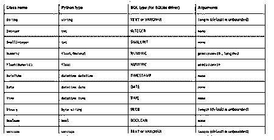
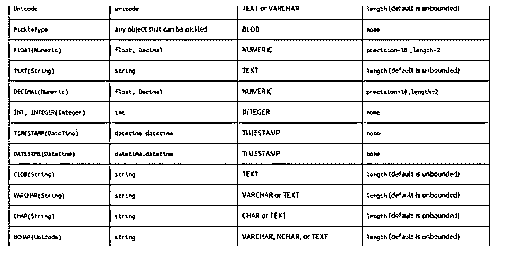
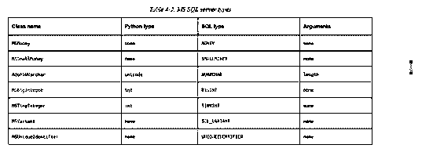
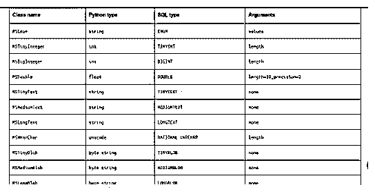
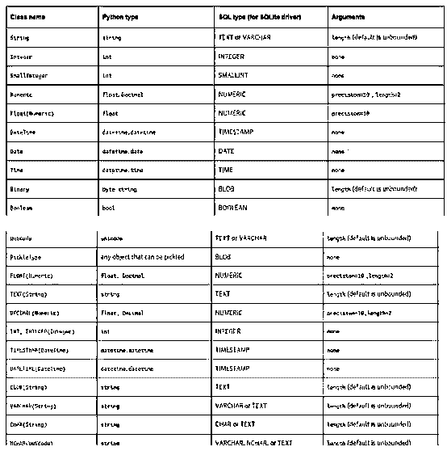

# SQLAlchemy 类型

> 原文：<https://www.educba.com/sqlalchemy-types/>

## SQLAlchemy 类型介绍

SQLAlchemy 类型是可用于数据库的内置类型之一，它是独立的数据类型，也是用于将应用程序数据映射到数据库模式的基本特定类型之一。此外，它还提供了跨多个数据库引擎分解通用类型的类型引擎，并且特定于方言的类型也是全局处理的。在定义应用程序使用的元数据时，指定每个表的每个数据列使用的 sql 数据类型非常重要。

当我们可以使用除非表定义为 autoload=True 时，其中 SQLAlchemy 提供了数据类型，而 TypeEngines 是作为 SQLAlchemy 类提供的实例创建的。当我们使用 python 类时，它们将被转换为本地数据库值，反之亦然。让我们使用为 varchar 等特殊字符分配的字符串类型。还为 SQL 文本提供了使用指定元数据创建或构建表的类型引擎，并像 table.create()或 create all()方法一样调用。我们在不同的方法集合中使用了 SQLAlchemy 的应用程序，这有助于用各种数据库引擎集合构建通用类型引擎。一组数据库，通过与数据库之间的对象对话进一步修改，SQLAlchemy 主要允许使用指定的自定义类型引擎构建应用程序。

<small>Hadoop、数据科学、统计学&其他</small>

### 不同类型的 SQLAlchemy

它有 n 种类型，其中一些 SQLAlchemy 类型如下:

#### 1.内置类型

它是 sqlAlchemy 类型中的一种，主要提供了相当基本的概念，还没有完成对附加数据库列类型的 SQL 支持的 TypeEngines。我们使用了 CLOB 中定义的相应类型引擎支持的类型引擎。这些都是从其他类型引擎中派生出来的，可能会也可能不会进一步专门化底层数据库类型的细粒度规范。下面是一些 SQL 类型，以及用类名和 python 类型映射的驱动程序和参数。

上表显示了一些类名，如映射到 python 类型的数据类型和带有数据库驱动程序的 sql 类型。我们可以根据我们端调用的参数指定多类型和单类型的参数。

其余的类型，以及 Sql 和 python 类型，都是为此准备的。它将与 TypeEngines 一起使用来指定表的行和列。一些通用类型引擎也被导入到代码中，如 SQLAlchemy.types 包。

#### 2.方言特有类型

如果我们想为 sql alchemy 生成特定于方言的内容，它将与通用和特定于方言的类型引擎相结合。它也是使用来自泛型类型的 Create Table 查询创建的。在某些情况下，除了一般类型之外，它还可以是方言特有的类型。系统使用 SQLAlchemy 与各种 DBAPI 实现和数据库进行通信。这种方言就像是其他特定于数据库的对象实现的工厂，包括 ExecutionContext、complied、默认生成器和 TypeEngine。在这里，它是具有不同组件的一些关键特性之一，称为核心和 ORM 核心和 orm sqltoolkit 将主要使用平滑层和广泛的 DBAPI 实现和行为进行抽象。

上图显示了类名以及 python 类型和 sql 类型的列表，以及连接数据库驱动程序和参数的参数。

#### 3.泛型类型

泛型类型包包含 SQLAlchemy 提供的泛型类型引擎，它是对可移植列类型的广泛支持。因此，我们可以列出更支持可移植列类型的类型引擎、它们的 Python 类型和 sql 表示。此外，类型引擎更多地是用所有 CLOBs 定义的，这些 CLOBs 可能会也可能不会专用于更细粒度的数据库规范类型。

如果缺省参数更多地构造 SQL 类型，则使用表行和列为 TypeEngine 类本身指定更多的类型引擎实例类型。

#### 4.特定于应用程序的自定义类型

通常，SQLAlchemy 提供了一系列丰富的通用数据库特定类型。但是，创建特定的应用程序自定义类型会更有帮助，而且范围更广。然后，例如，它可能希望通过限制列值来模拟枚举类型不支持的数据库引擎。它包含两种类型的 SQLAlchemy、TypeEngine 和 TypeDecorator，以便通过 TypeEngine 子类更直接地实现。

它是否可能包含已经实现了 TypeDecorator 并创建了一个新的 TypeEngine 来实现和修饰 TypeEngine 子类。

### SQLAlchemy 类型的示例

以下是 SQLAlchemy 类型的示例:

#### 示例#1

**代码:**

`from SQLAlchemy import types
class Firstclasses(types.TypeDecorator):
news=types.Integer
def __init__(a, vars, *al, **cde):
types.TypeDecorator.__init__(a, *al, **cde)
a.vars = vars
def paramsbind(a, value, engine):
outs = a.news.paramsbind(value, engine)
if outs not in a.vars:
raise TypeError(
"The values outss is %s must be one of the output %s" % (outs, a.vars))
return outs
def resout(a, value, engine):
'Have a Nice day thanks for your support'
return a.news.resout(value, engine)
print("Thanks for the first example regarding SQLAlchemy types")`

**输出:**

第一个示例是创建类并传递 TypeDecorator 类型，以将输入转换为整数格式，这可能是称为数字的整数输入范围。我们定义了带有传递参数的方法集；此外，我们通过使用 if 语句和 return 并在 TypeError()方法中引发错误来验证条件。对于同样的 in resout()方法并返回参数。

#### 实施例 2

**代码:**

`from SQLAlchemy import types
class secondclasses(types.TypeDecorator):
second=types.String
def __init__(ab, vars2, *vas, **ref):
types.TypeDecorator.__init__(ab, *vas, **ref)
ab.vars2 = vars2
def newsmeth(ab, vals, eng):
ress = ab.second.newsmeth(value, eng)
if ress not in ab.vars2:
raise TypeError(
"Please find the output results from the newmeth methd" % (ress, ab.vars2))
return ress
def resout(ab, vals, eng):
'Have a Nice day thanks for your support'
return ab.second.resout(vals, eng)
print("Thanks for the second example regarding SQLAlchemy types")`

**输出:**

在上面的例子中，我们使用了 String 这样的类型来转换值。这里我提到了第二个类，它在富泛型和特定于数据库的类型中声明了 def 类型。为数据库表列中存储的值的仿真枚举中的每个实例创建具有自定义特定类型的应用程序会更有帮助。它通常有两种方法来创建具有特定客户类型的应用程序，并为 TypeEngine 子类中涉及更多的 TypeDecorator 实现类似的现有 TypeEngine。

### 结论

SQLAlchemy 包括许多用于将数据库数据连接到应用程序 UI 的函数、操作符和关键字。例如，type 是数据库格式之一。它操作指定数据库中的表列和以前使用 SQLAlchmey 和数据库驱动程序构建的表。

### 推荐文章

这是 SQLAlchemy 类型的指南。这里我们分别讨论介绍、不同类型的 SQLAlchemy 和示例。您也可以看看以下文章，了解更多信息–

1.  [desc 的 SQL 订单](https://www.educba.com/sql-order-by-desc/)
2.  [SQL 执行](https://www.educba.com/sql-execute/)
3.  [SQL 排除](https://www.educba.com/sql-exclude/)
4.  [MySQL InnoDB 集群](https://www.educba.com/mysql-innodb-cluster/)

